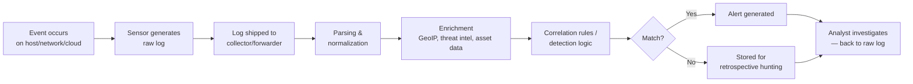
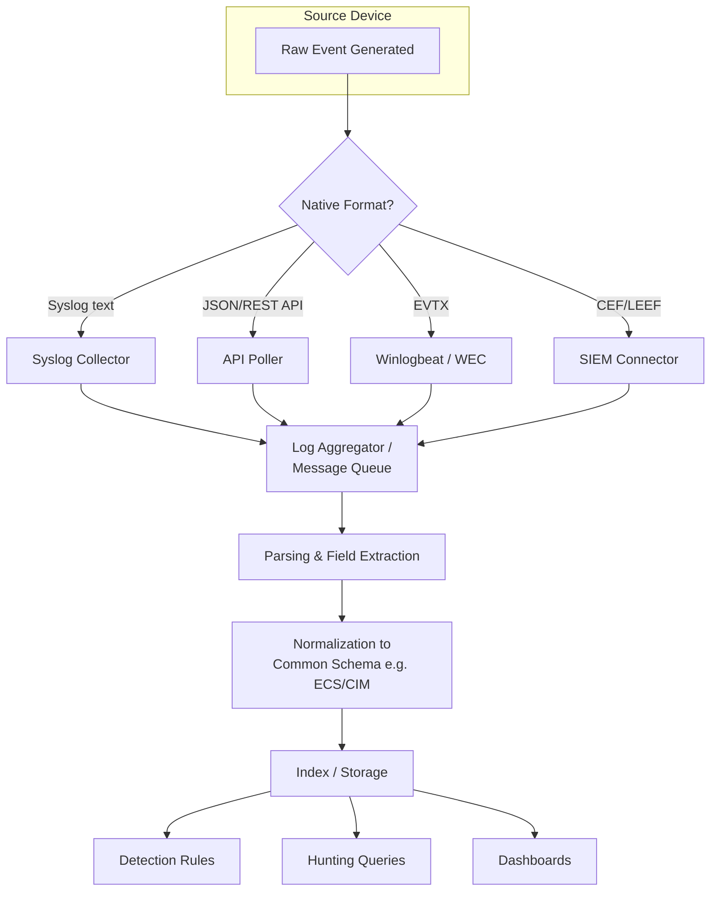
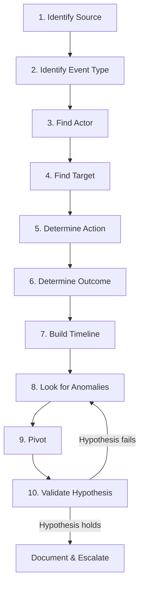
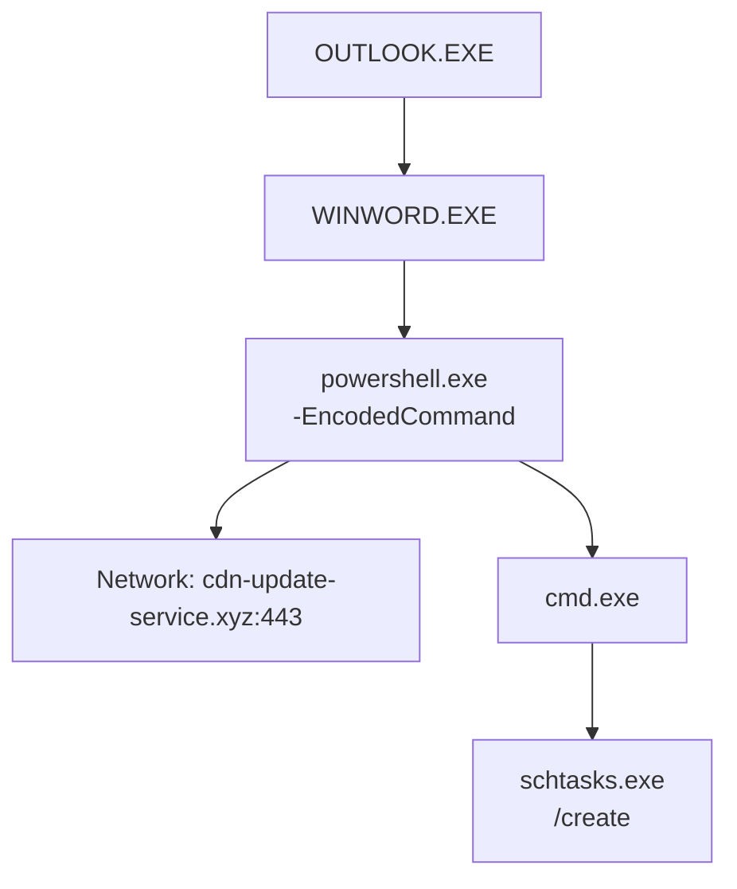
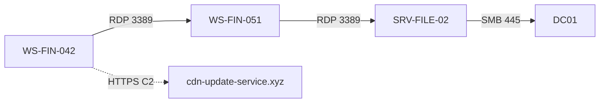
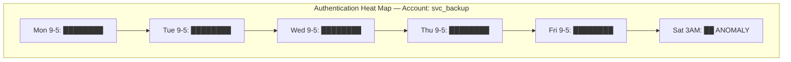
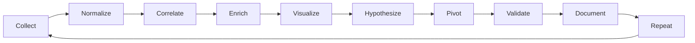

# Reading Raw Logs Like a Threat Hunter: A Complete Field Guide

*A ThreatHuntingLabs.com deep-dive on what logs actually are, how to read them, and how to think like the person who has to make sense of them at 2am during an incident.*

---

There's a moment every analyst hits, usually in their first six months, where a SIEM dashboard tells them "Suspicious PowerShell Execution Detected" and they click into it expecting an explanation. What they get instead is a wall of raw text — half of it truncated, half of it encoded, and none of it explained. The dashboard did its job. It surfaced something. But it can't tell you *why* it matters, what the attacker was actually trying to do, or whether this is a real intrusion or a sysadmin running a deployment script at a weird hour.

That gap — between "the SIEM flagged something" and "I understand what happened" — is where raw logs live. And it's where most analysts either become good at their job or stay stuck clicking dashboards forever, hoping the next tool will finally explain things for them.

This guide exists to close that gap. Not by giving you a cheat sheet of log formats to memorize — those go stale the moment a vendor ships a new log schema — but by teaching you how to *think* about any log you've never seen before, from any vendor, in any format, and walk away understanding it.

We'll go field by field, vendor by vendor, log type by log type. We'll look at real raw logs from Fortinet, Palo Alto, Cisco, Windows, Sysmon, Zeek, Suricata, CrowdStrike, AWS, and Azure. We'll build a repeatable methodology you can apply to a log source you've literally never encountered before. And we'll practice on real exercises, because reading about log analysis and actually doing it are very different skills.

---

<a id="part-1"></a>
## Part 1 — Why Every Threat Hunter Must Understand Raw Logs

### The dashboard is a summary, not the evidence

SIEM dashboards are built to do one thing well: reduce volume. A typical mid-sized enterprise generates somewhere between several hundred million and a few billion events per day. No human can look at that. So every SIEM — Splunk, Sentinel, Elastic, QRadar, whatever — exists to compress that ocean of events into something a human can scroll through in a shift.

Compression always loses information. That's not a flaw in the tools, it's math. When a correlation rule fires and creates an alert titled "Multiple Failed Logons Followed by Success," it has already thrown away:

- The exact authentication package used (NTLM vs Kerberos)
- The logon type (network, interactive, RDP, service, batch)
- The process that initiated the authentication attempt
- The workstation name versus the IP address
- Whether the source was internal or came through a jump host
- The elevation token type, if one was granted

Any one of those details could be the difference between "service account doing its normal thing" and "an attacker who just pivoted from a compromised workstation." The alert tells you something happened. The raw log tells you *what actually happened*.

### Telemetry, visibility, and observability — and why people confuse them

These three words get used interchangeably in marketing decks, but they mean different things, and the difference matters for hunting.

**Telemetry** is the raw stream of data your sensors produce — Sysmon events, firewall traffic logs, DNS query logs, EDR process events. It's just data in motion.

**Visibility** is whether you actually *have* telemetry covering a given part of your environment. You can have a five-million-dollar SIEM and still have zero visibility into a segment of your network because nothing is logging there. Visibility is a coverage question: do I have eyes on this asset, this protocol, this user, this cloud tenant?

**Observability** is whether the telemetry you have is *good enough* to answer questions you haven't thought of yet. A firewall that logs allow/deny with no application context gives you visibility into traffic, but poor observability into *what* that traffic actually was. Sysmon with a tuned config gives you both — you can see process execution (visibility) and you can ask arbitrary questions about parent-child relationships, command lines, and network correlation after the fact (observability).

Hunters live and die by observability. A detection engineer can write a rule for a known pattern. A hunter has to go find patterns nobody wrote a rule for yet, which means they need raw access to ask new questions of old data.

### Every detection starts as a log before it's ever an alert

This is the single most important mental model in this entire guide:

> There is no such thing as a detection that didn't start as a raw event.

A SIEM correlation rule, an EDR behavioral detection, a Sigma rule, a YARA match against memory — every single one of these mechanisms is just a piece of logic running against raw telemetry. Someone, at some point, looked at raw logs, recognized a pattern that indicated malicious behavior, and encoded that pattern into a rule.

When you understand this, two things become true:

1. **If you can't read the raw log, you can't write or tune a detection.** You're stuck consuming whatever someone else built, with no ability to extend it or trust it.
2. **If a detection misses something, the answer is always in the raw logs that detection should have looked at.** Tuning starts with reading raw events, not adjusting a slider in a UI.

### The detection lifecycle, end to end

It helps to see the full pipeline so you know where "reading raw logs" sits in the bigger picture:



Notice the loop back at the end. Whether something becomes an alert or just sits in storage, the moment a human needs to actually understand it, they end up back at the raw log. The dashboard, the parsing, the enrichment — all of that is scaffolding around the one thing that actually contains ground truth: the event as the device originally wrote it.

### Why hunters specifically can't avoid this

A SOC analyst doing tier-1 triage can sometimes get away with trusting the alert text and following a runbook. A threat hunter cannot, for a structural reason: **hunting is the search for things nobody has written a detection for yet.** By definition, there's no alert, no dashboard panel, no pre-built query. There's only the question "what does normal look like in this data, and what doesn't fit?" — and you can't answer that without being fluent in the raw shape of the data.

This is also why hunting skill transfers so well across tools. An analyst who deeply understands what a Windows 4624 logon event means, field by field, can pick up Splunk, Sentinel, Elastic, or a brand-new SIEM their company just migrated to, and be productive in days. An analyst who only knows "click here in tool X to see failed logons" has to relearn everything from scratch every time the tooling changes. Tools are temporary. Log literacy is permanent.


---

<a id="part-2"></a>
## Part 2 — What Is Actually a Log?

### How a log gets created in the first place

A log is a device's first-person account of something it observed itself doing or seeing. That's the whole definition. Strip away the formats and protocols, and every log — a firewall traffic log, a Windows Security event, a Sysmon process creation event — follows the same lifecycle:

1. **Something happens.** A packet arrives, a process spawns, a user authenticates, a file gets written.
2. **The device's internal logic decides this is worth recording.** Not everything is logged — every device has an internal filter (sometimes configurable, sometimes not) for what counts as loggable.
3. **The device formats the event** according to whatever schema it was built with — syslog, JSON, XML, a vendor-proprietary binary format, whatever.
4. **The device either writes the log locally, sends it to a collector, or both.**

That's it. A log is not analysis. A log is not a conclusion. A log is testimony — "this is what I, the device, saw, described in my own internal vocabulary."

This matters because it explains why two devices looking at the exact same event can produce wildly different logs. A firewall sees a TCP SYN packet and logs source/destination/port/action. An EDR agent watching the same connection attempt sees it from the process side and logs which executable initiated it, with what command line, under which user context. Neither is wrong. They're testimony from different witnesses standing in different positions.

### Events vs. alerts — the distinction that confuses almost everyone

This trips up more new analysts than anything else in this guide, so let's be precise:

**An event is a record of something that happened.** A 4624 logon event is just a record: this account logged on, at this time, using this method, from this source. It carries zero judgment about whether that's good or bad.

**An alert is a judgment that an event (or combination of events) is significant enough to require human attention.** Alerts are *derived* from events through detection logic. The event existed first; the alert is a layer of interpretation on top of it.

Practical consequence: when an alert says "Suspicious Logon Detected," somewhere underneath it there's a raw 4624 (or several) that the detection logic decided crossed some threshold. The alert can be wrong — wrong threshold, wrong baseline, outright bug in the detection rule. The underlying event is just a fact. When you're not sure whether to trust the alert, you trust the event and re-derive the conclusion yourself.

### Telemetry vs. detection — a related distinction

**Telemetry** is the complete stream of what's being observed, regardless of whether any of it is suspicious. Telemetry doesn't know what an attack looks like; it just knows what activity happened.

**Detection** is a layer that asks "does this telemetry, or this pattern across multiple pieces of telemetry, indicate something malicious?"

A mature hunting program treats detections as hypotheses tested against telemetry, not as the only lens through which telemetry is viewed. You collect telemetry broadly. You apply detections narrowly, where you have high confidence. And you hunt — manually exploring telemetry without a pre-built detection — everywhere a detection doesn't yet exist or might be incomplete.

### Structured vs. unstructured logs

This is a spectrum, not a binary, but it's useful to think of it as two ends:

**Unstructured / semi-structured (text) logs** are written for humans first, machines second. A classic example is a Linux `/var/log/auth.log` line:

```
Mar 15 09:42:13 webserver01 sshd[14223]: Failed password for root from 203.0.113.45 port 51223 ssh2
```

There's a recognizable pattern here, but it's not self-describing — you have to know that the third token after "for" is the username, and the token after "from" is the source IP. A parser has to be told this structure; the log itself doesn't declare it.

**Structured logs** are self-describing — the field name travels with the value. JSON is the most common modern example:

```json
{"timestamp":"2024-03-15T09:42:13Z","host":"webserver01","process":"sshd","pid":14223,"event":"authentication_failure","user":"root","src_ip":"203.0.113.45","src_port":51223,"protocol":"ssh2"}
```

Structured logs are dramatically easier to parse reliably at scale, which is why almost every modern log source — cloud platforms, EDR agents, newer network devices — defaults to JSON. But structured doesn't mean *more information*; it just means the same information is labeled. You still have to know what each field means.

### A field guide to the formats you'll actually encounter

**Syslog (RFC 3164 / RFC 5424).** The oldest standard still in widespread production use, originally designed for Unix systems in the 1980s, now used by essentially every network appliance, firewall, and Linux box on earth as a transport mechanism — note: syslog is a *transport protocol and a loose message format*, not a strict schema. The payload inside a syslog message can be anything: free text, key-value pairs, even JSON. A raw RFC 3164 message looks like:

```
<134>Mar 15 09:42:13 fw01 %ASA-6-302013: Built outbound TCP connection 4567 for outside:203.0.113.45/443 to inside:10.1.1.50/51223
```

The `<134>` is the priority value (facility × 8 + severity), then a timestamp, then hostname, then the actual message — which in this case is Cisco ASA's own proprietary message format riding inside the syslog envelope.

**CEF (Common Event Format).** Created by ArcSight (now part of Micro Focus/OpenText) specifically to standardize security event logs across vendors so SIEMs wouldn't need a custom parser for every product. A CEF message has a fixed header followed by pipe-delimited fields, then an extension section of key-value pairs:

```
CEF:0|Fortinet|FortiGate|7.2.5|0000000013|Traffic Allow|3|src=10.1.1.50 dst=8.8.8.8 spt=51223 dpt=443 proto=TCP act=allow
```

The header (everything before the second pipe-delimited block) is: CEF version, vendor, product, version, signature ID, name, severity. Everything after that is extensible key=value pairs. This format is genuinely useful to recognize on sight because so many security products support exporting in CEF specifically for SIEM ingestion.

**LEEF (Log Event Extended Format).** IBM's answer to CEF, used heavily by QRadar-integrated products. Structurally very similar — pipe-delimited header, then key-value extension — but with its own header fields:

```
LEEF:2.0|Fortinet|FortiGate|7.2.5|Traffic|cat=Allow	src=10.1.1.50	dst=8.8.8.8	spt=51223	dpt=443	proto=TCP
```

Note LEEF traditionally uses tabs to delimit the extension fields rather than CEF's flexible separator — a small detail that breaks naive parsers if they assume CEF rules.

**XML.** Verbose, self-describing, still the native format for Windows Event Logs (before tools convert them to something else) and a lot of enterprise network gear. Tag-based, so every value is wrapped:

```xml
<Event><System><EventID>4624</EventID><TimeCreated SystemTime="2024-03-15T09:42:13.123Z"/></System>
<EventData><Data Name="TargetUserName">jsmith</Data><Data Name="IpAddress">10.1.1.50</Data></EventData></Event>
```

**JSON.** The dominant modern format for cloud platforms, EDR agents, and most things built after roughly 2015. Self-describing key-value structure, supports nesting, easy for machines to parse without a custom grammar.

**CSV.** Rare as a native log format these days but common as an *export* format — vulnerability scanner output, bulk log exports, asset inventories. The catch: CSV carries no field names inline (unless there's a header row), so a CSV file divorced from its header row is just numbers and strings with no inherent meaning.

**EVTX.** Windows' native binary event log format. You cannot read EVTX with a text editor — it's a binary container holding XML-rendered events plus metadata, indexes, and templates for efficient storage. Tools like `wevtutil`, PowerShell's `Get-WinEvent`, or a forwarder like Winlogbeat read EVTX and typically re-render it as XML or JSON for downstream use.

**Binary / proprietary formats.** Full packet captures (PCAP), some EDR local caches, and certain legacy systems store data in formats meaningless without the vendor's own tooling to decode them. You generally don't read these directly — you use a parser (`tshark`, vendor SDKs) that converts them into one of the formats above first.

### The log pipeline, visually



The reason this matters for a hunter: every box in that pipeline is a place where information can be transformed, dropped, or mangled. A field that exists in the raw EVTX might be discarded during normalization because nobody mapped it. A timestamp might get silently converted to the wrong timezone during parsing. When something doesn't add up in your SIEM, the fix is almost always to go upstream — closer to box A — until you find the raw, unmodified version of the event.


---

<a id="part-3"></a>
## Part 3 — Anatomy of Every Log Field

Before you can read any specific vendor's logs, you need fluency in the universal building blocks that show up *everywhere*, regardless of vendor. Below is a field-by-field breakdown. For each one: what it means, why it exists, how attackers interact with it, why defenders care, and example values.

### Timestamp

**What it means:** The moment the event occurred, as recorded by the generating device's clock.

**Why it exists:** Without time, you have no sequence, no timeline, no way to correlate events across systems.

**Attacker interaction:** Attackers occasionally manipulate system clocks before an operation to confuse timeline reconstruction, or "timestomp" files (Sysmon Event ID 2) to make malware appear to have existed since the OS was installed. More commonly, attackers operate during off-hours specifically because timestamps reveal *when* — 3 AM activity from an account that normally works 9-to-5 is a free anomaly signal.

**Why defenders care:** Every correlation, every "first seen / last seen," every dwell-time calculation depends on accurate timestamps. This is also why NTP matters so much operationally (covered in Best Practices).

**Example values:** `2024-03-15T09:42:13.482Z` (ISO 8601 with milliseconds, UTC), `Mar 15 09:42:13` (syslog legacy format, often missing year and timezone — a real parsing headache).

### Hostname

**What it means:** The name of the machine that generated or is referenced by the event.

**Why it exists:** IP addresses change (DHCP), hostnames are usually more durable identifiers for asset tracking.

**Attacker interaction:** Attackers rename compromised hosts to blend in (`DESKTOP-A1B2C3` is suspicious in an environment where every machine follows `CORP-FIN-WS042` naming convention). Living-off-the-land tooling sometimes spoofs hostname fields in crafted traffic.

**Why defenders care:** Asset context. A hostname tells you the *role* of a machine if your naming convention encodes it (finance workstation vs. domain controller vs. build server), which changes the severity of any given finding.

**Example values:** `CORP-FIN-WS042`, `webserver01`, `DC01.corp.local`

### Device / Vendor / Product

**What it means:** Identifies *what generated this log* — not the asset being described, but the security or infrastructure product itself.

**Why it exists:** In an environment with dozens of log sources, you need to know which device's "truth" you're reading before you can interpret field meanings correctly (a "severity" of 3 means something different in Fortinet vs. Palo Alto vs. Suricata).

**Attacker interaction:** N/A directly, but attackers who understand your stack (from recon, leaked documentation, or simple guessing) will tailor evasion to specific products' blind spots.

**Why defenders care:** Determines which parser, which field dictionary, and which baseline of "normal" applies.

**Example values:** `Fortinet/FortiGate`, `Microsoft/Sysmon`, `CrowdStrike/Falcon`

### Source IP / Destination IP

**What it means:** The network address the traffic originated from / is headed to.

**Why it exists:** Fundamental to any network-layer log — without it you can't answer "who talked to whom."

**Attacker interaction:** Spoofing (mostly relevant to UDP-based attacks where return traffic doesn't matter, like some DDoS techniques), use of compromised intermediate hosts to obscure true origin, NAT/proxy chains, Tor/VPN exit nodes.

**Why defenders care:** Core pivot field — almost every investigation eventually asks "what else did this IP talk to" or "what else talked to this destination."

**Example values:** `10.1.1.50` (private/internal), `203.0.113.45` (public, often the one you'd check against threat intel)

### Source Port / Destination Port

**What it means:** The TCP/UDP port involved on each side of the connection.

**Why it exists:** Identifies which service/protocol is in play, alongside the IP.

**Attacker interaction:** C2 frameworks frequently use non-standard ports for known protocols (HTTP/S traffic on port 8443, 4444, 8080) specifically to slip past port-based assumptions. Port scanning shows up as sequential or randomized destination ports from a single source.

**Why defenders care:** Destination port 443 doesn't guarantee TLS, and an unusual destination port on a "normal" protocol is a classic weak signal worth investigating in context.

**Example values:** Source port is typically high/ephemeral (`51223`), destination port often well-known (`443`, `22`, `3389`) — though attacker C2 often inverts expectations.

### Username

**What it means:** The account associated with the action being logged.

**Why it exists:** Accountability and access tracking — nearly every framework (NIST, ISO 27001, PCI-DSS) requires it.

**Attacker interaction:** Credential theft and impersonation are the entire point of most lateral movement techniques — Pass-the-Hash, Pass-the-Ticket, Kerberoasting all exist specifically to let an attacker *be* a username they don't legitimately own.

**Why defenders care:** User behavior baselining (UEBA) lives or dies on this field. A service account behaving like a human, or a human account behaving like an automation script, is one of the highest-signal anomalies in the field.

**Example values:** `jsmith`, `svc_backup`, `NT AUTHORITY\SYSTEM`

### Domain

**What it means:** Depending on context, either the Windows/AD domain a username belongs to, or a DNS domain name being queried/contacted.

**Attacker interaction:** Domain Generation Algorithms (DGA) produce huge volumes of random-looking domains for C2 resilience. Typosquatting (`micros0ft-update.com`) targets human and pattern-matching defenses.

**Why defenders care:** Domain reputation, age, and registration patterns are some of the cheapest, highest-value enrichment you can apply.

**Example values:** `CORP`, `evil-c2-domain.xyz`, `login.microsoftonline.com`

### Event ID

**What it means:** A vendor-defined numeric or string identifier for *what type* of event this is.

**Why it exists:** Lets you filter for a specific kind of activity (a logon, a process creation, a firewall block) without parsing free text.

**Attacker interaction:** Some malware specifically disables or tampers with the auditing subsystem that generates certain event IDs (e.g., clearing the Security log, generating Event ID 1102, or disabling Sysmon, generating Event ID 4 in the Sysmon operational log itself).

**Why defenders care:** Event IDs are the backbone of almost every detection rule — "alert when 4769 has RC4 encryption" only works because you can isolate that exact event type first.

**Example values:** `4624` (Windows successful logon), `1` (Sysmon process create), `7045` (Windows new service installed)

### Severity

**What it means:** The generating device's own assessment of how significant this event is.

**Attacker interaction:** N/A directly, but attackers benefit when severity scales are miscalibrated and analysts learn to ignore "high" severity alerts due to alert fatigue.

**Why defenders care:** Severity is vendor-subjective — a "critical" in one product's scale might be roughly equivalent to a "medium" in another's. Never compare severities across products without normalizing first.

**Example values:** `1`–`10` (numeric scales vary by vendor), `low/medium/high/critical` (categorical)

### Action

**What it means:** What the generating device *did* in response to the observed event — allow, block, deny, quarantine, alert-only.

**Attacker interaction:** Attackers probe for the line between "logged but allowed" and "blocked" to understand your control posture — this is literally what reconnaissance and scanning are partly for.

**Why defenders care:** A "blocked" action means a control worked; an "allowed" action on something later found malicious means a control gap, which is a very different conversation with leadership.

**Example values:** `allow`, `deny`, `block`, `quarantine`, `alert`

### Protocol

**What it means:** The network or application protocol involved (TCP, UDP, ICMP, HTTP, DNS, SMB, RDP).

**Attacker interaction:** Protocol tunneling — running one protocol's traffic disguised inside another (DNS tunneling, ICMP tunneling, HTTP-encapsulated C2) — exists specifically to exploit the fact that some protocols are rarely inspected deeply.

**Why defenders care:** Protocol mismatches (a connection labeled HTTPS that never completes a TLS handshake) are a reliable detection technique independent of payload content.

**Example values:** `TCP`, `UDP`, `ICMP`, `HTTP/1.1`, `SMBv3`

### Application

**What it means:** Application-layer identification — not just the port, but what the traffic actually *is* (Facebook, Dropbox, generic-SSL, BitTorrent). Mostly a Next-Gen Firewall concept (App-ID in Palo Alto terms).

**Attacker interaction:** C2 frameworks deliberately mimic legitimate application signatures (looking like generic HTTPS, or impersonating known cloud services like Dropbox, Slack, or Discord APIs) to blend into approved traffic categories.

**Why defenders care:** Application identification catches things port-based rules miss entirely — an "unknown-tcp" classification on port 443 is itself a signal worth hunting on.

**Example values:** `ssl`, `dns`, `ms-rdp`, `unknown-tcp`

### Process Name / Process ID (PID) / Parent Process

**What it means:** The executable that performed an action, its OS-assigned process identifier, and the process that spawned it.

**Attacker interaction:** This is ground zero for "living off the land" detection. Process lineage — what spawned what — is one of the highest-fidelity signals in all of endpoint security. `winword.exe → cmd.exe → powershell.exe → certutil.exe` is a parent-child chain that should never occur naturally and screams macro-based malware execution.

**Why defenders care:** Nearly every modern EDR detection logic is fundamentally a process-tree pattern match.

**Example values:** `powershell.exe`, PID `4521`, parent `winword.exe`

### SHA256 / MD5 (file hashes)

**What it means:** Cryptographic fingerprints uniquely identifying a specific file's content.

**Attacker interaction:** Attackers recompile or repack malware specifically to generate new hashes and evade hash-based blocklists — this is why hash-only detection has limited shelf life and why behavioral detection matters.

**Why defenders care:** Hashes are the cleanest possible pivot into threat intelligence — a single hash lookup against VirusTotal, MISP, or a vendor's reputation service can instantly contextualize a file.

**Example values:** SHA256 `e3b0c44298fc1c149afbf4c8996fb92427ae41e4649b934ca495991b7852b855` (64 hex chars), MD5 `d41d8cd98f00b204e9800998ecf8427e` (32 hex chars)

### Command Line

**What it means:** The full string of arguments passed to a process at execution time.

**Attacker interaction:** This is the single richest field in endpoint telemetry for understanding attacker intent — encoded PowerShell, LOLBin abuse, credential dumping flags, all of it lives here. Attackers know this, which is why obfuscation (`-EncodedCommand`, string concatenation, environment variable substitution) specifically targets making command lines unreadable to both humans and naive string-matching detections.

**Why defenders care:** Command-line logging (via Sysmon Event ID 1 or Windows 4688 with command-line auditing enabled) is consistently rated by experienced defenders as one of the highest-value pieces of telemetry you can collect, full stop.

**Example values:** `powershell.exe -nop -w hidden -EncodedCommand SQBuAHYAbwBrAGUA...`

### Registry Key

**What it means:** A path within the Windows Registry that was created, modified, deleted, or queried.

**Attacker interaction:** Persistence mechanisms overwhelmingly rely on registry run keys, services keys, and WMI subscription artifacts stored in the registry.

**Why defenders care:** A small, well-understood set of registry locations account for the overwhelming majority of real-world persistence techniques — knowing them by heart pays off constantly.

**Example values:** `HKCU\Software\Microsoft\Windows\CurrentVersion\Run`, `HKLM\System\CurrentControlSet\Services`

### File Path

**What it means:** The filesystem location of a file referenced in the event.

**Attacker interaction:** Attackers favor world-writable, user-context directories (`%TEMP%`, `%APPDATA%`, `C:\Users\Public`) for staging payloads, and abuse legitimate-looking paths to blend in.

**Why defenders care:** File path alone is often enough to triage — an executable running from `C:\Windows\System32` is fundamentally different risk than the identical filename running from a temp folder.

**Example values:** `C:\Users\jsmith\AppData\Local\Temp\update.exe`

### URL

**What it means:** The full web address involved in an HTTP/S transaction.

**Attacker interaction:** Phishing kits, C2 check-in endpoints, and malicious downloads all hinge on URL structure — long randomized paths, suspicious query strings, and IP-literal URLs (instead of domain names) are all weak-to-moderate signals.

**Why defenders care:** URL is one of the richest fields for both signature matching and heuristic scoring (entropy of path, presence of base64-looking strings, etc.).

**Example values:** `https://cdn-update-service.xyz/api/v2/beacon?id=8821ffae`

### DNS Query

**What it means:** The domain name a system asked to resolve.

**Attacker interaction:** Beaconing intervals, DGA domains, and DNS tunneling (exfiltrating data via TXT or NULL record queries) all live in this field.

**Why defenders care:** DNS is one of the few protocols that's *almost never blocked outbound* across an entire enterprise, which makes it a favorite attacker channel and, conveniently, an extremely high-value hunting source.

**Example values:** `a8f3e1.dynamicdns-c2.net`, `8821ffae.exfil-tunnel.io` (TXT query encoding stolen data)

### User Agent

**What it means:** The client software string sent in HTTP requests, nominally identifying the browser/application making the request.

**Attacker interaction:** Default user agents from scripting tools and LOLBins (`curl`, `certutil`, `bitsadmin`, raw Python `requests` library) stand out starkly against normal browser traffic, since real users almost always show Chrome/Firefox/Edge/Safari strings.

**Why defenders care:** One of the cheapest, most effective filters for surfacing non-human, non-browser traffic in proxy logs.

**Example values:** `Mozilla/5.0 (Windows NT 10.0; Win64; x64) AppleWebKit/537.36...` (legitimate browser), `Microsoft-CryptoAPI/10.0` (certutil's distinctive UA — a frequent LOLBin tell)

### Session ID

**What it means:** A token uniquely identifying a continuous logical session — a logon session, a VPN session, a web application session.

**Attacker interaction:** Session token theft (cookie theft, token replay) lets attackers bypass authentication entirely by reusing a stolen, still-valid session ID — a growing technique as MFA adoption pushes attackers toward post-authentication targets.

**Why defenders care:** Tying multiple log entries to the same session ID lets you reconstruct a user's entire activity within one logical session, even across multiple log sources.

**Example values:** Windows Logon ID `0x3e7`, web session cookie `JSESSIONID=8821FFAE...`

### Bytes / Packets

**What it means:** Volume metrics for a network flow — how much data and how many packets were exchanged.

**Attacker interaction:** Large outbound byte counts on an otherwise unremarkable connection is a classic exfiltration tell. Small, regular byte counts at fixed intervals is a classic beaconing tell.

**Why defenders care:** Volume-based anomaly detection doesn't require understanding payload content at all — it's one of the few detection techniques that works even against fully encrypted traffic.

**Example values:** `bytes_sent=45000000` (43 MB out — worth a second look depending on context), `bytes_sent=512` (small, regular — possible beacon)

### Interface / Zone

**What it means:** The physical or logical network interface/segment a packet traversed, and the security zone it's classified into (trust, untrust, DMZ).

**Attacker interaction:** Lateral movement frequently involves traffic crossing zone boundaries it shouldn't (DMZ-to-internal, untrust-to-trust) — zone fields make this visible without needing to memorize every subnet.

**Why defenders care:** Zone-aware logging turns "an IP talked to another IP" into "traffic crossed a trust boundary it shouldn't have," which is a much stronger signal.

**Example values:** `interface=eth1`, `zone=DMZ`, `zone=trust`

### NAT IP

**What it means:** The translated address a packet was rewritten to/from when crossing a NAT boundary.

**Attacker interaction:** NAT can obscure true internal source identity from external-facing logs — without NAT translation logs, you may only see "the office" as a single public IP for dozens of internal hosts.

**Why defenders care:** Correlating NAT translation logs with the original internal IP is often required to attribute external-facing log entries (web server access logs, cloud WAF logs) back to a specific internal asset.

**Example values:** `nat_src_ip=203.0.113.10` (public) mapping to `src_ip=10.1.1.50` (internal, pre-NAT)

### Geo Location

**What it means:** Country/region/city resolved from an IP address via a geolocation database.

**Attacker interaction:** VPNs, residential proxies, and Tor exist specifically to defeat geo-based defenses and detection logic — never treat geolocation as authoritative, only as one weak signal among many.

**Why defenders care:** Impossible travel detection (same account authenticating from two geographically distant locations within a timeframe that makes physical travel impossible) is a cheap, effective, and still widely useful heuristic despite VPN noise.

**Example values:** `country=RO`, `city=Bucharest`

### Rule Name / Policy

**What it means:** The specific configured rule or policy that matched and caused the logged action.

**Attacker interaction:** N/A directly, but understanding which rule fired tells you exactly which control was tested — useful for understanding what an attacker has already probed and found.

**Why defenders care:** Lets you tie a log entry directly back to your own configuration, which is essential for both tuning false positives and validating that a control behaved as designed during an incident.

**Example values:** `rule_name=Block-Known-C2-IPs`, `policy=Allow-Outbound-Web`

### Log Type / Category

**What it means:** A broad classification of what kind of log this is, often used for routing/indexing purposes.

**Why defenders care:** Lets analysts and detection engineers filter at a coarse level before drilling into specific event IDs or signatures.

**Example values:** `category=traffic`, `category=utm`, `log_type=DNS`

### Threat Name / Signature ID

**What it means:** A specific named threat or detection signature that matched, usually from IDS/IPS, antivirus, or sandbox engines.

**Attacker interaction:** Threat naming conventions vary wildly between vendors for the same actual malware family — this is a constant source of confusion industry-wide, and a reason threat intelligence analysts spend real effort mapping aliases.

**Why defenders care:** A named threat gives you a starting point for research — MITRE ATT&CK mapping, known IOCs, known TTPs associated with that family or signature.

**Example values:** `ET MALWARE Cobalt Strike Beacon Activity`, `Trojan.GenericKD.12345678`

### Summary table — universal fields at a glance

| Field | Primary Use | Top Attacker Trick | Best Pivot |
|---|---|---|---|
| Timestamp | Sequencing/correlation | Timestomping, clock manipulation | Build timeline across sources |
| Hostname | Asset context | Renaming to blend in | Asset inventory lookup |
| Source/Dest IP | Network attribution | Spoofing, proxy chains, VPN | Threat intel, flow history |
| Username | Accountability | Credential theft, impersonation | UEBA baseline, AD lookup |
| Event ID | Event classification | Disabling audit subsystem | Filter for known-bad event types |
| Process/Parent | Execution context | LOLBin abuse, injection | Build process tree |
| Hash (SHA256/MD5) | File identity | Repacking to evade hash match | TI/VT lookup |
| Command Line | Intent/behavior | Obfuscation, encoding | String/entropy analysis |
| DNS Query | C2/exfil channel | DGA, tunneling | Domain age/reputation |
| User Agent | Client fingerprinting | LOLBin default strings | Browser baseline comparison |
| Bytes/Packets | Volume anomaly | Slow exfil, beaconing intervals | Baseline + statistical outliers |
| Geo Location | Travel/access anomaly | VPN/Tor/proxy evasion | Impossible travel correlation |


---

<a id="part-4"></a>
## Part 4 — Device Categories Every Hunter Must Understand

Reading individual fields is necessary but not sufficient. You also need a mental model for *why a category of device exists*, where it sits in the network, and what kind of attacker behavior it's positioned to see. A firewall and an EDR agent can both log "a connection happened," but they see completely different parts of the story because of where they sit.

For each category below: purpose, network position, why it logs what it logs, key log types, key fields, common attacks visible in its logs, hunting opportunities, and the mistakes beginners consistently make with it.

### Windows (Operating System)

**Purpose:** General-purpose endpoint/server OS — the single most heavily targeted platform in enterprise environments simply due to market share.

**Network position:** Everywhere — workstations, servers, domain controllers.

**Why it logs:** Built-in auditing subsystem (the Security, System, and Application event logs) exists for compliance and operational troubleshooting, but is also the primary native source of endpoint visibility absent third-party tooling.

**Key log types:** Security log (authentication, object access, policy changes), System log (driver/service issues), Application log (app-specific events), PowerShell operational logs.

**Key fields:** Event ID, SubjectUserName/TargetUserName, LogonType, IpAddress, ProcessName (if 4688 auditing enabled), ServiceName.

**Common attacks visible:** Brute-force authentication, pass-the-hash, Kerberoasting (on DCs), service installation for persistence, scheduled task abuse, log clearing (Event ID 1102).

**Hunting opportunities:** Logon type analysis (type 10 = RDP, type 3 = network — context-dependent on whether it should be happening from that source), 4648 explicit credential usage (process running as a different user than the logged-on session), account lockout patterns.

**Beginner mistakes:** Assuming default audit policy captures everything — by default, Windows does *not* log process creation (4688) or command lines without explicit GPO configuration. Many environments think they have endpoint visibility and actually have almost none until this is fixed.

### Linux

**Purpose:** General-purpose OS, dominant in server, cloud, and infrastructure roles.

**Network position:** Servers, containers, cloud instances, network appliances built on Linux kernels.

**Why it logs:** Syslog daemon (rsyslog/syslog-ng) plus auditd for security-relevant kernel-level events.

**Key log types:** `/var/log/auth.log` or `/var/log/secure` (authentication), `/var/log/syslog` or `/var/log/messages` (general), auditd logs (detailed syscall-level auditing).

**Key fields:** Process name, PID, source IP (for remote auth), TTY, command executed (in auditd), syscall number.

**Common attacks visible:** SSH brute force, sudo abuse, privilege escalation via SUID binaries, cron-based persistence, reverse shells.

**Hunting opportunities:** Correlating `Accepted password` events with unusual source IPs or off-hours timing, sudo command logging for privilege escalation attempts, auditd syscall monitoring for unusual process execve chains.

**Beginner mistakes:** Treating Linux as "lower risk" because it's less targeted by commodity malware — server-tier Linux boxes are frequently the highest-value targets (databases, build servers, hypervisors) and chronically under-monitored compared to Windows endpoints.

### Active Directory

**Purpose:** Centralized identity, authentication, and authorization for Windows-centric enterprises.

**Network position:** Domain Controllers, typically in a hardened internal segment.

**Why it logs:** Every authentication, authorization, and directory change in the domain flows through AD, making its logs uniquely comprehensive for identity-based attacks.

**Key log types:** Security log on Domain Controllers specifically (separate from member-server Security logs), capturing Kerberos and directory service events.

**Key fields:** TicketEncryptionType, ServiceName, PreAuthType, group SID, replication-related access masks.

**Common attacks visible:** Kerberoasting, AS-REP roasting, DCSync, Golden/Silver Ticket usage, group membership manipulation for privilege escalation.

**Hunting opportunities:** 4769 events with RC4 encryption for accounts with SPNs set, 4662 events referencing the directory replication access right from non-DC source IPs, sudden group membership changes outside change windows.

**Beginner mistakes:** Not enabling the "Directory Service Access" audit subcategory, which is off by default and is required to see most of the interesting AD enumeration and DCSync-related events.

### Sysmon

**Purpose:** Free Microsoft Sysinternals tool that dramatically expands Windows endpoint visibility beyond native auditing — not an EDR, but the closest thing to one available for free.

**Network position:** Installed on endpoints/servers as an agent, logging to its own Windows Event Log channel.

**Why it logs:** Microsoft built it specifically to fill the gap native Windows auditing leaves around process lineage, network connections by process, and file/registry granularity.

**Key log types:** A single dedicated channel (`Microsoft-Windows-Sysmon/Operational`) with ~25 distinct event types.

**Key fields:** Image, CommandLine, ParentImage, Hashes, ProcessGuid (for tying related events together), TargetObject (registry), PipeName.

**Common attacks visible:** Virtually everything endpoint-side — process injection, LSASS access, WMI persistence, named pipe C2 (Cobalt Strike), DLL side-loading.

**Hunting opportunities:** This entire guide could be about Sysmon hunting alone — see Part 5 for detailed raw examples.

**Beginner mistakes:** Deploying Sysmon with the default (essentially empty) configuration instead of a tuned community config (SwiftOnSecurity or Olaf Hartong's configs are the two most widely adopted starting points), resulting in either too little signal or overwhelming noise.

### Firewall / UTM / Next-Generation Firewall

**Purpose:** Enforce network-layer (and, for NGFW, application-layer) access policy at network boundaries.

**Network position:** Perimeter, between network zones, sometimes east-west between internal segments.

**Why it logs:** Every policy decision (allow/deny) is itself the product the device sells — visibility into its own decisions is core functionality, not an afterthought.

**Key log types:** Traffic logs (every session, allowed or denied), threat/UTM logs (IPS, antivirus, web filtering verdicts).

**Key fields:** src/dst IP and port, action, application (NGFW only), rule/policy name, bytes, threat name.

**Common attacks visible:** Port scanning, C2 callbacks (especially when application identification flags "unknown" traffic on common ports), exfiltration via large outbound transfers, exploitation attempts caught by IPS signatures.

**Hunting opportunities:** Denied traffic from internal hosts to external destinations (reconnaissance or blocked C2 attempts — valuable even though blocked, because it shows intent and a likely-compromised source), high-volume outbound sessions to never-before-seen destinations.

**Beginner mistakes:** Only reviewing "deny" logs and ignoring "allow" logs — allowed traffic is where actual successful C2 and exfiltration live; denies are just the noise of things that didn't work.

### Web Proxy

**Purpose:** Intermediary for outbound web traffic, enabling content filtering, logging, and (with TLS inspection) visibility into HTTPS content.

**Network position:** Sits between internal clients and the internet, often mandatory via explicit proxy configuration or transparent interception.

**Why it logs:** Web filtering and DLP functions both require comprehensive request-level logging by design.

**Key log types:** Access logs (every HTTP/S request), category/policy violation logs.

**Key fields:** URL, domain, user agent, HTTP method, status code, bytes sent/received, category, action.

**Common attacks visible:** C2 over HTTP/S, malicious downloads, phishing site visits, LOLBin tools calling out to the internet with distinctive user agents.

**Hunting opportunities:** Non-browser user agents making outbound requests, unusually large POST bodies (potential exfiltration), requests to domains registered in the last 24–48 hours.

**Beginner mistakes:** Assuming proxy logs show URL paths for HTTPS traffic without TLS inspection enabled — without it, you typically only get the destination domain via SNI, not the full path or payload.

### DNS Server

**Purpose:** Resolve domain names to IP addresses for the entire environment.

**Network position:** Internal resolvers (often Active Directory-integrated), sometimes forwarding to external resolvers.

**Why it logs:** Query logging is usually optional/configurable but, when enabled, captures essentially every domain every host on the network has ever tried to reach.

**Key log types:** Query logs, debug logs (more verbose, rarely enabled in production due to volume).

**Key fields:** Query name, query type (A, AAAA, TXT, MX, NS), response code, client IP.

**Common attacks visible:** C2 domain resolution, DGA traffic (high NXDOMAIN rates), DNS tunneling (abnormally long or high-entropy subdomain labels, especially in TXT queries).

**Hunting opportunities:** This is consistently rated by experienced hunters as one of the single highest-value log sources precisely because DNS is rarely blocked outbound and nearly all malware needs to resolve *something* eventually.

**Beginner mistakes:** Not enabling DNS query logging at all because of perceived volume/storage concerns — the security value is high enough that this is almost always worth the storage cost, even if you sample or pre-filter known-good high-volume domains.

### DHCP

**Purpose:** Dynamically assign IP addresses to devices joining the network.

**Network position:** Internal, often integrated with AD/DNS.

**Why it logs:** Lease assignment events are needed for basic IP address management, but incidentally provide the only reliable IP-to-MAC-to-hostname mapping in many environments.

**Key log types:** Lease logs (assign, renew, release).

**Key fields:** Client MAC address, assigned IP, hostname (as reported by the client), lease times.

**Common attacks visible:** Rogue devices joining the network (MAC address with no corresponding asset record), DHCP starvation attacks.

**Hunting opportunities:** Answering "who had IP 10.1.1.50 at 3:14 AM on March 15th" — a question that comes up constantly during incident response and is otherwise unanswerable without DHCP logs.

**Beginner mistakes:** Treating DHCP logs as low-priority/skippable — they're rarely the star of an investigation but are frequently the missing piece that makes every other log source attributable to an actual device.

### VPN / VPN Concentrator

**Purpose:** Provide encrypted remote access into the internal network for off-site users.

**Network position:** Perimeter-facing, terminating into the internal network.

**Why it logs:** Authentication and session tracking are core to the access-control function VPNs serve.

**Key log types:** Connection logs (connect/disconnect), authentication logs.

**Key fields:** Username, source IP, assigned internal IP, connect/disconnect time, MFA result, bytes transferred.

**Common attacks visible:** Credential stuffing against VPN portals, MFA bypass via legacy protocols, impossible travel (same account from two countries within minutes), session hijacking.

**Hunting opportunities:** Correlating VPN session windows against subsequent internal activity — if a VPN session and a separate, simultaneous local logon both belong to "the same user," something is wrong.

**Beginner mistakes:** Not correlating VPN logs with endpoint/AD logs — VPN logs alone tell you someone connected, not what they did once inside, which requires joining across log sources.


### EDR / XDR

**Purpose:** Endpoint Detection and Response agents provide deep, continuous behavioral telemetry plus automated response capability (isolate host, kill process, quarantine file). XDR extends this correlation across endpoint, network, identity, and cloud telemetry from a single vendor's ecosystem.

**Network position:** Agent-based, installed on every covered endpoint/server; cloud-managed console aggregates telemetry centrally.

**Why it logs:** The entire commercial value proposition is comprehensive behavioral visibility — far beyond what Sysmon alone provides, including kernel-level hooking, memory scanning, and cross-process correlation.

**Key log types:** Detection/alert events, raw telemetry events (process, network, file, registry — similar categories to Sysmon but typically richer), threat intelligence-matched events.

**Key fields:** Process tree (often pre-correlated by the vendor), MITRE ATT&CK technique mapping (most modern EDRs tag detections directly to ATT&CK IDs), confidence/severity score, remediation action taken.

**Common attacks visible:** The broadest category of any device type — process injection, credential dumping, ransomware behavior, fileless malware, living-off-the-land abuse.

**Hunting opportunities:** EDR platforms increasingly expose a query language (CrowdStrike's Event Search, Microsoft Defender's KQL via Advanced Hunting, SentinelOne's Deep Visibility) letting hunters query raw telemetry directly rather than relying solely on vendor-generated alerts — this is genuinely where modern hunting work happens day to day.

**Beginner mistakes:** Treating EDR alerts as the totality of available signal — the alert is the vendor's *interpretation*; the raw telemetry underneath frequently contains additional context the alert summary doesn't surface (sibling processes, full command-line arguments, network destinations the alert didn't flag as relevant).

### IDS / IPS

**Purpose:** Intrusion Detection/Prevention Systems inspect network traffic against signatures (and increasingly, anomaly models) to identify known attack patterns. IDS alerts only; IPS can actively block.

**Network position:** Inline (IPS, can block) or out-of-band via tap/span port (IDS, alert-only), typically at chokepoints.

**Why it logs:** Signature matches are the entire output of the product.

**Key log types:** Alert logs (EVE JSON for Suricata, unified2/fast alert for Snort).

**Key fields:** Signature ID, signature name, severity/priority, classification category, source/destination, matched payload snippet.

**Common attacks visible:** Known exploit attempts, known malware C2 traffic patterns, scanning tools with recognizable signatures, protocol anomalies.

**Hunting opportunities:** Even "informational" or low-severity alerts can be valuable pivots when correlated with other weak signals from different sources — a low-confidence IDS alert plus an unusual DNS query plus an off-hours logon adds up to something worth escalating even though no single signal would trigger on its own.

**Beginner mistakes:** Treating IDS/IPS as a primary detection mechanism rather than enrichment — signature-based detection structurally cannot catch novel or custom-built malware, only known patterns. High false-positive rates without tuning lead many teams to ignore IDS/IPS entirely, which throws away genuinely useful weak-signal data.

### Email Gateway

**Purpose:** Inspect, filter, and route inbound/outbound email, blocking phishing, malware attachments, and spam before reaching end users.

**Network position:** Sits in the mail flow path, either on-prem (Exchange Edge) or cloud (Mimecast, Proofpoint, Microsoft Defender for Office 365).

**Why it logs:** Email remains the single most common initial access vector industry-wide, making comprehensive message-level logging a core security control.

**Key log types:** Message logs (delivery/rejection/quarantine decisions), URL click-tracking logs (post-delivery, when a user actually clicks a rewritten link), attachment sandbox verdict logs.

**Key fields:** Sender, recipient, subject, sender IP, SPF/DKIM/DMARC results, attachment hash, action taken, threat verdict.

**Common attacks visible:** Phishing campaigns, business email compromise (BEC), malicious attachment delivery, credential harvesting links.

**Hunting opportunities:** URL click events are uniquely valuable because they confirm *post-delivery* user interaction — a malicious email that was delivered and ignored is a very different risk than one where a user actually clicked through, and only click-tracking logs distinguish the two.

**Beginner mistakes:** Only looking at blocked/quarantined messages — messages that were scored as borderline and delivered anyway (because automated scoring isn't perfect) are exactly where human-driven incidents tend to start.

### Web Server

**Purpose:** Serve HTTP/S content — could be a public-facing application, an internal portal, or API backend.

**Network position:** DMZ for public-facing services, internal segments for internal-only apps.

**Why it logs:** Access logging is a basic operational feature (Apache, Nginx, IIS all log by default) repurposed heavily for security analysis.

**Key log types:** Access logs (every request), error logs.

**Key fields:** Client IP, request method, URI, status code, user agent, referrer, response size, response time.

**Common attacks visible:** SQL injection attempts, path traversal, web shell uploads and subsequent access, credential stuffing against login endpoints, scanner/bot reconnaissance.

**Hunting opportunities:** Status code anomalies (a sudden spike in 500 errors might indicate exploitation attempts crashing the application), unusual URI patterns (especially encoded payloads in query strings), repeated requests to non-existent admin paths (`/wp-admin`, `/phpmyadmin` on a site that doesn't run either).

**Beginner mistakes:** Not retaining web server logs long enough — web application compromises frequently have long dwell times before detection, and short retention windows mean the initial exploitation evidence has often already rotated out of storage by the time anyone looks.

### Database

**Purpose:** Store and serve structured data — frequently the actual target of an intrusion, not just a stepping stone.

**Network position:** Internal, typically behind application tiers, ideally not directly internet-facing.

**Why it logs:** Audit logging (when enabled — frequently *not* enabled by default due to performance overhead concerns) tracks query execution, authentication, and schema changes.

**Key log types:** Audit logs, slow query logs, authentication logs, error logs.

**Key fields:** Query text, executing user, source application/IP, rows affected, timestamp, success/failure.

**Common attacks visible:** SQL injection (visible as malformed or unusual query patterns originating from the application tier), excessive data export queries (bulk SELECT against sensitive tables), privilege escalation via account/role manipulation.

**Hunting opportunities:** Queries against sensitive tables from accounts/applications that don't normally touch them, bulk export-pattern queries outside business hours, direct database connections bypassing the application tier entirely.

**Beginner mistakes:** Not enabling database audit logging at all due to performance concerns, then discovering during a breach investigation that there's no record of what data was actually accessed or exfiltrated — arguably one of the most consequential visibility gaps in enterprise environments.

### Cloud (General)

**Purpose:** Infrastructure and platform services hosted by a third-party provider (AWS, Azure, GCP) rather than on-premises.

**Network position:** Logically external to traditional network perimeter — visibility here depends entirely on API-based logging the provider exposes, not packet capture or traditional sensors.

**Why it logs:** Cloud providers expose audit/activity logs as a core trust and compliance feature, since customers have no physical access to underlying infrastructure to instrument it themselves.

**Key log types:** Vary by provider (CloudTrail for AWS, Activity Log/Sign-In Logs for Azure, Cloud Audit Logs for GCP) — covered individually below.

**Key fields:** Caller identity, API action invoked, source IP, resource affected, success/failure, request parameters.

**Common attacks visible:** Credential/key theft and abuse, privilege escalation via IAM misconfiguration, resource creation for cryptomining, data exfiltration via storage APIs.

**Hunting opportunities:** Cloud environments tend to have far more permissive default configurations than on-prem equivalents — hunting for overly broad IAM permissions actually being exercised (not just granted) is consistently high-value.

**Beginner mistakes:** Assuming cloud logging is "on" by default — in most providers, the most valuable logs (data-plane/object-level access, as opposed to control-plane/management API calls) require explicit, sometimes costly, configuration to enable.

### Azure AD / Microsoft Entra ID

**Purpose:** Microsoft's cloud identity provider — authentication and authorization backbone for Microsoft 365, Azure resources, and any federated application using it as an identity provider.

**Network position:** Cloud-hosted, but functionally the front door for a huge percentage of modern enterprise access, on-prem or cloud.

**Why it logs:** Every sign-in, every conditional access decision, every risk evaluation is logged because identity is the new perimeter, and Microsoft's own Identity Protection product depends on this telemetry.

**Key log types:** Sign-in logs, audit logs (administrative actions), risk detection logs.

**Key fields:** User principal name, application, IP address, location, device details, conditional access result, risk level.

**Common attacks visible:** Password spray, MFA fatigue attacks, impossible travel, legacy authentication protocol abuse (bypassing modern MFA enforcement), consent phishing (malicious OAuth app grants).

**Hunting opportunities:** Risk-flagged sign-ins that nonetheless succeeded, sign-ins via legacy auth protocols (which often can't enforce conditional access policies), unusual OAuth application consent grants.

**Beginner mistakes:** Not reviewing legacy authentication sign-in attempts — many environments still have IMAP/POP/SMTP basic auth enabled somewhere, and it remains a favorite path specifically because it bypasses modern conditional access and MFA enforcement.

### Microsoft Defender (for Endpoint / for Office 365 / for Cloud Apps)

**Purpose:** Microsoft's EDR/XDR suite spanning endpoint, email, and cloud app security, unified under the Microsoft 365 Defender umbrella.

**Network position:** Agent-based (endpoint), service-integrated (Office 365, Cloud Apps).

**Why it logs:** Same rationale as any EDR/XDR — comprehensive behavioral telemetry plus automated response.

**Key log types:** Alert logs, raw event tables (DeviceProcessEvents, DeviceNetworkEvents, EmailEvents, etc. — queryable via Advanced Hunting KQL).

**Key fields:** Process command lines, file hashes, network destinations, ATT&CK technique tags, alert severity.

**Common attacks visible:** Broad endpoint and email-based attack coverage; particularly strong at correlating identity + endpoint + email signals into a single incident view given Microsoft's visibility across all three.

**Hunting opportunities:** Advanced Hunting KQL queries against raw event tables let you ask arbitrary cross-domain questions (e.g., "show me all processes that made a network connection to an IP that also appeared in a malicious email within the last 24 hours") that a single-domain tool couldn't answer.

**Beginner mistakes:** Not learning KQL because the point-and-click portal "seems like enough" — the portal surfaces pre-built views; KQL is where genuine hunting happens, and skipping it caps how far you can go with the product.

### Microsoft Sentinel

**Purpose:** Microsoft's cloud-native SIEM/SOAR platform, ingesting logs from Microsoft and third-party sources for centralized detection, hunting, and response.

**Network position:** Cloud-hosted aggregation and analytics layer, not a log *source* itself but a consumer/correlator of other sources.

**Why it logs:** N/A directly (it's a SIEM) — but it stores and indexes everything ingested into Log Analytics workspaces using KQL as the query language.

**Key log types:** Whatever's connected — SignInLogs, AuditLogs, SecurityEvent, custom log tables via Data Collector API.

**Key fields:** Depends entirely on source table.

**Common attacks visible:** Whatever your connected data sources can see — Sentinel's value is correlation across sources, not generating its own primary telemetry.

**Hunting opportunities:** Built-in hunting query library (mapped to MITRE ATT&CK), notebooks for more complex multi-step hunts, and the ability to write custom KQL joining across completely different log sources in one query.

**Beginner mistakes:** Connecting data sources but never tuning ingestion — cost in cloud SIEMs scales with data volume, and naive "ingest everything" approaches get expensive fast without commensurate security value; selective, high-value ingestion beats indiscriminate volume.

### AWS CloudTrail

**Purpose:** Records every API call made within an AWS account — the foundational audit log for the entire platform.

**Network position:** AWS-managed service, logs delivered to S3 (and optionally CloudWatch Logs).

**Why it logs:** AWS's entire control plane is API-driven; CloudTrail is simply a record of every API call, by design covering essentially all administrative and resource-management activity.

**Key log types:** Management events (resource creation/modification/deletion), data events (object-level S3/Lambda access — must be explicitly enabled, costs more).

**Key fields:** eventName, eventSource, userIdentity (who/what made the call), sourceIPAddress, requestParameters, errorCode.

**Common attacks visible:** IAM privilege escalation, unauthorized resource creation (cryptomining instances), access key abuse, S3 bucket policy changes exposing data publicly.

**Hunting opportunities:** New access key creation events, role assumption chains crossing account boundaries, API calls from IP ranges or regions the account has never operated from before.

**Beginner mistakes:** Not enabling multi-region trails — by default, CloudTrail can be scoped to a single region, and attackers specifically exploit less-monitored regions to operate with reduced visibility.

### AWS GuardDuty

**Purpose:** AWS's managed threat detection service, applying machine learning and threat intelligence against CloudTrail, VPC Flow Logs, and DNS logs without requiring the customer to build detection logic themselves.

**Network position:** AWS-managed, analyzes existing log sources rather than generating new primary telemetry.

**Why it logs:** Findings are the product — GuardDuty's entire job is turning raw AWS telemetry into prioritized findings.

**Key log types:** Findings (not raw logs) — each finding has a type, severity, and resource/actor details.

**Key fields:** Finding type (e.g., `UnauthorizedAccess:EC2/SSHBruteForce`), severity score, resource affected, actor IP/ASN.

**Common attacks visible:** Cryptocurrency mining on compromised instances, credential exfiltration, port scanning from within the VPC, communication with known-malicious IPs.

**Hunting opportunities:** GuardDuty findings are a good starting point but shouldn't be the only source — pivoting from a finding back into the underlying raw CloudTrail/VPC Flow Logs almost always reveals additional context the finding summary omitted.

**Beginner mistakes:** Treating GuardDuty as a complete detection solution — it's genuinely useful but covers a specific, ML-driven slice of behavior; it is not a substitute for custom detection logic tailored to your specific environment and threat model.

### Azure Activity Logs

**Purpose:** Records subscription-level control-plane operations within Azure — analogous to CloudTrail for AWS.

**Network position:** Azure-managed, exported to Log Analytics, Storage, or Event Hub.

**Why it logs:** Every resource creation, modification, deletion, and role assignment within a subscription needs an audit trail for both compliance and security.

**Key log types:** Administrative, Service Health, Alert, Autoscale, Policy, Security categories.

**Key fields:** operationName, caller, resourceType, status, correlationId.

**Common attacks visible:** Unauthorized role assignments (privilege escalation), resource creation outside change management, policy changes weakening security posture.

**Hunting opportunities:** Role assignment write operations (`Microsoft.Authorization/roleAssignments/write`) originating from accounts that don't normally perform IAM administration.

**Beginner mistakes:** Confusing Activity Logs (control plane, subscription-level) with Azure AD Sign-In Logs (identity/authentication) — they answer different questions and frequently need to be correlated together, not used interchangeably.

### Microsoft 365

**Purpose:** Productivity suite (Exchange Online, SharePoint, Teams, OneDrive) — frequently the actual target of an attack given how much sensitive data lives there.

**Network position:** Cloud-hosted SaaS, logged via the Unified Audit Log (UAL).

**Why it logs:** Compliance requirements (eDiscovery, legal hold) and security monitoring both depend on comprehensive activity logging across the suite.

**Key log types:** Unified Audit Log entries spanning Exchange, SharePoint, Teams, and Azure AD-adjacent activity.

**Key fields:** Operation, UserId, ClientIP, Workload, ObjectId, ResultStatus.

**Common attacks visible:** Mailbox forwarding rule abuse (classic BEC technique), mass file download/exfiltration via SharePoint/OneDrive, malicious OAuth app consent, mailbox permission delegation abuse.

**Hunting opportunities:** New inbox forwarding rules (`Set-MailboxForwardingRule`/`New-InboxRule` with forwarding actions) are one of the highest-signal BEC indicators available; mass file access events outside normal user behavior patterns.

**Beginner mistakes:** Not enabling the Unified Audit Log at all — it's off by default in many tenants, and discovering this *after* an incident means there's simply no record to investigate.

### Google Workspace

**Purpose:** Google's equivalent productivity suite (Gmail, Drive, Docs, Calendar).

**Network position:** Cloud-hosted SaaS, logged via the Admin console's Audit and Investigation tools / Reports API.

**Why it logs:** Same compliance and security rationale as Microsoft 365.

**Key log types:** Login audit log, Drive audit log, Admin audit log, Gmail log search.

**Key fields:** Actor email, event name, IP address, resource (file/document ID), timestamp.

**Common attacks visible:** OAuth app abuse, external file sharing of sensitive documents, suspicious login patterns, mail forwarding rule abuse (same BEC pattern as M365).

**Hunting opportunities:** External sharing events on sensitive Drive files, third-party OAuth app grants with broad scopes (`https://mail.google.com/` full access being a common target for malicious apps).

**Beginner mistakes:** Underestimating Workspace logging depth compared to Microsoft 365 — Google's audit logging is genuinely robust, but many security teams default to assuming "Google = consumer-grade logging" and don't build equivalent hunting capability for it.


### Load Balancer

**Purpose:** Distribute incoming traffic across multiple backend servers for availability and performance.

**Network position:** Sits in front of web/application tiers, often the first thing to see inbound public traffic.

**Why it logs:** Connection and request-level logging supports both operational troubleshooting and, incidentally, security visibility into traffic patterns before it even reaches application servers.

**Key log types:** Access logs (per-request), health check logs.

**Key fields:** Client IP, backend target, request path, response code, latency, TLS cipher used.

**Common attacks visible:** Distributed scanning/scraping across backend pool, TLS downgrade attempts, abnormal request distribution patterns suggesting bot activity.

**Hunting opportunities:** Client IPs hitting an unusually wide spread of backend targets/paths in a short time window — often the earliest visible sign of automated reconnaissance against a web application.

**Beginner mistakes:** Only logging at the web server tier and not the load balancer — the load balancer often sees the *true* client IP before any internal NAT/proxy rewriting and is a cleaner source for client attribution.

### WAF (Web Application Firewall)

**Purpose:** Inspect HTTP/S traffic specifically for application-layer attack patterns (SQLi, XSS, command injection) that network firewalls don't understand.

**Network position:** In front of (or integrated with) web applications, either as an appliance, reverse proxy, or cloud service (Cloudflare, AWS WAF).

**Why it logs:** Rule matches are the entire security function — logging which OWASP-style rule fired, on which request, is the product.

**Key log types:** Rule match/block logs, often with an anomaly score that aggregates multiple partial-match signals.

**Key fields:** Client IP, request URI, rule ID/name, action (block/log/challenge), matched payload snippet, anomaly score.

**Common attacks visible:** SQL injection, cross-site scripting, path traversal, command injection, scanner fingerprinting via known bad user agents/paths.

**Hunting opportunities:** Requests that scored close to but under the blocking threshold ("logged but allowed") — these represent near-misses where the attacker's technique almost worked and is worth investigating regardless of the immediate non-block outcome.

**Beginner mistakes:** Running WAF rules in "block" mode without a tuning period in "log only" mode first — overly aggressive default rulesets generate enough false positives that teams often disable protections entirely out of frustration, throwing away real protection along with the noise.

### Kubernetes

**Purpose:** Container orchestration platform managing deployment, scaling, and networking for containerized workloads.

**Network position:** Cluster-internal, spanning potentially many nodes, often within cloud environments.

**Why it logs:** The API server processes every cluster operation (pod creation, secret access, RBAC changes) and can be configured to audit all of it — though, like databases, this is opt-in and has a real performance/storage cost.

**Key log types:** Kubernetes audit logs (API server-level), container/pod logs (application-level, separate concern).

**Key fields:** User/service account, verb (get/list/create/delete/patch), resource type, namespace, response status.

**Common attacks visible:** Container escape attempts, secret/credential exfiltration from etcd or mounted secrets, lateral movement via compromised service account tokens, unauthorized `exec` into running pods.

**Hunting opportunities:** `exec` and `attach` verbs against pods (essentially equivalent to remote shell access) from users/service accounts that don't normally perform interactive operations is a near-automatic high-priority review item.

**Beginner mistakes:** Not enabling audit logging at the cluster level at all — it must be explicitly configured via an audit policy file at API server startup, and many clusters run for their entire lifecycle without it.

### Docker

**Purpose:** Container runtime — packages and runs individual containerized applications, typically one layer below an orchestrator like Kubernetes (though it can run standalone).

**Network position:** Host-level, on whatever machine is running the Docker daemon.

**Why it logs:** Daemon-level events (container start/stop/exec) are logged for operational visibility; individual container application logs are a separate, container-specific concern.

**Key log types:** Docker daemon log (`dockerd`), container stdout/stderr (captured per-container).

**Key fields:** Container ID, image name, command executed, privileged flag, mounted volumes.

**Common attacks visible:** Privileged container escapes, host filesystem mounts enabling container-to-host breakout, cryptomining within containers, supply-chain compromised base images.

**Hunting opportunities:** Containers launched with `--privileged` or sensitive host path mounts (`/var/run/docker.sock`, `/`) are a structural risk worth hunting for as configuration, independent of any specific malicious activity — that configuration alone is often the actual finding.

**Beginner mistakes:** Monitoring container application logs while ignoring the daemon log entirely — the daemon log is what tells you a container was launched with dangerous capabilities in the first place; the application log inside the container won't reveal that.

### Hypervisor

**Purpose:** Run and manage multiple virtual machines on shared physical hardware (VMware ESXi, Hyper-V, KVM/Proxmox).

**Network position:** Underlying infrastructure layer beneath every VM it hosts — compromise here has blast radius across every guest.

**Why it logs:** Administrative actions (VM creation, snapshot/clone, console access) need an audit trail given the privileged nature of hypervisor-level access.

**Key log types:** vCenter/ESXi event logs, Hyper-V operational logs.

**Key fields:** User performing action, VM name, operation type (clone, snapshot, power state change), source IP of management connection.

**Common attacks visible:** Unauthorized VM cloning/snapshotting (a clean way to exfiltrate an entire system's data, including credentials at rest), direct hypervisor login bypassing all guest-OS-level security controls, ESXi-targeted ransomware (a significant and growing real-world threat).

**Hunting opportunities:** Direct ESXi/hypervisor console logins from sources other than known management jump hosts — this bypasses every Windows or Linux security control running inside the guest VMs entirely, making it a uniquely dangerous and uniquely under-monitored access path in many environments.

**Beginner mistakes:** Monitoring guest VMs heavily while leaving the hypervisor layer itself essentially unmonitored — a hypervisor compromise renders all that guest-level monitoring moot, since the attacker can manipulate the VM from underneath the OS that's doing the logging.

### Identity Provider (IdP) / Authentication Server

**Purpose:** Centralized authentication and single sign-on across multiple applications (Okta, Ping, ADFS, ForgeRock).

**Network position:** Cloud or on-prem, functionally the front door for every connected application.

**Why it logs:** Same identity-is-the-perimeter rationale as Azure AD — every authentication decision across every connected app flows through one system, making its logs uniquely comprehensive for identity-based threats.

**Key log types:** Authentication event logs, policy evaluation logs, administrative change logs.

**Key fields:** Actor, event type, outcome, source IP, MFA method/result, application targeted.

**Common attacks visible:** Credential stuffing, MFA fatigue (repeated push notification spam), session token theft/replay, suspicious application access grants.

**Hunting opportunities:** Repeated MFA push failures/denials in a short window for a single user (classic fatigue attack signature), authentication to sensitive applications from devices that have never been seen for that user before.

**Beginner mistakes:** Monitoring the IdP for failed logins only — successful logins that follow a burst of failures, or successful logins via unusual factors (SMS fallback when push is normally used), are often more important than the failures themselves.

### Wireless Controller

**Purpose:** Centrally manage and secure enterprise Wi-Fi access points.

**Network position:** Internal, managing the wireless edge of the network.

**Why it logs:** Client association/authentication events are needed for both troubleshooting connectivity and tracking which devices have joined the wireless network.

**Key log types:** Association logs, authentication logs (often tied to RADIUS/802.1X), rogue AP detection logs.

**Key fields:** Client MAC address, SSID, signal strength, authentication method, AP location.

**Common attacks visible:** Rogue access points, evil-twin attacks, unauthorized device association, deauthentication attacks.

**Hunting opportunities:** Correlating wireless association logs with physical location/building access logs to answer "who was physically present and on the network at this time" during a physical security investigation.

**Beginner mistakes:** Not integrating wireless logs with the rest of the SIEM at all, treating wireless as a purely networking/IT operations concern rather than a security telemetry source.

### NAC (Network Access Control)

**Purpose:** Enforce policy on devices before/as they connect to the network — verifying compliance (patch level, AV status, domain membership) before granting access.

**Network position:** Inline at the network edge (wired and wireless), often integrated with switches and wireless controllers via 802.1X.

**Why it logs:** Compliance decisions and device posture assessments are the entire function — every connection attempt and its outcome needs a record.

**Key log types:** Authentication/authorization decision logs, posture assessment logs, quarantine/remediation logs.

**Key fields:** Device MAC/identity, posture status, policy applied, VLAN assigned, remediation action.

**Common attacks visible:** Unmanaged/non-compliant device connection attempts, MAC spoofing to bypass device-based policy, devices quarantined repeatedly (possible indicator of persistent compromise being caught by posture checks).

**Hunting opportunities:** Devices that pass NAC checks intermittently or that show MAC addresses inconsistent with their claimed device type/OS fingerprint.

**Beginner mistakes:** Treating NAC purely as a network access/compliance tool and never feeding its logs into security hunting workflows — a device repeatedly failing posture checks for unusual reasons can be an early compromise indicator, not just an IT hygiene issue.

### SIEM

**Purpose:** Aggregate, normalize, correlate, and provide search/alerting across logs from every other category in this list.

**Network position:** Logically central — not a log source itself in the traditional sense, but the consumer and correlator of everyone else's logs.

**Why it logs:** N/A directly — its value is in what it does with logs from elsewhere.

**Key log types:** Whatever's ingested; SIEMs typically normalize into a common schema (CIM in Splunk, ECS in Elastic, ASIM in Sentinel) to enable cross-source queries.

**Common attacks visible:** Whatever your ingested sources can see — the SIEM's contribution is correlation, not generation, of telemetry.

**Hunting opportunities:** Cross-source correlation that no single device could ever produce on its own — e.g., joining a firewall "allow" event with a DNS query and an EDR process event into one coherent narrative.

**Beginner mistakes:** Trusting the SIEM's parsed/normalized field over the raw event when something looks wrong — normalization is a translation layer, and translation errors happen; the raw event is always the tiebreaker.

### SOAR

**Purpose:** Security Orchestration, Automation and Response — automates repetitive investigation and response steps (enrichment lookups, ticket creation, containment actions) triggered by SIEM/EDR alerts.

**Network position:** Logically sits on top of the SIEM/EDR layer, orchestrating actions across other connected tools via API.

**Why it logs:** Playbook execution logs record what automated actions were taken, when, and why — essential for audit and for debugging when automation does something unexpected.

**Key log types:** Playbook execution logs, action/API call logs against integrated tools.

**Key fields:** Triggering alert/incident ID, playbook name, action taken, success/failure, tool/API targeted.

**Common attacks visible:** N/A directly (it's a response tool, not a detection source) — but SOAR logs matter enormously during post-incident review to confirm what containment actions actually executed versus what was *supposed* to execute.

**Hunting opportunities:** Reviewing playbook failure logs systematically — a containment action that silently failed (isolate-host API call that returned an error nobody noticed) can mean an incident response was far less effective than the dashboard suggested.

**Beginner mistakes:** Trusting that a SOAR playbook "ran successfully" because an incident ticket shows it executed, without verifying each individual action's actual API response — playbooks can complete "successfully" at the orchestration level while individual steps silently fail.


---

<a id="part-5"></a>
## Part 5 — Understanding Real Vendor Logs

This section is the core of the guide. We'll walk through realistic raw logs from major vendors, field by field, the way you'd actually encounter them during an investigation. The goal isn't memorization — it's pattern recognition. Once you've broken down a dozen of these methodically, you'll find you can approach a thirteenth vendor you've never seen with the same confidence.

### Fortinet FortiGate — Traffic Log

```
date=2024-03-15 time=09:42:13 devname="FW-EDGE-01" devid="FG100F1234567890" eventtime=1710495733482431000 srcip=10.1.1.50 srcport=51223 srcintf="internal" srcintfrole="lan" dstip=203.0.113.45 dstport=443 dstintf="wan1" dstintfrole="wan" srccountry="Reserved" dstcountry="United States" sessionid=8821421 proto=6 action="accept" policyid=12 policytype="policy" service="HTTPS" trandisp="snat" transip=198.51.100.10 transport=51223 duration=120 sentbyte=4582 rcvdbyte=98234 sentpkt=42 rcvdpkt=78 appcat="Web.Client" app="HTTPS.BROWSER" srcuuid="ae5a8c1e-..." dstuuid="b71f9d2a-..."
```

**Field-by-field:**

- `date`/`time`/`eventtime` — three timestamp representations; `eventtime` is a nanosecond Unix timestamp, the most precise of the three and the one to trust for ordering.
- `devname`/`devid` — identifies which physical/virtual FortiGate generated this, important when you have multiple firewalls.
- `srcip`/`srcport`/`srcintf`/`srcintfrole` — the internal client's address, ephemeral port, and which interface/role (lan/wan/dmz) it arrived on.
- `dstip`/`dstport`/`dstintf`/`dstintfrole` — destination side, mirrored structure.
- `srccountry`/`dstcountry` — GeoIP lookups; note "Reserved" for private IP space (no meaningful country for RFC1918 addresses).
- `sessionid` — unique identifier for this specific flow; use it to pull every log line related to this exact session if there are multiple (e.g., a UTM log referencing the same session).
- `proto` — IANA protocol number; `6` is TCP, `17` would be UDP.
- `action` — `accept` here means *allowed*, which is a common point of confusion since "accept" sounds neutral but means the traffic was permitted.
- `policyid`/`policytype` — which configured firewall rule matched; pivotable back to your own change history.
- `service` — FortiGate's service object name, here recognizing port 443 as HTTPS.
- `trandisp`/`transip`/`transport` — NAT translation disposition (source NAT here) and what it was translated *to* — critical for tracing this session back to its pre-NAT internal identity if you only have post-NAT logs from somewhere downstream.
- `duration`/`sentbyte`/`rcvdbyte`/`sentpkt`/`rcvdpkt` — flow volume metrics; note `rcvdbyte` (98 KB) is much larger than `sentbyte` (4.5 KB) here, consistent with a normal web browsing pattern (small request, larger response) — if this ratio were inverted with a large `sentbyte`, that's worth a second look as potential exfiltration.
- `appcat`/`app` — FortiGate's App Control identification, here correctly recognizing standard browser HTTPS traffic.

**What a hunter would check:** Is `app` ever `"unknown-tcp"` or `"unknown-ssl"` for this `dstip`? That mismatch (claimed service "HTTPS" but App Control unable to classify the application) is one of the more reliable weak signals for C2 traffic riding on port 443 without a legitimate TLS-based application behind it.

### Palo Alto Networks — Traffic Log (CSV-style, as commonly exported)

```
2024/03/15 09:42:13,0011223344,TRAFFIC,end,2305,2024/03/15 09:42:13,10.1.1.50,203.0.113.45,198.51.100.10,203.0.113.45,Allow-Outbound-Web,jsmith,,ssl,vsys1,internal,wan1,internal,wan1,Forward-Log,2024/03/15 09:40:11,17,1,51223,443,51223,443,0x400000,tcp,allow,98234,4582,93652,78,2024/03/15 09:42:13,120,any,0,8821421,0x0,10.0.0.0-10.255.255.255,United States,0,42,36,tcp-fin,client-to-server,0,0,0,0,,FG100F1234567890,from-policy,,,0,,0,,N/A,0,0,0,0
```

This is dense — Palo Alto's CSV traffic log export has dozens of positional fields and no inline labels, which is exactly the kind of log that's unreadable until you have the field-order reference memorized or available. Key fields by position (abbreviated to the ones that matter most):

- **Receive Time** (`2024/03/15 09:42:13`) — when the firewall logged this.
- **Source/Destination address** (`10.1.1.50` / `203.0.113.45`) — same concept as Fortinet.
- **NAT Source/Destination address** — post-NAT addresses, same purpose as FortiGate's `transip`.
- **Rule Name** (`Allow-Outbound-Web`) — the configured security policy that matched.
- **Source User** (`jsmith`) — Palo Alto's User-ID feature maps IP to identity when integrated with AD — a genuinely powerful field that most other firewalls don't natively provide.
- **Application** (`ssl`) — App-ID classification. The same "unknown-tcp" red flag concept applies here as with Fortinet's `app` field.
- **Action** (`allow`) — same meaning as Fortinet's `action=accept`.
- **Bytes Sent/Received** — same volume-anomaly logic applies.
- **Session End Reason** (`tcp-fin`) — how the session ended; `tcp-fin` is a normal graceful close. Other values like `tcp-rst-from-client` or `aged-out` carry different investigative weight (a connection that's repeatedly reset might indicate a blocked/failed C2 handshake attempt, depending on direction).

**What a hunter would check:** The `Source User` field is gold when present — pivoting straight from a suspicious flow to "which human or service account was logged into this workstation at this exact time" without needing a separate AD correlation step.

### Cisco ASA — Syslog Message

```
<166>Mar 15 2024 09:42:13 FW-CORE-01 : %ASA-6-302013: Built outbound TCP connection 4567891 for outside:203.0.113.45/443 (203.0.113.45/443) to inside:10.1.1.50/51223 (198.51.100.10/51223)
```

- `<166>` — syslog priority value.
- `%ASA-6-302013` — Cisco's message ID format: `%ASA` (product), `6` (severity, informational here), `302013` (specific message type — "Built outbound TCP connection").
- `Built outbound TCP connection 4567891` — the connection ID Cisco assigns; useful for finding the matching `Teardown` message (`%ASA-6-302014`) later to compute session duration.
- `outside:203.0.113.45/443` — zone (`outside`) plus address/port, this is the destination as seen from outside the firewall.
- `(203.0.113.45/443)` — the post-NAT representation (identical here because no NAT applies on this side).
- `inside:10.1.1.50/51223` — the internal source, zone-qualified.
- `(198.51.100.10/51223)` — post-NAT translation of the internal source.

**What a hunter would check:** ASA's zone-qualified format (`outside:` / `inside:`) directly tells you traffic direction and crossing point without needing a separate interface lookup — useful for quickly spotting traffic that crosses an unexpected zone boundary (e.g., `dmz:` directly to `inside:` without going through expected intermediary controls).


### Windows Security Log — Event ID 4624 (Successful Logon)

```xml
<Event xmlns="http://schemas.microsoft.com/win/2004/08/events/event">
  <System>
    <Provider Name="Microsoft-Windows-Security-Auditing" Guid="{54849625-5478-4994-A5BA-3E3B0328C30D}"/>
    <EventID>4624</EventID>
    <Version>2</Version>
    <Level>0</Level>
    <Task>12544</Task>
    <Keywords>0x8020000000000000</Keywords>
    <TimeCreated SystemTime="2024-03-15T09:42:13.482431200Z"/>
    <EventRecordID>918273645</EventRecordID>
    <Computer>DC01.corp.local</Computer>
  </System>
  <EventData>
    <Data Name="SubjectUserSid">S-1-5-18</Data>
    <Data Name="SubjectUserName">DC01$</Data>
    <Data Name="SubjectDomainName">CORP</Data>
    <Data Name="TargetUserSid">S-1-5-21-1234567890-987654321-1122334455-1106</Data>
    <Data Name="TargetUserName">jsmith</Data>
    <Data Name="TargetDomainName">CORP</Data>
    <Data Name="TargetLogonId">0x3e7a1c2</Data>
    <Data Name="LogonType">3</Data>
    <Data Name="LogonProcessName">Kerberos</Data>
    <Data Name="AuthenticationPackageName">Kerberos</Data>
    <Data Name="WorkstationName">-</Data>
    <Data Name="IpAddress">10.1.1.50</Data>
    <Data Name="IpPort">51223</Data>
  </EventData>
</Event>
```

**Field-by-field:**

- `EventID` (`4624`) — successful logon, always paired conceptually with `4625` (failed logon) and `4634` (logoff).
- `TimeCreated SystemTime` — UTC timestamp with sub-second precision; Windows always logs in UTC internally regardless of the displayed local time in tools.
- `Computer` — which machine generated *this specific log entry* (the Domain Controller, in this case, since this is an interactive-network logon being validated against AD).
- `SubjectUserSid`/`SubjectUserName` — the security context that *performed* the logon operation, not the account logging on. `S-1-5-18` is the well-known SID for `SYSTEM` — meaning the local SYSTEM account on the DC processed this request, which is completely normal for AD authentication.
- `TargetUserSid`/`TargetUserName`/`TargetDomainName` — the actual account that successfully logged on: `jsmith` in domain `CORP`. The SID is the authoritative identifier; the username is a label that can change without the SID changing — always pivot on SID when tracking an account across renames.
- `TargetLogonId` — a unique logon session identifier (Logon ID). Critical pivot field — every subsequent action this session takes (file access, process creation, eventually logoff) carries this same Logon ID, letting you reconstruct the entire session's activity.
- `LogonType` — `3` means *Network* logon (no interactive desktop session created — typical for accessing a file share or this kind of Kerberos-based domain authentication). Other common values: `2` (Interactive — console logon), `10` (RemoteInteractive — RDP), `5` (Service), `4` (Batch — scheduled tasks), `9` (NewCredentials — `runas /netonly`).
- `LogonProcessName`/`AuthenticationPackageName` — both `Kerberos` here, telling you the authentication protocol used. NTLM showing up where Kerberos is expected (e.g., a domain-joined modern Windows machine using NTLM internally) is itself sometimes a weak anomaly signal, since it can indicate something blocking normal Kerberos negotiation, including some attack tooling.
- `WorkstationName` — often blank (`-`) for network logons since there's no interactive session to name; populated for interactive/RDP logons.
- `IpAddress`/`IpPort` — source of the logon attempt.

**What a hunter would check:** `LogonType=3` from an *external* or unexpected internal IP, especially combined with an account that has elevated privileges, paired with the matching `TargetLogonId` across subsequent events to see exactly what that authenticated session went on to do.

### Sysmon — Event ID 1 (Process Create)

```xml
<Event>
  <System>
    <EventID>1</EventID>
    <TimeCreated SystemTime="2024-03-15T09:43:02.119Z"/>
    <Computer>WS-FIN-042.corp.local</Computer>
  </System>
  <EventData>
    <Data Name="UtcTime">2024-03-15 09:43:02.119</Data>
    <Data Name="ProcessGuid">{a1b2c3d4-1234-5678-90ab-cdef01234567}</Data>
    <Data Name="ProcessId">4521</Data>
    <Data Name="Image">C:\Windows\System32\WindowsPowerShell\v1.0\powershell.exe</Data>
    <Data Name="FileVersion">10.0.19041.1</Data>
    <Data Name="Description">Windows PowerShell</Data>
    <Data Name="CommandLine">powershell.exe -nop -w hidden -EncodedCommand SQBuAHYAbwBrAGUALQBXAGUAYgBSAGUAcQB1AGUAcwB0AA==</Data>
    <Data Name="CurrentDirectory">C:\Users\jsmith\Documents\</Data>
    <Data Name="User">CORP\jsmith</Data>
    <Data Name="LogonGuid">{f1e2d3c4-...}</Data>
    <Data Name="LogonId">0x3e7a1c2</Data>
    <Data Name="ParentProcessGuid">{99887766-...}</Data>
    <Data Name="ParentProcessId">6688</Data>
    <Data Name="ParentImage">C:\Program Files\Microsoft Office\root\Office16\WINWORD.EXE</Data>
    <Data Name="ParentCommandLine">"WINWORD.EXE" /n "C:\Users\jsmith\Downloads\Invoice_8821.docm"</Data>
    <Data Name="Hashes">SHA256=B5C8E9F2A1D4736E8F0A9B2C3D4E5F6071829304A5B6C7D8E9F0A1B2C3D4E5F6</Data>
    <Data Name="IntegrityLevel">Medium</Data>
  </EventData>
</Event>
```

**Field-by-field:**

- `ProcessGuid` — Sysmon's own unique identifier for this process instance, distinct from the OS PID (which can be reused after a process exits). Use this, not raw PID, when correlating across multiple Sysmon event types for the *same* process instance — that's exactly what it's designed for.
- `Image` — full path to the executable. `powershell.exe` from its legitimate System32 path — not itself suspicious; the suspicion comes from context (parent and command line).
- `CommandLine` — this is the entire story in one field: `-nop` (no profile, skips startup scripts that might otherwise be monitored), `-w hidden` (hidden window — no visible console), `-EncodedCommand` followed by a Base64 string. Decoding that Base64 (which any hunter should reflexively do) reveals readable text starting with `Invoke-WebRequest` — i.e., this PowerShell instance was launched specifically to silently fetch something from the network.
- `ParentImage`/`ParentCommandLine` — `WINWORD.EXE` opening a `.docm` (macro-enabled Word document) file, then spawning PowerShell. This parent-child relationship — **Office application spawning a scripting engine** — is one of the most reliable, well-known malicious patterns in all of endpoint detection, consistently associated with malicious macro execution.
- `User`/`LogonId` — ties this process execution back to the exact authenticated session (same `LogonId` concept as the Windows 4624 example above) — meaning you can pivot from this process event directly to the logon session that started it, and from there to every other action taken in that session.
- `Hashes` — the SHA256 of the `powershell.exe` binary itself (the legitimate Microsoft binary, in this case) — not to be confused with hashing the payload the command line is fetching, which Sysmon doesn't capture directly (you'd need the subsequent FileCreate event, ID 11, for that).
- `IntegrityLevel` — `Medium` here means standard user-level privileges, not elevated/administrator. If this same pattern showed `High` integrity, it would mean the macro somehow achieved privilege escalation before spawning PowerShell — a meaningfully worse finding.

**What a hunter would check:** This single event, properly read, is close to a complete incident summary on its own: a user opened a downloaded macro-enabled document, the macro spawned hidden PowerShell with an encoded command that — once decoded — performs a web request. The next pivot is obvious: find the corresponding Sysmon Event ID 3 (Network Connection) from this same `ProcessGuid` to see exactly where that web request went.

### Sysmon — Event ID 3 (Network Connection), same incident continued

```xml
<Event>
  <System>
    <EventID>3</EventID>
    <TimeCreated SystemTime="2024-03-15T09:43:03.560Z"/>
    <Computer>WS-FIN-042.corp.local</Computer>
  </System>
  <EventData>
    <Data Name="ProcessGuid">{a1b2c3d4-1234-5678-90ab-cdef01234567}</Data>
    <Data Name="ProcessId">4521</Data>
    <Data Name="Image">C:\Windows\System32\WindowsPowerShell\v1.0\powershell.exe</Data>
    <Data Name="User">CORP\jsmith</Data>
    <Data Name="Protocol">tcp</Data>
    <Data Name="Initiated">true</Data>
    <Data Name="SourceIp">10.1.1.50</Data>
    <Data Name="SourcePort">52891</Data>
    <Data Name="DestinationIp">198.51.100.200</Data>
    <Data Name="DestinationHostname">cdn-update-service.xyz</Data>
    <Data Name="DestinationPort">443</Data>
  </EventData>
</Event>
```

Notice `ProcessGuid` is identical to the previous event — this is the same `powershell.exe` instance, confirmed without ambiguity. `DestinationHostname` resolves to `cdn-update-service.xyz` — a domain that, on inspection, was registered nine days ago (a quick WHOIS/threat-intel pivot any hunter would do next) and has no legitimate association with any approved software update mechanism the organization uses. That's the second piece of corroborating evidence in what's becoming a clear malicious document execution chain.


### Zeek — conn.log (TSV)

Zeek's logs are tab-separated with a header comment block declaring field names and types — genuinely one of the friendliest log formats to learn from because it documents itself:

```
#fields ts uid orig_h orig_p resp_h resp_p proto service duration orig_bytes resp_bytes conn_state history orig_pkts resp_pkts
1710495783.560000 CHhAvVGS1DHFjwGM9 10.1.1.50 52891 198.51.100.200 443 tcp ssl 118.442 5621 184320 SF ShADadFf 64 142
```

- `ts` — Unix epoch timestamp (fractional seconds).
- `uid` — Zeek's own unique connection identifier — analogous to Sysmon's ProcessGuid but for network flows. Every other Zeek log (`ssl.log`, `http.log`, `files.log`) referencing the same connection carries this exact `uid`, letting you join across log types for one flow.
- `orig_h`/`orig_p`, `resp_h`/`resp_p` — originator and responder host/port — Zeek's terminology for source/destination.
- `proto`/`service` — transport protocol and Zeek's own protocol-detection result (`ssl` here, detected by behavior/handshake inspection, not just port number — meaning Zeek would *still* show `service=ssl` correctly even if this used a non-standard port, unlike naive port-based classification).
- `duration` — connection length in seconds (~118 seconds — consistent with the beaconing/dwell pattern of a C2 check-in that stays open rather than a typical quick web request).
- `orig_bytes`/`resp_bytes` — 5.6 KB sent, 180 KB received — the response volume is large relative to a simple beacon check-in, suggesting either a substantial payload download or a chunkier C2 protocol.
- `conn_state` — `SF` means normal establishment and termination (SYN, FIN both seen cleanly). Other values like `S0` (connection attempt, no reply) or `REJ` (rejected) carry very different meaning — `S0` repeating rapidly across many destination IPs is a classic scanning signature.
- `history` — a compact letter-coded summary of the TCP flag sequence observed (`ShADadFf`): each letter represents a packet type/direction seen during the connection, and experienced Zeek users learn to read this string almost like a mini packet capture summary at a glance.
- `orig_pkts`/`resp_pkts` — packet counts, supporting volume-based analysis alongside the byte counts.

**What a hunter would check:** Joining this `uid` against `ssl.log` would surface the JA3/JA3S TLS client fingerprint — frequently a more reliable indicator than the destination IP or domain alone, since JA3 fingerprints identify the *TLS client library/configuration* being used, and many malware families have characteristic, well-documented JA3 hashes regardless of which domain or IP they're currently using for infrastructure.

### Suricata — EVE JSON Alert

```json
{
  "timestamp": "2024-03-15T09:43:04.102331+0000",
  "flow_id": 1788234567890123,
  "event_type": "alert",
  "src_ip": "10.1.1.50",
  "src_port": 52891,
  "dest_ip": "198.51.100.200",
  "dest_port": 443,
  "proto": "TCP",
  "alert": {
    "action": "allowed",
    "gid": 1,
    "signature_id": 2034567,
    "rev": 2,
    "signature": "ET MALWARE Generic Trojan Activity Reported by ET Intel (cdn-update-service .xyz)",
    "category": "A Network Trojan was detected",
    "severity": 1
  },
  "tls": {
    "subject": "CN=cdn-update-service.xyz",
    "issuerdn": "CN=cdn-update-service.xyz",
    "sni": "cdn-update-service.xyz",
    "ja3": {
      "hash": "e7d705a3286e19ea42f587b344ee6865",
      "string": "771,4866-4867-4865-49195-..."
    }
  }
}
```

**Field-by-field:**

- `flow_id` — Suricata's connection identifier, conceptually identical to Zeek's `uid` and Sysmon's `ProcessGuid` — every log format in this guide has *some* version of a unique correlation key, because every system needs a way to tie related log lines together.
- `alert.action` — `allowed` means the signature matched but the device was running in IDS (detect-only) mode or the rule action was set to alert rather than drop/block — important distinction from the `action` field discussed in firewall logs (which describes the firewall's policy decision, not the IDS's detection mode).
- `alert.signature_id`/`alert.signature` — the matched rule and its human-readable description, here from the well-known Emerging Threats ruleset (`ET MALWARE`), specifically a threat-intel-list-based signature flagging a known-bad domain.
- `alert.severity` — Suricata severity scale runs 1 (highest) to 3 (lowest) — note this is the *opposite* direction from some other vendors' scales (where higher numbers mean higher severity), a classic cross-vendor severity comparison trap mentioned earlier in this guide.
- `tls.subject`/`tls.issuerdn` — both showing the same self-signed-looking certificate for the suspicious domain; a self-signed cert (issuer matching subject) where you'd expect a proper CA-issued cert is itself a weak signal worth noting, separate from the explicit signature match.
- `tls.sni` — Server Name Indication, the plaintext hostname sent during the TLS handshake even when everything after it is encrypted — this is *why* network devices can identify destination domains for HTTPS traffic without decrypting it.
- `tls.ja3.hash`/`tls.ja3.string` — the JA3 fingerprint referenced earlier; this specific hash can be checked against community-maintained JA3 reputation lists for additional corroboration independent of the domain/IP.

**What a hunter would check:** This alert, the Zeek conn.log entry, and the Sysmon network connection event from earlier are *all describing the exact same network connection*, seen from three different vantage points (signature-based IDS, protocol-metadata logger, and endpoint agent). This is the essence of multi-source correlation — no single source proves malicious intent on its own as strongly as three independent sources agreeing.

### CrowdStrike Falcon — Process Detection Event (simplified JSON)

```json
{
  "timestamp": "2024-03-15T09:43:02.119Z",
  "aid": "a1b2c3d4e5f67890abcdef1234567890",
  "event_simpleName": "ProcessRollup2",
  "ComputerName": "WS-FIN-042",
  "UserName": "jsmith",
  "FileName": "powershell.exe",
  "CommandLine": "powershell.exe -nop -w hidden -EncodedCommand SQBuAHYAbwBrAGUA...",
  "ParentBaseFileName": "WINWORD.EXE",
  "ParentProcessId": 6688,
  "SHA256HashData": "b5c8e9f2a1d4736e8f0a9b2c3d4e5f6071829304a5b6c7d8e9f0a1b2c3d4e5f6",
  "RawProcessId": 4521,
  "ProcessStartTime": 1710495782119,
  "IntegrityLevel": 8192,
  "tactic": "Execution",
  "technique": "Command and Scripting Interpreter",
  "technique_id": "T1059.001",
  "PatternDispositionDescription": "Detection, process blocked"
}
```

**Field-by-field, focusing on what's different from raw Sysmon:**

- `aid` — CrowdStrike's Agent ID, uniquely identifying the sensor/host, separate from hostname (which can change) — the durable identifier you'd use when pivoting across CrowdStrike's own console or API.
- `event_simpleName` — CrowdStrike's internal event taxonomy label (`ProcessRollup2` is their process-execution event type) — vendor-specific naming you simply have to learn per platform, same as Windows Event IDs or Sysmon channel names.
- `tactic`/`technique`/`technique_id` — direct, pre-built MITRE ATT&CK mapping shipped with the detection itself. This is the major practical advantage of modern commercial EDR over raw Sysmon: you don't have to manually map the behavior to ATT&CK yourself — the vendor did it, though you should still sanity-check it rather than trust it blindly, since automated mapping can occasionally over- or under-classify.
- `PatternDispositionDescription` — tells you the *outcome*: this wasn't just observed, it was actively blocked. This is the field that turns this from "a Sysmon event you have to interpret" into "an EDR action you have to validate worked" — the next thing a hunter does here is confirm in the console that the block was actually effective and no child process from this PowerShell instance survived.

**What a hunter would check:** Compare the EDR's automated ATT&CK tagging (`T1059.001`) against your own read of the command line and process lineage — in this case it agrees with the obvious interpretation, but in ambiguous cases, don't let the vendor's auto-tag substitute for your own judgment about what actually happened.

### AWS CloudTrail — IAM Privilege Escalation Event

```json
{
  "eventVersion": "1.08",
  "eventTime": "2024-03-15T09:45:11Z",
  "eventSource": "iam.amazonaws.com",
  "eventName": "AttachUserPolicy",
  "awsRegion": "us-east-1",
  "sourceIPAddress": "198.51.100.77",
  "userAgent": "aws-cli/2.13.0 Python/3.11.4 Linux/5.15.0",
  "userIdentity": {
    "type": "IAMUser",
    "principalId": "AIDACKCEVSQ6C2EXAMPLE",
    "arn": "arn:aws:iam::123456789012:user/contractor-bob",
    "accountId": "123456789012",
    "userName": "contractor-bob"
  },
  "requestParameters": {
    "userName": "contractor-bob",
    "policyArn": "arn:aws:iam::aws:policy/AdministratorAccess"
  },
  "responseElements": null,
  "requestID": "8821ffae-1234-5678-90ab-cdef01234567",
  "eventID": "f1e2d3c4-9876-5432-10ab-cdef98765432",
  "readOnly": false,
  "eventType": "AwsApiCall",
  "managementEvent": true,
  "recipientAccountId": "123456789012"
}
```

**Field-by-field:**

- `eventName` (`AttachUserPolicy`) — the specific IAM API call made; this single action — a user attaching a policy *to themselves* — is one of the most well-known privilege escalation primitives in AWS, since IAM doesn't inherently distinguish "attaching a policy to someone else" from "attaching a policy to yourself" at this API level if the calling principal happens to have the `iam:AttachUserPolicy` permission.
- `requestParameters.policyArn` — `AdministratorAccess`, the AWS-managed policy granting full account control — about as severe an outcome as this API call could produce.
- `userIdentity.userName`/`arn` — `contractor-bob`, an IAM user (not a role) — worth flagging on its own merits, since long-lived IAM user credentials (versus short-lived assumed-role credentials) are a known higher-risk pattern AWS itself recommends moving away from.
- `sourceIPAddress` — the IP this API call originated from; cross-reference against this user's normal operating pattern (working from a known office/VPN range vs. an unfamiliar address).
- `userAgent` — `aws-cli/2.13.0` tells you this was issued via the command-line tool, not the web console — itself neutral, but useful context when reconstructing intent (CLI usage suggests either an experienced admin or scripted/automated activity, including potentially attacker tooling).
- `readOnly: false` — CloudTrail explicitly flags whether an API call is read-only or mutating; this is a quick, reliable filter for "show me only the calls that actually changed something" across massive volumes of read-heavy CloudTrail noise.
- `managementEvent: true` — this is a control-plane (management) event, the default category CloudTrail captures; data-plane events (like individual S3 object `GetObject` calls) are a separate, optionally-enabled category as mentioned in Part 4.

**What a hunter would check:** Self-privilege-escalation API calls (`AttachUserPolicy`, `PutUserPolicy`, `AddUserToGroup` targeting the *calling* principal's own username) are specific, well-documented patterns worth a standing detection rule rather than waiting to discover them during ad hoc hunting — but understanding the raw event this thoroughly is exactly what lets you write that rule correctly in the first place.


### Comparison tables

**Windows vs. Linux logging philosophy**

| Aspect | Windows | Linux |
|---|---|---|
| Native auth log | Security Event Log (binary EVTX) | Plaintext `/var/log/auth.log` or `/var/log/secure` |
| Process creation logging | Off by default; needs 4688 + command-line auditing GPO | Visible via auditd `execve` syscall records if configured |
| Deep behavioral telemetry | Requires Sysmon or EDR | Requires auditd, osquery, or EDR |
| Centralized identity logging | Active Directory Security log on DCs | Typically external (LDAP/AD integration, or cloud IdP) |
| Default log format | Binary (EVTX), rendered as XML | Plaintext syslog-style |
| Common collection method | Winlogbeat, WEC, EDR agent | Filebeat, auditd dispatcher, EDR agent |

**Firewall vendor field-naming differences**

| Concept | Fortinet | Palo Alto | Cisco ASA |
|---|---|---|---|
| Source address | `srcip` | Source address | `inside:`/`outside:` zone-qualified |
| Action taken | `action=accept` | `Action=allow` | Message type (`Built`/`Teardown`) |
| Rule matched | `policyid` | `Rule Name` | ACL name in separate log line |
| App identification | `app`/`appcat` | `Application` | Not natively present (requires NGFW upgrade or external tool) |
| NAT translation | `trandisp`/`transip` | NAT Source/Dest address | Parenthetical post-NAT tuple |

**EDR vendor concept mapping**

| Concept | Sysmon | CrowdStrike Falcon | Microsoft Defender for Endpoint |
|---|---|---|---|
| Process correlation key | ProcessGuid | Composite (aid + RawProcessId + ProcessStartTime) | ReportId / InitiatingProcessId chain |
| ATT&CK mapping | Manual (you map it) | Built-in `tactic`/`technique_id` | Built-in via Advanced Hunting schema |
| Query language | None (read raw events) | CQL (CrowdStrike Query Language) | KQL via Advanced Hunting |
| Response action | None (visibility only) | Native (isolate, kill process) | Native (isolate, kill process) |
| Cost model | Free | Licensed per endpoint | Licensed per endpoint (bundled in some M365 tiers) |

**Syslog vs. JSON as a transport/format choice**

| Aspect | Syslog | JSON |
|---|---|---|
| Self-describing fields | No (positional/free-text) | Yes (key-value) |
| Human readability | Generally high | Lower for deeply nested structures |
| Machine parsing reliability | Lower — depends on consistent message structure per vendor | Higher — standard parsers work universally |
| Typical era of origin | 1980s protocol, still ubiquitous as transport | Post-2010 dominant for new products |
| Common pitfall | Vendor-specific message bodies inside the syslog envelope vary wildly | Schema drift between vendor versions still requires re-validation |

**CEF vs. LEEF**

| Aspect | CEF | LEEF |
|---|---|---|
| Originating vendor | ArcSight (Micro Focus/OpenText) | IBM |
| Header field count | 7 (Version, Vendor, Product, Version, SignatureID, Name, Severity) | 5 (Version, Vendor, Product, Version, EventID) |
| Extension delimiter | Flexible (commonly space-separated key=value) | Traditionally tab-separated |
| Primary SIEM association | ArcSight (historically), broadly supported elsewhere too | QRadar |

**Windows Event IDs every hunter should know cold**

| Event ID | Meaning | Why it matters |
|---|---|---|
| 4624 | Successful logon | Foundation of authentication tracking |
| 4625 | Failed logon | Brute force detection |
| 4648 | Logon using explicit credentials | RunAs / lateral movement indicator |
| 4672 | Special privileges assigned to new logon | Admin-level logon flag |
| 4688 | Process creation | Requires explicit audit policy + command-line logging |
| 4720 | User account created | New account = potential persistence |
| 4728/4732/4756 | Member added to security-enabled group | Privilege escalation via group membership |
| 4768 | Kerberos TGT requested | AS-REP roasting hunting starts here |
| 4769 | Kerberos service ticket requested | Kerberoasting hunting starts here |
| 4771 | Kerberos pre-authentication failed | AS-REP roasting / brute force indicator |
| 1102 | Audit log cleared | High-confidence defense evasion indicator |
| 7045 | New service installed | Classic persistence mechanism |

**Sysmon Event IDs every hunter should know cold**

| Event ID | Meaning | Why it matters |
|---|---|---|
| 1 | Process Create | The single highest-value Sysmon event |
| 3 | Network Connection | Process-attributed network telemetry |
| 7 | Image Loaded (DLL) | DLL injection / side-loading detection |
| 8 | CreateRemoteThread | Process injection hallmark |
| 10 | ProcessAccess | LSASS credential dumping detection |
| 11 | FileCreate | Payload drops, persistence artifacts |
| 12/13/14 | Registry events | Persistence via Run keys, services |
| 17/18 | Pipe Created/Connected | Cobalt Strike named pipe C2 detection |
| 22 | DNS Query | Process-attributed DNS, C2 domain resolution |

**Cloud logs at a glance**

| Platform | Control-plane log | Data-plane log | Identity log |
|---|---|---|---|
| AWS | CloudTrail (management events) | CloudTrail data events (S3/Lambda, opt-in) | IAM Access Analyzer findings |
| Azure | Activity Log | Diagnostic settings per-resource (opt-in) | Azure AD Sign-In Logs |
| GCP | Cloud Audit Logs — Admin Activity | Cloud Audit Logs — Data Access (opt-in) | Cloud Identity logs |
| M365 | Unified Audit Log | Unified Audit Log (same source, different operations) | Azure AD Sign-In Logs (shared identity backbone) |

**Authentication log comparison**

| Source | Logon success event | Logon failure event | MFA visibility |
|---|---|---|---|
| Windows/AD | 4624 | 4625 | Limited natively; better via Azure AD if hybrid-joined |
| Linux PAM/SSH | `Accepted password`/`Accepted publickey` | `Failed password` | Depends on PAM module (e.g., Duo PAM integration) |
| Azure AD | Sign-in log, status=Success | Sign-in log, status=Failure with error code | Native, detailed (`authenticationDetails`) |
| Okta | `user.authentication.sso` success | `user.authentication.sso` failure | Native (`authenticationContext.mfaUsed`) |


---

<a id="part-6"></a>
## Part 6 — How Threat Hunters Read Logs

Everything above was vocabulary. This part is grammar — the repeatable sequence of questions you run against *any* log, from *any* source, the first time you see it. Internalize this order; it works whether you're looking at a Fortinet traffic log or some homegrown application's debug output you've never encountered before.

### Step 1 — Identify the log source

Before you read a single field's value, establish: what device or system produced this? This determines the entire vocabulary you're about to apply — a `severity` field means something different in Suricata than in Fortinet, as we covered. If you don't know the source, find out before doing anything else. Check for vendor/product fields, distinctive formatting, or ask whoever forwarded it to you.

### Step 2 — Identify the event type

What *kind* of event is this — a logon, a network connection, a process execution, an API call, a file operation? Most log sources have some field dedicated to this (Event ID, `eventName`, `event_simpleName`, `alert.category`). This narrows down which fields are even relevant to look at next; a process-creation event and a network-connection event from the same EDR will have mostly different field sets despite coming from the same source.

### Step 3 — Find the actor

Who or what *did* this? Could be a username, a service account, a process, an IAM principal, an IP address standing in for an unidentified source. Every log has an actor, even if it's just "unauthenticated source IP" for something like a pre-auth scan.

### Step 4 — Find the target

Who or what was *acted upon*? A destination IP, a file, a registry key, a user account being modified, an API resource. Actor and target together give you the basic sentence structure of the event: *[actor] did [action] to [target]*.

### Step 5 — Determine the action

What actually happened — connect, logon, create, delete, modify, deny, execute? This is usually explicit in a dedicated field, but sometimes you have to infer it from the event type itself (an Event ID of 4624 *is* the action "successful logon," there's no separate "action" field needed).

### Step 6 — Determine the outcome

Did it succeed or fail? Was it blocked or allowed? Outcome changes everything about severity — a failed privilege escalation attempt and a successful one are wildly different findings even though the *attempted* action was identical.

### Step 7 — Build a timeline

Once you understand one event, the next move is almost always "what happened immediately before and after this, from the same actor/target/host?" Pull surrounding events ordered by timestamp. This is where you start seeing the *story*, not just an isolated data point.

### Step 8 — Look for anomalies

Compare what you're seeing against a baseline — either an explicit baseline you've built, or your accumulated experience of "what normal looks like" for this environment. Off-hours timing, unusual source/destination, unexpected parent-child relationship, abnormal volume — anomalies are deviations from *some* expectation, so you need an expectation to compare against.

### Step 9 — Pivot

Take a specific value from this event — an IP, a hash, a username, a domain, a session ID — and use it to query other log sources or other time windows. This is how a single event becomes an investigation. Good pivot fields (covered in Part 3's summary table) are the connective tissue of the entire methodology.

### Step 10 — Validate the hypothesis

You've formed a theory about what happened. Now actively try to disprove it, not just confirm it. Look for evidence that contradicts your theory just as hard as you looked for evidence supporting it. This step is what separates rigorous hunting from confirmation-biased storytelling — and it's the step beginners skip most often because once a narrative feels right, it's psychologically uncomfortable to keep poking holes in it.



Notice the loop back from step 10 to step 8 — when your hypothesis fails validation, you don't start over from scratch, you go back to looking for anomalies with new information in hand, since the failed hypothesis itself taught you something about what *isn't* happening.


---

<a id="part-7"></a>
## Part 7 — Log Visualization

Raw logs are rows of text. Most patterns that matter — relationships, sequences, frequencies — are far easier to spot visually than by scanning text line by line. This part covers the visualization techniques experienced hunters reach for constantly.

### Timeline analysis

The most basic and most powerful visualization: plot every event related to an investigation on a single chronological axis, regardless of source. This is the visual equivalent of Step 7 in the methodology above, and it's where multi-source correlation becomes obvious in a way text logs alone never quite manage.

```mermaid
timeline
    title Incident Timeline — WS-FIN-042
    09:40 : Email received with malicious .docm attachment
    09:42 : User opens attachment (WINWORD.EXE launches)
    09:43 : WINWORD.EXE spawns powershell.exe (encoded command)
    09:43 : PowerShell resolves cdn-update-service.xyz
    09:43 : Network connection to 198.51.100.200:443
    09:44 : Suricata ET MALWARE signature fires
    09:45 : Second-stage payload written to %TEMP%
    09:47 : New scheduled task created for persistence
```

### Process trees

Visualizing parent-child process relationships as a tree turns a flat list of Sysmon/EDR events into an immediately legible attack chain:



The moment you see Office spawning a scripting interpreter, which spawns both a network-capable process *and* a persistence mechanism, the entire attack chain reads clearly even to someone unfamiliar with the specific malware family involved.

### Network graphs

For lateral movement and C2 infrastructure mapping, a node-and-edge graph (host-to-host or host-to-infrastructure) reveals patterns that are nearly invisible in tabular flow logs:



A fan-out pattern (one host touching many others over admin protocols in a short window) is one of the clearest lateral-movement signatures a network graph can surface — far harder to notice scrolling through thousands of individual connection log lines.

### Authentication chains

Similar concept applied specifically to logon events — visualizing which accounts authenticated to which systems, in sequence, surfaces credential abuse patterns (one account suddenly authenticating to a dozen systems it's never touched before) immediately.

### DNS graphs

Mapping which internal hosts queried which domains, especially when overlaid with domain registration age or threat intel reputation, surfaces infrastructure clusters — multiple internal hosts independently resolving the same suspicious, recently-registered domain is a strong signal of either a widespread compromise or shared malicious infrastructure (e.g., a watering-hole attack).

### Frequency analysis and heat maps

Plotting event volume over time (by hour of day, by day of week) reveals baseline rhythms quickly — most legitimate business activity clusters during business hours on weekdays. A heat map showing authentication activity by hour, with a clear hot spot at 3 AM on a Sunday for an account that otherwise only shows activity Monday–Friday 9-to-5, is an anomaly visualization doing the work that would otherwise require manually scanning thousands of timestamp values.



### Baselines and statistical anomalies

A baseline is simply "what does normal look like for this specific entity (user, host, application) over a representative time period." Once you have one, anomaly detection becomes a comparison problem: how far does this new observation deviate from the established baseline, measured in whatever units make sense (standard deviations from a mean, percentile rank, simple categorical "never seen before").

The practical hunting technique most experienced analysts use isn't fancy statistics — it's simpler: "has this specific combination of [user, source IP, destination, time-of-day, process] ever occurred before in this dataset's history?" First-time-seen combinations, especially involving sensitive accounts or systems, are disproportionately likely to be worth investigating, even without any formal statistical model behind the comparison.


---

<a id="part-8"></a>
## Part 8 — Thinking Like a Threat Hunter

This part covers the specific mental patterns experienced hunters apply when scanning logs — the "tells" that make certain log entries jump out from the noise even before any formal detection logic evaluates them.

### Impossible travel

If the same account authenticates from Bucharest at 09:00 UTC and from Chicago at 09:45 UTC, no commercial flight makes that physically possible. This pattern is cheap to compute (you just need geolocated IPs and timestamps) and remains genuinely effective despite widespread VPN usage muddying the picture — the key is tuning for *your* organization's actual travel and remote-work patterns rather than using an out-of-the-box threshold blindly.

### Beaconing

Malware command-and-control connections frequently check in at regular intervals — every 60 seconds, every 5 minutes, sometimes with deliberate jitter added specifically to evade naive periodicity detection. The tell in raw logs is a series of connections from the same source to the same (or rotating) destination, with suspiciously consistent timing and often suspiciously consistent byte counts. Plot connection timestamps for a single source-destination pair on a timeline, and true beaconing will show up as near-evenly-spaced marks, visually distinct from organic human-driven traffic's natural irregularity.

### Failed logins

A handful of failed logins is normal human behavior — typos happen. The patterns worth flagging are: many failures across many *different* accounts from one source (password spray), many failures against *one* account from one source (targeted brute force), and — the highest-value pattern — failures immediately followed by a success, especially against a privileged account or from an unusual source.

### Living off the Land (LOLBins)

Attackers increasingly avoid dropping custom malware binaries at all, instead abusing legitimate, signed system tools already present on every Windows install — `certutil.exe` (can download files and decode Base64), `bitsadmin.exe` (background file transfers), `mshta.exe` (executes HTA/script content), `rundll32.exe` (loads arbitrary DLL exports), `regsvr32.exe` (can fetch and execute remote scripts via the lesser-known "squiblydoo" technique). None of these tools are inherently malicious — they're legitimate Windows utilities — which is exactly why command-line context (Part 3's Command Line field) matters so much: `certutil.exe -urlcache -split -f http://...` is a recognizable, well-documented malicious pattern despite using a completely legitimate, digitally-signed Microsoft binary.

### Privilege escalation

Look for any sequence where an account or process ends up with *more* capability than it started with — a standard user account suddenly added to an administrative group, a process running at Medium integrity that spawns a child at High integrity, a service account that starts being used interactively when it was provisioned only for automated, non-interactive use.

### Lateral movement

The pattern is movement *between* systems using legitimate administrative protocols (RDP, WinRM, SMB, SSH) in a sequence that doesn't match normal administrative behavior — one workstation connecting outward to several other workstations in succession (rather than the more typical pattern of many workstations connecting *inward* to a smaller number of servers).

### Process injection

One process (the "source") reaching into another process's memory space (the "target") to execute code under the target's identity — Sysmon Event ID 8 (CreateRemoteThread) and Event ID 10 (ProcessAccess, particularly with access masks associated with memory read/write rights against sensitive targets like `lsass.exe`) are your primary visibility into this. The tell: a process that has no legitimate reason to be touching another specific process's memory doing exactly that.

### Encoded PowerShell

Covered in detail in Part 5's Sysmon example — the practical habit to build is: any time you see `-EncodedCommand`, `-enc`, or a long Base64-looking string in a PowerShell command line, decode it immediately as a reflex, before doing anything else with that log entry. It takes seconds and routinely reveals exactly what the obfuscation was hiding.

### Suspicious DNS

High-entropy subdomain labels (`a8f3e1c9b2.evil-domain.net` rather than something a human would type), unusually long TXT record queries, extremely high query volume to a single domain in a short window, or NXDOMAIN responses dominating a host's query pattern — all weak-to-moderate signals individually, but stacking several together against the same host quickly builds a strong case.

### Long command lines

Legitimate administrative command lines are usually reasonably short and human-composed. Command lines stretching to hundreds of characters, full of string concatenation, character substitution (`'p'+'o'+'w'+'e'+'r'...`), or repeated encoding layers are a strong indicator of deliberate obfuscation — the complexity itself is the tell, independent of being able to immediately decode the full intent.

### Rare parent-child relationships

Build (mentally or with actual tooling) a sense of which parent-child process pairs are common in your environment, and treat genuinely rare pairings as worth a second look — `lsass.exe` spawning *anything* is almost never legitimate; `outlook.exe` spawning `powershell.exe` is far rarer and more suspicious than `explorer.exe` spawning the same.

### Abnormal ports

Services running on non-standard ports for their protocol (HTTP/S traffic on 4444, 8888, or other ports associated with known C2 frameworks rather than 80/443) or, conversely, malicious traffic deliberately using *standard* ports specifically to blend in (which is why port number alone is never sufficient — you need protocol/application identification, not just the port field, as covered repeatedly above).

### Persistence

The handful of well-known mechanisms — registry Run keys, scheduled tasks, Windows services, WMI event subscriptions, startup folder entries, AppInit DLLs, browser extensions — account for the overwhelming majority of real-world persistence techniques. Knowing this short list cold, and what each looks like in Sysmon/Windows logs, covers a disproportionate share of persistence-hunting value relative to the long tail of more exotic techniques.

### Defense evasion

Look for the attacker actively working *against* your visibility itself: Sysmon service stop/config-change events (Event ID 4/16), Windows Security log clearing (Event ID 1102), AMSI bypass attempts, disabling of Windows Defender real-time protection, timestomping (Sysmon Event ID 2). These are uniquely high-confidence findings — there's essentially no legitimate business reason for most of these actions to occur outside of deliberate, authorized security testing.


---

<a id="part-9"></a>
## Part 9 — Building a Hunting Workflow

Individual skills — reading a field, spotting a pattern, pivoting on a value — need to fit into a repeatable end-to-end process, or every hunt starts from scratch with no institutional consistency. Here's the loop mature hunting programs run, explicitly or implicitly.



**Collect** — get the raw telemetry flowing from every source you've decided matters, ideally before you need it for an actual investigation. Hunting after the fact only works if the data already existed; you cannot retroactively collect logs from yesterday.

**Normalize** — map vendor-specific field names into a consistent internal schema (whatever your SIEM uses — CIM, ECS, ASIM, or a custom one) so queries can span multiple log sources without needing a different field name for "source IP" in every single query.

**Correlate** — join related events across sources using the pivot fields covered throughout this guide — session IDs, process GUIDs, connection UIDs, usernames, hashes.

**Enrich** — attach context the raw log doesn't natively carry: GeoIP, threat intelligence reputation, asset criticality/ownership, vulnerability data. Enrichment turns "an IP" into "a known C2 server associated with this threat actor" or "this CEO's laptop."

**Visualize** — apply the techniques from Part 7 to make patterns visible that text alone would hide.

**Hypothesize** — form a specific, falsifiable theory about what's happening based on what you've observed so far. "This looks like Kerberoasting" is a hypothesis; "something seems off" is not — it can't be tested.

**Pivot** — actively go test the hypothesis by querying for corroborating or contradicting evidence elsewhere in your telemetry.

**Validate** — apply Step 10 from Part 6's methodology rigorously; actively try to disprove your own hypothesis before accepting it.

**Document** — record what you found, how you found it, and what query/process got you there — both for the incident record and so the next hunter (possibly you, six months from now) doesn't have to rediscover the same technique from scratch.

**Repeat** — feed what you learned back into the front of the loop; a successful hunt often reveals a gap in collection or normalization that needs fixing before the next one.


---

<a id="part-10"></a>
## Part 10 — Beginner Exercises

The fastest way to build log fluency is to practice on real raw logs and force yourself to answer specific questions before looking at any analysis. Work through each exercise below. Resist the urge to skip ahead to the explanation — write down your own answer first, even if it's just a mental note.

### Exercise 1 — Windows Logon

```xml
<Event>
  <System><EventID>4624</EventID><TimeCreated SystemTime="2024-06-02T03:14:07.221Z"/><Computer>SRV-FILE-02.corp.local</Computer></System>
  <EventData>
    <Data Name="SubjectUserSid">S-1-5-18</Data>
    <Data Name="SubjectUserName">SRV-FILE-02$</Data>
    <Data Name="TargetUserName">svc_backup</Data>
    <Data Name="TargetDomainName">CORP</Data>
    <Data Name="TargetLogonId">0x9f2a3b1</Data>
    <Data Name="LogonType">10</Data>
    <Data Name="LogonProcessName">User32</Data>
    <Data Name="AuthenticationPackageName">NTLM</Data>
    <Data Name="WorkstationName">WS-FIN-042</Data>
    <Data Name="IpAddress">10.1.1.50</Data>
  </EventData>
</Event>
```

**Questions:**
- What happened?
- What is suspicious?
- Which fields matter most?
- Where would you pivot next?
- What hypothesis would you form?

**Walkthrough:**

What happened: the `svc_backup` account successfully logged onto `SRV-FILE-02` at 03:14 AM using **LogonType 10** (RemoteInteractive — meaning RDP), originating from workstation `WS-FIN-042`, authenticated via NTLM.

What's suspicious: three things stack together here. First, the timing — 3:14 AM is well outside normal business hours. Second, the logon type — service accounts have no legitimate reason to use RDP; they're meant for non-interactive, automated authentication (LogonType 5, typically). Third, the authentication package — NTLM rather than Kerberos on an internal domain-to-domain connection is itself slightly unusual and worth noting, though less significant on its own than the other two factors.

Which fields matter most: `LogonType` (10, RDP — wrong for a service account), `TargetUserName` (a service account, which shouldn't be doing interactive logons at all), `TimeCreated` (off-hours), `WorkstationName`/`IpAddress` (the source of the RDP session).

Where to pivot: check `WS-FIN-042` for Sysmon process creation events around 03:13–03:14 AM to see what initiated this RDP connection — was a human physically present, or was this driven by some other compromised process? Also check whether `svc_backup` has ever performed an interactive/RDP logon before this date, anywhere in your retained logs.

Hypothesis: `WS-FIN-042` may be compromised, and the attacker harvested or is otherwise leveraging the `svc_backup` credential to move laterally to the file server via RDP — a credential clearly never intended for interactive use being used interactively is a strong lateral movement indicator, independent of any single piece of evidence on its own.

### Exercise 2 — Firewall Traffic Log

```
date=2024-06-02 time=03:16:42 srcip=10.1.1.75 srcport=49231 dstip=185.220.101.45 dstport=8443 proto=6 action="accept" policyid=8 service="HTTPS" app="unknown-tcp" appcat="unscanned" sentbyte=890000 rcvdbyte=2100 duration=1840
```

**Questions:**
- What happened?
- What is suspicious?
- Which fields matter most?
- Where would you pivot?
- What hypothesis would you form?

**Walkthrough:**

What happened: an internal host (`10.1.1.75`) established an outbound TCP connection to an external address on port 8443, allowed by policy, lasting roughly 30 minutes, sending 890 KB and receiving only 2.1 KB.

What's suspicious: the port (8443 is a commonly used non-standard HTTPS-alternate port, frequently chosen by C2 frameworks specifically because it resembles legitimate HTTPS traffic at a glance), the application classification (`unknown-tcp`/`unscanned` despite the service being labeled HTTPS — meaning the firewall's own application identification couldn't classify what's actually happening inside this "HTTPS" session, a strong tell that there's no legitimate TLS application behind it), and critically the byte ratio — 890 KB sent versus only 2.1 KB received is the *inverse* of typical web browsing traffic and strongly suggestive of data exfiltration rather than a normal request/response pattern.

Which fields matter most: `app`/`appcat` (the classification mismatch), `sentbyte`/`rcvdbyte` (the inverted ratio), `dstport` (non-standard), `duration` (long-lived for this volume pattern).

Where to pivot: check DNS logs for what domain (if any) `185.220.101.45` resolves from on this host; check EDR/Sysmon on `10.1.1.75` for which process owns this connection and what it's been doing; check whether this destination IP appears in any threat intelligence feed (185.220.101.0/24 ranges are publicly associated with Tor exit node infrastructure in real-world threat intel, which is itself worth knowing as background knowledge).

Hypothesis: this looks like data exfiltration over a non-standard port disguised as HTTPS, potentially via Tor or similar anonymizing infrastructure — the byte ratio alone is enough to escalate this for endpoint-level investigation regardless of how the destination IP further resolves.

### Exercise 3 — DNS Query Log

```
2024-06-02T03:10:00Z client=10.1.1.50 query="k9x2mf81lq7z3vnp5tw.exfil-relay.io" type=TXT response=NOERROR
2024-06-02T03:10:04Z client=10.1.1.50 query="a8b3jc92mr4y6upo7sx.exfil-relay.io" type=TXT response=NOERROR
2024-06-02T03:10:08Z client=10.1.1.50 query="p1q5kd73nt9z2vwm4ly.exfil-relay.io" type=TXT response=NOERROR
```

**Questions:**
- What happened?
- What is suspicious?
- Which fields matter most?
- Where would you pivot?
- What hypothesis would you form?

**Walkthrough:**

What happened: a single internal host issued three TXT-type DNS queries within an eight-second window, each to a different, randomly-structured 20-character subdomain label under the same parent domain.

What's suspicious: the regularity of timing (every ~4 seconds), the consistently high-entropy, fixed-length subdomain labels (not the kind of name a human or legitimate application would generate), the TXT record type (commonly abused for tunneling because TXT records can carry more arbitrary data than A/AAAA records), and the domain name itself (`exfil-relay.io` is an obviously suggestive example, but in real investigations you'd be checking registration age and reputation rather than relying on a self-describing name).

Which fields matter most: `query` (the high-entropy label pattern), `type` (TXT), the consistent timing interval between queries, and the shared parent domain across all three.

Where to pivot: pull the full volume of DNS queries to this parent domain from this host over the last 24 hours — DNS tunneling for actual data exfiltration typically generates far more than three queries; check what process on `10.1.1.50` is generating these queries (Sysmon Event ID 22 if available); check domain registration date for `exfil-relay.io`.

Hypothesis: this is DNS tunneling, likely being used for command-and-control or slow data exfiltration, encoding data into the high-entropy subdomain labels — each label is plausibly an encoded chunk of either outbound stolen data or inbound C2 instructions.


---

<a id="part-11"></a>
## Part 11 — Advanced Exercises

These scenarios combine logs from multiple device categories, the way a real investigation actually unfolds. Your task: reconstruct the full attack timeline using only the raw logs provided, and identify the pivot that connects each stage to the next.

### Scenario: Multi-Stage Compromise — Finance Workstation to Domain Controller

**Stage 1 — Email Gateway Log**

```json
{"timestamp":"2024-09-10T08:55:02Z","sender":"billing@vendor-invoices-portal.com","recipient":"jsmith@corp.com","subject":"Overdue Invoice #88213 - Action Required","attachment_name":"Invoice_88213.docm","attachment_hash":"b5c8e9f2a1d4736e8f0a9b2c3d4e5f6071829304a5b6c7d8e9f0a1b2c3d4e5f6","spf_result":"fail","dkim_result":"fail","action":"delivered","verdict":"suspicious_not_blocked"}
```

**Stage 2 — Sysmon Process Create (WS-FIN-042)**

```
EventID=1 Time=2024-09-10T09:02:14Z Image=C:\Windows\System32\WindowsPowerShell\v1.0\powershell.exe ParentImage=WINWORD.EXE CommandLine="powershell -nop -w hidden -enc SQBuAHYAbwBrAGUA..." User=CORP\jsmith
```

**Stage 3 — Sysmon Process Create, second-order (WS-FIN-042)**

```
EventID=1 Time=2024-09-10T09:02:51Z Image=C:\Users\jsmith\AppData\Local\Temp\svchost_update.exe ParentImage=powershell.exe Hashes=SHA256=7f8e9d0a1b2c3d4e5f60718293a4b5c6d7e8f9a0b1c2d3e4f5061728394a5b6c User=CORP\jsmith IntegrityLevel=Medium
```

**Stage 4 — Sysmon ProcessAccess (WS-FIN-042)**

```
EventID=10 Time=2024-09-10T09:03:30Z SourceImage=svchost_update.exe TargetImage=C:\Windows\System32\lsass.exe GrantedAccess=0x1410 CallTrace=...
```

**Stage 5 — Windows Security Log (WS-FIN-042), minutes later**

```
EventID=4648 Time=2024-09-10T09:06:18Z SubjectUserName=jsmith TargetUserName=CORP\bk-admin LogonType=9 ProcessName=svchost_update.exe
```

**Stage 6 — AD/Kerberos Log (DC01)**

```
EventID=4769 Time=2024-09-10T09:07:02Z TargetUserName=bk-admin ServiceName=SRV-FILE-02$ TicketEncryptionType=0x12 IpAddress=10.1.1.50
```

**Stage 7 — Windows Logon (SRV-FILE-02)**

```
EventID=4624 Time=2024-09-10T09:07:45Z TargetUserName=bk-admin LogonType=3 AuthenticationPackageName=Kerberos IpAddress=10.1.1.50
```

**Stage 8 — Sysmon FileCreate (SRV-FILE-02)**

```
EventID=11 Time=2024-09-10T09:09:12Z TargetFilename=C:\Windows\Temp\ntds_dump.dit Image=ntdsutil.exe User=CORP\bk-admin
```

**Your task:** Reconstruct this timeline in your own words, identify every pivot field used to connect one stage to the next, and state what the attacker's ultimate objective appears to be.

**Walkthrough:**

The chain begins with a phishing email (Stage 1) that fails both SPF and DKIM authentication checks — a strong indicator of spoofing — yet was delivered rather than blocked, landing in `jsmith`'s inbox with a malicious macro-enabled document attached.

At 09:02:14 (Stage 2), `jsmith` opens the document, and `WINWORD.EXE` spawns `powershell.exe` with an encoded command — the exact pattern from Part 5's Sysmon walkthrough. The pivot from Stage 1 to Stage 2 is the attachment hash matching what would have executed, plus the timestamp proximity and the user context (`jsmith`) matching the email recipient.

37 seconds later (Stage 3), that PowerShell process writes and executes a second-stage binary from the user's Temp directory — `svchost_update.exe`, a name deliberately chosen to look like a legitimate Windows process while sitting in a location no legitimate `svchost.exe` would ever run from. The pivot here is `ParentImage=powershell.exe`, directly tying this new process to the PowerShell instance from Stage 2.

At 09:03:30 (Stage 4), this second-stage binary immediately accesses `lsass.exe` with `GrantedAccess=0x1410` — the exact access mask associated with reading LSASS process memory, the signature move for credential dumping tools like Mimikatz. The pivot is the `SourceImage` field matching the binary from Stage 3.

Roughly three minutes later (Stage 5), `jsmith`'s session uses explicit credentials (`LogonType=9`, RunAs-style) for a *different* account — `bk-admin` — initiated by the same `svchost_update.exe` process. This confirms the credential dump from Stage 4 succeeded: the attacker now has a working credential for `bk-admin` and is actively using it. The pivot is the `ProcessName` field matching the second-stage binary again.

A minute after that (Stage 6), `bk-admin`'s credential requests a Kerberos service ticket for `SRV-FILE-02$`, originating from the same internal IP (`10.1.1.50`) as `WS-FIN-042` — the pivot is the source IP matching the original compromised workstation, plus the `TargetUserName` matching the credential stolen in Stage 5.

Within a minute (Stage 7), that ticket is used for an actual network logon to `SRV-FILE-02` — lateral movement is now confirmed, not just attempted. The pivot is `TargetUserName=bk-admin` matching the previous two stages, plus the same source IP.

Finally (Stage 8), roughly ninety seconds after landing on the file server, the attacker runs `ntdsutil.exe` to attempt to dump the Active Directory database (`ntds.dit`) — the file containing every domain account's password hash. The pivot is the `User` field matching `bk-admin`, and the destination host (`SRV-FILE-02`) matching the logon target from Stage 7.

**Ultimate objective:** This is a full domain-compromise chain in under fifteen minutes — phishing for initial access, LOLBin-adjacent second-stage deployment, LSASS credential theft, lateral movement using the stolen credential, and an attempt at domain-wide credential extraction via the NTDS database. The attacker's goal is clearly to obtain every account credential in the domain, which — if successful — would represent a near-total compromise requiring a full credential reset across the organization, not just remediation of the originally affected workstation.

**Key lesson:** Notice that no single log entry, on its own, definitively proves malicious intent. Stage 4 alone (a process touching LSASS) could theoretically be a legitimate security tool. Stage 5 alone (explicit credential usage) happens routinely for legitimate administrative reasons. It's the *chain* — each stage's actor, timing, and process lineage connecting cleanly to the one before it — that builds an airtight case. This is precisely why pivot fields and timeline reconstruction matter more than any individual "smoking gun" log line.


---

<a id="part-12"></a>
## Part 12 — Best Practices

### Log retention

Retention periods should be set based on realistic dwell-time data, not arbitrary round numbers. Industry dwell-time research has consistently shown intrusions going undetected for weeks to months in many cases — a 30-day retention window guarantees you'll lose the earliest, often most diagnostic, evidence of exactly the intrusions that matter most. A common practical approach: shorter hot/searchable retention (30–90 days) for high-volume sources, with longer cold/archival storage (6–12+ months) for high-value sources like authentication logs, DNS, and EDR telemetry, accepting slower retrieval times for older data in exchange for not losing it entirely.

### Time synchronization (NTP)

This sounds like a boring infrastructure detail until you're trying to build a cross-system timeline and discover one server's clock drifted four minutes ahead of everything else. Every device contributing logs to your SIEM needs to be synchronized against a common, reliable time source. Without this, "Step 7 — Build a Timeline" from Part 6 becomes actively misleading rather than just incomplete — events can appear to happen in the wrong order, breaking causal reasoning about what triggered what.

### Time zones

A related, distinct problem: not every log source reports timestamps in UTC. Some report local time, some report local time with no timezone indicator at all (a classic syslog limitation, as noted in Part 2), and some report UTC. Normalize everything to UTC at ingestion time, and verify this normalization actually happened correctly for every new source you onboard — silent timezone bugs are a recurring, underappreciated source of investigation errors.

### Normalization and field mapping

Every log source uses its own field names for conceptually identical data (`srcip` vs. `src_ip` vs. `Source Address` vs. `clientIP`). Mapping these into a single common schema (ECS, CIM, ASIM, or a custom equivalent) is what lets you write one query that works across multiple sources, rather than maintaining separate, source-specific queries forever. This mapping work is unglamorous and is exactly the kind of task that gets deprioritized — and exactly the kind of debt that makes every future hunt slower once it's been deferred long enough.

### MITRE ATT&CK mapping

Tagging detections and hunting hypotheses to specific ATT&CK techniques gives you a shared vocabulary across your team and against the broader industry's threat intelligence. It also reveals coverage gaps directly — if you can visually map which techniques you have detections/hunting capability for and which you don't, you immediately see where to invest next, rather than guessing.

### Log quality

Not all logs of the same "type" are equally useful. A firewall traffic log with application identification enabled is categorically more useful than one without, even though both nominally produce "firewall traffic logs." Periodically audit whether your sources are actually configured to log the fields you assume they're logging — defaults frequently omit the highest-value fields (Windows command-line auditing being the canonical example covered repeatedly above).

### Noise reduction

High-volume, low-value log entries (routine health checks, expected automated service-to-service traffic, known-benign repeated patterns) crowd out the signal you actually need to find. Tuning isn't about logging less overall — it's about routing low-value-but-high-volume noise away from your primary searchable index (or filtering it before ingestion entirely) so that hunting queries return signal-dense results instead of having to scroll past thousands of identical benign entries to find the one that matters.

### False positives

Every detection rule and every heuristic pattern in this guide will occasionally fire on legitimate activity. The discipline that matters isn't eliminating false positives entirely (impossible) — it's building the habit of validating *before* escalating, and feeding what you learn from confirmed false positives back into tuning the detection, rather than just dismissing the alert and moving on without improving anything for next time.

### Data enrichment

Raw logs answer "what happened." Enrichment answers "why does that matter." GeoIP, threat intelligence reputation, asset ownership/criticality data, vulnerability scan results, and business context (is this a finance system during month-end close, when unusual activity is actually expected) all transform a bare log entry into something you can make a confident decision about quickly. Invest in enrichment pipelines early — the same raw log is dramatically faster to triage once it arrives already carrying this context, rather than requiring a hunter to manually look each piece of context up by hand, every single time.

---

## Closing Thoughts

If you've worked through this entire guide, you now have something most analysts never build deliberately: a transferable methodology for approaching *any* log, not a memorized list of specific formats that will be partially obsolete the next time a vendor ships a schema update.

The specific examples in this guide — Fortinet's field names, Sysmon's event structure, CloudTrail's JSON layout — will all still be roughly accurate for a while. But the actual skill, the one that compounds over a career, is the ten-step methodology in Part 6, the pattern recognition in Part 8, and the discipline to actually decode that Base64 string instead of skimming past it.

The next time a SIEM dashboard hands you an alert title and nothing else, you'll know exactly where to go: back to the raw log, asking the same questions every time — who is the actor, what is the target, what's the timestamp telling you, and what does this pivot to next. That loop, run consistently and rigorously, is the actual job. Everything else is tooling around it.
