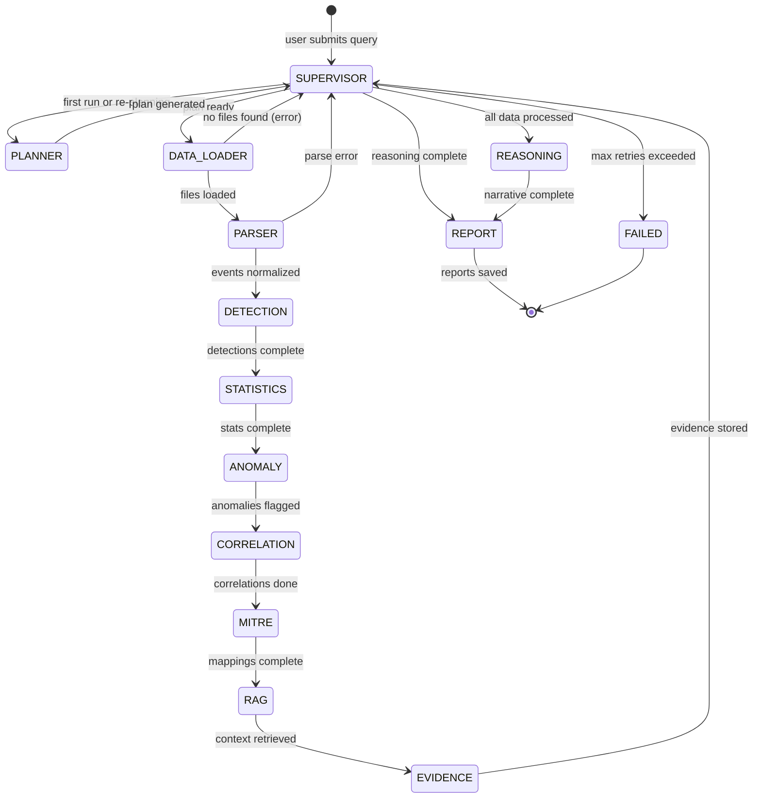
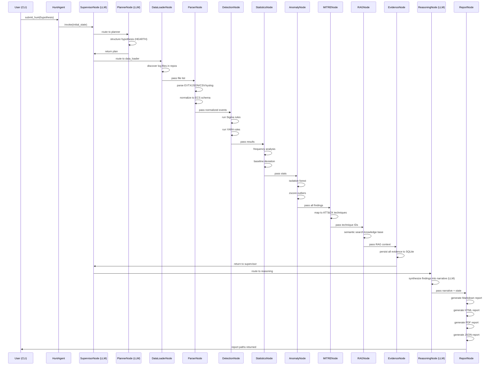
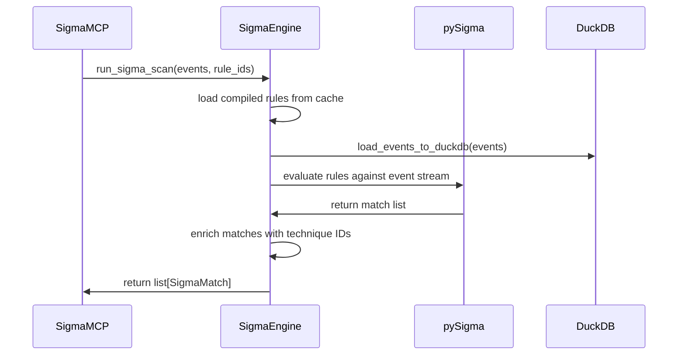
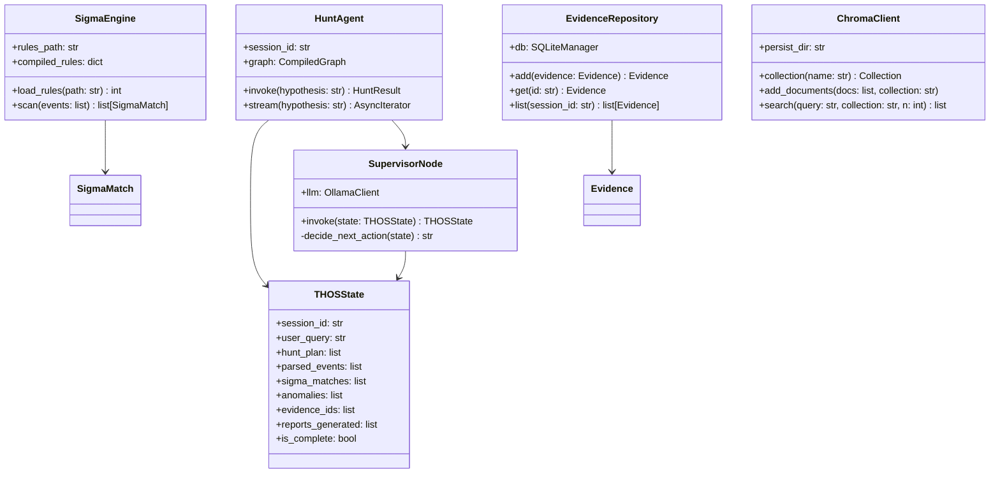
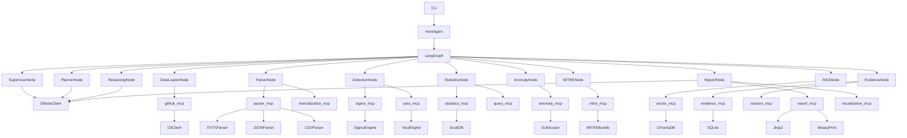

# PROJECT_SPECIFICATION.md
# Threat Hunting Operating System (THOS)
# Enterprise-Grade AI-Powered Offline Threat Hunting Platform

---

## 1. EXECUTIVE OVERVIEW

THOS is a fully offline, on-premises AI-powered Threat Hunting Operating System built on Python 3.12. It orchestrates a local LLM (Ollama/Qwen/Mistral) through LangGraph, exposes all tool capabilities via FastMCP servers, and operates exclusively against local Git repositories containing EVTX logs, JSON, CSV, Sigma rules, YARA rules, Markdown playbooks, and MITRE knowledge bases.

The LLM is used **only** for planning, reasoning, decision-making, summarization, explanation, and report generation. All deterministic operations - log parsing, Sigma matching, YARA scanning, statistics, anomaly detection, normalization - are implemented as Python tools.

---

## 2. CORE DESIGN PRINCIPLES

| Principle | Implementation |
|-----------|---------------|
| Clean Architecture | Presentation → Use Cases → Domain → Infrastructure |
| SOLID | Single responsibility per module, dependency injection throughout |
| Domain-Driven Design | Bounded contexts: Hunting, Evidence, Reporting, Knowledge |
| Offline-First | Zero network calls; all data from local Git repos |
| LLM Discipline | LLM never touches raw data; only receives structured summaries |
| Deterministic Safety | All rule matching, parsing, statistics in Python tools |
| Configuration-Driven | All paths, models, thresholds in YAML/TOML config |
| Observability | Loguru structured logging; DuckDB audit trail |

---

## 3. TECHNOLOGY STACK

```
Runtime          : Python 3.12
Package Manager  : UV
MCP Framework    : FastMCP
LLM Orchestrator : LangGraph
LLM Backend      : Ollama (Qwen2.5:14b / Mistral:7b)
Vector Store     : ChromaDB (local)
Relational DB    : SQLite (hunt sessions, evidence)
Analytics DB     : DuckDB (log analytics, statistics)
Version Control  : GitPython (read-only access to data repos)
Log Parsing      : PyEvtx, python-libevtx, json, csv
Detection Engine : Sigma (pySigma), YARA (yara-python)
Templating       : Jinja2
Report Formats   : Markdown, HTML, PDF (weasyprint), JSON
Models           : Pydantic v2
CLI              : Typer + Rich
Logging          : Loguru
Testing          : Pytest + pytest-asyncio + pytest-cov
Containers       : Docker + Docker Compose
```

---

## 4. COMPLETE FOLDER HIERARCHY

```
thos/
├── PROJECT_SPECIFICATION.md
├── PROJECT_TREE.md
├── pyproject.toml
├── uv.lock
├── Dockerfile
├── docker-compose.yml
├── .env.example
├── README.md
│
├── config/
│   ├── __init__.py
│   ├── settings.py              # Pydantic Settings root config loader
│   ├── thos.yaml                # Main configuration file
│   ├── repositories.yaml        # Git repo definitions
│   ├── models.yaml              # LLM model profiles
│   ├── logging.yaml             # Loguru logging config
│   └── collections.yaml         # ChromaDB collection definitions
│
├── core/
│   ├── __init__.py
│   ├── exceptions.py            # Domain exceptions hierarchy
│   ├── types.py                 # Shared type aliases and enums
│   ├── constants.py             # System-wide constants
│   ├── events.py                # Domain event definitions
│   └── interfaces/
│       ├── __init__.py
│       ├── repository.py        # Abstract repository interface
│       ├── parser.py            # Abstract log parser interface
│       ├── detector.py          # Abstract detection interface
│       └── embedder.py          # Abstract embedder interface
│
├── domain/
│   ├── __init__.py
│   ├── hunting/
│   │   ├── __init__.py
│   │   ├── models.py            # HuntSession, HuntHypothesis, HuntResult
│   │   ├── state.py             # LangGraph THOSState definition
│   │   └── entities.py          # Hunt domain entities
│   ├── evidence/
│   │   ├── __init__.py
│   │   ├── models.py            # Evidence, IOC, Artifact, Finding
│   │   └── entities.py
│   ├── detection/
│   │   ├── __init__.py
│   │   ├── models.py            # SigmaMatch, YaraMatch, Anomaly
│   │   └── entities.py
│   ├── reporting/
│   │   ├── __init__.py
│   │   ├── models.py            # Report, ReportSection, ReportMetadata
│   │   └── entities.py
│   └── knowledge/
│       ├── __init__.py
│       ├── models.py            # MITRETechnique, Playbook, ThreatActor
│       └── entities.py
│
├── infrastructure/
│   ├── __init__.py
│   ├── database/
│   │   ├── __init__.py
│   │   ├── sqlite_manager.py    # SQLite connection/migration manager
│   │   ├── duckdb_manager.py    # DuckDB analytics engine
│   │   └── migrations/
│   │       ├── 001_initial.sql
│   │       ├── 002_evidence.sql
│   │       └── 003_sessions.sql
│   ├── repositories/
│   │   ├── __init__.py
│   │   ├── hunt_repository.py   # Hunt session persistence
│   │   ├── evidence_repository.py
│   │   ├── detection_repository.py
│   │   └── report_repository.py
│   ├── git/
│   │   ├── __init__.py
│   │   ├── git_client.py        # GitPython read-only client
│   │   └── repo_registry.py     # Repository catalog manager
│   ├── vector/
│   │   ├── __init__.py
│   │   ├── chroma_client.py     # ChromaDB client wrapper
│   │   ├── embedder.py          # Local embedding (sentence-transformers)
│   │   └── indexer.py           # Document indexing pipeline
│   ├── ollama/
│   │   ├── __init__.py
│   │   ├── client.py            # Ollama HTTP client (local only)
│   │   └── model_manager.py     # Model availability checks
│   └── filesystem/
│       ├── __init__.py
│       └── file_manager.py      # Safe file I/O utilities
│
├── parsers/
│   ├── __init__.py
│   ├── evtx_parser.py           # Windows EVTX log parser (PyEvtx)
│   ├── json_parser.py           # Generic JSON log parser
│   ├── csv_parser.py            # CSV log parser with schema detection
│   ├── syslog_parser.py         # Syslog RFC3164/5424 parser
│   ├── cef_parser.py            # CEF (ArcSight) format parser
│   └── normalizer.py            # ECS-like field normalization
│
├── detectors/
│   ├── __init__.py
│   ├── sigma_engine.py          # pySigma rule matching engine
│   ├── yara_engine.py           # YARA rule scanning engine
│   ├── anomaly_engine.py        # Statistical anomaly detection
│   └── ioc_matcher.py           # IOC pattern matching engine
│
├── analytics/
│   ├── __init__.py
│   ├── statistics.py            # Frequency analysis, baselines
│   ├── timeline.py              # Event timeline reconstruction
│   ├── correlation.py           # Cross-source event correlation
│   └── graph_builder.py         # Entity relationship graph
│
├── mcp_servers/
│   ├── __init__.py
│   │
│   ├── github_mcp/
│   │   ├── __init__.py
│   │   ├── server.py
│   │   └── tools.py             # list_repos, get_file, list_files, diff_commits, get_log_files
│   │
│   ├── parser_mcp/
│   │   ├── __init__.py
│   │   ├── server.py
│   │   └── tools.py             # parse_evtx, parse_json_logs, parse_csv_logs, parse_syslog, parse_cef
│   │
│   ├── timeline_mcp/
│   │   ├── __init__.py
│   │   ├── server.py
│   │   └── tools.py             # build_timeline, filter_timeline, pivot_on_entity, export_timeline
│   │
│   ├── normalization_mcp/
│   │   ├── __init__.py
│   │   ├── server.py
│   │   └── tools.py             # normalize_events, detect_schema, map_to_ecs, validate_normalized
│   │
│   ├── sigma_mcp/
│   │   ├── __init__.py
│   │   ├── server.py
│   │   └── tools.py             # load_sigma_rules, run_sigma_scan, list_sigma_rules, get_rule_detail
│   │
│   ├── yara_mcp/
│   │   ├── __init__.py
│   │   ├── server.py
│   │   └── tools.py             # load_yara_rules, scan_with_yara, list_yara_rules, compile_rules
│   │
│   ├── query_mcp/
│   │   ├── __init__.py
│   │   ├── server.py
│   │   └── tools.py             # run_duckdb_query, run_sqlite_query, explain_query, list_tables
│   │
│   ├── hearth_mcp/
│   │   ├── __init__.py
│   │   ├── server.py
│   │   └── tools.py             # create_hypothesis, validate_hypothesis, score_hypothesis, get_hearth_template
│   │
│   ├── statistics_mcp/
│   │   ├── __init__.py
│   │   ├── server.py
│   │   └── tools.py             # frequency_analysis, top_n, baseline_deviation, entropy_score, time_series
│   │
│   ├── anomaly_mcp/
│   │   ├── __init__.py
│   │   ├── server.py
│   │   └── tools.py             # detect_anomalies, isolation_forest, zscore_outliers, rare_events
│   │
│   ├── mitre_mcp/
│   │   ├── __init__.py
│   │   ├── server.py
│   │   └── tools.py             # lookup_technique, map_to_attack, get_tactic, list_techniques, search_mitre
│   │
│   ├── evidence_mcp/
│   │   ├── __init__.py
│   │   ├── server.py
│   │   └── tools.py             # add_evidence, get_evidence, list_evidence, tag_evidence, export_chain
│   │
│   ├── report_mcp/
│   │   ├── __init__.py
│   │   ├── server.py
│   │   └── tools.py             # generate_markdown, generate_html, generate_pdf, generate_json, generate_ioc_report
│   │
│   ├── visualization_mcp/
│   │   ├── __init__.py
│   │   ├── server.py
│   │   └── tools.py             # render_timeline_chart, render_heatmap, render_attack_graph, render_statistics
│   │
│   ├── session_mcp/
│   │   ├── __init__.py
│   │   ├── server.py
│   │   └── tools.py             # create_session, get_session, list_sessions, close_session, export_session
│   │
│   ├── vector_mcp/
│   │   ├── __init__.py
│   │   ├── server.py
│   │   └── tools.py             # semantic_search, keyword_search, hybrid_search, index_document, list_collections
│   │
│   ├── cache_mcp/
│   │   ├── __init__.py
│   │   ├── server.py
│   │   └── tools.py             # get_cached, set_cached, invalidate_cache, list_cache_keys, clear_namespace
│   │
│   ├── configuration_mcp/
│   │   ├── __init__.py
│   │   ├── server.py
│   │   └── tools.py             # get_config, list_repos, get_model_profile, validate_config
│   │
│   ├── logging_mcp/
│   │   ├── __init__.py
│   │   ├── server.py
│   │   └── tools.py             # write_audit_log, get_recent_logs, search_logs, get_session_logs
│   │
│   └── system_mcp/
│       ├── __init__.py
│       ├── server.py
│       └── tools.py             # health_check, get_system_info, list_available_models, check_ollama
│
├── graph/
│   ├── __init__.py
│   ├── nodes/
│   │   ├── __init__.py
│   │   ├── planner_node.py      # LLM: decomposes user intent into hunt plan
│   │   ├── data_loader_node.py  # Tool: loads logs from git repos
│   │   ├── parser_node.py       # Tool: parses raw logs to normalized events
│   │   ├── detection_node.py    # Tool: runs Sigma + YARA
│   │   ├── statistics_node.py   # Tool: frequency / anomaly analysis
│   │   ├── mitre_node.py        # Tool: maps findings to MITRE ATT&CK
│   │   ├── evidence_node.py     # Tool: collects and stores evidence
│   │   ├── rag_node.py          # Tool: semantic search against knowledge base
│   │   ├── hypothesis_node.py   # LLM: creates/validates HEARTH hypotheses
│   │   ├── reasoning_node.py    # LLM: reasons over structured findings
│   │   ├── report_node.py       # LLM + Tool: generates hunt report
│   │   └── supervisor_node.py   # LLM: decides next action, handles retries
│   ├── edges.py                 # Conditional edge logic
│   ├── state.py                 # THOSState (TypedDict, complete)
│   ├── workflow.py              # LangGraph graph compilation
│   └── checkpointer.py          # SQLite-backed graph checkpointing
│
├── agents/
│   ├── __init__.py
│   ├── hunt_agent.py            # Primary LangGraph agent entry point
│   └── prompt_templates/
│       ├── __init__.py
│       ├── planner.jinja2
│       ├── hypothesis.jinja2
│       ├── reasoning.jinja2
│       ├── report_executive.jinja2
│       ├── report_technical.jinja2
│       └── supervisor.jinja2
│
├── templates/
│   ├── reports/
│   │   ├── executive_report.html.jinja2
│   │   ├── technical_report.html.jinja2
│   │   ├── ioc_report.html.jinja2
│   │   ├── timeline_report.html.jinja2
│   │   ├── mitre_report.html.jinja2
│   │   └── evidence_report.html.jinja2
│   └── styles/
│       └── report.css
│
├── cli/
│   ├── __init__.py
│   ├── app.py                   # Typer root CLI app
│   ├── commands/
│   │   ├── __init__.py
│   │   ├── hunt.py              # thos hunt <hypothesis>
│   │   ├── index.py             # thos index <repo>
│   │   ├── report.py            # thos report <session_id>
│   │   ├── sessions.py          # thos sessions list/show/export
│   │   ├── repos.py             # thos repos list/sync
│   │   └── system.py            # thos system health/info
│   └── display/
│       ├── __init__.py
│       ├── tables.py            # Rich table renderers
│       ├── panels.py            # Rich panel/layout builders
│       └── progress.py          # Rich progress indicators
│
├── data/
│   ├── mitre/
│   │   └── enterprise-attack.json   # Local MITRE ATT&CK JSON bundle
│   ├── sigma_rules/                 # Bundled Sigma rule library
│   └── yara_rules/                  # Bundled YARA rule library
│
├── tests/
│   ├── conftest.py
│   ├── fixtures/
│   │   ├── sample.evtx
│   │   ├── sample_logs.json
│   │   ├── sample.csv
│   │   └── test_sigma.yml
│   ├── unit/
│   │   ├── test_parsers.py
│   │   ├── test_detectors.py
│   │   ├── test_analytics.py
│   │   ├── test_repositories.py
│   │   └── test_normalizer.py
│   ├── integration/
│   │   ├── test_mcp_servers.py
│   │   ├── test_graph_workflow.py
│   │   └── test_vector_search.py
│   └── e2e/
│       └── test_full_hunt.py
│
└── scripts/
    ├── setup_repos.sh
    ├── index_knowledge_base.py
    └── seed_test_data.py
```

---

## 5. DOMAIN MODELS

### 5.1 Hunt Domain

```python
# domain/hunting/models.py (Pydantic v2)

class HuntStatus(str, Enum):
    PENDING = "pending"
    PLANNING = "planning"
    EXECUTING = "executing"
    ANALYZING = "analyzing"
    REPORTING = "reporting"
    COMPLETE = "complete"
    FAILED = "failed"

class HuntHypothesis(BaseModel):
    id: UUID
    text: str
    tactic: str
    technique_id: str
    data_sources: list[str]
    hearth_template: HEARTHTemplate
    confidence: float = 0.0
    created_at: datetime

class HuntSession(BaseModel):
    id: UUID
    name: str
    hypothesis: HuntHypothesis
    status: HuntStatus
    repositories: list[str]
    start_time: datetime
    end_time: Optional[datetime]
    findings_count: int
    evidence_ids: list[UUID]

class HuntResult(BaseModel):
    session_id: UUID
    findings: list[Finding]
    mitre_mappings: list[MITREMapping]
    iocs: list[IOC]
    timeline_events: list[TimelineEvent]
    risk_score: float
    summary: str
```

### 5.2 Evidence Domain

```python
class EvidenceType(str, Enum):
    LOG_EVENT = "log_event"
    FILE_ARTIFACT = "file_artifact"
    NETWORK_CONNECTION = "network_connection"
    PROCESS_EXECUTION = "process_execution"
    REGISTRY_MODIFICATION = "registry_modification"
    SIGMA_HIT = "sigma_hit"
    YARA_HIT = "yara_hit"

class Evidence(BaseModel):
    id: UUID
    session_id: UUID
    type: EvidenceType
    source_file: str
    source_repo: str
    timestamp: datetime
    raw_event: dict[str, Any]
    normalized_event: dict[str, Any]
    tags: list[str]
    mitre_technique: Optional[str]
    confidence: float
    notes: str

class IOC(BaseModel):
    id: UUID
    session_id: UUID
    ioc_type: Literal["ip", "domain", "hash_md5", "hash_sha1", "hash_sha256", "url", "email", "registry_key", "file_path"]
    value: str
    context: str
    first_seen: datetime
    last_seen: datetime
    occurrence_count: int
```

### 5.3 Detection Domain

```python
class SigmaMatch(BaseModel):
    rule_id: str
    rule_title: str
    rule_description: str
    severity: Literal["critical", "high", "medium", "low", "informational"]
    matched_events: list[dict[str, Any]]
    match_count: int
    source_file: str
    technique_ids: list[str]

class YaraMatch(BaseModel):
    rule_name: str
    rule_tags: list[str]
    matched_strings: list[dict[str, str]]
    source_file: str
    offset: int
    meta: dict[str, str]

class Anomaly(BaseModel):
    anomaly_type: Literal["frequency", "zscore", "isolation", "temporal", "rare_event"]
    field: str
    value: Any
    expected_baseline: float
    observed_value: float
    deviation_score: float
    supporting_events: list[dict[str, Any]]
```

### 5.4 MITRE Domain

```python
class MITRETechnique(BaseModel):
    technique_id: str          # e.g. "T1059.001"
    name: str
    tactic: list[str]
    description: str
    data_sources: list[str]
    detection_guidance: str
    mitigations: list[str]
    subtechniques: list[str]
    platforms: list[str]

class MITREMapping(BaseModel):
    session_id: UUID
    technique_id: str
    technique_name: str
    tactic: str
    evidence_ids: list[UUID]
    confidence: float
    rationale: str
```

### 5.5 Report Domain

```python
class ReportFormat(str, Enum):
    MARKDOWN = "markdown"
    HTML = "html"
    PDF = "pdf"
    JSON = "json"

class ReportType(str, Enum):
    EXECUTIVE = "executive"
    TECHNICAL = "technical"
    EVIDENCE = "evidence"
    TIMELINE = "timeline"
    MITRE = "mitre"
    IOC = "ioc"

class Report(BaseModel):
    id: UUID
    session_id: UUID
    report_type: ReportType
    format: ReportFormat
    title: str
    generated_at: datetime
    content: str
    file_path: Optional[str]
    metadata: dict[str, Any]
```

---

## 6. LANGGRAPH STATE

```python
# graph/state.py

class THOSState(TypedDict):
    # Session
    session_id: str
    session_name: str
    started_at: str

    # User Input
    user_query: str
    raw_hypothesis: str

    # Planning
    structured_hypothesis: Optional[HuntHypothesisDict]
    hunt_plan: Optional[list[HuntStepDict]]
    current_step: int
    total_steps: int

    # Data Loading
    target_repositories: list[str]
    loaded_files: list[str]
    raw_log_batches: list[LogBatchDict]

    # Parsing
    parsed_events: list[NormalizedEventDict]
    parse_errors: list[str]
    total_events_parsed: int

    # Detection
    sigma_matches: list[SigmaMatchDict]
    yara_matches: list[YaraMatchDict]
    detection_summary: Optional[str]

    # Analytics
    statistics_results: Optional[StatisticsResultDict]
    anomalies: list[AnomalyDict]
    timeline_events: list[TimelineEventDict]

    # Knowledge
    rag_context: list[RAGResultDict]
    mitre_techniques: list[MITREMappingDict]

    # Evidence
    evidence_ids: list[str]
    iocs: list[IOCDict]

    # Reasoning
    reasoning_chain: list[ReasoningStepDict]
    findings_summary: Optional[str]
    risk_score: float
    confidence_score: float

    # Reporting
    reports_generated: list[str]
    report_paths: list[str]

    # Control
    errors: list[str]
    warnings: list[str]
    next_action: Optional[str]
    is_complete: bool
    retry_count: int
    max_retries: int
```

---

## 7. LANGGRAPH NODES

### Node Definitions

| Node | Type | Responsibility |
|------|------|---------------|
| `supervisor_node` | LLM | Orchestrates the workflow, decides next action |
| `planner_node` | LLM | Decomposes hypothesis into structured hunt plan |
| `data_loader_node` | Tool | Discovers and loads log files from Git repos |
| `parser_node` | Tool | Parses EVTX/JSON/CSV/syslog/CEF to normalized events |
| `detection_node` | Tool | Runs Sigma and YARA engines |
| `statistics_node` | Tool | Frequency analysis, baseline deviation, entropy |
| `anomaly_node` | Tool | Isolation forest, Z-score, rare event detection |
| `correlation_node` | Tool | Cross-source event correlation |
| `mitre_node` | Tool | Maps detections to MITRE ATT&CK |
| `rag_node` | Tool | Semantic search against knowledge base |
| `hypothesis_node` | LLM | Creates and validates HEARTH hypothesis |
| `evidence_node` | Tool | Stores findings as evidence chain |
| `reasoning_node` | LLM | Synthesizes all findings into threat narrative |
| `report_node` | LLM+Tool | Generates all report formats |

---

## 8. STATE MACHINE TRANSITIONS



---

## 9. CONDITIONAL EDGE LOGIC

```python
# graph/edges.py

def route_supervisor(state: THOSState) -> str:
    if state["errors"] and state["retry_count"] >= state["max_retries"]:
        return "failed"
    if not state.get("hunt_plan"):
        return "planner"
    if not state.get("parsed_events"):
        return "data_loader"
    if state.get("is_complete"):
        return "report"
    if state.get("findings_summary"):
        return "report"
    return "reasoning"

def route_after_detection(state: THOSState) -> str:
    total_hits = (
        len(state.get("sigma_matches", [])) +
        len(state.get("yara_matches", []))
    )
    if total_hits == 0:
        return "statistics"  # continue with statistical analysis anyway
    return "statistics"

def route_after_reasoning(state: THOSState) -> str:
    if state.get("findings_summary"):
        return "report"
    return "supervisor"
```

---

## 10. MCP SERVER SPECIFICATIONS

### 10.1 github_mcp

**Purpose:** Read-only access to local Git repositories

**Tools:**
- `list_repositories()` → list[RepoInfo]
- `list_files(repo: str, path: str = "", extensions: list[str] = [])` → list[FileInfo]
- `get_file_content(repo: str, file_path: str)` → FileContent
- `get_commit_log(repo: str, max_entries: int = 50)` → list[CommitInfo]
- `list_log_files(repo: str)` → list[LogFileInfo] - auto-discovers EVTX/JSON/CSV/log
- `get_repo_tree(repo: str)` → RepoTree

### 10.2 parser_mcp

**Purpose:** Parse all supported log formats to normalized event dicts

**Tools:**
- `parse_evtx(file_path: str, max_events: int = 10000)` → ParseResult
- `parse_json_logs(file_path: str, record_path: Optional[str])` → ParseResult
- `parse_csv_logs(file_path: str, timestamp_field: str)` → ParseResult
- `parse_syslog(file_path: str)` → ParseResult
- `parse_cef(file_path: str)` → ParseResult
- `auto_parse(file_path: str)` → ParseResult - detects format automatically

### 10.3 timeline_mcp

**Purpose:** Build, filter, and export chronological event timelines

**Tools:**
- `build_timeline(events: list[dict], timestamp_field: str)` → Timeline
- `filter_timeline(timeline_id: str, start: str, end: str, event_types: list[str])` → Timeline
- `pivot_on_entity(timeline_id: str, entity_field: str, entity_value: str)` → Timeline
- `enrich_timeline(timeline_id: str)` → Timeline - adds MITRE context per event
- `export_timeline(timeline_id: str, format: str)` → ExportResult

### 10.4 normalization_mcp

**Purpose:** Normalize diverse log formats to a common ECS-like schema

**Tools:**
- `normalize_events(events: list[dict], source_type: str)` → list[NormalizedEvent]
- `detect_schema(events: list[dict])` → SchemaDetectionResult
- `map_to_ecs(events: list[dict], source_type: str)` → list[ECSEvent]
- `validate_normalized(events: list[dict])` → ValidationResult
- `get_field_mapping(source_type: str)` → FieldMapping

### 10.5 sigma_mcp

**Purpose:** Load and execute Sigma rules against normalized events

**Tools:**
- `load_sigma_rules(rules_path: str, tags: list[str] = [])` → RuleLoadResult
- `run_sigma_scan(events: list[dict], rule_ids: list[str] = [])` → list[SigmaMatch]
- `list_sigma_rules(filter_tactic: str = "", filter_severity: str = "")` → list[SigmaRuleSummary]
- `get_rule_detail(rule_id: str)` → SigmaRule
- `validate_sigma_rule(rule_yaml: str)` → ValidationResult

### 10.6 yara_mcp

**Purpose:** YARA rule scanning against file content and log artifacts

**Tools:**
- `load_yara_rules(rules_path: str)` → RuleLoadResult
- `scan_with_yara(content: str | bytes, rule_ids: list[str] = [])` → list[YaraMatch]
- `scan_file_yara(file_path: str, rule_ids: list[str] = [])` → list[YaraMatch]
- `list_yara_rules()` → list[YaraRuleSummary]
- `compile_rules(rules_path: str)` → CompileResult

### 10.7 query_mcp

**Purpose:** SQL analytics against DuckDB (logs) and SQLite (sessions)

**Tools:**
- `run_duckdb_query(sql: str, params: dict = {})` → QueryResult
- `run_sqlite_query(sql: str, params: dict = {})` → QueryResult
- `load_events_to_duckdb(events: list[dict], table_name: str)` → LoadResult
- `list_tables(database: Literal["duckdb", "sqlite"])` → list[TableInfo]
- `explain_query(sql: str)` → str

### 10.8 hearth_mcp

**Purpose:** HEARTH methodology hypothesis management

**Tools:**
- `create_hypothesis(text: str, tactic: str, technique_id: str)` → HEARTHHypothesis
- `validate_hypothesis(hypothesis_id: str)` → ValidationResult
- `score_hypothesis(hypothesis_id: str, findings: dict)` → HypothesisScore
- `get_hearth_template(tactic: str)` → HEARTHTemplate
- `list_hypotheses(session_id: str)` → list[HEARTHHypothesis]

### 10.9 statistics_mcp

**Purpose:** All statistical analysis - never done by LLM

**Tools:**
- `frequency_analysis(events: list[dict], field: str, top_n: int = 20)` → FrequencyResult
- `top_n_values(events: list[dict], field: str, n: int)` → list[ValueCount]
- `baseline_deviation(events: list[dict], field: str, window_hours: int)` → BaselineResult
- `entropy_score(values: list[str])` → float
- `time_series_analysis(events: list[dict], bucket_minutes: int)` → TimeSeriesResult
- `co_occurrence_matrix(events: list[dict], field_a: str, field_b: str)` → CoOccurrenceResult

### 10.10 anomaly_mcp

**Purpose:** Statistical anomaly and outlier detection

**Tools:**
- `detect_anomalies(events: list[dict], method: Literal["isolation_forest", "zscore", "iqr"])` → list[Anomaly]
- `isolation_forest_scan(events: list[dict], features: list[str])` → list[Anomaly]
- `zscore_outliers(values: list[float], threshold: float = 3.0)` → list[int]
- `find_rare_events(events: list[dict], field: str, min_count: int = 2)` → list[dict]
- `temporal_anomaly(events: list[dict], expected_pattern: str)` → list[Anomaly]

### 10.11 mitre_mcp

**Purpose:** MITRE ATT&CK knowledge (fully local, from bundled JSON)

**Tools:**
- `lookup_technique(technique_id: str)` → MITRETechnique
- `map_to_attack(sigma_matches: list[dict], yara_matches: list[dict])` → list[MITREMapping]
- `get_tactic(tactic_name: str)` → TacticDetail
- `list_techniques(tactic: str = "", platform: str = "")` → list[TechniqueSummary]
- `search_mitre(query: str)` → list[TechniqueSummary]
- `get_datasources_for_technique(technique_id: str)` → list[str]

### 10.12 evidence_mcp

**Purpose:** Evidence chain management and persistence

**Tools:**
- `add_evidence(session_id: str, evidence: dict)` → Evidence
- `get_evidence(evidence_id: str)` → Evidence
- `list_evidence(session_id: str, filter_type: str = "")` → list[Evidence]
- `tag_evidence(evidence_id: str, tags: list[str])` → Evidence
- `export_chain(session_id: str, format: str)` → ExportResult
- `link_evidence(evidence_id_a: str, evidence_id_b: str, relationship: str)` → None

### 10.13 report_mcp

**Purpose:** Multi-format report generation

**Tools:**
- `generate_markdown(session_id: str, report_type: str)` → ReportResult
- `generate_html(session_id: str, report_type: str)` → ReportResult
- `generate_pdf(session_id: str, report_type: str)` → ReportResult
- `generate_json(session_id: str, report_type: str)` → ReportResult
- `generate_ioc_report(session_id: str)` → ReportResult
- `generate_executive_summary(session_id: str)` → ReportResult
- `list_reports(session_id: str)` → list[ReportInfo]

### 10.14 visualization_mcp

**Purpose:** Chart and graph generation (SVG/HTML, no external services)

**Tools:**
- `render_timeline_chart(timeline: dict)` → SVGContent
- `render_heatmap(data: dict, x_field: str, y_field: str)` → SVGContent
- `render_attack_graph(mitre_mappings: list[dict])` → SVGContent
- `render_frequency_bar(frequency_result: dict)` → SVGContent
- `render_statistics_dashboard(stats: dict)` → HTMLContent

### 10.15 session_mcp

**Purpose:** Hunt session lifecycle management

**Tools:**
- `create_session(name: str, hypothesis: dict)` → Session
- `get_session(session_id: str)` → Session
- `list_sessions(status: str = "", limit: int = 20)` → list[SessionSummary]
- `update_session_status(session_id: str, status: str)` → Session
- `close_session(session_id: str)` → Session
- `export_session(session_id: str)` → ExportResult

### 10.16 vector_mcp

**Purpose:** Semantic / hybrid search over local knowledge base

**Tools:**
- `semantic_search(query: str, collection: str, top_k: int = 10)` → list[SearchResult]
- `keyword_search(query: str, collection: str, top_k: int = 10)` → list[SearchResult]
- `hybrid_search(query: str, collection: str, top_k: int = 10, alpha: float = 0.5)` → list[SearchResult]
- `index_document(content: str, metadata: dict, collection: str)` → IndexResult
- `list_collections()` → list[CollectionInfo]
- `delete_document(doc_id: str, collection: str)` → None

### 10.17 cache_mcp

**Purpose:** In-memory and disk-backed caching for expensive operations

**Tools:**
- `get_cached(key: str, namespace: str)` → Optional[Any]
- `set_cached(key: str, value: Any, namespace: str, ttl_seconds: int = 3600)` → None
- `invalidate_cache(key: str, namespace: str)` → None
- `list_cache_keys(namespace: str)` → list[str]
- `clear_namespace(namespace: str)` → int - returns count cleared

### 10.18 configuration_mcp

**Purpose:** Runtime configuration access

**Tools:**
- `get_config(key: str)` → Any
- `list_repos()` → list[RepoConfig]
- `get_model_profile(profile_name: str)` → ModelProfile
- `validate_config()` → ValidationResult
- `get_collection_config(collection_name: str)` → CollectionConfig

### 10.19 logging_mcp

**Purpose:** Structured audit logging and log search

**Tools:**
- `write_audit_log(session_id: str, event_type: str, payload: dict)` → None
- `get_recent_logs(session_id: str, limit: int = 100)` → list[AuditLog]
- `search_logs(query: str, session_id: str = "")` → list[AuditLog]
- `get_session_logs(session_id: str)` → list[AuditLog]

### 10.20 system_mcp

**Purpose:** System health, model availability, environment checks

**Tools:**
- `health_check()` → HealthStatus
- `get_system_info()` → SystemInfo
- `list_available_models()` → list[ModelInfo]
- `check_ollama()` → OllamaStatus
- `check_database()` → DatabaseStatus
- `check_vector_store()` → VectorStoreStatus

---

## 11. CHROMADB VECTOR COLLECTIONS

| Collection Name | Contents | Embedding Model |
|----------------|----------|-----------------|
| `playbooks` | HEARTH playbooks, hunt runbooks | all-MiniLM-L6-v2 |
| `mitre_knowledge` | ATT&CK technique descriptions | all-MiniLM-L6-v2 |
| `sigma_rules_kb` | Sigma rule descriptions and rationale | all-MiniLM-L6-v2 |
| `threat_reports` | Markdown threat research docs | all-MiniLM-L6-v2 |
| `yara_rules_kb` | YARA rule documentation | all-MiniLM-L6-v2 |
| `investigation_notes` | Past hunt session summaries | all-MiniLM-L6-v2 |

**Metadata Schema (all collections):**
```json
{
  "source_repo": "string",
  "file_path": "string",
  "doc_type": "string",
  "technique_ids": ["T1059"],
  "tactic": "string",
  "severity": "string",
  "indexed_at": "ISO8601",
  "chunk_index": 0,
  "total_chunks": 1
}
```

---

## 12. DATABASE SCHEMA

### 12.1 SQLite - Hunt Sessions & Evidence

```sql
-- migrations/001_initial.sql
CREATE TABLE hunt_sessions (
    id TEXT PRIMARY KEY,
    name TEXT NOT NULL,
    hypothesis_text TEXT NOT NULL,
    technique_id TEXT,
    tactic TEXT,
    status TEXT NOT NULL DEFAULT 'pending',
    repositories TEXT NOT NULL,  -- JSON array
    start_time TEXT NOT NULL,
    end_time TEXT,
    findings_count INTEGER DEFAULT 0,
    risk_score REAL DEFAULT 0.0,
    created_at TEXT NOT NULL
);

CREATE TABLE evidence (
    id TEXT PRIMARY KEY,
    session_id TEXT NOT NULL REFERENCES hunt_sessions(id),
    evidence_type TEXT NOT NULL,
    source_file TEXT NOT NULL,
    source_repo TEXT NOT NULL,
    event_timestamp TEXT,
    raw_event TEXT NOT NULL,     -- JSON
    normalized_event TEXT,       -- JSON
    tags TEXT,                   -- JSON array
    mitre_technique TEXT,
    confidence REAL DEFAULT 0.0,
    notes TEXT,
    created_at TEXT NOT NULL
);

CREATE TABLE iocs (
    id TEXT PRIMARY KEY,
    session_id TEXT NOT NULL REFERENCES hunt_sessions(id),
    ioc_type TEXT NOT NULL,
    value TEXT NOT NULL,
    context TEXT,
    first_seen TEXT,
    last_seen TEXT,
    occurrence_count INTEGER DEFAULT 1
);

CREATE TABLE reports (
    id TEXT PRIMARY KEY,
    session_id TEXT NOT NULL REFERENCES hunt_sessions(id),
    report_type TEXT NOT NULL,
    format TEXT NOT NULL,
    title TEXT NOT NULL,
    generated_at TEXT NOT NULL,
    file_path TEXT,
    metadata TEXT              -- JSON
);

CREATE TABLE audit_logs (
    id TEXT PRIMARY KEY,
    session_id TEXT,
    event_type TEXT NOT NULL,
    payload TEXT NOT NULL,     -- JSON
    created_at TEXT NOT NULL
);

CREATE TABLE evidence_links (
    id TEXT PRIMARY KEY,
    evidence_id_a TEXT NOT NULL REFERENCES evidence(id),
    evidence_id_b TEXT NOT NULL REFERENCES evidence(id),
    relationship TEXT NOT NULL,
    created_at TEXT NOT NULL
);
```

### 12.2 DuckDB - Log Analytics

```sql
-- Dynamically created per hunt session
CREATE TABLE normalized_events_{session_id} (
    event_id VARCHAR PRIMARY KEY,
    timestamp TIMESTAMPTZ,
    source_file VARCHAR,
    source_type VARCHAR,
    event_type VARCHAR,
    host_name VARCHAR,
    user_name VARCHAR,
    process_name VARCHAR,
    process_id INTEGER,
    parent_process_name VARCHAR,
    command_line VARCHAR,
    file_path VARCHAR,
    network_src_ip VARCHAR,
    network_dst_ip VARCHAR,
    network_dst_port INTEGER,
    raw_event JSON,
    normalized_at TIMESTAMPTZ DEFAULT now()
);

CREATE INDEX idx_events_timestamp ON normalized_events_{session_id}(timestamp);
CREATE INDEX idx_events_host ON normalized_events_{session_id}(host_name);
CREATE INDEX idx_events_user ON normalized_events_{session_id}(user_name);
```

---

## 13. CONFIGURATION SCHEMA

### 13.1 thos.yaml

```yaml
thos:
  version: "1.0.0"
  environment: "production"
  data_dir: "/data/thos"
  output_dir: "/data/thos/output"

ollama:
  base_url: "http://localhost:11434"
  default_model: "qwen2.5:14b"
  fallback_model: "mistral:7b"
  timeout_seconds: 300
  context_window: 32768

database:
  sqlite_path: "/data/thos/db/thos.db"
  duckdb_path: "/data/thos/db/thos.duckdb"

chromadb:
  persist_directory: "/data/thos/vector"
  embedding_model: "all-MiniLM-L6-v2"
  embedding_device: "cpu"

mcp_servers:
  host: "127.0.0.1"
  base_port: 8100

logging:
  level: "INFO"
  file: "/data/thos/logs/thos.log"
  rotation: "100 MB"
  retention: "30 days"

detection:
  sigma_rules_path: "/data/thos/rules/sigma"
  yara_rules_path: "/data/thos/rules/yara"
  max_events_per_scan: 100000

reporting:
  output_path: "/data/thos/reports"
  templates_path: "templates/reports"

cache:
  ttl_seconds: 3600
  max_size_mb: 512
```

### 13.2 repositories.yaml

```yaml
repositories:
  - name: "evtx_lab"
    path: "/data/repos/evtx-lab"
    description: "Windows EVTX log samples"
    log_types: ["evtx"]
    auto_index: true

  - name: "sigma_rules"
    path: "/data/repos/sigma"
    description: "Sigma detection rules"
    log_types: []
    auto_index: true

  - name: "yara_rules"
    path: "/data/repos/yara"
    description: "YARA malware rules"
    log_types: []
    auto_index: true

  - name: "knowledge_base"
    path: "/data/repos/knowledge"
    description: "Threat intel and playbooks"
    log_types: []
    auto_index: true

  - name: "json_logs"
    path: "/data/repos/json-logs"
    description: "Structured JSON log samples"
    log_types: ["json"]
    auto_index: false
```

---

## 14. WORKFLOW SEQUENCE DIAGRAMS

### 14.1 Full Hunt Workflow



### 14.2 Sigma Detection Flow



---

## 15. CLASS DIAGRAMS



---

## 16. REPORT FORMATS

### 16.1 Executive Report
- Threat Summary (1 paragraph, LLM generated)
- Risk Score (0–10, calculated)
- Key Findings (bullet list)
- MITRE ATT&CK Navigator coverage
- Recommended Actions

### 16.2 Technical Report
- Hypothesis and Methodology
- Data Sources Analyzed
- Detection Results (Sigma hits, YARA matches)
- Statistical Anomalies
- Evidence Chain
- IOC List
- Timeline of Events
- MITRE Technique Mapping

### 16.3 IOC Report
- Hash IOCs (MD5/SHA1/SHA256)
- IP Indicators
- Domain Indicators
- File Path Indicators
- Registry Key Indicators
- First/Last Seen timestamps
- Occurrence counts

### 16.4 Timeline Report
- Chronological event list
- Color-coded by severity
- Pivotable by host/user/process
- Export to CSV

### 16.5 MITRE Report
- Techniques detected (with confidence)
- Tactic coverage matrix
- Detection gaps
- Navigator JSON layer

### 16.6 Evidence Report
- Full evidence chain
- Chain of custody log
- Source files
- Normalized event details

---

## 17. DEPENDENCY GRAPH



---

## 18. FUTURE EXTENSION POINTS

| Extension | Interface | Location |
|-----------|-----------|----------|
| New log format | `core/interfaces/parser.py:AbstractParser` | `parsers/` |
| New detection engine | `core/interfaces/detector.py:AbstractDetector` | `detectors/` |
| New LLM backend | `infrastructure/ollama/client.py` | Switch via config |
| New MCP server | `mcp_servers/<name>/server.py` | Auto-discovered |
| New report format | `templates/reports/` + `mcp_servers/report_mcp/tools.py` | Template + tool |
| New vector collection | `config/collections.yaml` | Config-driven |
| New Git data source | `config/repositories.yaml` | Config-driven |
| New embedding model | `config/thos.yaml:chromadb.embedding_model` | Config-driven |
| External SIEM | `infrastructure/repositories/` | New repo class |
| Streaming hunt output | `graph/workflow.py` | LangGraph `.stream()` |

---

## 19. TESTING STRATEGY

| Level | Scope | Tools |
|-------|-------|-------|
| Unit | Parsers, detectors, analytics | pytest, fixtures |
| Integration | MCP server tool invocations | pytest-asyncio, FastMCP test client |
| Integration | LangGraph node transitions | mock LLM responses |
| E2E | Full hunt with sample EVTX | Real Ollama optional (skipif not available) |
| Coverage | All modules ≥ 80% | pytest-cov |

---

## 20. ENVIRONMENT VARIABLES

```bash
THOS_CONFIG_PATH=/data/thos/config/thos.yaml
THOS_DATA_DIR=/data/thos
THOS_LOG_LEVEL=INFO
OLLAMA_BASE_URL=http://localhost:11434
THOS_SQLITE_PATH=/data/thos/db/thos.db
THOS_DUCKDB_PATH=/data/thos/db/thos.duckdb
THOS_CHROMA_DIR=/data/thos/vector
THOS_REPORTS_DIR=/data/thos/reports
THOS_REPOS_CONFIG=/data/thos/config/repositories.yaml
```

---

*End of PROJECT_SPECIFICATION.md*
*THOS v1.0.0 - Offline AI-Powered Threat Hunting Operating System*
