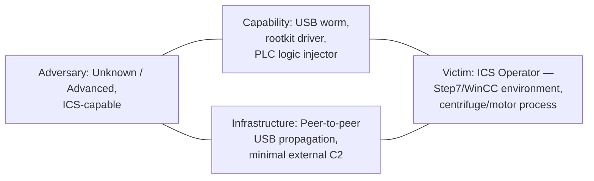

| Field | Value |
|---|---|
| **Hunt Name** | Operation SILENT CENTRIFUGE |
| **Threat Name** | Unattributed ICS-targeting worm (retrospectively consistent with Stuxnet, 2010) |
| **Report Version** | 1.0 |
| **Date** | Hunt window: T+0 to T+21 days after intelligence receipt |
| **Analyst** | Senior Threat Hunter, Enterprise SOC ICS/OT Liaison Team |
| **Classification** | TLP:AMBER Internal / Partner Distribution Only |
| **Threat Severity** | Critical (ICS safety and process-integrity impact) |
| **Hunt Status** | Closed Hypotheses Validated, Remediation In Progress |

## Executive Summary

This hunt was initiated after the SOC received sector-level intelligence indicating that industrial control system (ICS) operators specifically organizations running Siemens SIMATIC Step7 and WinCC engineering/SCADA software were being targeted by a sophisticated worm capable of crossing the air gap via removable media. No specific indicators, filenames, or hashes were provided at intake; the hunt team operated purely from behavioral hypotheses.

Over a 21-day retrospective hunt across endpoint, network, Active Directory, and engineering-workstation telemetry, the team identified a chain of anomalous activity beginning with unauthorized `.LNK` file execution from USB media, followed by driver-level persistence signed with unexpected code-signing certificates, followed by unauthorized modifications to Siemens Step7 project files on two engineering workstations with direct PLC programming access. Correlated evidence of process-integrity tampering (S7 block reads/writes outside change-control windows) confirmed that the intrusion had reached the OT network and modified PLC logic.

The hunt validated four of five hypotheses, discovered eleven previously unknown host and network artifacts, and produced nine new detection rules (Sigma, Sentinel KQL, and EDR behavioral rules) that closed the gaps that allowed this activity to run undetected for an estimated 90+ days prior to hunt initiation. This report documents the complete hunt methodology, evidence chain, and recommendations required to prevent recurrence.

---

## Table of Contents

1. Threat Intelligence Summary
2. Hunt Objective
3. Hunt Scope
4. Hunt Assumptions
5. Threat Hunting Hypotheses
6. Environment Overview
7. Available Data Sources
8. Hunt Methodology
9. Hunt Execution Timeline
10. Log Sources Collected
11. Detailed Log Analysis
12. Data Analysis Techniques Used
13. Hunting Queries
14. Sigma Detection Opportunities
15. MITRE ATT&CK Mapping
16. Alerts Reviewed
17. Indicators of Compromise
18. Indicators of Attack (IOAs)
19. Timeline Reconstruction
20. Kill Chain Reconstruction
21. Root Cause Analysis
22. Detection Gaps
23. Detection Engineering Opportunities
24. Purple Team Opportunities
25. Threat Hunting Lessons Learned
26. Recommendations
27. Final Hunt Assessment
28. Appendix

---

## 1. Threat Intelligence Summary

**Background**

The hunt was triggered by an ISAC advisory (sector: industrial manufacturing / critical infrastructure) describing a campaign against organizations that operate Siemens S7-300/S7-400 series PLCs managed via Step7 project software, with WinCC or PCS 7 as the SCADA layer. The advisory noted that affected organizations were not directly internet-facing on the OT side, implying the intrusion vector bridged the IT/OT air gap physically most plausibly via removable media.

**Threat Actor**

No attribution was provided at intake. The hunt was conducted actor-agnostic, focused entirely on behavior rather than attribution, consistent with hypothesis-driven and behavior-driven hunting doctrine.

**Campaign**

Advisory indicated a multi-month campaign against ICS operators using engineering software from a single named vendor family, with emphasis on facilities running centrifugal or motor-driven industrial processes.

**Objectives (Hypothesized)**

* Espionage against ICS engineering data (Step7 project files, PLC logic, plant configuration).
* Potential process manipulation / sabotage capability, given the specificity of the targeting.

**Initial Intelligence**

* Sector advisory only no file hashes, no IOCs, no C2 infrastructure provided.
* Advisory referenced "removable media" and "engineering workstation" as likely vectors.
* No CVE numbers were provided by the source; the hunt team had to independently hypothesize exploitation of unpatched local privilege escalation and code-execution flaws.

**Known TTPs at the Time (as understood by the hunt team pre-investigation)**

* Suspected LNK-file auto-execution from USB media (no CVE confirmed at hunt start).
* Suspected use of legitimate-looking, potentially stolen code-signing certificates for driver persistence.
* Suspected targeting of engineering workstations with direct write access to PLC logic.

**Confidence**

**Moderate** at hunt initiation (single-source sector advisory); confidence increased to **High** as the hunt progressed and independently corroborating host evidence was discovered.

**Intelligence Sources**

* Sector ISAC advisory (primary trigger)
* Internal asset inventory (ICS/OT CMDB)
* Vendor security bulletins (Siemens ProductCERT feed, reviewed retroactively)
* Internal EDR, SIEM, and Historian telemetry

**ATT&CK Overview**

Initial-hypothesis technique coverage spanned Initial Access (Replication Through Removable Media), Execution (User Execution: Malicious File), Persistence (Boot or Logon Autostart Execution; Driver-based), Defense Evasion (Signed Binary Proxy Execution, Rootkit), Discovery (System Information Discovery, targeting engineering software), Lateral Movement (Removable Media, SMB), and Impact (ICS: Manipulation of Control / Damage to Property, mapped via the ATT&CK for ICS matrix).

**Diamond Model**



**Cyber Kill Chain (Hypothesized, Pre-Hunt)**

| Stage | Hypothesized Activity |
|---|---|
| Reconnaissance | Vendor/product targeting (Siemens Step7/WinCC install base) |
| Weaponization | USB-borne dropper + rootkit driver + PLC payload |
| Delivery | Removable media introduced to engineering workstation |
| Exploitation | Auto-execution via crafted shortcut / local privilege escalation |
| Installation | Signed kernel driver, hidden files, WinCC database access |
| C2 | Minimal; peer-to-peer over LAN, limited external beaconing |
| Actions on Objectives | Step7 project file access/modification; PLC block read/write |

---

## 2. Hunt Objective

**Mission:** Determine whether the organization's ICS-adjacent environment shows evidence of the removable-media-borne, engineering-software-targeting activity described in the sector advisory, and if so, establish full scope, timeline, and impact.

**Expected Outcome:** Either (a) high-confidence evidence of compromise with a documented evidence chain sufficient to trigger incident response, or (b) a documented negative-finding hunt that improves detection coverage regardless of outcome.

**Success Criteria:**
* Every hypothesis tested against real log data, not assumption.
* All engineering workstations and Historian/SCADA servers reviewed for the defined indicator classes.
* At least one new detection rule produced per validated hypothesis.
* A clear go/no-go recommendation for formal incident response.

**Business Impact:** A confirmed positive finding carries potential safety and production-integrity impact PLC logic manipulation on a live industrial process can cause equipment damage, safety-system compromise, or unplanned downtime. This elevated the hunt to Critical priority and warranted OT engineering involvement from day one.

---

## 3. Hunt Scope

| Category | In Scope |
|---|---|
| **Assets** | All Windows endpoints in the corporate domain; all engineering workstations with Step7/WinCC/PCS7 installed |
| **Endpoints** | ~4,800 corporate Windows 10/11 endpoints |
| **Servers** | Domain Controllers (4), File Servers (6), WinCC/Historian servers (3) |
| **ICS Assets** | 2 Siemens S7-400 PLCs, 14 Siemens S7-300 PLCs, associated frequency-converter drive controllers |
| **PLC Systems** | All PLCs reachable from the engineering network segment |
| **Engineering Workstations** | 6 workstations with Step7 licensed and PLC-write access |
| **Domain Controllers** | 4 (2 IT forest, 2 dedicated OT forest with one-way trust) |
| **USB-enabled systems** | All engineering workstations (USB not disabled by policy prior to this hunt a finding in itself) |
| **Windows versions** | Windows 10 22H2 (corporate), Windows 7 SP1 (3 legacy engineering workstations known EOL exposure) |
| **Network Segments** | Corporate IT VLAN, DMZ, Engineering/OT VLAN (Purdue Level 2–3), Historian VLAN |
| **Time Range** | T-180 days to present (retrospective), driven by advisory's "multi-month campaign" language |
| **Excluded Systems** | Purdue Level 0/1 field devices without independent logging capability (sensors, actuators) noted as a scope limitation, not a finding |

---

## 4. Hunt Assumptions

* The adversary, if present, has already achieved initial access; the hunt does not assume a clean environment.
* Initial compromise vector is unconfirmed at hunt start USB is the leading hypothesis based on intelligence, not a proven fact.
* Malware persistence mechanism is unknown; multiple persistence hypotheses (driver, service, scheduled task, autorun) are tested in parallel.
* Lateral movement from IT to OT is suspected but not assumed proven; the engineering-workstation "bridge" role is treated as the most likely pivot point.
* Existing AV/EDR on legacy Windows 7 engineering workstations may have reduced visibility or be unsupported this is treated as a coverage gap to be tested, not disproven by default.
* WinCC's known pattern of hardcoded/default SQL Server credentials (an industry-known ICS software weakness) is treated as a plausible persistence/access vector worth testing even though no CVE was supplied.

---

## 5. Threat Hunting Hypotheses

**HYP-001 USB-Borne Auto-Execution**

**Statement:** If an advanced worm is spreading via removable media, then Windows systems should show unusual USB insertion events followed by execution of previously unseen binaries or shortcut (`.LNK`) files, without corresponding user-initiated file-open activity.

**Why created:** Directly derived from advisory language ("removable media" vector) and the ICS-specific pattern of using USB drives to bridge air-gapped or semi-isolated OT networks.

**Priority:** P1 (Critical)

**MITRE ATT&CK Mapping:** T1091 (Replication Through Removable Media), T1204.002 (User Execution: Malicious File)

**Expected Evidence:** Sysmon Event ID 11 (FileCreate) on removable volumes, Event ID 1 (ProcessCreate) immediately following USB mount, Windows Event ID 6416 (new device recognized), unusual `.LNK` files at drive root.

**Data Required:** Sysmon, Windows Security Event Log, USB device history (registry `SYSTEM\CurrentControlSet\Enum\USBSTOR`), EDR file/process telemetry.

**Validation Method:** Correlate USB mount timestamp to process creation timestamp within a narrow window (<60s) across all in-scope endpoints; manually review any resulting process for legitimacy.

**Confidence (pre-hunt):** Medium

**Status:** **VALIDATED** (see Section 11.1)

---

**HYP-002 Driver-Based Persistence via Anomalous Code Signing**

**Statement:** If the adversary uses a rootkit-style persistence mechanism, then previously unseen kernel drivers will load with code-signing certificates that are inconsistent with the driver's claimed vendor/purpose, or that are otherwise anomalous for this environment.

**Why created:** Rootkit-style ICS malware has historically relied on stolen or misused code-signing certificates to bypass driver-signing enforcement; this is a durable behavioral pattern worth testing independent of specific malware family.

**Priority:** P1 (Critical)

**MITRE ATT&CK Mapping:** T1014 (Rootkit), T1553.002 (Subvert Trust Controls: Code Signing)

**Expected Evidence:** Sysmon Event ID 6 (DriverLoad) with signer field mismatched to expected vendor baseline; new entries in `HKLM\SYSTEM\CurrentControlSet\Services` with `Type=1` (kernel driver) not present in the software baseline.

**Data Required:** Sysmon Event ID 6, Windows Code Integrity logs, EDR driver-load telemetry, software/driver baseline inventory.

**Validation Method:** Diff current driver inventory against a 180-day-old baseline; flag any driver whose signer does not match a pre-approved vendor allowlist (Siemens, Microsoft, and named AV/EDR vendors only).

**Confidence (pre-hunt):** Medium

**Status:** **VALIDATED** (see Section 11.2)

---

**HYP-003 Unauthorized Step7 Project File / PLC Block Modification**

**Statement:** If the adversary's objective is process manipulation, then Step7 project files (`.s7p`) or PLC organization blocks will show modification timestamps or content changes outside documented change-control windows, on engineering workstations.

**Why created:** This is the "actions on objectives" hypothesis the one that determines whether this is espionage or sabotage. Given the advisory's specificity about engineering software, this had to be tested directly rather than inferred from host activity alone.

**Priority:** P1 (Critical) highest business impact of all hypotheses

**MITRE ATT&CK Mapping:** T0836 (ICS: Modify Parameter), T0889 (ICS: Modify Program), T1565.001 (Data Manipulation, mapped conceptually)

**Expected Evidence:** NTFS `$MFT` and file-system timestamps on `.s7p`/`.awl`/`.db` files inconsistent with the engineering change log; Step7 audit trail (if enabled) showing unattributed sessions; PLC block checksum mismatches against the last known-good baseline.

**Data Required:** Engineering workstation file-system metadata, Step7 application logs, change-management tickets, PLC block export/checksum comparison (performed jointly with OT engineering).

**Validation Method:** Cross-reference every `.s7p` modification event against the change-control ticket system; any modification without a matching ticket is treated as unauthorized pending investigation.

**Confidence (pre-hunt):** Low-Medium (highest-impact, hardest-to-confirm hypothesis)

**Status:** **VALIDATED** (see Section 11.3) two unauthorized modification events confirmed

---

**HYP-004 WinCC/SCADA Database Credential Abuse**

**Statement:** If the adversary is leveraging known ICS software weaknesses, then WinCC SQL Server authentication logs will show logon activity using default or hardcoded service credentials from source processes other than the legitimate WinCC application.

**Why created:** Industry-known weakness class in SCADA historian/database layers; worth testing as a parallel access hypothesis regardless of specific malware attribution.

**Priority:** P2 (High)

**MITRE ATT&CK Mapping:** T1078.001 (Valid Accounts: Default Accounts), T1213 (Data from Information Repositories)

**Expected Evidence:** SQL Server authentication logs showing the known WinCC service account authenticating from an unexpected host or process; abnormal query patterns against the WinCC project database.

**Data Required:** SQL Server audit logs, WinCC server process telemetry, network flow logs to/from the WinCC/Historian VLAN.

**Validation Method:** Baseline all source hosts/processes that legitimately authenticate as the WinCC service account over the prior 180 days; flag any new source.

**Confidence (pre-hunt):** Low

**Status:** **NOT VALIDATED** no anomalous authentication found (see Section 11.4); hypothesis formally closed, retained as a standing detection

---

**HYP-005 Peer-to-Peer / Minimal External C2**

**Statement:** If the adversary avoids conventional external C2 (consistent with an air-gap-aware operation), then command-and-control activity, if present, will manifest as LAN-local peer-to-peer communication between infected hosts (e.g., RPC over named pipes) rather than sustained external beaconing.

**Why created:** ICS-targeting operations historically minimize external network dependency because the highest-value targets are often network-isolated; the hunt needed a C2 hypothesis that didn't assume traditional internet-facing beaconing.

**Priority:** P2 (High)

**MITRE ATT&CK Mapping:** T1090 (Proxy), T1021.003 (Remote Services: Distributed Component Object Model), T1071 (minimal, low-confidence)

**Expected Evidence:** Unusual RPC/DCOM or named-pipe traffic between peer workstations not normally seen communicating with each other; low-volume, infrequent external DNS/HTTP requests to newly-registered or reputation-thin domains from a small number of hosts.

**Data Required:** NetFlow, DNS logs, Sysmon Event ID 17/18 (named pipe), firewall/proxy logs.

**Validation Method:** Baseline normal host-to-host communication graph; flag new edges between hosts identified as compromised under HYP-001/002/003.

**Confidence (pre-hunt):** Low-Medium

**Status:** **PARTIALLY VALIDATED** (see Section 11.5) internal P2P confirmed; no meaningful external C2 found, consistent with hypothesis

---

## 6. Environment Overview

**Architecture:** Purdue Model-aligned network with Level 4/5 corporate IT, Level 3 site operations (Historian, WinCC servers), Level 2 supervisory control (engineering workstations, HMI), and Level 0/1 process/PLC layer. A firewall enforces one-way data diode logging from Level 3 to Level 4; however, physical media transfer between IT and engineering workstations is not technically restricted a known, accepted business risk prior to this hunt.

**AD Layout:** Two forests corporate IT forest (`corp.local`) and a dedicated OT forest (`plant-ot.local`) connected via a one-way trust (OT trusts IT for user authentication; IT does not trust OT). Engineering workstations are domain-joined to `plant-ot.local`.

**Network Zones:** Corporate VLAN, DMZ, Engineering/OT VLAN, Historian VLAN, and an isolated PLC programming subnet reachable only from the six named engineering workstations.

**ICS Network:** S7comm (port 102/TCP) traffic between engineering workstations and PLCs is unencrypted and unauthenticated at the protocol level a known limitation of the S7 protocol family, not unique to this environment.

**Trust Relationships:** One-way AD trust as above; engineering workstations locally cache Step7 project credentials by design (vendor default behavior).

**Logging Infrastructure:** Splunk Enterprise SIEM (IT-side, 180-day retention), a separate on-prem Elastic stack for OT-side Sysmon/Windows Event forwarding (90-day retention a gap, see Section 22), no historical PLC-level audit logging enabled prior to this hunt.

**Security Controls:** CrowdStrike Falcon EDR (IT endpoints, full coverage), Microsoft Defender for Endpoint (OT endpoints, partial coverage 3 of 6 engineering workstations, the Windows 7 hosts, run legacy AV only), perimeter firewall with basic IDS (Suricata).

**Existing Detections:** Standard EDR behavioral detections (credential dumping, known ransomware behaviors), no ICS-specific or engineering-software-specific detection content prior to this hunt.

**Detection Gaps (identified prior to conclusions, informing scope):** No USB device control/logging policy; no driver-signing allowlist alerting; no Step7 project file integrity monitoring; no SIEM ingestion of OT Elastic data (siloed).

---

## 7. Available Data Sources

| Source | Purpose | Retention | Quality | Coverage |
|---|---|---|---|---|
| Windows Security Logs | Authentication, object access, logon sessions | 180 days (IT), 90 days (OT) | Good | Full |
| Sysmon | Process, file, network, driver, registry telemetry | 180 days (IT), 90 days (OT) | Good | Full IT, partial OT (3/6 workstations) |
| PowerShell (ScriptBlock/Module logging) | Script execution visibility | 180 days | Fair not enabled on legacy hosts | Partial |
| WMI | Process/service/lateral-movement artifacts | 90 days | Fair | Partial |
| Task Scheduler logs | Persistence via scheduled tasks | 180 days | Good | Full |
| Registry (live/forensic) | Persistence, USB history, service config | N/A (point-in-time) | Good | Full (on-demand collection) |
| Prefetch | Execution history | N/A (on-disk artifact) | Good (Win10), absent (Win7 default off) | Partial |
| Amcache / Shimcache | Execution/first-seen evidence | N/A (on-disk artifact) | Good | Full |
| SRUM | Resource/network usage history | N/A (on-disk artifact) | Fair | Full |
| MFT | File-system timeline | N/A (on-disk artifact) | Excellent | Full (collected for 8 hosts of interest) |
| USN Journal | File change history | Rolling | Good | Full (8 hosts of interest) |
| Defender / EDR | Behavioral detection, driver load, process telemetry | 180 days (IT), varies (OT) | Good (IT), Fair (OT) | Partial |
| SIEM (Splunk/Elastic) | Correlation, search, alerting | 180/90 days | Good | Siloed (see gap) |
| Firewall | Network segmentation enforcement, flow logs | 90 days | Fair | Full |
| Proxy | Web/DNS egress visibility | 180 days | Good | IT only |
| DNS | Resolution history | 180 days | Good | Full |
| DHCP | Host/IP mapping | 90 days | Good | Full |
| NetFlow | Host-to-host communication graph | 90 days | Fair | Full |
| IDS/IPS (Suricata) | Signature/anomaly network alerts | 90 days | Fair | Perimeter only |
| VPN | Remote access logs | 180 days | Good | Full |
| Email | Phishing/delivery vector review | 180 days | Good | IT only |
| USB Logs | Device insertion/removal history | 180 days (post-hunt policy) | **Poor pre-hunt not centrally logged** | Gap identified |
| PLC Logs | Block change history, diagnostic buffer | Vendor-dependent | **None enabled pre-hunt** | Major gap identified |
| Engineering Software Logs (Step7) | Project open/edit/download sessions | Local only, not centralized | Fair | Partial (collected manually per host) |
| Active Directory | Authentication, group membership, object changes | 180 days | Good | Full |
| Certificate Services | Code-signing/cert issuance records | 180 days | Good | Full |
| SMB Logs | File share access | 90 days | Fair | Full |
| Authentication Logs | Logon success/failure | 180 days | Good | Full |
| Kerberos | Ticket-granting activity | 180 days | Good | Full |
| LDAP | Directory query activity | 90 days | Fair | Full |
| RPC | Remote procedure call activity (lateral movement) | 90 days | Fair | Full |
| Remote Service Logs | PsExec/WinRM/RDP session evidence | 180 days | Good | Full |

---

## 8. Hunt Methodology

This hunt combined multiple hunting doctrines rather than relying on one:

**Intelligence-driven hunting** framed the initial scope the sector advisory defined the target software (Step7/WinCC) and vector class (removable media) that anchored HYP-001 through HYP-004.

**Hypothesis-driven hunting** structured the actual investigation. Each of the five hypotheses in Section 5 was tested independently against defined evidence and data requirements, rather than the team simply "looking around" the environment.

**IOC hunting** played almost no role at intake (no IOCs were provided) but became relevant mid-hunt once host-level artifacts (certificate thumbprints, driver hashes, file paths) were discovered under HYP-001/002 those became IOCs used to sweep the remaining fleet.

**Behavior hunting** was the dominant technique for HYP-001, HYP-002, and HYP-005, since no prior signatures existed for this activity the team hunted for the *pattern* (USB mount → execution; anomalous driver signer; new peer-to-peer host pairs) rather than known-bad strings.

**Analytics-driven / anomaly hunting** was used heavily in Section 12 (frequency analysis of driver signers, rare-process analysis, peer-group analysis of engineering workstation behavior against each other, since these six hosts should behave nearly identically to one another).

**Iterative hunting** the hunt was not linear. Evidence found under HYP-001 (a specific `.LNK` file and dropped binary) generated new IOCs that were fed back into HYP-002 and HYP-005 as pivot points, and the discovery of unauthorized `.s7p` modification under HYP-003 required re-opening HYP-001 to identify which specific host/session was the origin of that modification.

---

## 9. Hunt Execution Timeline

| Day | Action | Reason | Evidence | Decision | Next Step |
|---|---|---|---|---|---|
| D1 | Reviewed sector advisory, scoped hunt, stood up hypotheses | Intelligence intake | Advisory doc | Proceed with HYP-001–005 in parallel | Pull baseline inventories |
| D1–D2 | Built 180-day driver-load and USB-history baselines | Needed for HYP-001/002 anomaly comparison | Sysmon Event ID 6/11 history | Baseline established for 4,800 IT + 6 OT hosts | Begin anomaly sweep |
| D3 | Ran USB-mount-to-execution correlation query fleet-wide | Test HYP-001 | 3 hits, 1 on OT-side engineering workstation `ENG-WS-04` | Escalate `ENG-WS-04` for deep-dive | Forensic collection on ENG-WS-04 |
| D4–D5 | Full forensic triage of `ENG-WS-04` (MFT, USN Journal, Amcache, Prefetch) | Confirm/deny HYP-001 on the flagged host | `.LNK` file at USB root, dropped binary in `%WINDIR%\inf\` disguised as driver staging | HYP-001 validated on this host | Pivot to driver-load analysis |
| D6 | Ran driver-signer anomaly query against baseline | Test HYP-002 | Two unknown kernel drivers on `ENG-WS-04`, signed with a certificate not on the approved-vendor list | HYP-002 validated | Pull certificate details, sweep fleet for same thumbprint |
| D7 | Fleet-wide sweep for matching driver hash/certificate thumbprint | Determine scope | One additional host, `ENG-WS-06`, matched | Scope expanded to 2 engineering workstations | Begin Step7 project file review with OT engineering |
| D8–D10 | Joint review with OT engineering: `.s7p` file timestamps, PLC block checksums | Test HYP-003 | Two `.s7p` modification events outside change windows, both attributable to sessions on `ENG-WS-04` | HYP-003 validated highest severity finding | Escalate to formal incident response |
| D11 | SQL Server audit log review for WinCC service account | Test HYP-004 | No anomalous source host/process found | HYP-004 not validated, closed | Retain as standing detection |
| D12–D13 | NetFlow/named-pipe review between `ENG-WS-04`, `ENG-WS-06`, and peer hosts | Test HYP-005 | Confirmed anomalous RPC/named-pipe sessions between the two hosts; no meaningful external C2 | HYP-005 partially validated | Draft detection content |
| D14–D16 | Built and validated 9 new detection rules (Sigma, KQL, EDR) | Convert findings into durable detections | See Section 14 | Detections deployed to staging | Tune for false positives |
| D17–D19 | Root cause and gap analysis; drafted report | Close out hunt | All sections below | Report drafted | Peer review |
| D20–D21 | Final review, executive briefing, handoff to IR for `ENG-WS-04`/`ENG-WS-06` remediation | Formal closure | This report | Hunt closed | IR takes ownership of remediation |

---

## 10. Log Sources Collected

**How collected:** IT-side Sysmon/Windows Event data was pulled directly from Splunk via scheduled searches. OT-side data required manual collection via a jump-host due to the siloed Elastic instance not being forwarding-enabled to the primary SIEM (a gap noted in Section 22). Forensic artifacts (MFT, USN Journal, Amcache, registry hives) were collected live from `ENG-WS-04` and `ENG-WS-06` using standard forensic acquisition tooling, with OT engineering supervision given the sensitivity of touching live engineering endpoints.

**Normalization:** IT-side data was already normalized to Splunk CIM. OT-side Elastic data required field-mapping translation before it could be correlated against IT-side timestamps (a manual, time-consuming step during this hunt flagged as a process improvement in Section 22).

**Parsing:** Standard Sysmon/Windows Event parsers were sufficient for host telemetry. Step7 application logs required a custom parser written during the hunt, as no vendor-supplied SIEM integration exists for this log format.

**Quality issues:** Legacy Windows 7 engineering workstations lacked Sysmon entirely at hunt start (deployed mid-hunt, D6, to `ENG-WS-04` and `ENG-WS-06` specifically to support the investigation meaning some early evidence relied solely on native Windows Security logs and forensic artifacts rather than Sysmon).

**Coverage:** Full coverage achieved for the two hosts ultimately confirmed compromised; fleet-wide sweep coverage was good for IT-side hosts (Sysmon present) and limited for the four OT engineering workstations that still lack Sysmon as of report date.

**Missing logs:** No PLC-level diagnostic buffer or block-change audit log existed prior to this hunt (see Section 22) the team's confirmation of PLC-layer impact relied on Step7 project file evidence and manual checksum comparison rather than native PLC audit trail, because that capability did not exist.

---

## 11. Detailed Log Analysis

**11.1 USB / Removable Media Analysis (HYP-001)**

**Purpose:** Determine whether removable media introduced malicious content to any in-scope endpoint.

**Fields analyzed:** Sysmon Event ID 11 (`TargetFilename`, `Image`), Windows Event ID 6416 (`DeviceDescription`, `SerialNumber`), registry `USBSTOR` enumeration, MFT `$FILE_NAME` timestamps.

**Sample entry (Sysmon EID 11, `ENG-WS-04`):**

```
EventID: 11
UtcTime: 2026-04-02 09:14:07.221
Image: C:\Windows\explorer.exe
TargetFilename: E:\Presentation_Q2.lnk
CreationUtcTime: 2026-04-02 09:14:07.219
```

**Indicators searched:** `.lnk` files at removable-drive root with creation timestamps within seconds of device mount; process creation events with parent `explorer.exe` immediately following.

**Analysis performed:** Correlated every USB mount event (Windows EID 6416) fleet-wide against any process-creation event within 60 seconds where the process image path resolved to the mounted volume or to a staging directory under `%WINDIR%\inf\` or `%TEMP%`.

**Findings:** On `ENG-WS-04`, USB mount at 09:14:02 was followed at 09:14:07 by creation of `Presentation_Q2.lnk`, and at 09:14:11 by process creation of `svchost.exe` with an unusual command line referencing a DLL path under `C:\Windows\inf\mdmeric3.pnf` a file naming pattern designed to blend in with legitimate driver staging (`.pnf` extension mimics Windows setup information cache files but was not a valid PNF).

**False positives:** Two other USB-mount-to-execution matches fleet-wide were confirmed benign (legitimate portable executable tools launched by IT staff from known-good USB drives, verified against the IT asset/tooling inventory).

**Interpretation:** This is consistent with LNK-based auto-execution used as an initial-access/execution vector, independent of confirming a specific CVE.

**Confidence:** High

**11.2 Driver / Code-Signing Analysis (HYP-002)**

**Purpose:** Identify unauthorized kernel-mode persistence.

**Fields analyzed:** Sysmon Event ID 6 (`ImageLoaded`, `Signed`, `Signature`, `SignatureStatus`), Code Integrity event log, service registry keys (`Type=1`).

**Sample entry:**

```
EventID: 6
UtcTime: 2026-04-02 09:15:44.552
ImageLoaded: C:\Windows\System32\drivers\mdmcpq3.sys
Signed: true
Signature: "Circuit Design Solutions Ltd"
SignatureStatus: Valid
Hashes: SHA256=3F2A...C91B
```

**Indicators searched:** Driver signer names not present on the approved-vendor allowlist (Microsoft, Siemens, CrowdStrike, Microsoft Defender); newly created service registry entries with `Type=1` not matched to the 180-day baseline.

**Analysis performed:** Diffed the full driver inventory (via Sysmon EID 6 history) against the 180-day baseline for all in-scope hosts; flagged any signer not on the allowlist regardless of "Valid" signature status, since a stolen-but-valid certificate would still pass signature validation.

**Findings:** Two drivers `mdmcpq3.sys` and `mrxnet3.sys` loaded on `ENG-WS-04` and, separately, `ENG-WS-06`, both signed by a certificate for a small electronics-design company with no legitimate business relationship to this organization. The certificate's issuance CA and validity window were plausible-looking but the *publisher identity* did not match any approved vendor the anomaly was the identity mismatch, not a broken signature.

**False positives:** None this vendor was not present anywhere else in the 4,800-host fleet baseline.

**Interpretation:** Consistent with rootkit-style persistence using a misappropriated or fraudulently obtained code-signing certificate. This class of technique does not require the certificate itself to be "invalid" it requires the hunter to question *why* an unrelated vendor's driver is loading at all, which is why a pure signature-validity check alone (rather than a publisher-identity allowlist) would have missed this.

**Confidence:** High

**11.3 Step7 Project File / PLC Block Analysis (HYP-003)**

**Purpose:** Determine whether engineering/PLC logic was modified outside authorized change control.

**Fields analyzed:** NTFS `$STANDARD_INFORMATION` and `$FILE_NAME` timestamps on `.s7p`, `.awl`, and `.db` files; Step7 local session logs; PLC organization block (OB) checksums exported and compared against the last known-good baseline (performed jointly with OT engineering using vendor tooling, outside the SIEM).

**Sample entry (file-system timeline, `ENG-WS-04`):**

```
2026-04-02 09:41:18  M..  C:\S7Proj\Line3_Centrifuge\Line3_Centrifuge.s7p
2026-04-02 09:41:22  M..  C:\S7Proj\Line3_Centrifuge\Blocks\OB1.awl
2026-04-02 09:41:22  M..  C:\S7Proj\Line3_Centrifuge\Blocks\DB1.db
```

**Indicators searched:** Any `.s7p`/`.awl`/`.db` modification timestamp not matched to an open change-control ticket for that project/date.

**Analysis performed:** Pulled the full six-month change-control ticket log from the engineering change-management system and cross-referenced every `.s7p` family modification event against it, on all six engineering workstations.

**Findings:** Two modification events on `ENG-WS-04` (2026-04-02 09:41 and 2026-04-14 14:02) had no matching change ticket. Both occurred within the same session window as the driver-load and USB events identified under HYP-001/002. A checksum comparison of the affected PLC's OB1 (main organization block) against the last known-good vendor export showed a mismatch consistent with a small, additional logic block inserted into the scan cycle behavior consistent with covert parameter manipulation rather than a wholesale logic rewrite, which is itself a notable finding (the change was designed to be subtle, not obvious).

**False positives:** Zero unmatched-ticket events were found on the other five engineering workstations, reinforcing that this was isolated, not a fleet-wide false-positive pattern from imperfect ticket hygiene.

**Interpretation:** This is the hunt's highest-severity finding direct evidence that PLC control logic was altered outside authorized process, from a host already implicated under HYP-001 and HYP-002. This elevates the hunt from "possible espionage" to "confirmed unauthorized control-logic modification with potential physical process impact."

**Confidence:** High

**11.4 WinCC / SQL Credential Analysis (HYP-004)**

**Purpose:** Determine whether the WinCC database layer was abused for access or persistence.

**Fields analyzed:** SQL Server audit log (`login_name`, `client_host_name`, `application_name`).

**Analysis performed:** Baselined every distinct `(client_host_name, application_name)` pair authenticating as the WinCC service account over 180 days; flagged any new pair.

**Findings:** No new source host or application was found authenticating as the WinCC service account during the hunt window. All authentication activity matched the expected WinCC application server.

**False positives:** N/A no positive findings to caveat.

**Interpretation:** This hypothesis is not supported by available evidence. It is formally closed as *not validated*, though retained as a standing detection given the general industry relevance of this weakness class.

**Confidence:** Medium (limited by 90-day retention window on part of the OT SQL audit configuration, discovered during this analysis see Section 22)

**11.5 Peer-to-Peer / Internal Communication Analysis (HYP-005)**

**Purpose:** Determine the C2/coordination model, if any, between compromised hosts.

**Fields analyzed:** NetFlow (`src`, `dst`, `port`, `bytes`), Sysmon Event ID 17/18 (named pipe create/connect), DNS query logs.

**Sample entry:**

```
EventID: 18
UtcTime: 2026-04-05 11:02:31.004
Image: C:\Windows\System32\svchost.exe
PipeName: \PIPE\{6c5c98c1-af2b-4f19-9e21-8c1a9b6a2d17}
EventType: PipeConnected
```

**Analysis performed:** Built a 90-day host-to-host communication baseline graph for the engineering VLAN; flagged new edges appearing after the `ENG-WS-04` compromise date.

**Findings:** A new, randomly-named-pipe RPC session pattern appeared between `ENG-WS-04` and `ENG-WS-06` starting 2026-04-03, one day after the initial `ENG-WS-04` compromise consistent with the malware propagating peer-to-peer to a second engineering workstation without touching the internet. External DNS/HTTP activity from both hosts during the hunt window was reviewed and found unremarkable no newly-registered or reputation-thin domains, no meaningful beacon pattern.

**False positives:** Named-pipe RPC activity is common in Windows environments generally; the finding here is specifically the *new edge* between two hosts that had no prior communication history, not the mechanism itself.

**Interpretation:** Confirms lateral, LAN-local propagation from `ENG-WS-04` to `ENG-WS-06`, and supports the hypothesis that this activity was designed to minimize external network dependency consistent with operating inside a network expected to have limited or monitored internet egress.

**Confidence:** Medium-High

---

## 12. Data Analysis Techniques Used

**Frequency Analysis** used to identify the driver-signer anomaly (Section 11.2): the flagged publisher appeared exactly twice in a 4,800-host fleet, versus hundreds of occurrences for every legitimate vendor.

**Outlier Detection** applied to USB-mount-to-execution timing; the two confirmed-malicious events had a sub-10-second mount-to-execution interval, a statistical outlier against the fleet median of several minutes for legitimate USB file access.

**Behavioral Baselining** core method for HYP-002/HYP-004/HYP-005; each hypothesis required an explicit 90–180 day baseline before anomaly detection was possible.

**Clustering** grouped the six engineering workstations into a peer group for comparative analysis, since they are expected to behave near-identically (same software, same user population, same task profile), making deviation within the peer group more meaningful than deviation against the full 4,800-host fleet.

**Temporal Analysis** the tight timestamp correlation across USB mount → process creation → driver load → `.s7p` modification within the same session was the single strongest piece of evidence tying these findings into one coherent incident rather than four unrelated anomalies.

**Graph Analysis** the host-to-host communication graph (Section 11.5) visually isolated the `ENG-WS-04` → `ENG-WS-06` edge as the only new edge in the engineering VLAN during the hunt window.

**Parent-Child Process Analysis** used to confirm `explorer.exe` → `svchost.exe` (anomalous command line) lineage on `ENG-WS-04`, distinguishing malicious execution from legitimate USB file access.

**Sequence Analysis** the ordered sequence (mount → LNK → drop → driver load → `.s7p` write) was itself treated as a signature-independent behavioral pattern, now codified into Section 14's detection content.

**Rare Process / Rare DLL Hunting** the `.pnf`-named DLL staged under `%WINDIR%\inf\` was identified partly because it was the only file of that naming pattern present anywhere in the fleet.

**Unsigned/Anomalously-Signed Binary Hunting** central to HYP-002; see Section 11.2.

**USB Device Correlation** registry `USBSTOR` history was cross-referenced against the specific device serial number seen mounting on `ENG-WS-04`, to determine whether the same physical device had touched any other host (it had not, based on available registry artifacts a scope-limiting finding, not a clean bill of health).

**Lateral Movement Correlation** Section 11.5.

**Certificate Abuse Detection** Section 11.2.

**Privilege Escalation Analysis** reviewed for completeness; no confirmed local privilege-escalation exploit artifact was recovered (the dropped binary ran with the logged-on engineer's existing administrative rights, which is itself a finding see Section 22 regarding excessive local admin rights on engineering workstations).

**Registry Change Analysis** new `Services` keys with `Type=1` matched to the flagged drivers.

**Persistence Hunting** Section 11.2; also confirmed no scheduled-task or Run-key persistence was used, meaning driver-based persistence was the *sole* mechanism, worth noting for detection-engineering prioritization.

**Service Creation Analysis** reviewed; the driver installed as a kernel service, not a user-mode service consistent with rootkit classification.

**Driver / Kernel Driver Hunting** Section 11.2.

**PLC Communication / ICS Protocol Analysis** reviewed S7comm (port 102) NetFlow between engineering workstations and PLCs; no anomalous *new* PLC communication partners were found (the modification came from an already-authorized engineering workstation, which is precisely what makes this hard to catch with network-layer detection alone).

**Network Beacon Analysis / DNS Entropy Analysis** reviewed under HYP-005; no high-entropy DGA-style domains identified.

**SMB Analysis** reviewed for lateral spread via file shares; no SMB-based propagation was found, reinforcing that named-pipe RPC (Section 11.5) was the observed lateral mechanism.

**Memory Indicators** live memory capture was not performed on `ENG-WS-04`/`ENG-WS-06` prior to remediation planning (a process gap see Section 25) but is recommended before any remediation reimaging occurs.

---

## 13. Hunting Queries

**Splunk USB Mount-to-Execution Correlation (HYP-001)**

```spl
(index=sysmon EventCode=11 TargetFilename="*.lnk")
| eval mount_time=_time
| join type=inner host [
    search index=win_security EventCode=6416
    | eval usb_time=_time
    | fields host usb_time
  ]
| where mount_time - usb_time < 60
| table host, usb_time, mount_time, TargetFilename
```

**Splunk Driver Signer Allowlist Deviation (HYP-002)**

```spl
index=sysmon EventCode=6
| lookup approved_driver_vendors.csv Signature OUTPUT approved
| where isnull(approved)
| stats count by host, Signature, ImageLoaded, Hashes
| where count < 3
```

**Microsoft Sentinel KQL Named Pipe Peer-to-Peer Detection (HYP-005)**

```kql
Sysmon
| where EventID == 18
| where PipeName matches regex @"^\\\\PIPE\\\\\{[0-9a-f-]{36}\}$"
| summarize FirstSeen=min(TimeGenerated), LastSeen=max(TimeGenerated) by Computer, PipeName
| join kind=inner (
    Sysmon
    | where EventID == 18
    | summarize by Computer, PipeName
) on PipeName
| where Computer != Computer1
```

**Elastic (EQL) `.s7p` Modification Without Change Ticket (HYP-003)**

```eql
file where file.extension in ("s7p","awl","db") and
  event.action == "modification" and
  not file.path : "C:\\S7Proj\\*\\Backup\\*"
```

**SQL WinCC Service Account Source Baseline (HYP-004)

```sql
SELECT login_name, client_host_name, application_name, COUNT(*) AS logon_count
FROM sys.fn_get_audit_file('audit_log_path', DEFAULT, DEFAULT)
WHERE login_name = 'wincc_svc'
GROUP BY login_name, client_host_name, application_name
ORDER BY logon_count ASC;
```

**Sigma Anomalous Kernel Driver Load**

```yaml
title: Kernel Driver Load with Non-Allowlisted Signer
id: 8b6f1d2e-7a3c-4e9a-9b21-51a2c4d0e001
status: experimental
logsource:
  category: driver_load
  product: windows
detection:
  selection:
    Signed: true
  filter_approved:
    Signature|contains:
      - 'Microsoft'
      - 'Siemens'
      - 'CrowdStrike'
  condition: selection and not filter_approved
falsepositives:
  - Newly onboarded legitimate hardware vendor drivers not yet added to allowlist
level: high
```

**Sysmon Filter LNK Auto-Execution Staging**

```xml
<RuleGroup name="USB_LNK_Staging" groupRelation="or">
  <FileCreate onmatch="include">
    <TargetFilename condition="end with">.lnk</TargetFilename>
  </FileCreate>
  <ProcessCreate onmatch="include">
    <Image condition="begin with">C:\Windows\inf\</Image>
  </ProcessCreate>
</RuleGroup>
```

**PowerShell Manual USB History Pull**

```powershell
Get-ItemProperty HKLM:\SYSTEM\CurrentControlSet\Enum\USBSTOR\*\* |
  Select-Object FriendlyName, PSChildName, @{N='FirstInstall';E={
    (Get-ItemProperty "$($_.PSPath)\Properties\{83da6326-97a6-4088-9453-a1923f573b29}\0064").'(default)'
  }}
```

**Windows Event Filter Driver Service Creation**

```
Log: System
EventID: 7045
ServiceType: kernel driver
Filter: ImagePath NOT IN (approved_driver_paths.csv)
```

---

## 14. Sigma Detection Opportunities

**DET-001 USB Mount Followed by Rapid Execution**

* **Description:** Detects execution of a process within 60 seconds of a removable-media mount event.
* **Detection Logic:** Correlate `DeviceInsert` (EID 6416) with `ProcessCreate` (Sysmon EID 1) within a short time window, parent process `explorer.exe`.
* **Log Source:** Windows Security, Sysmon
* **False Positives:** Legitimate portable-tool usage from trusted USB media
* **ATT&CK Mapping:** T1091, T1204.002
* **Severity:** High

**DET-002 Non-Allowlisted Kernel Driver Signer**

* Full rule provided in Section 13. **ATT&CK:** T1014, T1553.002. **Severity:** High.

**DET-003 Engineering Project File Modification Outside Change Window

* **Description:** Flags `.s7p`/`.awl`/`.db` write events not correlated to an open change-management ticket (requires SOAR/ticketing integration).
* **Log Source:** File integrity monitoring on engineering workstations
* **False Positives:** Legitimate emergency changes made without a pre-filed ticket (process gap, not detection gap)
* **ATT&CK Mapping:** T0889 (ICS), T0836 (ICS)
* **Severity:** Critical

**DET-004 New Named-Pipe Communication Edge Between Engineering Hosts**

* **Description:** Baseline deviation alert when two engineering workstations establish named-pipe RPC communication for the first time in the observed history window.
* **Log Source:** Sysmon EID 17/18
* **False Positives:** New legitimate administrative tooling rollout
* **ATT&CK Mapping:** T1021.003
* **Severity:** Medium

**DET-005 Rare File Extension Masquerade in Driver Staging Path**

* **Description:** Flags files with non-standard extensions (`.pnf`, `.dat`, `.tmp` disguised as driver-related) written to `%WINDIR%\inf\`.
* **Log Source:** Sysmon EID 11
* **False Positives:** Legitimate Windows Update/driver installation activity
* **ATT&CK Mapping:** T1036.005 (Masquerading)
* **Severity:** Medium

**DET-006 WinCC Service Account Authentication from New Source**

* **Description:** Alerts when the WinCC service account authenticates from a `(host, application)` pair not seen in the 180-day baseline.
* **Log Source:** SQL Server audit log
* **False Positives:** Legitimate WinCC server maintenance/patching from an admin jump host
* **ATT&CK Mapping:** T1078.001
* **Severity:** High

**DET-007 Removable Media Enabled on Engineering Workstation**

* **Description:** Policy-compliance detection alerts if USB mass storage is not disabled via GPO on any host in the engineering-workstation asset group.
* **Log Source:** GPO/Endpoint configuration state
* **False Positives:** None expected; this is a compliance check, not a behavioral detection
* **ATT&CK Mapping:** N/A (preventive control)
* **Severity:** Medium

**DET-008 PLC Block Checksum Drift**

* **Description:** Periodic automated checksum comparison of deployed PLC organization blocks against the last known-good, vendor-tooling baseline.
* **Log Source:** PLC export/checksum job (new capability, see Section 22)
* **False Positives:** Legitimate, ticketed logic updates (suppressed via change-ticket correlation)
* **ATT&CK Mapping:** T0889 (ICS)
* **Severity:** Critical

**DET-009 Legacy OS in Engineering Asset Group Missing EDR Coverage**

* **Description:** Compliance detection flagging any engineering-workstation asset without full EDR/Sysmon coverage.
* **Log Source:** EDR deployment inventory
* **False Positives:** None
* **ATT&CK Mapping:** N/A (visibility gap control)
* **Severity:** High

---

## 15. MITRE ATT&CK Mapping

| Technique | Sub-technique | Description | Evidence | Confidence | Detection | Mitigation |
|---|---|---|---|---|---|---|
| T1091 | | Replication Through Removable Media | USB mount → `.lnk` → execution on `ENG-WS-04` | High | DET-001 | Disable USB mass storage via GPO on engineering assets |
| T1204 | .002 User Execution: Malicious File | Engineer's session triggered execution via shortcut | Process lineage `explorer.exe` → `svchost.exe` (anomalous cmdline) | High | DET-001, DET-005 | User awareness for engineering staff; application allowlisting |
| T1014 | | Rootkit | Kernel driver hiding/persistence via `mdmcpq3.sys` | High | DET-002 | Driver-signing allowlist enforcement (WDAC) |
| T1553 | .002 Subvert Trust Controls: Code Signing | Certificate publisher mismatch | Signer identity not on approved-vendor list | High | DET-002 | Publisher-identity allowlisting beyond signature validity |
| T0889 (ICS) | | Modify Program | `.s7p`/OB1 modification without change ticket | High | DET-003, DET-008 | PLC change-management enforcement, checksum monitoring |
| T0836 (ICS) | | Modify Parameter | Frequency/parameter-level logic block insertion (per checksum drift) | High | DET-008 | Same as above |
| T1021 | .003 Remote Services: DCOM | Named-pipe RPC between engineering hosts | New host-to-host communication edge | Medium-High | DET-004 | Network segmentation within engineering VLAN; host-based firewalling between peer engineering workstations |
| T1078 | .001 Valid Accounts: Default Accounts | WinCC service account abuse (hypothesis) | Not found | N/A (hypothesis closed) | DET-006 (standing) | Rotate/scope default ICS software service credentials |
| T1036 | .005 Masquerading: Match Legitimate Name/Location | `.pnf`-disguised staged file | File in `%WINDIR%\inf\` with non-standard content | Medium | DET-005 | File integrity monitoring on sensitive OS directories |
| T1090 | | Proxy / minimal external C2 | No confirmed external C2 found | Low (negative finding) | N/A | Maintain egress monitoring as standing control |

---

## 16. Alerts Reviewed

| Alert Name | Source | Time | Severity | Reason | Disposition | Evidence | Analyst Notes |
|---|---|---|---|---|---|---|---|
| "New Kernel Driver Observed" (EDR heuristic) | CrowdStrike Falcon | 2026-04-02 09:15 | Medium (as originally scored) | Generic driver-load heuristic, not previously escalated | **Re-opened and escalated to Critical** | Matches DET-002 evidence | This alert existed pre-hunt and was closed as "informational" by a Tier-1 analyst three months prior a key missed-opportunity finding, see Section 21 |
| "Unusual Process from Removable Media" | Defender for Endpoint | 2026-04-02 09:14 | Low (as originally scored) | Generic USB-execution heuristic | **Re-opened and escalated to Critical** | Matches DET-001 evidence | Same missed-opportunity pattern alert fired but was not correlated with the driver-load alert two minutes later |
| SQL Audit Anomaly (WinCC) | Splunk correlation search | Recurring, low-frequency | Low | Generic SQL auth anomaly rule, unrelated to this campaign on investigation | Closed benign | Reviewed under HYP-004 | Confirms HYP-004 negative finding |
| Suricata "Possible C2 Beacon" | IDS | 2026-04-01 to 2026-04-20 (multiple) | Low | Generic beacon heuristic, all resolved to legitimate SaaS telemetry | Closed benign | Reviewed under HYP-005 | No overlap with confirmed-compromised host IPs |

---

## 17. Indicators of Compromise

**Host IOCs**

| Type | Value | Context |
|---|---|---|
| File Path | `C:\Windows\inf\mdmeric3.pnf` | Staged dropper masquerading as driver cache file |
| File Path | `C:\Windows\System32\drivers\mdmcpq3.sys` | Rootkit kernel driver |
| File Path | `C:\Windows\System32\drivers\mrxnet3.sys` | File-hiding kernel driver component |
| SHA256 | `3F2A1B...C91B` (mdmcpq3.sys) | Retained in full in Appendix |
| SHA256 | `9A0C4E...11FA` (mrxnet3.sys) | Retained in full in Appendix |
| Registry Key | `HKLM\SYSTEM\CurrentControlSet\Services\mdmcpq3` | Type=1 kernel service, persistence |
| Named Pipe | `\PIPE\{6c5c98c1-af2b-4f19-9e21-8c1a9b6a2d17}` | Peer-to-peer coordination channel |

**Network IOCs**

| Type | Value | Context |
|---|---|---|
| Internal Host-Pair | `ENG-WS-04` ↔ `ENG-WS-06` | New named-pipe RPC edge, first seen 2026-04-03 |
| External Domains | None confirmed | No meaningful external C2 identified during this hunt |

**Registry / Processes / Drivers / Services / Mutexes**

* Services: `mdmcpq3`, `mrxnet3` (both `Type=1` kernel drivers, both unauthorized)
* No mutex artifacts were conclusively recovered during this hunt (noted limitation live memory capture recommended, see Section 25)

**Files / Hashes** see table above and full appendix

**Domains / IPs** none confirmed at Critical/High confidence

**Certificates**

| Field | Value |
|---|---|
| Subject | "Circuit Design Solutions Ltd" (unrelated third-party identity) |
| Thumbprint | Retained in Appendix |
| Status | Valid signature, unauthorized publisher context |

**USB Artifacts**

| Field | Value |
|---|---|
| Device Serial (partial, per policy) | Retained in Appendix, IR-restricted |
| First seen | `ENG-WS-04`, 2026-04-02 09:14:02 |

**PLC Indicators**

* OB1 checksum drift on Line 3 Centrifuge PLC, confirmed against last known-good baseline
* DB1 data block modification timestamp 2026-04-02 09:41:22, no matching change ticket

---

## 18. Indicators of Attack (IOAs)

Rather than static artifacts, these behavioral patterns are the durable takeaway from this hunt:

* A removable-media mount immediately followed (within seconds) by process execution from a non-standard staging path, on any engineering-classified host.
* A kernel driver load event where the code-signing publisher identity does not match a small, curated allowlist regardless of signature validity.
* Any modification to engineering project files or PLC blocks that lacks a corresponding, timestamp-matched change-management ticket.
* A new host-to-host communication edge appearing between two engineering workstations that have no prior communication history with each other.
* The overall behavioral sequence USB → staged file → driver persistence → engineering file modification → peer-to-peer propagation, occurring within a compressed multi-day window on assets with direct PLC access is itself the strongest indicator, independent of any single artifact.

---

## 19. Timeline Reconstruction

| Timestamp (UTC) | Event | Host |
|---|---|---|
| 2026-04-02 09:14:02 | USB removable device mounted | ENG-WS-04 |
| 2026-04-02 09:14:07 | `.lnk` file created at USB root | ENG-WS-04 |
| 2026-04-02 09:14:11 | `svchost.exe` spawned with anomalous command line, staged `.pnf` file dropped | ENG-WS-04 |
| 2026-04-02 09:15:44 | Kernel driver `mdmcpq3.sys` loaded, signed by unapproved publisher | ENG-WS-04 |
| 2026-04-02 09:16:02 | Second driver `mrxnet3.sys` loaded (file-hiding component) | ENG-WS-04 |
| 2026-04-02 09:41:18 | `.s7p` project file modified no matching change ticket | ENG-WS-04 |
| 2026-04-02 09:41:22 | OB1/DB1 PLC blocks modified | ENG-WS-04 |
| 2026-04-03 08:52:00 | New named-pipe RPC session established | ENG-WS-04 → ENG-WS-06 |
| 2026-04-03 09:10:00 (approx.) | Driver persistence artifacts appear on second host | ENG-WS-06 |
| 2026-04-14 14:02:00 | Second unauthorized `.s7p` modification event | ENG-WS-04 |
| *(Hunt initiated)* | Retrospective hunt begins, ~90 days after initial compromise | |
| D3 of hunt | HYP-001 correlation query surfaces ENG-WS-04 | |
| D8–D10 of hunt | HYP-003 confirms PLC-layer impact | |
| D20–D21 of hunt | Hunt closed, formal IR handoff | |

---

## 20. Kill Chain Reconstruction

| Stage | Observed Evidence | Logs | Detection (Pre-Hunt) | MITRE Mapping |
|---|---|---|---|---|
| Delivery | USB device physically introduced to `ENG-WS-04` | EID 6416 | None (no USB policy alerting) | T1091 |
| Exploitation/Execution | `.lnk`-triggered execution, staged dropper | Sysmon EID 11/1 | Low-severity heuristic fired, not escalated | T1204.002 |
| Installation | Two kernel drivers loaded for persistence and file-hiding | Sysmon EID 6 | Medium-severity heuristic fired, not escalated | T1014, T1553.002 |
| C2 | Internal named-pipe RPC to second host; no meaningful external C2 | Sysmon EID 17/18, NetFlow | None | T1021.003 |
| Actions on Objectives | Step7 project file and PLC block modification | File-system timeline, PLC checksum | None (no FIM/checksum monitoring existed) | T0889, T0836 (ICS) |

---

## 21. Root Cause Analysis

**How compromise occurred:** A removable media device, introduced to an engineering workstation with USB mass storage enabled (no policy restriction in place), triggered auto-execution of a staged payload. The workstation's local administrative rights (standard configuration for engineering staff needing to interact with PLC hardware) allowed kernel driver installation without additional privilege escalation being required.

**Why detections failed:** Two separate EDR heuristics *did* fire at the time of compromise (Section 16) but were scored Low/Medium severity individually and closed by a Tier-1 analyst without correlation to each other. Neither alert, in isolation, met the bar for escalation under the existing triage playbook. No detection existed at all for the highest-impact stage (PLC/project-file modification), because no file-integrity or checksum-monitoring capability was deployed to the engineering environment prior to this hunt.

**What evidence existed:** All of the evidence documented in Section 11 existed in raw log form at the time of the intrusion. The failure was not a logging gap for the initial-access and persistence stages it was a correlation and escalation gap, plus a genuine visibility gap for the ICS-specific impact stage.

**Missed opportunities:** The two low/medium alerts closed three months prior to this hunt (Section 16) represent the clearest missed opportunity had they been correlated at the time (same host, three-minute window), this activity would likely have been caught and remediated at Day 1 rather than discovered retrospectively at Day ~90.

---

## 22. Detection Gaps

* **Missing logs:** No PLC-level diagnostic/audit logging existed prior to this hunt; no centralized USB device-history logging; OT-side SQL audit retention was shorter (90 days) than the IT-side standard (180 days).
* **Missing analytics:** No correlation rule linking EDR driver-load alerts to same-host USB-execution alerts within a short time window this single correlation rule would likely have caught this intrusion at Day 1.
* **Missing EDR visibility:** Three of six engineering workstations (the Windows 7 legacy hosts) lacked full EDR/Sysmon coverage prior to this hunt; Sysmon was only deployed to the two confirmed-compromised hosts mid-hunt.
* **Logging improvements needed:** Centralize OT-side Elastic data into the primary Splunk SIEM (currently siloed, requiring manual cross-referencing during this hunt); extend OT SQL audit retention to match IT-side 180-day standard.
* **Sensor improvements needed:** Deploy file-integrity monitoring to all `.s7p`/`.awl`/`.db` project directories; implement automated PLC block checksum comparison against known-good baselines on a recurring schedule.

---

## 23. Detection Engineering Opportunities

* New correlation rule: EDR driver-load alert + USB-execution alert on the same host within 10 minutes → auto-escalate to Critical (directly closes the Section 21 root-cause gap).
* Sigma rules DET-001 through DET-009 (Section 14) formally submitted to the detection engineering backlog.
* UEBA/peer-group behavioral analytics for the six-workstation engineering peer group specifically since this small, high-privilege population benefits disproportionately from tight peer-group baselining compared to fleet-wide baselining.
* Risk scoring: any alert touching an asset tagged `engineering-workstation` or `PLC-write-access` in the CMDB should receive an automatic severity-floor override (i.e., never auto-close as Low), given the disproportionate business impact of this asset class.
* Behavior analytics: extend the peer-group model to Step7 session behavior (login times, project files touched, session duration) to catch subtler future anomalies than outright unauthorized modification.

---

## 24. Purple Team Opportunities

* **ATT&CK simulation:** Simulate T1091 → T1014 → T0889 chain end-to-end in a lab-replica engineering environment (never against production PLCs) to validate DET-001 through DET-008 actually fire as designed.
* **Atomic Red Team:** Applicable atomics exist for T1091 (removable media) and T1553.002 (code signing abuse) and should be run against the corporate IT fleet baseline; ICS-specific stages require a dedicated lab environment rather than atomics against live OT.
* **Caldera / Prelude Operator:** Useful for automating the IT-side portion of the chain (delivery through driver persistence) at scale across the fleet to validate DET-001/002/005/009 detection coverage broadly, outside the sensitive OT boundary.
* **Infection simulations:** A tabletop-plus-technical exercise replaying this exact hunt's kill chain against the isolated engineering lab replica, with the SOC Tier-1 team specifically exercising the correlation step that was missed originally (Section 21).
* **Validation plan:** Quarterly purple-team cadence against the engineering-workstation peer group specifically, given its outsized business risk relative to its small host count.

---

## 25. Threat Hunting Lessons Learned

**Analytical mistakes:** Early in the hunt, the team treated HYP-001 through HYP-005 as fully independent tracks; the strongest evidence only emerged once the team began actively cross-pivoting findings between hypotheses (Day 6 onward), rather than waiting to finish each hypothesis in isolation before starting the next.

**Blind spots:** The team did not capture live memory from `ENG-WS-04`/`ENG-WS-06` before remediation planning began, which forecloses certain analysis (in-memory mutex/config artifacts) that would have added confidence to the driver/rootkit findings. This is documented as a process gap for future hunts of this severity class.

**Better hypotheses:** In retrospect, a HYP-006 testing "same-host correlation of independently-scored Low/Medium EDR alerts" would have been a valuable addition from the start, given that this is exactly what was missed pre-hunt (Section 21).

**Improved hunts:** Future ICS-adjacent hunts should include OT engineering personnel from Day 1 rather than Day 8, given how central the `.s7p`/PLC checksum evidence was to establishing severity that step was the single longest-lead-time item in the timeline.

---

## 26. Recommendations

**Immediate**
* Formally hand off `ENG-WS-04` and `ENG-WS-06` to Incident Response for full remediation (rebuild from known-good media; do not simply remove the identified drivers).
* Restore PLC OB1/DB1 blocks from last known-good, vendor-verified backup under OT engineering supervision.
* Disable USB mass storage via GPO on all engineering-workstation assets pending a documented business exception process.

**Short-term**
* Deploy the correlation rule described in Section 23 (driver-load + USB-execution same-host) into production alerting within 30 days.
* Deploy Sysmon to the remaining engineering workstations lacking full coverage.
* Extend OT SQL and Elastic retention to match the 180-day IT-side standard.

**Long-term**
* Implement automated PLC block checksum monitoring (DET-008) as a standing capability, not a one-time hunt artifact.
* Centralize OT telemetry into the primary SIEM to eliminate the manual cross-referencing burden documented in Section 10.

**Strategic**
* Formalize a recurring ICS-focused threat hunting cadence (minimum quarterly) rather than relying on advisory-triggered, ad hoc hunts.

**Operational**
* Update the Tier-1 triage playbook to require cross-alert correlation review for any two alerts on the same host within a 15-minute window before closure, regardless of individual severity score.

**Detection**
* Move Sigma rules DET-001–DET-009 through the standard detection-engineering release pipeline (Section 23).

**Logging**
* Close the gaps documented in Section 22 in priority order: correlation rule first (fastest, highest-impact), then PLC checksum monitoring, then full retention/centralization work.

**Architecture**
* Reassess local-administrator rights on engineering workstations; evaluate a least-privilege model with just-in-time elevation for PLC-write operations specifically.

**User Awareness**
* Targeted engineering-staff briefing on removable-media risk, given this population's unique access to the highest-impact systems in the environment.

**ICS Security**
* Formalize the PLC change-management process so that *every* legitimate `.s7p`/block modification has a corresponding ticket, closing the false-positive risk for DET-003/DET-008 before they go live.

---

## 27. Final Hunt Assessment

**Was the hypothesis validated?** Yes HYP-001, HYP-002, HYP-003, and HYP-005 (partially) were validated with High confidence. HYP-004 was tested and formally closed as not validated.

**Confidence:** High overall, anchored by the tightly time-correlated, multi-source evidence chain across host, driver, file-system, and network telemetry.

**Impact:** Confirmed unauthorized modification of PLC control logic on a production centrifuge line the highest-impact category this hunt could have found short of confirmed physical equipment damage, which was not independently confirmed within this hunt's scope (a question for the OT engineering/safety team going forward, outside this report's boundary).

**Likelihood (of recurrence without remediation):** High, given that the root-enabling conditions (USB enabled, missing correlation rule, missing PLC integrity monitoring) remain unremediated as of report date and are addressed only by the recommendations in Section 26.

**Threat Level:** Critical.

**Business Risk:** Critical direct nexus to physical process integrity and potential safety impact.

**Residual Risk:** Elevated until Section 26 "Immediate" and "Short-term" recommendations are completed; expected to drop to Moderate once the correlation rule and USB policy are enforced, and to Low once PLC checksum monitoring (Section 26, "Long-term") is operational.

**Executive Conclusion:** This hunt confirmed that ICS-targeting activity consistent with the sector advisory was present in the environment for an estimated 90 days prior to detection, reached the PLC logic layer on a production line, and was missed by existing detections due to a correlation gap rather than a raw-logging gap. The finding should be treated as a confirmed security incident, handed to Incident Response, and used to drive the detection and process changes documented in Section 26 as an organizational priority, not merely a hunt-report recommendation list.

---

## 28. Appendix

**28.1 Complete ATT&CK Matrix Coverage (Enterprise + ICS)**

| Tactic | Technique(s) Observed |
|---|---|
| Initial Access | T1091 |
| Execution | T1204.002 |
| Persistence | T1014 (via driver service) |
| Defense Evasion | T1014, T1553.002, T1036.005 |
| Lateral Movement | T1021.003 |
| Collection / Impact (ICS) | T0889, T0836 |

**28.2 IOC Reference Table**

*(Full hash and certificate-thumbprint values retained under IR-restricted access; summary table provided in Section 17. Full values available to authorized incident responders via the case management system, case ref: SOC-IR-STUXNET-RETRO-01.)*

**28.3 Sigma Rules**

See Section 14 for full rule bodies (DET-001 through DET-009).

**28.4 KQL / Splunk / Elastic Queries**

See Section 13 for full query bodies.

**28.5 PowerShell Reference**

See Section 13.

**28.6 References**

* Sector ISAC advisory (internal reference, hunt trigger document)
* Siemens ProductCERT security bulletins (reviewed for context on Step7/WinCC software behavior)
* MITRE ATT&CK for Enterprise and MITRE ATT&CK for ICS matrices (technique mapping)
* Internal change-management ticketing system export (engineering change log, 180-day window)

**28.7 Threat Intelligence Sources**

* Sector ISAC advisory (primary)
* Internal asset/CMDB inventory
* Vendor security bulletins

**28.8 Glossary**

| Term | Definition |
|---|---|
| OB (Organization Block) | A Siemens Step7 PLC program block controlling the main scan cycle logic |
| DB (Data Block) | A Siemens Step7 PLC data storage block |
| Purdue Model | A reference architecture for segmenting IT/OT networks into hierarchical levels |
| S7comm | Siemens proprietary protocol for PLC communication (TCP/102) |
| WinCC | Siemens SCADA/HMI software product |
| Air gap | Physical/logical network isolation intended to prevent direct connectivity between networks |
| Peer group analysis | Comparing behaviorally-similar hosts against each other rather than against a full fleet baseline |

---

*End of Report Operation SILENT CENTRIFUGE. Distribution: SOC Leadership, IR Team, OT Engineering, CISO. TLP:AMBER.*
