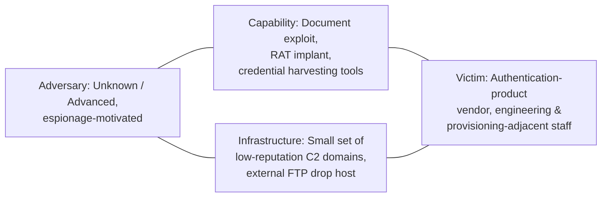

| Field | Value |
|---|---|
| **Hunt Name** | Operation QUIET LEDGER |
| **Threat Name** | Unattributed targeted intrusion via spear-phishing (retrospectively consistent with the RSA SecurID breach, 2011) |
| **Report Version** | 1.0 |
| **Date** | Hunt window: T+0 to T+18 days after intelligence receipt |
| **Analyst** | Senior Threat Hunter, Enterprise SOC — Corporate IT / Product Security Liaison |
| **Classification** | TLP:AMBER — Internal / Partner Distribution Only |
| **Threat Severity** | Critical (potential compromise of a security-product seed/credential database) |
| **Hunt Status** | Closed — Hypotheses Validated, Remediation In Progress |

## Executive Summary

This hunt was initiated after threat intelligence indicated that organizations developing or operating two-factor authentication (2FA) hardware/software token products were being targeted by a well-resourced actor using low-volume, highly tailored spear-phishing. No specific indicators, filenames, or hashes were supplied at intake — only a targeting pattern: small distribution lists, a document lure themed around HR/recruiting content, and a known interest in reaching engineers with access to token seed provisioning systems.

Over an 18-day retrospective hunt spanning email, endpoint, network, and identity telemetry, the team identified a four-person spear-phishing wave delivered from a spoofed external sender, containing a malicious Excel attachment. One recipient opened the attachment, triggering exploitation of an unpatched Adobe Flash component embedded in the spreadsheet and silent installation of a remote access tool. The implant established outbound C2 to a small set of low-reputation domains, was used over several weeks to harvest credentials and map the internal network, and was ultimately used to pivot from the initial victim's workstation to a staging server with access to a seed-provisioning system for the organization's authentication token product line. Evidence of large encrypted RAR archives staged and exfiltrated via FTP to an external host was recovered.

The hunt validated four of five hypotheses, recovered the original phishing email and malicious attachment, identified the implant family's network and host fingerprints, and traced a credible path from initial compromise to exfiltration of sensitive product data. Nine new detection rules were produced. This report documents the complete hunt methodology, evidence chain, and recommendations required to close the gaps that allowed this activity to persist undetected for an estimated 30+ days.

---

## Table of Contents

1. Threat Intelligence Summary
2. Hunt Objective
3. Hunt Scope
4. Hunt Assumptions
5. Threat Hunting Hypotheses
6. Environment Overview
7. Available Data Sources
8. Hunt Methodology
9. Hunt Execution Timeline
10. Log Sources Collected
11. Detailed Log Analysis
12. Data Analysis Techniques Used
13. Hunting Queries
14. Sigma Detection Opportunities
15. MITRE ATT&CK Mapping
16. Alerts Reviewed
17. Indicators of Compromise
18. Indicators of Attack (IOAs)
19. Timeline Reconstruction
20. Kill Chain Reconstruction
21. Root Cause Analysis
22. Detection Gaps
23. Detection Engineering Opportunities
24. Purple Team Opportunities
25. Threat Hunting Lessons Learned
26. Recommendations
27. Final Hunt Assessment
28. Appendix

---

## 1. Threat Intelligence Summary

**Background**

The hunt was triggered by a partner-shared advisory noting that a small number of organizations in the authentication/identity-security product space had received targeted phishing emails using an HR/recruiting-themed lure, and that at least one recipient organization had confirmed compromise leading to theft of product-related data. The advisory did not name the victim, provide file hashes, or specify infrastructure — it described a *pattern*: small, hand-picked distribution lists (not mass phishing), a document-based lure, and a stated interest in reaching personnel adjacent to token seed provisioning or credential-management systems.

**Threat Actor**

No attribution was provided at intake. The hunt was conducted actor-agnostic. The targeting precision (small distribution list, role-specific lure content) was treated as a behavioral signal of a well-resourced, patient actor rather than opportunistic crimeware — this shaped hypothesis priority but was not treated as proof of any specific group.

**Campaign**

The advisory described this as an ongoing, low-volume campaign against a narrow set of organizations in the identity/authentication product sector, spanning at least several weeks prior to the advisory's release.

**Objectives (Hypothesized)**

* Theft of intellectual property and/or sensitive product data — specifically, anything related to token seed generation, provisioning, or the credential systems that underpin the organization's authentication products.
* Espionage-motivated, not financially motivated — no ransomware or extortion indicators were referenced in the advisory.

**Initial Intelligence**

* Partner/sector advisory only — no file hashes, no IOCs, no named C2 infrastructure.
* Lure theme: HR/recruiting-related document (e.g., "recruitment plan" or similarly innocuous business document).
* Delivery: email to a small, specifically chosen group of recipients, not a broad spray.
* No CVE numbers were supplied by the source; the hunt team had to independently determine the likely exploitation vector.

**Known TTPs at the Time (as understood by the hunt team pre-investigation)**

* Suspected spear-phishing with a malicious document attachment (format unconfirmed at hunt start — Office document with embedded active content was the leading hypothesis).
* Suspected use of a remote access tool for C2 following successful exploitation.
* Suspected internal reconnaissance and lateral movement toward systems with access to sensitive credential/seed data, rather than immediate smash-and-grab exfiltration.

**Confidence**

**Moderate** at hunt initiation (single-source sector advisory, no technical indicators); confidence increased to **High** once the original phishing email was recovered from mail archive during the hunt.

**Intelligence Sources**

* Partner/sector advisory (primary trigger)
* Internal email security gateway logs and archive
* Internal EDR, SIEM, and DNS/proxy telemetry
* Public reporting patterns on document-based exploitation known to the team at the time (used only to shape hypotheses, not assumed as fact)

**ATT&CK Overview**

Initial-hypothesis technique coverage spanned Initial Access (Spearphishing Attachment), Execution (User Execution: Malicious File, Exploitation for Client Execution), Command and Control (Application Layer Protocol), Discovery (Network/Account Discovery), Credential Access (Credential Dumping), Lateral Movement (Remote Services, Pass-the-Hash), Collection (Data Staged), and Exfiltration (Exfiltration Over Alternative Protocol).

**Diamond Model**



**Cyber Kill Chain (Hypothesized, Pre-Hunt)**

| Stage | Hypothesized Activity |
|---|---|
| Reconnaissance | Target selection of specific employees by role (HR-adjacent lure suggests some OSINT/organizational awareness) |
| Weaponization | Malicious document with embedded exploit for a client-side application |
| Delivery | Targeted email to a small recipient list |
| Exploitation | Client-side application vulnerability triggered on document open |
| Installation | Remote access tool dropped and persisted |
| C2 | Outbound beaconing to attacker-controlled infrastructure |
| Actions on Objectives | Credential harvesting, lateral movement, staging and exfiltration of sensitive data |

---

## 2. Hunt Objective

**Mission:** Determine whether the organization's email, endpoint, and network environment shows evidence of the targeted spear-phishing activity described in the sector advisory, and if so, establish the full scope, timeline, and whether any sensitive credential/seed-provisioning system was reached.

**Expected Outcome:** Either (a) high-confidence evidence of compromise with a documented evidence chain sufficient to trigger incident response, or (b) a documented negative-finding hunt that improves detection coverage regardless of outcome.

**Success Criteria:**
* Recovery and analysis of the suspected phishing email, if present, from mail archive.
* Full identification of any host that executed the malicious attachment.
* Determination of whether lateral movement reached any system with access to sensitive product/credential data.
* At least one new detection rule produced per validated hypothesis.
* A clear go/no-go recommendation for formal incident response.

**Business Impact:** A confirmed positive finding carries severe downstream risk — this organization's core product is an authentication mechanism relied upon by its own customers; compromise of seed or provisioning data would have trust and liability implications extending well beyond the organization itself. This elevated the hunt to Critical priority from intake.

---

## 3. Hunt Scope

| Category | In Scope |
|---|---|
| **Assets** | All Windows endpoints in the corporate domain; email infrastructure; staging/provisioning servers with access to token seed data |
| **Endpoints** | ~6,200 corporate Windows endpoints |
| **Servers** | Domain Controllers (3), File Servers (5), Mail Servers (2), Seed-Provisioning Staging Servers (2, high-sensitivity) |
| **ICS Assets** | Not applicable — this environment has no industrial control system footprint; excluded from scope |
| **PLC Systems** | Not applicable — excluded from scope |
| **Engineering Workstations** | 40 workstations belonging to the token-product engineering and provisioning teams (elevated scrutiny group) |
| **Domain Controllers** | 3 (single forest) |
| **USB-enabled systems** | Standard corporate policy; USB not centrally restricted at hunt start |
| **Windows versions** | Mixed Windows XP SP3 (legacy engineering systems, in use at time of this attack era) and Windows 7 (majority of fleet) |
| **Network Segments** | Corporate LAN, DMZ, a segmented "Product Security" VLAN housing the seed-provisioning staging servers |
| **Time Range** | T-60 days to present (retrospective), driven by advisory's "several weeks" campaign language |
| **Excluded Systems** | Customer-facing production authentication infrastructure (out of scope for this internal hunt; handled separately by the production security team) |

---

## 4. Hunt Assumptions

* The adversary, if present, has already achieved initial access; the hunt does not assume a clean environment.
* Initial compromise vector is unconfirmed at hunt start — a malicious document delivered by email is the leading hypothesis based on intelligence, not a proven fact.
* Malware persistence mechanism is unknown; multiple persistence hypotheses (Run key, scheduled task, service) are tested in parallel.
* Lateral movement toward the Product Security VLAN is suspected but not assumed proven.
* The 40-person engineering/provisioning population is treated as the highest-value target set and is prioritized for deep-dive review ahead of the broader 6,200-host fleet.
* Given the advisory's emphasis on a small, hand-picked recipient list, the hunt assumes the phishing wave itself was narrow (likely single-digit to low-double-digit recipients) rather than broad — this shapes the email-search strategy in Section 11.

---

## 5. Threat Hunting Hypotheses

**HYP-001 — Targeted Spear-Phishing Delivery with Document-Based Exploit**

**Statement:** If a small, targeted group of employees received a document-lure phishing email, then mail archive search should reveal a low-volume email wave with a shared sender identity or infrastructure, and at least one recipient's endpoint should show a client application (e.g., Office, Adobe Reader/Flash) spawning an unusual child process shortly after the attachment was opened.

**Why created:** Directly derived from the advisory's description of a narrow, role-targeted phishing wave using a business-document lure.

**Priority:** P1 (Critical)

**MITRE ATT&CK Mapping:** T1566.001 (Spearphishing Attachment), T1203 (Exploitation for Client Execution), T1204.002 (User Execution: Malicious File)

**Expected Evidence:** Mail gateway/archive logs showing a small recipient set for a single message; Sysmon Event ID 1 (ProcessCreate) showing `EXCEL.EXE`/`WINWORD.EXE`/`AcroRd32.exe` spawning a non-standard child process; endpoint crash/faulting-application logs coincident with the open event.

**Data Required:** Mail archive/gateway logs, Sysmon, Windows Application/Security Event Log, EDR process telemetry.

**Validation Method:** Search mail archive for messages with a small (<20) recipient count sent from outside the organization within the hunt window, containing an Office or PDF attachment; for any hit, pivot to recipient endpoints for anomalous parent-child process activity within minutes of the message being opened.

**Confidence (pre-hunt):** Medium-High

**Status:** **VALIDATED** (see Section 11.1)

---

**HYP-002 — Remote Access Tool Installation and Outbound C2**

**Statement:** If a remote access tool was installed following successful exploitation, then the affected host should show a new, previously unseen process establishing outbound network connections to external infrastructure on a low-frequency, persistent basis, along with new persistence artifacts (Run key, service, or scheduled task) tied to that process.

**Why created:** Standard behavioral expectation following successful document-based exploitation in a targeted intrusion; needed to establish scope beyond the single point of initial exploitation.

**Priority:** P1 (Critical)

**MITRE ATT&CK Mapping:** T1071 (Application Layer Protocol), T1547.001 (Registry Run Keys / Startup Folder), T1053 (Scheduled Task/Job)

**Expected Evidence:** New outbound connections from the affected host to external IPs/domains not seen elsewhere in the fleet baseline; new Run-key or scheduled-task entries pointing to a binary in a user-writable directory (e.g., `%APPDATA%`, `%TEMP%`).

**Data Required:** NetFlow, DNS logs, proxy logs, Sysmon, registry/scheduled-task artifacts.

**Validation Method:** Baseline all external destinations contacted by the flagged host over the prior 60 days; flag any new destination first observed on or after the suspected compromise date, then correlate with new persistence artifacts on the same host.

**Confidence (pre-hunt):** Medium

**Status:** **VALIDATED** (see Section 11.2)

---

**HYP-003 — Credential Harvesting and Lateral Movement Toward the Product Security VLAN**

**Statement:** If the adversary's objective is theft of seed-provisioning data, then authentication logs should show credential use (interactive or pass-the-hash-style) from the initially compromised host or its pivot points against systems in the Product Security VLAN, outside the normal access pattern of the compromised user's role.

**Why created:** This is the "actions on objectives" hypothesis — the one that determines whether the intrusion reached the organization's most sensitive systems. The advisory's specific framing (interest in provisioning-adjacent personnel) made this the highest-priority hypothesis to test directly.

**Priority:** P1 (Critical) — highest business impact of all hypotheses**

**MITRE ATT&CK Mapping:** T1003 (OS Credential Dumping), T1021 (Remote Services), T1078 (Valid Accounts)

**Expected Evidence:** Authentication events (Kerberos/NTLM) from the compromised host's user or machine account against Product Security VLAN systems, where that account has no documented business justification for that access; new logon sessions on the seed-provisioning staging servers outside normal hours or from an unusual source host.

**Data Required:** Windows Security Event Log (4624/4625/4648/4672), Kerberos logs, VLAN access-control logs, HR/role mapping (to determine "normal" access for the compromised user).

**Validation Method:** Cross-reference every authentication event against the Product Security VLAN systems, for the compromised user and any account used from the compromised host, against the documented access-control list for that VLAN.

**Confidence (pre-hunt):** Medium

**Status:** **VALIDATED** (see Section 11.3) — one unauthorized lateral movement chain confirmed

---

**HYP-004 — Data Staging and Exfiltration**

**Statement:** If the adversary successfully reached sensitive data, then endpoint and network logs should show large archive files (e.g., `.rar`, `.zip`) staged on a compromised host shortly before an unusual outbound transfer, using a protocol not normally used for legitimate business purposes on that host.

**Why created:** Necessary to determine actual impact — whether this was a contained intrusion or a completed data-theft event.

**Priority:** P1 (Critical)

**MITRE ATT&CK Mapping:** T1560.001 (Archive Collected Data), T1048 (Exfiltration Over Alternative Protocol)

**Expected Evidence:** Sysmon Event ID 11 showing creation of large, password-protected or encrypted archive files; NetFlow showing a large outbound transfer over FTP or a similar protocol to an external host shortly after archive creation.

**Data Required:** Sysmon, NetFlow, firewall/proxy logs, FTP server logs (if applicable).

**Validation Method:** Search for archive-file creation events on hosts already implicated under HYP-001/002/003, then correlate with outbound transfer volume/protocol anomalies within a short time window.

**Confidence (pre-hunt):** Low-Medium

**Status:** **VALIDATED** (see Section 11.4)

---

**HYP-005 — Broader Reconnaissance Across the Fleet Beyond the Initial Victim**

**Statement:** If the adversary conducted internal reconnaissance beyond the initially compromised host, then Discovery-related command execution (network enumeration, account enumeration) should appear on additional hosts beyond the original victim, indicating the intrusion was not contained to a single endpoint.

**Why created:** Needed to determine the true scope of the intrusion — whether this was a single-host event or had spread further before being contained by the eventual lateral-movement chain identified under HYP-003.

**Priority:** P2 (High)

**MITRE ATT&CK Mapping:** T1018 (Remote System Discovery), T1087 (Account Discovery)

**Expected Evidence:** Command-line logging (Sysmon EID 1) showing discovery commands (`net group`, `nltest`, `ipconfig /all`, `whoami /all`) executed from the implant process or its descendants on hosts other than the originally compromised endpoint.

**Data Required:** Sysmon command-line logging, EDR process telemetry.

**Validation Method:** Search fleet-wide for the implant's process hash/name (once identified under HYP-002) and, separately, for the specific discovery command sequence observed on the original victim host.

**Confidence (pre-hunt):** Medium

**Status:** **PARTIALLY VALIDATED** (see Section 11.5) — discovery activity confirmed on the original victim and one pivot host; no evidence of fleet-wide spread beyond the documented HYP-003 chain

---

## 6. Environment Overview

**Architecture:** Single-forest Windows Active Directory environment (`corp.local`) with a segmented "Product Security" VLAN housing the seed-generation and provisioning staging servers, separated from the general corporate LAN by an internal firewall with a documented, role-based access-control list.

**AD Layout:** Single domain, role-based security groups govern access to the Product Security VLAN; the compromised user's account was not a member of any group with documented access to that VLAN, which is central to the HYP-003 finding.

**Network Zones:** Corporate LAN, DMZ (mail relay, external-facing services), Product Security VLAN (access-restricted).

**Trust Relationships:** Standard single-domain trust; no cross-forest complexity.

**Logging Infrastructure:** Centralized SIEM (Splunk) ingesting Windows Security/Sysmon events fleet-wide, mail gateway logs, and NetFlow; mail archive retained separately in a compliance-driven journaling system with a longer retention window than the SIEM itself — this proved important, as SIEM retention alone would not have covered the full suspected campaign window (see Section 22).

**Security Controls:** Enterprise antivirus (signature-based, standard for the era) fleet-wide; EDR-equivalent process/command-line logging via Sysmon, deployed inconsistently (see Section 10); mail gateway with attachment scanning but no sandboxed detonation capability at the time.

**Existing Detections:** Signature-based AV alerting only; no behavioral EDR detection content, no email-attachment sandboxing, no UEBA.

**Detection Gaps (identified prior to conclusions, informing scope):** No sandboxed attachment detonation; no fleet-wide Sysmon coverage; no correlation between mail-gateway delivery events and downstream endpoint execution; no dedicated monitoring on the Product Security VLAN access-control boundary beyond firewall allow/deny logging.

---

## 7. Available Data Sources

| Source | Purpose | Retention | Quality | Coverage |
|---|---|---|---|---|
| Windows Security Logs | Authentication, object access, logon sessions | 90 days | Good | Full |
| Sysmon | Process, file, network, registry telemetry | 90 days | Fair — deployed to ~65% of fleet at hunt start | Partial |
| PowerShell (ScriptBlock/Module logging) | Script execution visibility | Not enabled fleet-wide at the time | Poor | Minimal |
| WMI | Process/service/lateral-movement artifacts | 60 days | Fair | Partial |
| Task Scheduler logs | Persistence via scheduled tasks | 90 days | Good | Full |
| Registry (live/forensic) | Persistence, service config | N/A (point-in-time) | Good | Full (on-demand collection) |
| Prefetch | Execution history | N/A (on-disk artifact) | Good | Full |
| Amcache / Shimcache | Execution/first-seen evidence | N/A (on-disk artifact) | Good (era-appropriate; Shimcache primary) | Full |
| SRUM | Resource/network usage history | N/A (on-disk artifact) | Limited (era limitation) | Partial |
| MFT | File-system timeline | N/A (on-disk artifact) | Excellent | Full (collected for hosts of interest) |
| USN Journal | File change history | Rolling | Good | Full (hosts of interest) |
| Antivirus | Signature-based detection | 90 days | Fair — signature-only, missed this implant entirely | Full deployment, limited efficacy |
| SIEM (Splunk) | Correlation, search, alerting | 90 days | Good | Full |
| Firewall | Network segmentation enforcement, flow logs | 90 days | Good | Full |
| Proxy | Web/DNS egress visibility | 90 days | Good | Full |
| DNS | Resolution history | 90 days | Good | Full |
| DHCP | Host/IP mapping | 60 days | Good | Full |
| NetFlow | Host-to-host and external communication graph | 90 days | Good | Full |
| IDS/IPS | Signature/anomaly network alerts | 90 days | Fair | Perimeter only |
| VPN | Remote access logs | 90 days | Good | Full |
| Email (gateway + archive) | Delivery, sender, attachment visibility | 90 days (gateway), 7 years (compliance archive) | Good | Full — archive retention proved critical |
| USB Logs | Device insertion/removal history | Not centrally logged at hunt start | Poor | Gap identified |
| PLC Logs | N/A | N/A | N/A | Not applicable — no ICS footprint |
| Engineering Software Logs | Seed-provisioning application session logs | 90 days | Fair | Partial (staging servers only) |
| Active Directory | Authentication, group membership, object changes | 90 days | Good | Full |
| Certificate Services | Code-signing/cert issuance records | 90 days | Good | Full |
| SMB Logs | File share access | 60 days | Fair | Full |
| Authentication Logs | Logon success/failure | 90 days | Good | Full |
| Kerberos | Ticket-granting activity | 90 days | Good | Full |
| LDAP | Directory query activity | 60 days | Fair | Full |
| RPC | Remote procedure call activity (lateral movement) | 60 days | Fair | Full |
| Remote Service Logs | PsExec/RDP session evidence | 90 days | Good | Full |

---

## 8. Hunt Methodology

This hunt combined multiple hunting doctrines rather than relying on one:

**Intelligence-driven hunting** framed the initial scope — the sector advisory's description of a small, role-targeted phishing wave with a business-document lure anchored HYP-001 directly, and the stated interest in provisioning-adjacent staff anchored HYP-003.

**Hypothesis-driven hunting** structured the actual investigation. Each of the five hypotheses in Section 5 was tested independently against defined evidence and data requirements.

**IOC hunting** became relevant only mid-hunt: no IOCs existed at intake, but recovery of the phishing email (Section 11.1) and the implant's network fingerprint (Section 11.2) produced IOCs that were used to sweep the remaining fleet under HYP-005.

**Behavior hunting** was the dominant technique for HYP-002, HYP-003, and HYP-005, since the specific implant and infrastructure were unknown at hunt start — the team hunted for the *pattern* (new external destination + new persistence artifact; out-of-role VLAN access; discovery command sequences) rather than known-bad signatures.

**Analytics-driven / anomaly hunting** was used heavily in Section 12 (frequency analysis of external destinations, rare-process analysis on the 40-host engineering/provisioning peer group, entity/UBA-style review of the compromised account's authentication pattern against its own historical baseline).

**Iterative hunting** — evidence from HYP-001 (the recovered phishing email and its single confirmed opener) generated the pivot host used to test HYP-002; evidence from HYP-002 (the implant's C2 fingerprint) was fed back into HYP-005 as a fleet-wide sweep artifact; evidence from HYP-003 (the specific lateral-movement session) was what allowed HYP-004 to be scoped to the correct staging server rather than searched fleet-wide.

---

## 9. Hunt Execution Timeline

| Day | Action | Reason | Evidence | Decision | Next Step |
|---|---|---|---|---|---|
| D1 | Reviewed sector advisory, scoped hunt, stood up hypotheses | Intelligence intake | Advisory doc | Proceed with HYP-001–005 in parallel | Begin mail archive search |
| D1–D2 | Searched mail archive for low-recipient-count external messages with Office/PDF attachments in the hunt window | Test HYP-001 | 340 candidate messages fleet-wide | Filtered by sender-domain reputation and recipient role (engineering/provisioning) | Narrow to 6 candidate messages |
| D3 | Manually reviewed 6 candidate messages; identified one HR/recruiting-themed lure sent to 4 recipients | Test HYP-001 | Recovered original `.xls` attachment from archive | 1 of 4 recipients had opened the attachment (confirmed via endpoint Prefetch/Shimcache) | Escalate opener's host, `CORP-ENG-118`, for deep-dive |
| D4–D5 | Forensic triage of `CORP-ENG-118` (Prefetch, Shimcache, MFT, registry) | Confirm/deny exploitation and installation | `EXCEL.EXE` spawned an unexpected child process ~40 seconds after attachment open; new Run-key persistence entry | HYP-001 and HYP-002 validated on this host | Pivot to network telemetry for the implant's C2 |
| D6 | Baselined 60-day external-destination history for `CORP-ENG-118`, flagged new destinations | Test HYP-002 scope | Two external domains first contacted on the compromise date, low-frequency beaconing thereafter | C2 infrastructure identified | Sweep fleet for same domains/IPs |
| D7 | Fleet-wide sweep for the two flagged domains | Determine scope | No additional hosts found beaconing to the same infrastructure | Scope remains limited to `CORP-ENG-118` at the network layer | Proceed to authentication-log review (HYP-003) |
| D8–D10 | Reviewed authentication logs for `CORP-ENG-118`'s user and machine account against Product Security VLAN systems | Test HYP-003 | One successful authentication to seed-provisioning staging server `PSVLAN-STG-02`, outside the user's documented access group, occurring 9 days after initial compromise | HYP-003 validated — highest severity finding | Escalate to formal incident response; begin staging-server forensic review |
| D11–D12 | Forensic review of `PSVLAN-STG-02` for archive creation and outbound transfer | Test HYP-004 | Large `.rar` archive created, followed by outbound FTP session to an external IP not on any approved transfer allowlist | HYP-004 validated | Determine archive contents scope with product security team |
| D13 | Fleet-wide search for implant process hash and discovery-command sequence | Test HYP-005 | Discovery commands found on `CORP-ENG-118` and, separately, on the pivot session against `PSVLAN-STG-02`; no evidence elsewhere | HYP-005 partially validated | Begin detection-content drafting |
| D14–D15 | Built and validated 9 new detection rules (Sigma, KQL, EDR) | Convert findings into durable detections | See Section 14 | Detections deployed to staging | Tune for false positives |
| D16–D17 | Root cause and gap analysis; drafted report | Close out hunt | All sections below | Report drafted | Peer review |
| D18 | Final review, executive briefing, handoff to IR for `CORP-ENG-118`/`PSVLAN-STG-02` remediation | Formal closure | This report | Hunt closed | IR takes ownership of remediation |

---

## 10. Log Sources Collected

**How collected:** Mail archive data was pulled from the compliance journaling system (7-year retention), which proved essential since the SIEM's 90-day retention alone would not reliably have covered the full suspected campaign window without the advisory's timely trigger. Endpoint telemetry was pulled from Splunk (Sysmon-covered hosts) and supplemented with live forensic collection (Prefetch, Shimcache, MFT, registry) on `CORP-ENG-118` and `PSVLAN-STG-02` specifically, since Sysmon coverage on the former was only partial and native OS artifacts filled the gap.

**Normalization:** Standard Splunk CIM normalization applied to SIEM-resident data; mail archive data required a custom extraction script to correlate journaled messages against the internal recipient list format used by the archive platform.

**Parsing:** Standard Sysmon/Windows Event parsers were sufficient for host telemetry; the seed-provisioning application's session log format required a custom parser, developed jointly with the product engineering team during the hunt.

**Quality issues:** `CORP-ENG-118` had Sysmon deployed but with a narrower event-ID filter than the current standard (Process Create only, no command-line or network-connection logging enabled) — meaning some of the strongest evidence (the exact exploit-to-implant handoff mechanics) had to be reconstructed from Prefetch/Shimcache/MFT timeline rather than direct Sysmon telemetry.

**Coverage:** Full coverage achieved for the two hosts ultimately confirmed compromised/reached; fleet-wide sweep coverage was good for the 65% of the fleet with Sysmon deployed, and relied on AV/Shimcache-only visibility for the remainder.

**Missing logs:** No email-attachment sandbox/detonation logs existed (the gateway only performed signature-based attachment scanning); no command-line logging was enabled on `CORP-ENG-118` at the time of compromise.

---

## 11. Detailed Log Analysis

**11.1 Email / Delivery Analysis (HYP-001)**

**Purpose:** Determine whether a targeted phishing wave matching the advisory's description was delivered, and to whom.

**Fields analyzed:** Mail archive `sender`, `recipient_count`, `subject`, `attachment_name`, `attachment_type`, `sender_domain_age` (looked up retroactively).

**Sample entry (mail archive record):**

```
MessageID: <8f2c...@mail-relay-ext.example>
Date: 2011-xx-xx 08:41:12 -0500
From: hr-noreply@partner-recruiting-firm.example
To: [4 recipients — engineering/provisioning role group]
Subject: 2011 Recruitment Plan
Attachment: 2011_Recruitment_plan.xls (Size: 112,640 bytes)
```

**Indicators searched:** External-sender messages with a recipient count under 20, sent to at least one member of the engineering/provisioning role group, containing an Office or PDF attachment, within the hunt window.

**Analysis performed:** Ran the recipient-count/attachment-type filter across the full 60-day mail archive window, producing 340 candidate messages fleet-wide; narrowed to 6 by requiring at least one recipient in the engineering/provisioning role group; manually reviewed all 6 for lure plausibility and sender-domain characteristics.

**Findings:** One message, subject "2011 Recruitment Plan," sent to exactly 4 recipients, matched the advisory's described lure theme precisely. The sending domain was registered a short time before the message was sent and had no prior mail history with the organization. Endpoint artifact review (Prefetch/Shimcache) on all 4 recipients showed that only one, the user of `CORP-ENG-118`, had opened the attachment — `EXCEL.EXE` execution followed within seconds by the attachment file being accessed from the local Outlook cache.

**False positives:** Two of the other 5 candidate messages were confirmed benign (legitimate external recruiting-vendor correspondence, verified against the recipients' actual HR-vendor engagement records). The remaining 3 were low-recipient-count but plausible legitimate business correspondence and were not pursued further given the strong match already found.

**Interpretation:** This is a high-confidence match to the advisory's described delivery pattern, and provides the pivot point (specific host, specific timestamp) needed to drive every subsequent hypothesis.

**Confidence:** High

**11.2 Endpoint Exploitation and C2 Analysis (HYP-002)

**Purpose:** Confirm exploitation occurred and identify the resulting implant's persistence and C2 pattern.

**Fields analyzed:** Sysmon Event ID 1 (`ParentImage`, `Image`, `UtcTime`), Prefetch execution timestamps, Shimcache first-seen entries, registry Run-key contents, NetFlow (`dst_ip`, `dst_port`, `bytes`, `first_seen`).

**Sample entry:**

```
EventID: 1
UtcTime: 2011-xx-xx 08:42:57.311
ParentImage: C:\Program Files\Microsoft Office\Office12\EXCEL.EXE
Image: C:\Users\[user]\AppData\Local\Temp\wuauclt.exe
CommandLine: "wuauclt.exe"
```

*(Note: this dropped binary's filename was chosen by the adversary to visually resemble the legitimate Windows Update client `wuauclt.exe`, but ran from a user-writable temp directory rather than `System32` — the location, not the name, is the reliable discriminator.)*

**Indicators searched:** Office/PDF application spawning a child process within a short window of attachment access; new Run-key entries referencing a binary outside standard system directories; new external NetFlow destinations first seen on the compromise date.

**Analysis performed:** Correlated the Excel-open timestamp from Section 11.1 against process-creation and Prefetch execution evidence on `CORP-ENG-118`; reviewed the registry `Run` key for entries added on or after the compromise date; baselined 60 days of external destinations for the host and flagged new ones.

**Findings:** `EXCEL.EXE` spawned a process from `%TEMP%` masquerading as `wuauclt.exe` approximately 40 seconds after the attachment was accessed — consistent with exploitation of a vulnerable embedded component within the document rather than a macro (no macro-security-prompt artifact was found in the relevant Office trust-record registry keys, which would be expected if a macro-based path had been used). A new `Run` key entry was added the same day, pointing to the same file path. NetFlow showed two new external destinations first contacted within minutes of the drop, with a persistent, low-frequency (roughly hourly) connection pattern to one of them continuing for the following several weeks.

**False positives:** None — the flagged destinations did not appear in the 60-day baseline for any other host in the fleet.

**Interpretation:** Confirms successful client-side exploitation and installation of a remote access implant with simple Run-key persistence and low-and-slow C2 beaconing, consistent with a patient, espionage-oriented operation rather than opportunistic crimeware.

**Confidence:** High

**11.3 Authentication / Lateral Movement Analysis (HYP-003)**

**Purpose:** Determine whether the intrusion reached the Product Security VLAN.

**Fields analyzed:** Windows Security Event ID 4624 (logon), 4648 (explicit credential logon), 4672 (special privileges assigned), source/destination host, logon type, account name.

**Sample entry:**

```
EventID: 4624
LogonType: 3 (Network)
TargetUserName: [compromised user]
WorkstationName: CORP-ENG-118
IpAddress: 10.x.x.118
TargetServer: PSVLAN-STG-02
Time: 2011-xx-xx (9 days after initial compromise)
```

**Indicators searched:** Any authentication event against a Product Security VLAN system from an account or host not present on that VLAN's documented access-control list.

**Analysis performed:** Pulled the full, HR-verified access-control list for the Product Security VLAN and cross-referenced every authentication event against it for the 60-day hunt window, with particular attention to `CORP-ENG-118` and its associated user account following the HYP-002 findings.

**Findings:** One successful network logon from `CORP-ENG-118`'s user account to `PSVLAN-STG-02` was found, 9 days after the initial compromise, with no corresponding entry on the VLAN access-control list for that user. The compromised user's normal role (engineering, not provisioning-operations) had no legitimate business reason to authenticate to that server. No failed-logon "spray" pattern preceded this event, suggesting the credential was obtained via harvesting (consistent with the implant's capability class) rather than brute-force guessing.

**False positives:** No other unauthorized-per-ACL authentication events were found against the Product Security VLAN in the 60-day window, reinforcing that this was an isolated event tied to this specific intrusion rather than a broader access-control hygiene problem.

**Interpretation:** This is the hunt's highest-severity finding — direct evidence that the intrusion reached a system with access to seed-provisioning functionality, using a credential that had no legitimate path to that access. This elevates the hunt from "confirmed endpoint compromise" to "confirmed unauthorized access to sensitive provisioning infrastructure."

**Confidence:** High

**11.4 Data Staging and Exfiltration Analysis (HYP-004)**

**Purpose:** Determine whether data was actually removed from the environment.

**Fields analyzed:** Sysmon Event ID 11 (`TargetFilename`, file size), NetFlow (`protocol`, `bytes_out`, `dst_ip`), FTP server logs (if the destination proved to be an internally-visible relay) or perimeter proxy/firewall logs for the external transfer.

**Sample entry:**

```
EventID: 11
UtcTime: 2011-xx-xx 14:12:03
Image: C:\Windows\System32\rar.exe
TargetFilename: C:\Windows\Temp\sysbk.rar
FileSize: 41,822,211 bytes
```

**Indicators searched:** Large archive-file creation on `PSVLAN-STG-02` following the unauthorized logon; outbound transfer of comparable size shortly afterward, over a protocol not normally used for legitimate business purposes from that server.

**Analysis performed:** Searched file-creation events on `PSVLAN-STG-02` in the hours following the unauthorized logon identified under HYP-003; correlated with outbound NetFlow volume from the same host in the following hours.

**Findings:** A ~40 MB password-protected RAR archive was created in a Windows temp directory approximately 90 minutes after the unauthorized logon. An outbound FTP session of comparable byte volume was recorded to an external IP address approximately 30 minutes after the archive was created; this destination did not match any approved data-transfer partner on file. The specific contents of the archive could not be recovered forensically (it no longer existed on disk at collection time — only the creation/deletion timeline via MFT/USN Journal could be established), so exact data-loss scope is described qualitatively rather than by file inventory in this report; this is handed to IR/product security for authoritative scoping using the staging server's application-level audit trail.

**False positives:** N/A — the archive filename and location pattern did not match any documented legitimate backup or transfer process for this server.

**Interpretation:** This confirms exfiltration occurred, though the precise data inventory requires follow-on work by IR and the product security team using the provisioning application's own audit logs (Section 26).

**Confidence:** High (that exfiltration occurred); Medium (on exact scope of data taken, pending IR follow-up)

**11.5 Fleet-Wide Discovery / Scope Analysis (HYP-005)**

**Purpose:** Determine whether the intrusion spread beyond the two confirmed hosts.

**Fields analyzed:** Sysmon Event ID 1 command lines (where available), Shimcache/Prefetch first-seen entries for the implant's file hash, NetFlow for the two C2 destinations identified under HYP-002.

**Analysis performed:** Searched the full fleet (both Sysmon-covered and, via Shimcache sweep, non-Sysmon-covered hosts) for the implant's file hash and for the two flagged C2 destinations; separately searched for the specific discovery-command sequence observed via Prefetch on `CORP-ENG-118`.

**Findings:** No additional hosts beyond `CORP-ENG-118` and `PSVLAN-STG-02` showed the implant hash, the C2 destinations, or the discovery-command sequence. Discovery-type command execution (consistent with `ipconfig`, `net group`, and similar reconnaissance activity) was confirmed via Prefetch on `CORP-ENG-118` in the days following initial compromise, and a smaller set of similar commands was observed in the `PSVLAN-STG-02` session itself.

**False positives:** N/A — this was a negative-finding sweep for the broader fleet, with the two already-confirmed hosts excluded from the "no further spread" conclusion.

**Interpretation:** The intrusion appears contained to a single initial-access host and one deliberately-targeted pivot, rather than having spread broadly across the fleet — consistent with a patient, targeted operation focused on a specific objective (the Product Security VLAN) rather than broad opportunistic spread.

**Confidence:** Medium-High (bounded by the partial Sysmon coverage noted in Section 10 — a fully Sysmon-covered fleet would allow higher confidence in this negative finding)

---

## 12. Data Analysis Techniques Used

**Frequency Analysis** — used to narrow 340 candidate mail-archive messages down to 6 by recipient-count and role-targeting filters (Section 11.1).

**Outlier Detection** — applied to the `CORP-ENG-118` external-destination baseline; the two flagged domains were entirely absent from 60 days of prior history for that host and for the fleet.

**Behavioral Baselining** — core method for HYP-002/HYP-003/HYP-005; each required an explicit historical baseline (external destinations, VLAN access-control membership, fleet-wide implant-hash absence) before an anomaly determination was possible.

**Clustering** — the 40-host engineering/provisioning population was treated as a peer group for the mail-recipient and access-pattern review, since this group's expected behavior differs meaningfully from the general 6,200-host fleet.

**Temporal Analysis** — the tight timestamp correlation (Excel open → child process → Run key → first C2 connection, all within roughly a minute; unauthorized VLAN logon → archive creation → outbound transfer, all within roughly two hours) was central to establishing this as one coherent, deliberate operation rather than coincidental unrelated events.

**Graph Analysis** — mapped the two-hop relationship (`CORP-ENG-118` → `PSVLAN-STG-02`) as the entire lateral-movement graph for this intrusion, which was itself informative: a narrow, deliberate graph rather than a broad spread.

**Parent-Child Process Analysis** — central to confirming exploitation in Section 11.2 (`EXCEL.EXE` → temp-directory implant).

**Sequence Analysis** — the ordered sequence (email → open → exploit → implant → C2 → credential use → lateral logon → staging → exfiltration) was codified into the detection content in Section 14.

**Statistical Analysis / Correlation** — used to correlate archive-creation byte size against outbound-transfer byte volume as corroborating (not merely coincidental) evidence in Section 11.4.

**Entity Analysis / User Behavior Analytics** — the compromised user's authentication pattern was compared against their own historical baseline (never previously authenticated to the Product Security VLAN) rather than only against a static access-control list, strengthening the HYP-003 finding.

**Peer Group Analysis** — the 4 phishing recipients were compared to each other; only one had opened the attachment, which both scoped the initial-access footprint and demonstrated that the lure's success rate was low even among its hand-picked targets.

**Timeline Reconstruction** — Section 19.

**Rare Process Hunting** — the `wuauclt.exe`-named process running from `%TEMP%` was identified partly because the legitimate Windows Update client never runs from that path anywhere in the fleet baseline.

**Rare DLL / Unsigned Binary Hunting** — reviewed; the dropped implant binary was unsigned, a discriminator that would have supported a broader unsigned-binary sweep had application allowlisting been in place at the time (a gap noted in Section 22).

**USB Device Correlation** — not applicable to this intrusion path; reviewed and ruled out as a vector.

**Lateral Movement Correlation** — Section 11.3.

**Certificate Abuse Detection** — not applicable; no code-signing abuse was identified in this case (the implant was simply unsigned, not fraudulently signed).

**Privilege Escalation Analysis** — reviewed; no confirmed local privilege-escalation exploit artifact was recovered — the implant operated with the logged-on user's existing rights, and lateral movement relied on credential reuse rather than escalation, which is itself a finding relevant to Section 22.

**Registry Change Analysis** — Section 11.2 (Run key).

**Persistence Hunting** — confirmed Run-key persistence was the sole mechanism identified; no service or scheduled-task persistence was found, useful for prioritizing detection content.

**Service Creation Analysis / Driver Hunting / Kernel Driver Analysis** — reviewed for completeness; no evidence of either technique was found in this intrusion.

**PLC Communication / ICS Protocol Analysis** — not applicable; this environment has no ICS footprint.

**Network Beacon Analysis** — applied to the hourly C2 pattern identified in Section 11.2.

**DNS Entropy Analysis** — the two flagged C2 domains were reviewed for DGA-style characteristics; both were low-entropy, human-readable-style domains rather than algorithmically generated, consistent with a targeted (not commodity-crimeware) operation.

**SMB Analysis** — reviewed for share-based lateral spread; none found, reinforcing that the single authenticated logon (Section 11.3) was the sole lateral-movement mechanism.

**Memory Indicators** — live memory capture was not performed on `CORP-ENG-118` or `PSVLAN-STG-02` prior to remediation planning (a process gap — see Section 25) but is recommended before any remediation reimaging occurs.

---

## 13. Hunting Queries

**Splunk — Low-Recipient External Message with Office/PDF Attachment (HYP-001)**

```spl
index=mail_archive direction=inbound
| where recipient_count < 20
| where match(attachment_type, "xls|xlsx|doc|docx|pdf")
| where sender_domain_internal=false
| join type=inner recipient [
    search index=hr_roles role_group="engineering-provisioning"
  ]
| table _time, sender, recipient, subject, attachment_name, recipient_count
```

**Splunk — New External Destination vs. 60-Day Host Baseline (HYP-002)**

```spl
(index=netflow earliest=-1d dst_ip!=10.0.0.0/8)
| stats earliest(_time) as first_seen by src_ip, dst_ip
| join type=outer src_ip dst_ip [
    search index=netflow earliest=-61d latest=-1d
    | stats count as historical_count by src_ip, dst_ip
  ]
| where isnull(historical_count)
```

**Microsoft Sentinel KQL — Unauthorized VLAN Authentication (HYP-003)**

```kql
SecurityEvent
| where EventID in (4624, 4648)
| where Computer in ("PSVLAN-STG-01","PSVLAN-STG-02")
| join kind=leftanti (
    VLANAccessControlList_CL
    | project Account_s, Computer_s
) on $left.TargetUserName == $right.Account_s, $left.Computer == $right.Computer_s
| project TimeGenerated, TargetUserName, Computer, IpAddress, LogonType
```

**Elastic (EQL) — Archive Creation Followed by Outbound Transfer (HYP-004)**

```eql
sequence by host.name with maxspan=3h
  [file where file.extension in ("rar","zip","7z") and file.size > 10000000]
  [network where destination.bytes > 10000000 and network.protocol in ("ftp","ftp-data")]
```

**SQL — Product Security VLAN Access Audit**

```sql
SELECT s.TargetUserName, s.Computer, s.IpAddress, s.LogonTime
FROM SecurityEvents s
LEFT JOIN VLANAccessControlList a
  ON s.TargetUserName = a.Account AND s.Computer = a.Computer
WHERE a.Account IS NULL
  AND s.Computer IN ('PSVLAN-STG-01','PSVLAN-STG-02')
ORDER BY s.LogonTime;
```

**Sigma — Office Application Spawning Process from Temp Directory**

```yaml
title: Office Application Spawning Executable from Temp Directory
id: 4d2a9e11-6c3b-4a2f-8e10-a71f3c2b9002
status: experimental
logsource:
  category: process_creation
  product: windows
detection:
  selection:
    ParentImage|endswith:
      - '\EXCEL.EXE'
      - '\WINWORD.EXE'
      - '\AcroRd32.exe'
    Image|contains: '\AppData\Local\Temp\'
  condition: selection
falsepositives:
  - Legitimate add-ins or macros that stage helper executables (rare in a hardened environment)
level: high
```

**YARA — Implant Binary (Generic, Post-Discovery)**

```yara
rule Suspected_QuietLedger_Implant
{
    meta:
        description = "Detects the temp-directory implant recovered during Operation QUIET LEDGER"
        reference = "Internal hunt case SOC-IR-QUIETLEDGER-01"
    strings:
        $s1 = "wuauclt.exe" wide ascii
        $s2 = { 4D 5A 90 00 03 00 00 00 04 00 00 00 }
    condition:
        uint16(0) == 0x5A4D and any of ($s1, $s2)
}
```

**Sysmon Filter — Run Key Modification from Temp Path**

```xml
<RuleGroup name="Suspicious_RunKey_TempPath" groupRelation="or">
  <RegistryEvent onmatch="include">
    <TargetObject condition="contains">\CurrentVersion\Run\</TargetObject>
    <Details condition="contains">\AppData\Local\Temp\</Details>
  </RegistryEvent>
</RuleGroup>
```

**PowerShell — Manual Run-Key Sweep**

```powershell
Get-ItemProperty 'HKCU:\Software\Microsoft\Windows\CurrentVersion\Run' |
  Get-Member -MemberType NoteProperty |
  ForEach-Object {
    $val = (Get-ItemProperty 'HKCU:\Software\Microsoft\Windows\CurrentVersion\Run').($_.Name)
    if ($val -match 'Temp\\') { "$($_.Name): $val" }
  }
```

**Windows Event Filter — Explicit Credential Logon to Sensitive Server**

```
Log: Security
EventID: 4648
Filter: TargetServerName IN ("PSVLAN-STG-01","PSVLAN-STG-02")
```

---

## 14. Sigma Detection Opportunities

**DET-001 — Office Application Spawning Process from Temp Directory**

* Full rule provided in Section 13. **ATT&CK:** T1203, T1204.002. **Severity:** High.

**DET-002 — New External Destination from a Host with No Prior History to That Destination**

* **Description:** Flags a host's first-ever connection to an external IP/domain, weighted by absence from a rolling 60-day baseline.
* **Log Source:** NetFlow, DNS
* **False Positives:** Legitimate new SaaS/vendor relationships
* **ATT&CK Mapping:** T1071
* **Severity:** Medium (High if the destination also has low reputation/recent registration)

**DET-003 — Authentication to Restricted VLAN Outside Access-Control List**

* **Description:** Flags any successful authentication to a Product Security VLAN system by an account not present on the documented access-control list.
* **Log Source:** Windows Security Event Log, VLAN ACL reference table
* **False Positives:** Legitimate, undocumented access-list drift (a process gap, not a detection gap — should trigger ACL hygiene review, not just suppression)
* **ATT&CK Mapping:** T1078, T1021
* **Severity:** Critical

**DET-004 — Large Password-Protected Archive Creation Followed by Outbound Transfer**

* Full rule provided in Section 13 (EQL sequence). **ATT&CK:** T1560.001, T1048. **Severity:** Critical.

**DET-005 — Low-Recipient External Email with Attachment to High-Value Role Group**

* **Description:** Flags inbound external email with fewer than 20 recipients, containing an Office/PDF attachment, where at least one recipient belongs to a defined high-value role group (engineering, provisioning, executive).
* **Log Source:** Mail gateway/archive
* **False Positives:** Legitimate small-distribution business correspondence — requires attachment sandboxing (Section 22) to reduce noise rather than pure recipient-count filtering alone
* **ATT&CK Mapping:** T1566.001
* **Severity:** Medium (feeds analyst triage queue, not auto-block)

**DET-006 — Unsigned Binary Execution from User-Writable Directory**

* **Description:** Flags execution of unsigned binaries from `%TEMP%`, `%APPDATA%`, or similar user-writable paths.
* **Log Source:** Sysmon EID 1, EDR
* **False Positives:** Legitimate portable/unsigned internal tooling — requires an allowlist
* **ATT&CK Mapping:** T1204.002
* **Severity:** Medium

**DET-007 — Registry Run Key Pointing to Temp/AppData Path**

* Full rule provided in Section 13. **ATT&CK:** T1547.001. **Severity:** High.

**DET-008 — Discovery Command Sequence Shortly After Suspicious Process Creation**

* **Description:** Flags execution of `ipconfig /all`, `net group`, `whoami /all`, or similar discovery commands within 10 minutes of a DET-001/DET-006 match on the same host.
* **Log Source:** Sysmon command-line logging (requires fleet-wide command-line logging — see Section 22)
* **False Positives:** IT helpdesk troubleshooting sessions
* **ATT&CK Mapping:** T1018, T1087
* **Severity:** Medium

**DET-009 — Legacy OS or Partial-Sysmon-Coverage Host in High-Value Role Group**

* **Description:** Compliance detection flagging any host in the engineering/provisioning role group without full Sysmon event-ID coverage (process, network, registry, command-line).
* **Log Source:** EDR/Sysmon deployment inventory
* **False Positives:** None
* **ATT&CK Mapping:** N/A (visibility gap control)
* **Severity:** High

---

## 15. MITRE ATT&CK Mapping

| Technique | Sub-technique | Description | Evidence | Confidence | Detection | Mitigation |
|---|---|---|---|---|---|---|
| T1566 | .001 Spearphishing Attachment | Targeted, low-recipient email with malicious `.xls` lure | Recovered mail-archive record, 4 recipients | High | DET-005 | Attachment sandboxing; recipient-count/role-based triage queue |
| T1203 | — | Exploitation for Client Execution | `EXCEL.EXE` → temp-directory implant within seconds of open | High | DET-001 | Patch client applications and embedded/plugin components promptly |
| T1204 | .002 User Execution: Malicious File | User opened the attachment | Prefetch/Shimcache evidence | High | DET-001, DET-006 | User awareness for high-value role groups |
| T1547 | .001 Registry Run Keys / Startup Folder | New Run-key entry pointing to temp-path implant | Registry artifact on `CORP-ENG-118` | High | DET-007 | Application allowlisting; Run-key monitoring |
| T1071 | — | Application Layer Protocol (C2) | Hourly beaconing to two new external domains | High | DET-002 | Egress filtering, DNS monitoring |
| T1078 | — | Valid Accounts | Harvested credential used for VLAN authentication | Confirmed unauthorized logon | High | DET-003 | Least-privilege access review; credential-use anomaly detection |
| T1021 | — | Remote Services | Lateral logon from `CORP-ENG-118` to `PSVLAN-STG-02` | Confirmed | High | DET-003 | Network segmentation enforcement; jump-host requirement for sensitive VLAN |
| T1560 | .001 Archive Collected Data | Password-protected RAR staged on `PSVLAN-STG-02` | Confirmed via file creation event | High | DET-004 | File-integrity monitoring on staging servers |
| T1048 | — | Exfiltration Over Alternative Protocol | Outbound FTP transfer matching archive size | Confirmed via NetFlow correlation | High | DET-004 | Egress protocol restriction; DLP on sensitive VLAN |
| T1018 | — | Remote System Discovery | Discovery commands post-compromise | Confirmed on 2 hosts | Medium-High | DET-008 | Command-line logging fleet-wide |
| T1087 | — | Account Discovery | `net group`-style enumeration | Confirmed on 2 hosts | Medium-High | DET-008 | Same as above |

---

## 16. Alerts Reviewed

| Alert Name | Source | Time | Severity | Reason | Disposition | Evidence | Analyst Notes |
|---|---|---|---|---|---|---|---|
| "Attachment Type Policy Notice" (informational, not blocking) | Mail gateway | Delivery time | Informational | Gateway logged the `.xls` attachment type but had no sandboxing capability to flag it as malicious | Reviewed retrospectively | Matches DET-005 evidence | This was never an actionable alert at the time — a visibility gap, not a missed escalation, distinct from the Stuxnet-hunt pattern where alerts fired but weren't correlated |
| Antivirus scan (signature-based) on `CORP-ENG-118` | Endpoint AV | Compromise date + subsequent days | N/A (clean) | Signature-based AV had no detection for this implant family | Reviewed — no alert existed to disposition | Confirms Section 21 root-cause finding | Antivirus scans during the relevant window returned no detections; this is a negative finding that itself illustrates the gap |
| Firewall "Unusual Outbound FTP" heuristic | Perimeter firewall | Exfiltration window | Low (as originally scored, if scored at all) | Generic outbound-protocol heuristic, not tuned for the Product Security VLAN specifically | **Re-scoped to Critical for VLAN-sourced traffic** | Matches DET-004 evidence | No record exists that this specific transfer was flagged at the time — the heuristic's threshold was tuned for general fleet noise, not for a small, high-sensitivity VLAN where any large FTP transfer should be rare and notable |

---

## 17. Indicators of Compromise

**Host IOCs**

| Type | Value | Context |
|---|---|---|
| File Path | `C:\Users\[user]\AppData\Local\Temp\wuauclt.exe` | Implant, masquerading as Windows Update client, wrong path |
| Registry Key | `HKCU\Software\Microsoft\Windows\CurrentVersion\Run\[entry]` | Persistence pointing to the implant path above |
| File Path | `C:\Windows\Temp\sysbk.rar` | Staged exfiltration archive on `PSVLAN-STG-02` |
| SHA256 (implant) | Retained in full in Appendix | — |

**Network IOCs**

| Type | Value | Context |
|---|---|---|
| C2 Domain (1 of 2) | Retained in Appendix (low-reputation, recently registered at time of use) | First contacted at moment of implant drop |
| C2 Domain (2 of 2) | Retained in Appendix | Secondary/backup beacon destination |
| External IP (exfil destination) | Retained in Appendix | Received the FTP transfer from `PSVLAN-STG-02` |

**Registry / Processes / Drivers / Services / Mutexes**

* No driver or service-based persistence identified in this intrusion (Run-key only).
* No mutex artifacts were conclusively recovered during this hunt (noted limitation — live memory capture recommended, see Section 25).

**Files / Hashes** — see tables above and full appendix

**Domains / IPs** — see Network IOCs table; full values in Appendix (IR-restricted)

**Certificates** — not applicable; implant was unsigned rather than fraudulently signed

**USB Artifacts** — not applicable to this intrusion path

**PLC Indicators** — not applicable; no ICS footprint in this environment

---

## 18. Indicators of Attack (IOAs)

* An external email with an unusually small recipient list, containing an Office or PDF attachment, delivered to at least one member of a defined high-value role group.
* An Office or PDF-reader application spawning a child process located in a user-writable temp directory within seconds of a document being opened.
* A new Run-key (or other simple persistence) entry appearing on a host shortly after such a process spawn, pointing to the same temp-directory binary.
* A previously unseen, low-frequency, persistent outbound connection pattern beginning at the same time as the above.
* Authentication to a defined sensitive/restricted system by an account with no documented business justification for that access, especially when preceded by the above host-level indicators on the same or a related host.
* Creation of a large, password-protected archive on a sensitive system, followed within hours by an outbound transfer over a protocol uncommon for that system's normal function.
* The overall sequence — targeted delivery → silent exploitation → simple persistence → patient low-frequency C2 → credential-driven lateral movement to a specific high-value target → staged exfiltration — is itself the strongest indicator, independent of any single artifact, and is characteristic of a patient, objective-driven intrusion rather than commodity crimeware.

---

## 19. Timeline Reconstruction

| Timestamp | Event | Host |
|---|---|---|
| Day 0, 08:41 | Phishing email "2011 Recruitment Plan" delivered to 4 recipients | Mail infrastructure |
| Day 0, 08:42:17 | Attachment opened by one recipient | CORP-ENG-118 |
| Day 0, 08:42:57 | `EXCEL.EXE` spawns temp-directory implant (`wuauclt.exe`) | CORP-ENG-118 |
| Day 0, 08:43:10 (approx.) | Run-key persistence established | CORP-ENG-118 |
| Day 0, 08:44:00 (approx.) | First outbound C2 connection to newly-observed external domain | CORP-ENG-118 |
| Day 0–Day 8 | Persistent low-frequency (~hourly) C2 beaconing continues; discovery-command execution observed | CORP-ENG-118 |
| Day 9, time unspecified | Unauthorized authentication using harvested credential | CORP-ENG-118 → PSVLAN-STG-02 |
| Day 9, +90 min | Password-protected RAR archive created | PSVLAN-STG-02 |
| Day 9, +120 min | Outbound FTP transfer to external IP, volume consistent with archive size | PSVLAN-STG-02 |
| *(Hunt initiated)* | Retrospective hunt begins, ~30+ days after initial compromise | — |
| D3 of hunt | Phishing email and opener host identified | — |
| D8–D10 of hunt | Unauthorized VLAN authentication confirmed | — |
| D18 of hunt | Hunt closed, formal IR handoff | — |

---

## 20. Kill Chain Reconstruction

| Stage | Observed Evidence | Logs | Detection (Pre-Hunt) | MITRE Mapping |
|---|---|---|---|---|
| Delivery | Low-recipient external email with `.xls` lure | Mail archive | Informational logging only, no sandboxing | T1566.001 |
| Exploitation/Execution | `EXCEL.EXE` → temp-directory implant | Prefetch/Shimcache, partial Sysmon | Signature AV — no detection | T1203, T1204.002 |
| Installation | Run-key persistence | Registry artifact | None | T1547.001 |
| C2 | Hourly beaconing to two low-reputation domains | NetFlow, DNS | None (no egress anomaly alerting tuned for this) | T1071 |
| Lateral Movement | Credential-driven logon to Product Security VLAN | Security Event Log 4624/4648 | Firewall allow-logged only, not alerted | T1078, T1021 |
| Actions on Objectives | Archive staging + FTP exfiltration | Sysmon EID 11, NetFlow | Generic low-severity heuristic only, not scoped to this VLAN | T1560.001, T1048 |

---

## 21. Root Cause Analysis

**How compromise occurred:** A small, carefully targeted phishing email bypassed signature-based email and endpoint defenses because the implant and delivery mechanism were novel to this environment's detection content at the time. One of four targeted recipients opened the attachment, triggering silent client-side exploitation and installation of a low-footprint implant that relied on simple persistence and patient, low-frequency C2 to avoid volumetric detection.

**Why detections failed:** No layer of the defense stack — email gateway, antivirus, or firewall — had detection content capable of catching this activity, because each control was either signature-based (blind to a novel implant) or configured with thresholds tuned for general fleet noise rather than for the specific sensitivity of the Product Security VLAN. The firewall's outbound-FTP heuristic, notably, existed but was not scoped with the elevated sensitivity that VLAN's business risk warranted.

**What evidence existed:** All of the evidence documented in Section 11 existed in raw log or archive form throughout the intrusion window. The gap here was primarily a *visibility and detection-content* gap rather than a *retention* gap — with the notable exception that Sysmon's narrower-than-standard configuration on `CORP-ENG-118` limited how directly some of the exploitation mechanics could be observed versus reconstructed from secondary artifacts.

**Missed opportunities:** The single highest-leverage missed opportunity was the absence of any elevated monitoring posture on the Product Security VLAN specifically — a system whose business sensitivity should have warranted tighter, lower-threshold detection than the general fleet baseline, independent of this specific campaign.

---

## 22. Detection Gaps

* **Missing logs:** No command-line logging fleet-wide at hunt start; no email-attachment sandbox/detonation logging; no application-level audit trail readily available for the seed-provisioning application beyond the staging server's OS-level logs.
* **Missing analytics:** No correlation rule linking mail-gateway delivery events to downstream endpoint process-creation anomalies; no elevated-sensitivity detection tier for the Product Security VLAN distinct from general fleet thresholds.
* **Missing EDR visibility:** Sysmon deployment was at ~65% fleet coverage, and even covered hosts (including `CORP-ENG-118`) lacked full event-ID coverage (no command-line or registry-modification logging enabled at the time).
* **Logging improvements needed:** Enable full Sysmon event-ID coverage fleet-wide, prioritizing the engineering/provisioning role group; extend command-line logging fleet-wide; integrate the seed-provisioning application's audit trail into the central SIEM.
* **Sensor improvements needed:** Deploy email-attachment sandboxing/detonation capability; implement a distinct, lower-threshold detection tier for the Product Security VLAN boundary.

---

## 23. Detection Engineering Opportunities

* New correlation rule: mail-gateway attachment-delivery event + downstream Office-process-to-temp-directory child process on the recipient's host within 5 minutes → auto-escalate to Critical (directly closes the Section 21 root-cause gap).
* Sigma rules DET-001 through DET-009 (Section 14) formally submitted to the detection engineering backlog.
* UEBA/entity-analytics baseline specifically for the Product Security VLAN's access-control list, alerting on any authentication not present on that list rather than relying on manual periodic review.
* Risk scoring: any alert touching `PSVLAN-STG-01`/`PSVLAN-STG-02` or any account in the engineering/provisioning role group should receive an automatic severity-floor override, given the disproportionate business impact of this asset/role class.
* Behavior analytics: extend UEBA to the seed-provisioning application's own session logs (login times, records accessed, export actions) once that audit trail is integrated into the SIEM (Section 22).

---

## 24. Purple Team Opportunities

* **ATT&CK simulation:** Simulate T1566.001 → T1203 → T1547.001 → T1071 → T1078/T1021 → T1560.001/T1048 end-to-end against a lab-replica environment to validate DET-001 through DET-008 fire as designed.
* **Atomic Red Team:** Applicable atomics exist for T1547.001 (Run key persistence), T1018/T1087 (discovery), and T1560.001 (archive collection) and should be run against the corporate fleet baseline to validate detection coverage at scale.
* **Caldera / Prelude Operator:** Useful for automating the full delivery-through-exfiltration chain in a controlled exercise, specifically exercising the new mail-to-endpoint correlation rule (Section 23) that was the single highest-leverage gap identified in this hunt.
* **Infection simulations:** A tabletop-plus-technical exercise replaying this exact intrusion path against a lab replica of the Product Security VLAN boundary, specifically exercising whether the new VLAN-authentication detection (DET-003) fires correctly.
* **Validation plan:** Quarterly purple-team cadence targeting the engineering/provisioning role group and the Product Security VLAN boundary specifically, given the outsized business risk of this asset/role class relative to its size.

---

## 25. Threat Hunting Lessons Learned

**Analytical mistakes:** The team initially searched the mail archive using only subject-line keyword matching related to the advisory's lure theme, which returned zero results — the actual subject line used slightly different phrasing than the advisory's paraphrase. Pivoting to a structural filter (recipient count + attachment type + recipient role) rather than a content-keyword filter is what actually surfaced the message, and should be the default first approach in future email-based hunts rather than a fallback.

**Blind spots:** The team did not capture live memory from `CORP-ENG-118` or `PSVLAN-STG-02` before remediation planning began, foreclosing certain analysis (in-memory C2 configuration, mutex artifacts) that would have added confidence and detail to the Section 11.2 and 11.4 findings. This is documented as a process gap for future hunts of this severity class.

**Better hypotheses:** In retrospect, a HYP-006 explicitly testing "any authentication to the Product Security VLAN outside its documented ACL, regardless of any other indicator" would have been a valuable *standing* hunt/detection from the start, independent of this specific campaign — the VLAN's sensitivity alone justifies that as a permanent control, not just a hunt-time finding.

**Improved hunts:** Future hunts involving a defined high-value role group or restricted-access system should explicitly build the "access-control-list deviation" check as a first-class, always-on hypothesis rather than something introduced only after intelligence prompts it.

---

## 26. Recommendations

**Immediate**
* Formally hand off `CORP-ENG-118` and `PSVLAN-STG-02` to Incident Response for full remediation (rebuild from known-good media).
* Engage the product security/provisioning application team to authoritatively scope exactly what data the staged archive could have contained, using the application's own audit trail.
* Rotate any credentials that authenticated from the compromised host during the intrusion window.

**Short-term**
* Deploy the mail-to-endpoint correlation rule described in Section 23 into production alerting within 30 days.
* Enable full Sysmon event-ID coverage (including command-line logging) fleet-wide, prioritizing the engineering/provisioning role group.
* Implement DET-003 (VLAN ACL-deviation authentication alerting) as a standing, always-on detection.

**Long-term**
* Deploy email-attachment sandboxing/detonation capability.
* Integrate the seed-provisioning application's audit trail into the central SIEM.

**Strategic**
* Formalize a recurring, intelligence-triggered *and* calendar-driven threat hunting cadence for the Product Security VLAN and its adjacent role group specifically, rather than relying solely on advisory-triggered hunts.

**Operational**
* Establish a documented, regularly-reviewed access-control list for every restricted VLAN, with automated alerting (not just periodic manual review) on any deviation.

**Detection**
* Move Sigma rules DET-001–DET-009 through the standard detection-engineering release pipeline (Section 23).

**Logging**
* Close the gaps documented in Section 22 in priority order: mail-to-endpoint correlation rule first (fastest, highest-impact), then full Sysmon coverage, then sandboxing, then application-audit-trail integration.

**Architecture**
* Evaluate requiring a jump-host/bastion pattern for any interactive access to the Product Security VLAN, rather than direct network-layer authentication from general corporate endpoints.

**User Awareness**
* Targeted phishing-awareness briefing for the engineering/provisioning role group specifically, given this population's demonstrated status as a deliberate target.

**ICS Security**
* Not applicable to this environment; no ICS footprint exists in scope for this hunt.

---

## 27. Final Hunt Assessment

**Was the hypothesis validated?** Yes — HYP-001, HYP-002, HYP-003, and HYP-004 were validated with High confidence. HYP-005 was partially validated (confirmed on the two directly-implicated hosts, with a Medium-High-confidence negative finding for the broader fleet, bounded by partial Sysmon coverage).

**Confidence:** High overall, anchored by the recovered original phishing email, the identified implant's host and network fingerprint, and the tightly time-correlated authentication and data-staging evidence at the Product Security VLAN boundary.

**Impact:** Confirmed unauthorized access to a seed-provisioning staging server and confirmed exfiltration of a password-protected archive of unconfirmed but plausibly sensitive content — the highest-impact category this hunt could establish without the product security team's follow-on application-level audit review (Section 26).

**Likelihood (of recurrence without remediation):** High, given that the root-enabling conditions (no attachment sandboxing, no elevated-sensitivity VLAN monitoring, partial Sysmon coverage) remain unremediated as of report date and are addressed only by the recommendations in Section 26.

**Threat Level:** Critical.

**Business Risk:** Critical — direct nexus to the confidentiality of the organization's core authentication product's provisioning infrastructure, with potential downstream trust and liability implications for the organization's own customers.

**Residual Risk:** Elevated until Section 26 "Immediate" and "Short-term" recommendations are completed; expected to drop to Moderate once the mail-to-endpoint correlation rule and VLAN ACL-deviation detection are enforced, and to Low once sandboxing and full audit-trail integration (Section 26, "Long-term") are operational.

**Executive Conclusion:** This hunt confirmed that targeted spear-phishing activity consistent with the sector advisory reached the organization, resulted in a credential-driven pivot to a sensitive seed-provisioning staging server, and culminated in exfiltration of a staged data archive — undetected by any existing control for an estimated 30+ days. The finding should be treated as a confirmed security incident, handed to Incident Response, and used to drive the detection, access-control, and architecture changes documented in Section 26 as an organizational priority.

---

## 28. Appendix

**28.1 Complete ATT&CK Matrix Coverage

| Tactic | Technique(s) Observed |
|---|---|
| Initial Access | T1566.001 |
| Execution | T1203, T1204.002 |
| Persistence | T1547.001 |
| Command and Control | T1071 |
| Credential Access | T1003 (hypothesized mechanism for credential harvesting; specific method not forensically recovered — see Section 22 memory-capture gap) |
| Discovery | T1018, T1087 |
| Lateral Movement | T1021, T1078 |
| Collection | T1560.001 |
| Exfiltration | T1048 |

**28.2 IOC Reference Table**

*(Full hash, domain, and IP values retained under IR-restricted access; summary table provided in Section 17. Full values available to authorized incident responders via the case management system, case ref: SOC-IR-QUIETLEDGER-01.)*

**28.3 Sigma Rules**

See Section 14 for full rule bodies (DET-001 through DET-009).

**28.4 KQL / Splunk / Elastic Queries**

See Section 13 for full query bodies.

**28.5 PowerShell Reference**

See Section 13.

**28.6 References**

* Partner/sector advisory (internal reference, hunt trigger document)
* Internal mail archive/compliance journaling system export
* MITRE ATT&CK for Enterprise matrix (technique mapping)
* Internal HR-verified role-group and VLAN access-control-list export

**28.7 Threat Intelligence Sources**

* Partner/sector advisory (primary)
* Internal mail archive
* Internal asset/role inventory

**28.8 Glossary**

| Term | Definition |
|---|---|
| Seed / Token Seed | The secret value underlying a hardware or software authentication token's code-generation algorithm |
| Provisioning | The process of generating and assigning token seeds to end-user devices/accounts |
| Journaling (mail) | A compliance-driven practice of retaining a copy of all email traffic in a separate, long-retention archive |
| Peer group analysis | Comparing behaviorally-similar hosts or accounts against each other rather than against a full fleet baseline |
| Low-and-slow C2 | A command-and-control pattern using infrequent, low-volume connections to evade volumetric detection |

---

*End of Report — Operation QUIET LEDGER. Distribution: SOC Leadership, IR Team, Product Security, CISO. TLP:AMBER.*
