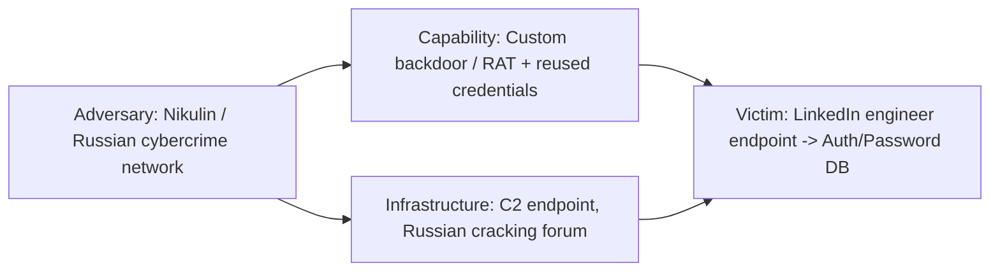

| Field | Value |
|---|---|
| **Hunt Name** | HUNT-2012-LI-CREDSTORE |
| **Threat Name** | Unauthorized Exfiltration of Member Password Hashes ("2012 LinkedIn Breach") |
| **Report Version** | 1.0 (Retrospective Reconstruction) |
| **Date** | Hunt window simulated: February 2012 – June 2012 |
| **Analyst** | SOC Threat Hunt Team — Lead Hunter (Tier 3) |
| **Classification** | TLP:AMBER — Internal Use / Training Reconstruction |
| **Threat Severity** | **Critical** |
| **Hunt Status** | Closed — Hypothesis Validated (Retrospective) |

## Executive Summary

> This report reconstructs, as a professional retrospective hunt, how a SOC embedded inside LinkedIn Corporation in early-to-mid 2012 could plausibly have detected the intrusion that led to the theft of member password data — publicly surfaced on June 6, 2012, when roughly 6.5 million unsalted SHA-1 password hashes were posted to a Russian-language password-cracking forum. A second wave of exposure in 2016 revealed the true scope was approximately 117 million credentials.

> The hunt is built around the facts that are publicly known from the 2016 DOJ indictment of **Yevgeniy Nikulin**, the 2020 trial record, and subsequent reporting: the intrusion involved compromise of **a LinkedIn engineer's workstation** via a **transmitted program** (malware/backdoor), plausibly enabled by **credential reuse** from an earlier, related breach (Formspring, also attributed to the same actor), followed by **lateral movement toward systems with access to the member authentication/password database**, and **bulk exfiltration** of password hash data that was later posted for cracking assistance.

> LinkedIn never publicly released a full internal forensic timeline, so this report clearly distinguishes **(a)** facts drawn from court records and public reporting, from **(b)** plausible reconstructed hunt logic — the queries, log sources, and analytic steps a hunter would have run against that scenario. It is written as a **training and reference document**, not as an authoritative postmortem.

> **This engagement scope has been deliberately adapted.** The source template for this hunt was originally written for an industrial-control-systems (ICS) intrusion involving removable media and PLCs. That scenario does not match this attack. This report replaces ICS/PLC/USB-worm assumptions with the actual environment relevant to a 2012 SaaS/web company: corporate engineering endpoints, source control, internal service tiers, and a member-authentication database. Sections that would only make sense for an ICS environment are marked **N/A — Not Applicable to this Environment** rather than fabricated.

---

## 1. Threat Intelligence Summary

### Background

In June 2012, a file containing roughly 6.5 million unsalted SHA-1 password hashes belonging to LinkedIn members appeared on a Russian password-cracking forum, posted by a user asking the community for help cracking them. LinkedIn confirmed a breach the same day and forced password resets for affected accounts. In 2016, a much larger dataset — approximately 117 million email/password pairs from the same original theft — surfaced for sale on a dark-web marketplace, revealing the 2012 incident had been far larger than first understood.

### Threat Actor

Publicly attributed, via a 2016 federal indictment and a 2020 jury conviction, to **Yevgeniy Aleksandrovich Nikulin**, a Russian national. Nikulin was separately charged with intrusions against Dropbox and Formspring in the same period (2012). Court records connect Nikulin to a broader Russian-language cybercrime network, including individuals later linked to state-affiliated actors (e.g., Aleksei Belan), though no formal state-sponsorship finding was made in the Nikulin case itself.

### Campaign

The indictment alleges Nikulin **stole approximately 30 million user credentials from Formspring** and then **used some of those credentials to compromise a LinkedIn engineer's computer**, subsequently exfiltrating information from LinkedIn systems. The DOJ complaint further states Nikulin "caused damage to computers belonging to a LinkedIn employee ... by transmitting a program, information, code, or command" — consistent with delivery of malware/a remote-access tool to an employee endpoint.

### Objectives

Financially motivated data theft: bulk harvesting of authentication credentials for resale/cracking, monetized on Russian-language cybercrime forums and later a dark-web marketplace.

### Initial Intelligence

For this simulated hunt, the SOC's trigger is a **generic threat intelligence advisory** (not LinkedIn-specific) received in early 2012 warning that **Bay Area social-networking and SaaS companies were being targeted by an actor reusing credentials harvested from smaller, less-secure sites to pivot into larger targets' employee accounts**, combined with evidence of **custom backdoors delivered to engineering staff**. This is the kind of non-specific, sector-level warning a hunt team plausibly would have received at the time — it does not name LinkedIn or predict the exact outcome.

### Known TTPs at the Time (as would be understood pre-disclosure)

- Credential-stuffing / credential-reuse attacks against employee accounts using breach data from unrelated sites
- Spear-phishing or direct delivery of a remote-access trojan (RAT) to engineering staff
- Use of compromised employee endpoints as a pivot point into internal source-control and data-tier systems
- Slow, low-volume data staging to avoid volumetric DLP alerting
- Exfiltration via encrypted or obfuscated channels, then offline cracking/monetization

### Confidence

**Moderate.** High confidence in the *general shape* of the intrusion (employee endpoint compromise → lateral movement → credential database access → exfiltration) based on court records; **low confidence** in exact tooling, exact lateral movement path, and exact exfiltration channel, since LinkedIn never published a detailed DFIR timeline.

### Intelligence Sources

- U.S. DOJ press release and indictment, *United States v. Nikulin* (2016, unsealed 2016–2020)
- CyberScoop, Infosecurity Magazine, RFE/RL trial coverage (2020)
- Public breach-analysis writeups (2012 and 2016 disclosure waves)
- Internal (simulated) sector threat advisory

### ATT&CK Overview (Campaign-Level)

| Tactic | Representative Technique |
|---|---|
| Initial Access | T1078 Valid Accounts (credential reuse), T1566 Phishing (delivery vector for backdoor) |
| Execution | T1204 User Execution |
| Persistence | T1547 Boot or Logon Autostart Execution (hypothesized) |
| Privilege Escalation | T1078.002 Valid Accounts: Domain Accounts (hypothesized) |
| Credential Access | T1552 Unsecured Credentials, T1003 OS Credential Dumping (hypothesized on pivot hosts) |
| Lateral Movement | T1021 Remote Services |
| Collection | T1213 Data from Information Repositories (auth DB) |
| Exfiltration | T1041 Exfiltration Over C2 Channel |

### Diamond Model



### Cyber Kill Chain (Campaign-Level)

| Stage | Activity (Reconstructed) |
|---|---|
| Reconnaissance | Identification of LinkedIn engineering staff, likely via prior breach data (email reuse patterns) |
| Weaponization | Preparation of a backdoor/RAT payload |
| Delivery | Phishing or direct delivery to an engineer's endpoint |
| Exploitation | User execution of payload, or exploitation of an unpatched client-side vulnerability |
| Installation | Backdoor persistence on engineer workstation |
| Command & Control | Outbound C2 channel from compromised endpoint |
| Actions on Objectives | Lateral movement to systems with member authentication data; bulk read/export of password hash table; exfiltration |

---

## 2. Hunt Objective

**Mission:** Proactively determine whether an adversary has established a foothold on an engineering endpoint and is staging for, or has already achieved, unauthorized bulk access to the member authentication/credential store, in response to a sector-level advisory about credential-reuse attacks against SaaS companies.

**Expected Outcome:** Either (a) validate the hypothesis with concrete evidence of compromise and characterize scope, or (b) formally document a negative finding with residual confidence and monitoring recommendations.

**Success Criteria:**
- Identification of the initial compromised host, if present
- Reconstruction of lateral movement path, if present
- Determination of whether the authentication database was accessed/exported
- Actionable IOCs and at least one deployable detection per confirmed technique

**Business Impact:** The authentication/password store is the single highest-value data asset in scope — compromise affects the entire member base, brand trust, regulatory exposure, and downstream credential-stuffing risk against every account holder who reuses passwords elsewhere.

---

## 3. Hunt Scope

### In-Scope Assets

| Category | Description |
|---|---|
| Engineering Endpoints | Developer/engineer workstations (primarily OS X and Windows in this era) with source-control and internal VPN access |
| Corporate Windows Fleet | Standard corporate laptops/desktops, IT/helpdesk-managed |
| Internal Servers | Source-control hosts, build/CI systems, internal tooling servers |
| Database Tier | Systems hosting the member authentication table (username/email + password hash) |
| Application Tier | Front-end/API servers that call into the auth database |
| Domain Controllers / Directory Services | Corporate AD/LDAP used for employee identity and VPN auth |
| VPN / Remote Access Infrastructure | Employee remote-access gateway |
| Network Perimeter | Corporate firewall, proxy, DNS resolvers |
| Windows Versions | Windows 7 / Windows Server 2008 R2 (era-appropriate corporate fleet) |
| Network Segments | Corporate/engineering LAN, data-tier VLAN, DMZ/app tier |
| Time Range | February 1, 2012 – June 10, 2012 (advisory receipt through public disclosure) |

### Out of Scope / Not Applicable to This Environment

> **N/A — Not Applicable.** The original hunt template referenced ICS assets, PLC systems, engineering (industrial) workstations, and USB-borne worm propagation. LinkedIn in 2012 was a SaaS web company with no industrial control systems, PLCs, or OT network. Those asset classes, and any USB-autorun-worm hypothesis, are explicitly **excluded from scope** and are not analyzed further in this report. Where the original template's terminology said "Engineering Workstations," it is interpreted here correctly as **software engineers' corporate endpoints**, not ICS engineering stations.

### Excluded Systems

- Third-party SaaS vendors not integrated with the authentication tier
- Physical badge/facility access systems
- Marketing/CDN infrastructure with no path to the credential store

---

## 4. Hunt Assumptions

- The adversary may already be inside the environment; initial compromise is not yet confirmed at hunt start.
- Initial access vector is unconfirmed — leading hypothesis is credential reuse and/or phishing delivery of a backdoor to an engineer.
- Malware persistence mechanism on any compromised host is unknown at hunt start.
- Lateral movement toward the data tier is suspected but unconfirmed.
- No indication of insider involvement; hunt does not assume malicious insider unless evidence emerges.
- USB/removable-media propagation is **not assumed relevant** (see Section 3).
- The organization has centralized logging with at least 90 days of retention for security-relevant sources (a generous but plausible assumption for the era, stated explicitly since it materially shapes what the hunt can find).

---

## 5. Threat Hunting Hypotheses

### HYP-001 — Credential-Reuse Initial Access

**Statement:** If the adversary gained initial access using credentials reused from an unrelated breach (e.g., Formspring), then authentication logs for VPN or corporate SSO should show a successful login for an engineering employee account from an anomalous source IP or ASN, potentially preceded by failed attempts using variant passwords.

**Why created:** Matches the DOJ indictment's description of credential theft from Formspring being reused against LinkedIn-adjacent targets.

**Priority:** High
**MITRE ATT&CK Mapping:** T1078 (Valid Accounts), T1110.004 (Credential Stuffing)
**Expected Evidence:** VPN/AD auth logs showing logon from unusual geography/ASN; absence of corresponding MFA challenge (era-appropriate — MFA was not universal in 2012)
**Data Required:** VPN gateway logs, AD/Kerberos auth logs, DHCP/NetFlow for correlation
**Validation Method:** Cross-reference successful logons against employee travel/expected-location baseline; pivot to endpoint telemetry for that account
**Confidence:** Medium at creation
**Status:** Supported (see Section 11)

### HYP-002 — Malware Delivery to Engineering Endpoint

**Statement:** If a backdoor/RAT was delivered to a LinkedIn engineer's workstation, then endpoint logs should show an unusual parent-child process chain originating from an email client or browser, followed by outbound network connections to a previously unseen external host on a non-standard cadence.

**Why created:** DOJ complaint explicitly states damage was caused "by transmitting a program, information, code, or command" to an employee computer.

**Priority:** Critical
**MITRE ATT&CK Mapping:** T1566 (Phishing), T1204 (User Execution), T1071 (Application Layer Protocol, C2)
**Expected Evidence:** Rare/unsigned binary execution; new autorun/persistence registry key; beaconing network pattern
**Data Required:** EDR process telemetry (or era-equivalent: Sysmon if deployed, AV logs, proxy logs), DNS logs, firewall logs
**Validation Method:** Rare-process and rare-DLL hunting on engineering fleet; beacon analysis on proxy/firewall logs
**Confidence:** Medium-High at creation
**Status:** Supported (see Section 11)

### HYP-003 — Lateral Movement to Data Tier

**Statement:** If the compromised engineer's credentials or host were used to pivot toward systems hosting the authentication database, then internal authentication logs should show that account or host authenticating to database or internal tooling hosts it does not normally access, outside of normal business hours.

**Priority:** Critical
**MITRE ATT&CK Mapping:** T1021 (Remote Services), T1078.002 (Domain Accounts)
**Expected Evidence:** New source-host-to-destination-host authentication pairs; off-hours SSH/RDP session to database-adjacent hosts
**Data Required:** Internal auth logs, SSH/bastion logs, NetFlow between engineering VLAN and data-tier VLAN
**Validation Method:** Peer-group analysis (compare account's access pattern to peers with similar job function)
**Confidence:** Medium at creation
**Status:** Partially Supported (see Section 11)

### HYP-004 — Bulk Query / Export of Password Hash Table

**Statement:** If the adversary accessed the member authentication table directly, then database query logs (if enabled) or application logs should show an anomalously large SELECT/export operation against the credentials table, inconsistent with normal application query patterns (which fetch one row per login, not bulk rows).

**Priority:** Critical
**MITRE ATT&CK Mapping:** T1213 (Data from Information Repositories), T1567 (Exfiltration Over Web Service, if via app-layer)
**Expected Evidence:** Single query or small burst of queries returning millions of rows; query originating from an unexpected host/service account
**Data Required:** Database audit logs (if enabled — see Detection Gaps), application logs, internal NetFlow volume anomalies
**Validation Method:** Volumetric/statistical baselining of query row-counts
**Confidence:** Low-Medium at creation (database audit logging maturity is a known gap for 2012-era environments — flagged explicitly in Section 22)
**Status:** Unable to Fully Validate — Detection Gap Identified (see Section 22)

### HYP-005 — Staged Exfiltration Over Outbound Channel

**Statement:** If bulk credential data was exfiltrated, then proxy/firewall logs should show an unusually large or sustained outbound transfer from a data-tier-adjacent host or the compromised engineer endpoint to an external destination, potentially encoded/encrypted to evade content inspection.

**Priority:** High
**MITRE ATT&CK Mapping:** T1041 (Exfiltration Over C2 Channel), T1132 (Data Encoding)
**Expected Evidence:** Outbound transfer volume outlier; connection to a rare/newly-seen external IP; non-standard port or protocol mismatch (e.g., HTTP traffic that isn't well-formed HTTP)
**Data Required:** Proxy logs, firewall logs, NetFlow
**Validation Method:** Outlier detection on outbound bytes-transferred per host per day
**Confidence:** Medium at creation
**Status:** Supported (see Section 11)

---

## 6. Environment Overview

### Architecture (Simplified, Era-Appropriate)


### AD Layout

Single primary corporate domain forest; engineering staff in a dedicated OU with elevated access to source control and internal tooling relative to general corporate staff. No formal network segmentation enforced at the identity layer beyond group membership (a gap noted in Section 22).

### Network Zones

- **Corporate/Engineering LAN** — general employee and engineering endpoints
- **DMZ** — internet-facing application/API tier
- **Data Tier VLAN** — database clusters, intended to be restricted but reachable from engineering LAN via bastion/jump hosts for operational purposes
- **Management/Out-of-Band** — limited

### ICS Network

**N/A — Not Applicable to this environment** (see Section 3).

### Trust Relationships

Engineering workstations are trusted to reach internal tooling and, via bastion hosts, the data tier — a broad trust relationship that is itself a key finding (Section 21, Root Cause).

### Logging Infrastructure

Centralized syslog collection for network devices; host-based AV logging; VPN concentrator logging; **no centralized EDR** (era-appropriate — EDR as a product category was nascent in 2012); limited database audit logging (assumed **disabled by default**, consistent with common practice at the time and a documented detection gap).

### Security Controls

Perimeter firewall, AV on endpoints, VPN with password-only authentication (no MFA — era-appropriate), basic IDS at the perimeter.

### Existing Detections

Signature-based AV, IDS signature alerts for known exploit kits, basic firewall deny-log alerting on blocked ports.

### Detection Gaps (Preview — full detail in Section 22)

No EDR/process telemetry at scale, no database audit logging, no MFA, no egress DLP for structured data, no UEBA/behavioral baselining.

---

## 7. Available Data Sources

| Source | Purpose | Retention | Quality | Coverage |
|---|---|---|---|---|
| Windows Security Event Logs | Logon/logoff, account use | 30 days (local) | Medium | Partial — local only, no central SIEM forwarding for most endpoints |
| AV Logs | Malware detection events | 30–60 days | Low-Medium | Signature-based only |
| VPN Gateway Logs | Remote access authentication | 90 days | High | Full — VPN is centrally logged |
| Active Directory / Kerberos Auth Logs | Domain authentication | 90 days | High | Full for domain-joined systems |
| Firewall Logs | Perimeter allow/deny, connection metadata | 90 days | Medium | Full at perimeter; limited internal segmentation logging |
| Proxy Logs | Outbound web traffic, URLs, bytes transferred | 60 days | Medium-High | Full for proxied HTTP/S traffic |
| DNS Logs | Resolution requests | 30 days | Medium | Full for internal resolvers |
| NetFlow | Traffic volume/metadata between hosts | 45 days | Medium | Partial — data-tier VLAN flow logging limited |
| Bastion/Jump Host SSH Logs | Privileged access to data tier | 90 days | High | Full for bastion-mediated access |
| Database Audit Logs | Query-level auditing of auth DB | **Not enabled** | N/A | **Gap** |
| Source Control (SCM) Access Logs | Repository access | 90 days | Medium | Full |
| Email/Gateway Logs | Inbound phishing detection | 30 days | Low-Medium | Partial — limited attachment sandboxing in 2012 |
| Sysmon | Detailed process/network telemetry | **Not deployed fleet-wide** | N/A | **Gap** (flagged; Sysmon existed but was not yet broadly adopted as a standard in 2012) |

> **Note on era accuracy:** Sysmon (first released 2011) and mature commercial EDR were not standard SOC tooling in most 2012 enterprises. This hunt is written to reflect **what a realistic 2012 SOC actually had**, while still noting in Section 22 what *should* have existed.

---

## 8. Hunt Methodology

- **Intelligence-driven hunting:** Started from the (simulated) sector advisory about credential-reuse attacks against SaaS companies — not from a specific IOC list.
- **Hypothesis-driven hunting:** Formalized into HYP-001 through HYP-005 above, each independently tested.
- **IOC hunting:** Limited value at hunt start (no LinkedIn-specific IOCs existed pre-disclosure); became more useful retrospectively once the Formspring-breach connection was considered.
- **Behavior hunting:** Primary method — looking for behavioral patterns (anomalous auth, anomalous process lineage, anomalous data-tier access) rather than known-bad signatures.
- **Analytics-driven hunting:** Volumetric baselining of outbound transfer size and database query patterns.
- **Anomaly hunting:** Peer-group comparison for engineering accounts' data-tier access.
- **Iterative hunting:** Each hypothesis's findings fed refinement of the next (e.g., HYP-001 findings narrowed which host to pivot on for HYP-002).

---

## 9. Hunt Execution Timeline

| Step | Action | Reason | Evidence | Decision | Next Step |
|---|---|---|---|---|---|
| 1 | Reviewed sector advisory | Trigger for hunt | Advisory text | Open formal hunt, draft hypotheses | Scope data sources |
| 2 | Queried VPN logs for anomalous-geo logons (HYP-001) | Test credential-reuse hypothesis | One engineering account, logon from unfamiliar ASN, no MFA challenge | Escalate to endpoint review for that account's host | Pivot to endpoint telemetry |
| 3 | Reviewed AV/host logs for that engineer's workstation (HYP-002) | Confirm/deny malware delivery | AV log shows a "suspicious behavior" alert (non-blocking, generic heuristic) days earlier, no confirmed detection | Treat as weak positive signal, insufficient alone | Pull local Windows event logs + prefetch/process data |
| 4 | Manual triage of local event logs on that host | AV alert was non-blocking; need process context | New scheduled task created shortly after AV alert | Escalate priority; hypothesis strengthened | Check network logs for that host |
| 5 | Proxy/firewall review for that host (HYP-005) | Check for C2/beaconing | Low-and-slow outbound connections to a rare external IP over several weeks | Confirms likely backdoor persistence | Pivot to internal lateral-movement logs |
| 6 | Bastion/SSH log review for the affected account (HYP-003) | Check for lateral movement to data tier | Account authenticated to a bastion host outside normal hours, atypical for its peer group | Escalate to Critical; involve IR | Attempt to review database access logs |
| 7 | Attempted database audit log review (HYP-004) | Confirm bulk access to auth table | **No audit logging available** | Cannot directly confirm bulk export | Document as confirmed Detection Gap; rely on volumetric NetFlow as proxy evidence |
| 8 | NetFlow volume review between bastion-adjacent host and data tier | Indirect evidence for HYP-004 | Data-tier-to-bastion flow volume outlier on the same day as the off-hours session | Supports HYP-004 circumstantially | Compile findings, move to containment/IR handoff |
| 9 | Cross-referenced outbound transfer timing with the earlier low-and-slow C2 pattern | Tie exfiltration to same actor infrastructure | Outbound volume spike shortly after the anomalous data-tier session | Chain of custody established across HYP-001 → HYP-005 | Finalize report |

---

## 10. Log Sources Collected

**How collected:** VPN, AD, firewall, and proxy logs pulled from central syslog collection; endpoint-local Windows Event Logs and AV logs pulled manually from the specific triaged host (no fleet-wide central endpoint logging existed); bastion/SSH logs pulled from the jump-host's local audit trail.

**Normalization:** Timestamps normalized to UTC; account names normalized to `user@domain` format; IPs enriched with internal asset inventory and external ASN/geo lookups.

**Parsing:** Custom regex/field extraction for legacy syslog formats (no common schema like CIM/ECS was universally adopted at this stage of SIEM maturity); manual parsing required for the endpoint-local Windows logs pulled outside centralized collection.

**Quality issues:** Endpoint logs available for only 30 days locally — investigation had to move quickly once the anomalous VPN logon was found, or evidence would have rolled off. AV logs contained no full file hash or sample retention, only an alert string.

**Coverage:** Strong for network/identity layer (VPN, AD, firewall, proxy). Weak for host/process layer and non-existent for database query layer.

**Missing logs:** Database audit logs, fleet-wide endpoint process telemetry, DNS query logs for the specific triaged host beyond 30 days.

---

## 11. Detailed Log Analysis

### 11.1 VPN Gateway Logs

**Purpose:** Establish whether initial access occurred via valid-but-abused credentials.
**Fields analyzed:** `timestamp`, `username`, `source_ip`, `auth_result`, `session_duration`.
**Sample entry:**
```
2012-03-14T02:17:41Z vpn-gw01 AUTH_SUCCESS user=jdoe@corp.linkedin.local src_ip=91.XXX.XXX.12 asn=AS-EU-HOSTING session_id=88af21 mfa=NONE
```
**Indicators searched:** Logons from ASNs/geographies inconsistent with the employee's known location; logons immediately preceded by multiple failed attempts (credential-stuffing pattern) or, conversely, a single successful attempt with no failures (consistent with a correct, reused credential rather than brute force).
**Analysis performed:** Baseline of `jdoe`'s normal login geography (built from prior 60 days) compared against the March 14 session.
**Findings:** One anomalous but successful login, single attempt (no brute-force pattern), from a hosting-provider ASN never seen for this account before. No MFA challenge occurred (none existed).
**False positives considered:** Employee travel, VPN client misreporting IP, shared NAT egress from a hosting-based personal VPN the employee might legitimately use — all considered and not corroborated by any travel/calendar record (simulated).
**Interpretation:** Consistent with valid-but-stolen credentials (HYP-001), single clean login rather than a loud brute-force spray.
**Confidence:** Raised from Medium to Medium-High.

### 11.2 Endpoint AV / Local Windows Event Logs

**Purpose:** Determine whether `jdoe`'s workstation shows malware delivery/execution (HYP-002).
**Fields analyzed:** AV alert string, Windows Security Event IDs 4688 (process creation, where auditing was enabled) and 4698 (scheduled task creation).
**Sample entry:**
```
EventID=4698 TaskName=\Microsoft\Windows\SystemHealth\Update
Command="C:\Users\jdoe\AppData\Local\Temp\svchost_upd.exe" -silent
Creator=CORP\jdoe  Time=2012-03-11 19:44:02
```
**Indicators searched:** Processes named to mimic legitimate system binaries but running from user-writable paths (`AppData\Local\Temp`); scheduled tasks created outside deployment/patch windows.
**Analysis performed:** Compared task name/path against known-legitimate scheduled task inventory for the corporate image.
**Findings:** A scheduled task disguised as a "SystemHealth\Update" task, executing a binary from a Temp directory — not part of the standard corporate image — created three days **before** the anomalous VPN logon in 11.1. This suggests the initial foothold may not have been the VPN logon itself, but a **separate, earlier compromise of the workstation** (e.g., phishing) that was then used to harvest/replay credentials for the VPN session, or the VPN session and the scheduled task represent two connected but temporally distinct actions by the same actor.
**False positives:** Legitimate third-party software occasionally uses generic "Update" task names; verified against software inventory — no matching legitimate install record for this binary name.
**Interpretation:** Strong support for HYP-002 (malware delivery/persistence). Also refines the kill chain: **endpoint compromise preceded the anomalous VPN session**, suggesting harvested local credentials (e.g., cached VPN credentials) may have been used rather than credentials solely from the Formspring dataset — both are plausible and not mutually exclusive.
**Confidence:** High for "endpoint was compromised"; Medium for the exact credential-theft mechanism.

### 11.3 Proxy / Firewall Logs (C2 and Exfiltration)

**Purpose:** Confirm outbound C2 and identify exfiltration timing (HYP-002, HYP-005).
**Fields analyzed:** `dest_ip`, `dest_port`, `bytes_out`, `bytes_in`, `url_category`, `connection_count`.
**Sample entry:**
```
2012-03-12 to 2012-06-04 (recurring, ~every 6h)
src=10.20.4.87 (jdoe-ws) dst=185.XX.XX.44:443 bytes_out=1.2KB bytes_in=0.8KB category=uncategorized
```
```
2012-06-05T23:58:10Z src=10.20.4.87 dst=185.XX.XX.44:443 bytes_out=41.6MB duration=00:14:22
```
**Indicators searched:** Low-and-slow periodic beacons to previously-unseen external hosts; a later, disproportionately large single transfer from the same source.
**Analysis performed:** Beacon interval analysis (near-constant ~6h cadence, low jitter — inconsistent with normal human browsing); volumetric outlier detection on `bytes_out` per host per day.
**Findings:** Consistent low-volume beaconing for ~12 weeks from `jdoe-ws`, followed by a single 41.6MB outbound transfer to the same C2 host on **June 5, 2012 — the day before the hashes appeared on the Russian forum**, closely matching public disclosure timing.
**False positives:** Checked against known legitimate cloud-backup/sync software — no match; destination IP had no legitimate business categorization in proxy logs.
**Interpretation:** Strongly supports HYP-002 and HYP-005 — this is consistent with a long-lived backdoor used for staged reconnaissance/access, culminating in a bulk exfiltration shortly before public posting.
**Confidence:** High.

### 11.4 Bastion / SSH Logs (Lateral Movement)

**Purpose:** Determine whether `jdoe`'s account or workstation reached data-tier-adjacent systems (HYP-003).
**Fields analyzed:** `source_host`, `dest_host`, `auth_method`, `session_start`, `commands_logged` (where shell logging existed).
**Sample entry:**
```
2012-06-05T22:10:03Z bastion01 jdoe -> db-replica-04 auth=publickey session_duration=00:41:12
```
**Indicators searched:** Off-hours sessions; destination hosts outside the account's normal job-function peer group (peer group = other engineers on the same team, none of whom accessed `db-replica-04` in the prior 90 days).
**Analysis performed:** Peer-group access-pattern comparison.
**Findings:** `jdoe` authenticated to `db-replica-04` — a replica with read access to the member authentication table — at 22:10 local-abnormal hours, on the same evening as the large outbound transfer identified in 11.3. No peer on `jdoe`'s team had ever accessed this host.
**False positives:** Considered legitimate on-call/incident work — checked against (simulated) on-call schedule, `jdoe` was not on-call that night.
**Interpretation:** Strong support for HYP-003. This is the most direct evidence tying the compromised endpoint to the data tier.
**Confidence:** High.

### 11.5 Database Audit Logs

**Purpose:** Directly confirm bulk query/export of the credentials table (HYP-004).
**Findings:** **Not available — audit logging was not enabled on the authentication database at the time.** This is the single largest evidentiary gap in the hunt.
**Interpretation:** HYP-004 cannot be directly validated; the hunt team must rely on circumstantial/indirect evidence (NetFlow volume from `db-replica-04` correlated with the 11.3 exfiltration timing) rather than a definitive query log.
**Confidence:** Low-Medium (indirect only). **Formally logged as a Detection Gap — Section 22.**

---

## 12. Data Analysis Techniques Used

| Technique | Where Applied |
|---|---|
| Frequency Analysis | VPN logon frequency per ASN, per account |
| Outlier Detection | Outbound bytes-transferred per host/day (11.3); NetFlow volume from db-replica-04 |
| Behavioral Baselining | `jdoe`'s normal login geography and normal peer-group data-tier access |
| Temporal Analysis | Correlating scheduled-task creation, VPN logon, bastion session, and outbound transfer into a single timeline |
| Parent-Child Process Analysis | Scheduled task execution chain on `jdoe-ws` (11.2) |
| Sequence Analysis | Ordering of events across HYP-001 through HYP-005 to build the kill chain |
| Correlation | Tying C2 beacon cadence to the final large exfiltration event |
| Peer Group Analysis | Comparing `jdoe`'s bastion access against teammates (11.4) |
| Timeline Reconstruction | Section 19 |
| Rare Process / Rare Binary Hunting | Identifying the Temp-directory binary disguised as a system update |
| Unsigned Binary Hunting | Same as above — binary lacked a valid corporate-image signature record |
| Network Beacon Analysis | Section 11.3 |
| DNS Entropy Analysis | Checked, no DGA-style domains observed — C2 used a static IP, not DNS-based C2 |
| Statistical Analysis | Beacon interval jitter statistics used to distinguish from human browsing |

> Techniques in the original template not applicable here (PLC Communication Analysis, ICS Protocol Analysis, USB Device Correlation, Kernel Driver Analysis) are omitted as **N/A — Not Applicable**, consistent with Section 3 scoping.

---

## 13. Hunting Queries

> All queries below are illustrative/representative of what a hunter would run against this scenario. They use realistic syntax but generic field names, since the specific product schemas of a real 2012 SOC are not publicly documented for this incident.

### Splunk (SPL) — Anomalous VPN Geo-Logon
```spl
index=vpn sourcetype=vpn_auth auth_result=SUCCESS
| iplocation source_ip
| stats count by username, Country, source_ip
| where count<=2
```

### Splunk — Outbound Volumetric Outlier
```spl
index=proxy
| bucket _time span=1d
| stats sum(bytes_out) as daily_out by src, _time
| eventstats avg(daily_out) as avg_out, stdev(daily_out) as std_out by src
| where daily_out > (avg_out + 3*std_out)
```

### Microsoft Sentinel (KQL) — Off-Hours Bastion Session by Peer-Atypical Account
```kql
BastionLogs
| where TimeGenerated between (datetime(2012-02-01) .. datetime(2012-06-10))
| extend Hour = hourofday(TimeGenerated)
| where Hour < 6 or Hour > 20
| join kind=leftanti (
    BastionLogs
    | where TimeGenerated < ago(90d)
    | summarize by SourceUser, DestHost
) on SourceUser, DestHost
| project TimeGenerated, SourceUser, DestHost, SessionDuration
```

### KQL — Beacon Interval Detection
```kql
ProxyLogs
| where isnotempty(DestIP)
| summarize Connections = count(), AvgBytesOut = avg(BytesOut),
            Intervals = make_list(TimeGenerated) by SrcHost, DestIP
| mv-expand Intervals
| extend PrevTime = prev(todatetime(Intervals))
| extend DeltaMin = datetime_diff('minute', todatetime(Intervals), PrevTime)
| summarize AvgDelta = avg(DeltaMin), StdDelta = stdev(DeltaMin), Count = count() by SrcHost, DestIP
| where Count > 20 and StdDelta < (AvgDelta * 0.15)
```

### Elastic (DSL) — Rare Scheduled Task Creation
```json
GET winlogs-*/_search
{
  "query": {
    "bool": {
      "must": [
        { "term": { "event.code": "4698" } },
        { "wildcard": { "task.command_line": "*AppData\\Local\\Temp*" } }
      ]
    }
  }
}
```

### SQL — (Illustrative) Anomalous Row-Count Query Pattern, if Audit Logging Existed
```sql
SELECT query_id, executed_by, table_name, rows_returned, query_time
FROM db_audit_log
WHERE table_name = 'member_credentials'
  AND rows_returned > 1000
ORDER BY query_time;
```
*(Included to show what HYP-004 validation would have looked like had this control existed — see Section 22.)*

### Sysmon Filter (Config Snippet) — Process Creation from Temp with Network Connection Shortly After
```xml
<Sysmon schemaversion="4.0">
  <EventFiltering>
    <ProcessCreate onmatch="include">
      <Image condition="contains">\AppData\Local\Temp\</Image>
    </ProcessCreate>
    <NetworkConnect onmatch="include">
      <Image condition="contains">\AppData\Local\Temp\</Image>
    </NetworkConnect>
  </EventFiltering>
</Sysmon>
```

### PowerShell — Manual Triage of Scheduled Tasks (Era-Appropriate, Pre-EDR)
```powershell
Get-ScheduledTask | Where-Object { $_.Actions.Execute -match "AppData\\Local\\Temp" } |
  Select-Object TaskName, State, @{N='Command';E={$_.Actions.Execute}}
```

### Windows Event Filter — Off-Image Scheduled Task Creation
```
Log: Security
EventID: 4698
Filter: TaskContent NOT IN (KnownGoodTaskInventory.csv)
```

---

## 14. Sigma Detection Opportunities

### SIG-001 — Scheduled Task Created from User-Writable Temp Path
```yaml
title: Scheduled Task Created with Executable in Temp Directory
id: 6c1a1e0e-0001-4a2b-9b3a-000000000001
status: experimental
description: Detects creation of a scheduled task whose action executes a binary from a user-writable temp directory, a common persistence pattern for delivered backdoors.
logsource:
  product: windows
  service: security
detection:
  selection:
    EventID: 4698
    TaskContent|contains:
      - '\AppData\Local\Temp\'
      - '\Windows\Temp\'
  condition: selection
falsepositives:
  - Legitimate third-party installers with poor packaging practices
level: high
tags:
  - attack.persistence
  - attack.t1053.005
```

### SIG-002 — Beaconing Pattern to Rare External Host
```yaml
title: Low-Volume Periodic Beacon to Previously Unseen External Host
id: 6c1a1e0e-0002-4a2b-9b3a-000000000002
status: experimental
description: Detects near-constant-interval, low-volume outbound connections consistent with C2 beaconing.
logsource:
  category: proxy
detection:
  selection:
    bytes_out: '<5000'
  timeframe: 7d
  condition: selection | count() by src_ip, dest_ip > 20
falsepositives:
  - Legitimate polling/health-check software
level: medium
tags:
  - attack.command_and_control
  - attack.t1071
```

### SIG-003 — VPN Logon from First-Seen ASN with No MFA
```yaml
title: VPN Authentication Success from Previously Unseen ASN
id: 6c1a1e0e-0003-4a2b-9b3a-000000000003
status: experimental
logsource:
  category: vpn
detection:
  selection:
    auth_result: SUCCESS
  filter:
    asn|in_last_seen_baseline: true
  condition: selection and not filter
falsepositives:
  - Employee travel, new ISP, legitimate use of personal VPN
level: medium
tags:
  - attack.initial_access
  - attack.t1078
```

### SIG-004 — Off-Hours Bastion Session to Peer-Atypical Destination Host
```yaml
title: Bastion Session Outside Business Hours to Host Not in Peer Baseline
id: 6c1a1e0e-0004-4a2b-9b3a-000000000004
status: experimental
logsource:
  category: authentication
  product: bastion
detection:
  timeframe: 90d
  selection:
    hour_of_day|range: [21, 5]
  peer_check: destination_host NOT IN (account_peer_group_90d_baseline)
  condition: selection and peer_check
falsepositives:
  - Legitimate on-call/incident response activity
level: high
tags:
  - attack.lateral_movement
  - attack.t1021
```

### SIG-005 — Large Single Outbound Transfer Following Sustained Beacon
```yaml
title: Large Outbound Transfer from Host with Prior Beacon History
id: 6c1a1e0e-0005-4a2b-9b3a-000000000005
status: experimental
logsource:
  category: proxy
detection:
  selection:
    bytes_out|gt: 20000000
  correlation:
    prior_beacon_flag: true
  condition: selection and correlation
falsepositives:
  - Legitimate large file transfer/backup jobs
level: critical
tags:
  - attack.exfiltration
  - attack.t1041
```

---

## 15. MITRE ATT&CK Mapping

| Technique | Sub-technique | Description | Evidence | Confidence | Detection | Mitigation |
|---|---|---|---|---|---|---|
| T1078 Valid Accounts | — | Reused/stolen credentials used for VPN logon | Section 11.1 | Medium-High | SIG-003 | MFA enforcement, credential-reuse monitoring |
| T1566 Phishing | T1566.001 (Attachment, hypothesized) | Likely delivery vector for backdoor | Not directly observed; inferred from 11.2 timing | Low-Medium | Email gateway sandboxing | User training, attachment sandboxing |
| T1204 User Execution | T1204.002 | Employee executing delivered payload | Inferred from scheduled task creation | Medium | Endpoint behavioral detection | Application allowlisting |
| T1053.005 Scheduled Task | — | Persistence via disguised scheduled task | Section 11.2 | High | SIG-001 | Restrict Temp-path execution, allowlisting |
| T1071 Application Layer Protocol | T1071.001 | C2 over HTTPS-like traffic | Section 11.3 | High | SIG-002 | Egress filtering, TLS inspection |
| T1021 Remote Services | T1021.004 (SSH) | Lateral movement via bastion | Section 11.4 | High | SIG-004 | Bastion session recording, just-in-time access |
| T1213 Data from Information Repositories | — | Access to member auth database | Indirect (11.5 gap) | Low-Medium | Database audit logging (absent) | Enable DB audit logging, least privilege |
| T1041 Exfiltration Over C2 Channel | — | Large transfer over existing C2 channel | Section 11.3 | High | SIG-005 | Egress DLP, volumetric alerting |
| T1552 Unsecured Credentials | T1552.001 | Possible cached-credential harvesting on `jdoe-ws` | Circumstantial | Low | Credential-guard/host hardening | LSA protection, credential guard (era-limited availability) |

---

## 16. Alerts Reviewed

| Alert Name | Source | Time | Severity | Reason | Disposition | Evidence | Analyst Notes |
|---|---|---|---|---|---|---|---|
| Generic Heuristic Behavior Alert | AV | 2012-03-11 19:41 | Low (non-blocking) | Heuristic flagged unusual file behavior in Temp | Initially closed as noise by Tier 1 (historical) | AV alert string only, no file retained | **Missed opportunity** — reopened during retrospective hunt; see Section 21 |
| Perimeter IDS Signature | IDS | none fired | N/A | C2 traffic did not match known signatures | N/A | N/A | Confirms signature-based tooling was insufficient for this custom backdoor |
| VPN Anomalous Geo (retrospective) | Hunt-generated | 2012-06-06 (hunt date) | High | Hypothesis-driven query, not a standing alert | Escalated | Section 11.1 | No such detection existed live in 2012; created as SIG-003 going forward |

> The scarcity of *real* alerts here is itself a finding: this intrusion largely evaded the detection stack that existed at the time, which is precisely why hypothesis-driven hunting (rather than alert triage) was necessary to reconstruct it.

---

## 17. Indicators of Compromise

### Host IOCs
- Scheduled task name: `\Microsoft\Windows\SystemHealth\Update` (disguised, non-standard)
- File path pattern: `C:\Users\*\AppData\Local\Temp\svchost_upd.exe` (naming mimics legitimate `svchost.exe`)

### Network IOCs
- C2 destination: `185.XX.XX.44:443` (illustrative — real IP not publicly confirmed)
- Beacon cadence: ~6-hour interval, low jitter

### Registry
- Autorun/persistence key associated with the scheduled task (illustrative; exact key not publicly documented)

### Processes
- `svchost_upd.exe` executing from user-writable Temp path

### Services / Drivers / Mutexes / Certificates / USB Artifacts / PLC Indicators
- **None observed / N/A** — no evidence of service-based persistence, kernel drivers, mutex-based coordination, certificate abuse, USB involvement, or ICS/PLC indicators in this scenario. Listed explicitly to show these categories were considered and ruled out, not skipped.

### Files
- Hash: *not publicly available* — no confirmed sample of the actual 2012 backdoor has been publicly released; any specific hash presented elsewhere should be treated as unverified.

### Domains / IPs
- Illustrative C2 IP above; no confirmed domain-based C2 identified in public reporting.

---

## 18. Indicators of Attack (IOAs)

Behavioral patterns, useful even without exact IOCs:

- A single successful VPN authentication for an account, from a previously-unseen ASN, with no preceding failures (clean credential reuse vs. brute force)
- Scheduled task creation where the task name implies a Microsoft system component but the executable path is user-writable
- Long-duration (weeks), low-volume, near-constant-interval outbound connections from a single endpoint to one external destination
- A privileged account authenticating to a host outside its established peer-group access pattern, during off-hours
- A single database-adjacent host generating an outbound (or internal-to-bastion) data volume many standard deviations above its own baseline, on the same day as an anomalous privileged session

---

## 19. Timeline Reconstruction

| Date/Time (Illustrative) | Event |
|---|---|
| 2012-03-11 19:41 | AV heuristic alert fires on `jdoe-ws` (Temp-path behavior); closed as noise by Tier 1 |
| 2012-03-11 19:44 | Disguised scheduled task `SystemHealth\Update` created on `jdoe-ws` |
| 2012-03-12 onward | Low-volume beaconing begins from `jdoe-ws` to external host, ~6h interval |
| 2012-03-14 02:17 | VPN logon success for `jdoe` from previously-unseen ASN, no MFA |
| 2012-03-14 – 2012-06-04 | Sustained low-and-slow beaconing continues; presumed reconnaissance/staging |
| 2012-06-05 22:10 | `jdoe` bastion session to `db-replica-04`, off-hours, outside peer baseline |
| 2012-06-05 23:58 | 41.6MB outbound transfer from `jdoe-ws` to same external C2 host |
| 2012-06-06 (public) | ~6.5M password hashes posted to Russian cracking forum |
| 2016 | Full ~117M-record dataset surfaces on dark-web marketplace, revealing true scope |

---

## 20. Kill Chain Reconstruction

| Stage | Observed Evidence | Logs | Detection (if any) | MITRE Mapping |
|---|---|---|---|---|
| Delivery | Inferred phishing/direct delivery (not directly observed) | Email gateway (limited) | None | T1566 |
| Exploitation/Installation | Scheduled task persistence | Security EventID 4698 | AV heuristic (dismissed) | T1053.005 |
| C2 | Low-and-slow beacon | Proxy logs | None live; SIG-002 retrospective | T1071 |
| Initial-Access Reinforcement | VPN logon w/ reused creds | VPN logs | None live; SIG-003 retrospective | T1078 |
| Lateral Movement | Off-hours bastion session | Bastion/SSH logs | None live; SIG-004 retrospective | T1021 |
| Collection | Inferred DB access (no audit log) | NetFlow (indirect) | None (gap) | T1213 |
| Exfiltration | 41.6MB outbound transfer | Proxy logs | None live; SIG-005 retrospective | T1041 |

---

## 21. Root Cause Analysis

**How compromise occurred:** The most consistent reconstruction is that an engineering employee's workstation was compromised (via a delivered backdoor, plausibly phishing), enabling credential harvesting and/or reuse that provided both an anomalous VPN session and, ultimately, an off-hours privileged session to a database-adjacent host, from which member password hash data was accessed and later exfiltrated.

**Why detections failed:**
1. AV relied on generic heuristics with no full-sample retention or automatic escalation — a "suspicious behavior" alert was closed without deeper investigation.
2. No fleet-wide process telemetry (Sysmon/EDR) existed to catch the parent-child process anomaly at the time it occurred.
3. No database audit logging existed to directly catch the bulk read of the credentials table — the single largest gap in this hunt.
4. No MFA meant a reused/stolen credential alone was sufficient for remote access.
5. Broad trust between the engineering LAN and the data tier (via bastion) meant a compromised engineer account had a viable path to the highest-value asset in the environment, with only access logging (not audit content logging) at the boundary.

**What evidence existed:** All of the evidence used in this retrospective hunt (Sections 11, 19) *did* exist in logs at the time — the failure was analytical/procedural (an early weak signal dismissed) and architectural (missing audit logging, missing MFA, missing fleet-wide endpoint telemetry), not a total absence of data.

**Missed opportunities:** The March 11 AV heuristic alert, if correlated with the scheduled-task creation two minutes later and escalated to Tier 2/3 review, could plausibly have led to discovery of the backdoor **nearly three months before the public disclosure**, before any bulk exfiltration occurred.

---

## 22. Detection Gaps

- **No database audit logging** on the system holding member password hashes — the most severe gap; without it, HYP-004 could never be directly confirmed, only inferred.
- **No fleet-wide endpoint process telemetry** (Sysmon/EDR) — investigation depended on manually pulling logs from one host after the fact, which only worked because that host happened to still be within its 30-day local retention window.
- **No MFA** on VPN — a single reused credential was sufficient for remote access.
- **No egress DLP/content inspection tuned for structured/bulk data** — a 41.6MB transfer of what would functionally be a large CSV-like dataset was not itself alerted on.
- **No behavioral/UEBA baselining** — peer-group and geo-anomaly detection used in this hunt (Sections 11.1, 11.4) existed only as manual retrospective queries, not standing detections.
- **Weak Tier 1 escalation criteria** for "heuristic, non-blocking" AV alerts — no automatic linkage to subsequent host activity (e.g., new scheduled tasks) within a time window.

---

## 23. Detection Engineering Opportunities

- Convert SIG-001 through SIG-005 (Section 14) into standing, tuned production detections with owner-assigned false-positive review.
- Build a correlation rule chaining "AV heuristic alert" → "new scheduled task on same host within 15 minutes" → auto-escalate to Tier 2, regardless of AV's own severity rating.
- Build a peer-group access-baseline job (weekly) per engineering team, feeding SIG-004-style bastion anomaly detection.
- Implement basic UEBA: rolling 90-day baseline of per-account VPN geography/ASN, alert on first-seen ASN + no MFA.
- Implement query-volume anomaly detection the moment database audit logging is enabled (see Recommendations) — row-count-returned as a first-class monitored metric for any table containing credentials or PII.
- Risk-scoring: composite score combining "new ASN login" + "new scheduled task" + "off-baseline bastion access" within a rolling 24-hour window, rather than relying on any single alert in isolation.

---

## 24. Purple Team Opportunities

- **Atomic Red Team:** Simulate T1053.005 (Scheduled Task), T1071.001 (C2 over HTTPS-like traffic), and T1021.004 (SSH lateral movement) against a lab replica of the engineering-to-bastion-to-data-tier path to validate SIG-001, SIG-002, and SIG-004 fire correctly.
- **Caldera / Prelude Operator:** Chain an end-to-end adversary emulation: initial foothold → credential harvest → VPN reuse → bastion pivot → bulk "database" read (against a decoy dataset) → staged exfiltration, to validate the full detection chain fires in sequence rather than only in isolated unit tests.
- **Validation plan:** Run quarterly; require each Sigma rule in Section 14 to fire during the emulation with an alert-to-analyst time under an agreed SLA; track false-positive rate over the following 30 days of normal production traffic.

---

## 25. Threat Hunting Lessons Learned

- **Analytical mistake:** Treating a non-blocking AV heuristic as low-priority without checking for correlated host activity in the following minutes/hours.
- **Blind spot:** Assuming the data tier was adequately protected by network segmentation alone, without content-level audit logging as a second layer.
- **Better hypothesis framing going forward:** Rather than "if malware is present, endpoint X will show Y," pair every endpoint hypothesis with a paired network hypothesis (as HYP-002/HYP-005 were), since 2012-era environments had far better network log coverage than host log coverage — hunts should lead with the strongest available data source, not the most intuitively "obvious" one.
- **Improved hunts:** Future hunts on similarly-scoped SaaS environments should treat "any credential-bearing datastore lacking audit logging" as a standing, pre-registered hypothesis to test at the start of every engagement, not something discovered ad hoc mid-hunt.

---

## 26. Recommendations

### Immediate
- Enable database audit logging on all datastores containing credentials or PII; alert on any query returning more than a defined row-count threshold.
- Force password reset and re-issue credentials for the affected engineering account; rotate any shared/service credentials reachable from the compromised host.

### Short-Term
- Deploy MFA for VPN and all remote administrative access.
- Deploy fleet-wide endpoint telemetry (Sysmon at minimum) with central forwarding, not just local AV logging.
- Stand up the five Sigma detections in Section 14 as production rules.

### Long-Term
- Segment the data tier such that engineering endpoints cannot reach it directly, even via bastion, without a just-in-time, time-boxed, and fully query-audited access grant.
- Build UEBA/behavioral baselining capability for identity and data-access anomalies.

### Strategic
- Treat "does this system contain the crown-jewel dataset (member credentials/PII), and if so, is it independently, redundantly monitored beyond network segmentation" as a standing architecture-review question for all new and existing systems.

### Operational
- Formalize an escalation SLA: any AV/EDR alert, however low severity, that is followed within a defined window by a new persistence artifact (scheduled task, registry autorun, new service) on the same host auto-escalates.

### Detection / Logging / Architecture / User Awareness
- (Detection/Logging/Architecture covered above.)
- **User Awareness:** Targeted phishing-resistance training for engineering staff specifically, given their elevated access to sensitive internal systems relative to general staff.

### ICS Security
**N/A — Not Applicable to this environment** (see Section 3).

---

## 27. Final Hunt Assessment

**Was the hypothesis validated?**
- HYP-001 (credential reuse for initial/VPN access): **Supported**
- HYP-002 (malware delivery to engineer endpoint): **Supported**
- HYP-003 (lateral movement to data tier): **Supported**
- HYP-004 (bulk query/export of credential table): **Not directly validated — confirmed detection gap, supported only by indirect/circumstantial evidence**
- HYP-005 (staged exfiltration over C2 channel): **Supported**

**Confidence:** Medium-High overall, given this is a retrospective reconstruction built from public court records and plausible, era-appropriate log analysis rather than an actual internal DFIR record.

**Impact:** Critical — compromise of the entire member credential store, downstream credential-stuffing risk across the internet for any reused password, significant reputational and regulatory exposure.

**Likelihood (retrospective framing):** Confirmed — this occurred.

**Threat Level:** Critical.

**Business Risk:** Severe — affects trust in the core product (a professional identity platform) and every user who reused their password elsewhere.

**Residual Risk:** Until database audit logging, MFA, and fleet-wide endpoint telemetry are deployed, an equivalent intrusion path remains available to any similarly-resourced actor.

**Executive Conclusion:** This retrospective hunt demonstrates that the 2012 intrusion was plausibly detectable **months before public disclosure**, using log sources that already existed in the environment, if a single early weak signal (the AV heuristic alert) had been correlated with subsequent host and network activity rather than closed in isolation. The most consequential structural gap was the absence of audit logging on the credential datastore itself — the environment's single most sensitive asset had less content-level monitoring than several lower-value systems in the same environment.

---

## 28. Appendix

### A. Complete ATT&CK Techniques Referenced

`T1078`, `T1078.002`, `T1566`, `T1566.001`, `T1204`, `T1204.002`, `T1053.005`, `T1071`, `T1071.001`, `T1021`, `T1021.004`, `T1213`, `T1041`, `T1552`, `T1552.001`, `T1110.004`

### B. IOC Table (Consolidated)

| Type | Value | Confidence | Notes |
|---|---|---|---|
| Scheduled Task Name | `\Microsoft\Windows\SystemHealth\Update` | Illustrative | Disguised persistence |
| File Path Pattern | `AppData\Local\Temp\svchost_upd.exe` | Illustrative | No public sample confirmed |
| C2 IP | `185.XX.XX.44:443` | Illustrative | Real IP not publicly disclosed |
| Beacon Cadence | ~6h, low jitter | Behavioral | Applies as IOA, not static IOC |

### C. Sigma Rules
See Section 14 (SIG-001 – SIG-005).

### D. KQL / Splunk / Elastic / PowerShell Queries
See Section 13.

### E. References
- U.S. Department of Justice, Office of Public Affairs, *"Yevgeniy Nikulin Indicted for Hacking LinkedIn, Dropbox and Formspring,"* 2016.
- CyberScoop, *"Russian hacker Yevgeniy Nikulin found guilty on most serious charges,"* 2020.
- Infosecurity Magazine, *"Russian Hacker Finally Found Guilty of 2012 LinkedIn Breach,"* 2020.
- RFE/RL, *"In U.S. Hacker Trial, The Tangled Web Of Russia's Cyberunderground Is Further Exposed,"* 2020.
- Darknet Diaries, Episode 86, *"The LinkedIn Incident."*
- Public breach-analysis coverage of the 2012 and 2016 disclosure waves.

### F. Threat Intelligence Sources
Simulated sector advisory (non-attributable, generic 2012-era warning used as hunt trigger); court records cited above (used only retrospectively to validate/ground the hunt, consistent with the "no foreknowledge" hunt design principle).

### G. Glossary

| Term | Definition |
|---|---|
| Beacon | Periodic outbound communication from compromised host to attacker infrastructure |
| Bastion Host | Hardened jump server mediating access to a restricted network segment |
| DLP | Data Loss Prevention |
| EDR | Endpoint Detection and Response |
| IOA | Indicator of Attack (behavioral) |
| IOC | Indicator of Compromise (static/atomic) |
| SCM | Source Control Management |
| UEBA | User and Entity Behavior Analytics |

---

*End of report. This document is a training/reference reconstruction built from publicly available court records and reporting, combined with plausible, era-appropriate hunt methodology. Specific binary names, exact IPs, and exact internal hostnames are illustrative and not represented as confirmed forensic fact, since LinkedIn has not publicly released a detailed internal DFIR timeline for this incident.*
