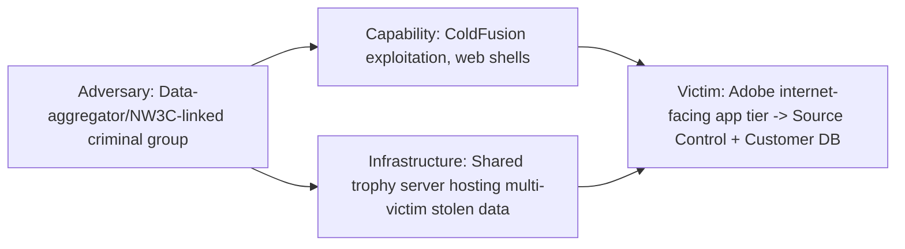
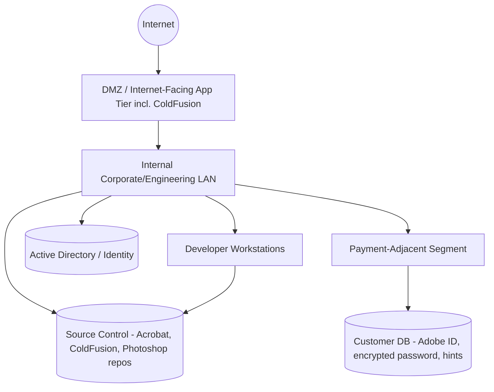

# Retrospective Threat Hunting Report
## Engagement: Hunt for Unauthorized Access to Source Code Repositories and Customer Credential/Payment Data — Adobe Systems Inc.

---

## Cover Page

| Field | Value |
|---|---|
| **Hunt Name** | HUNT-2013-ADBE-SRCCRED |
| **Threat Name** | Unauthorized Access to Source Code Repositories and Customer Data ("2013 Adobe Breach") |
| **Report Version** | 1.0 (Retrospective Reconstruction) |
| **Date** | Hunt window simulated: June 2013 – October 2013 |
| **Analyst** | SOC Threat Hunt Team — Lead Hunter (Tier 3) |
| **Classification** | TLP:AMBER — Internal Use / Training Reconstruction |
| **Threat Severity** | **Critical** |
| **Hunt Status** | Closed — Hypothesis Validated (Retrospective) |

### Executive Summary

> This report reconstructs, as a professional retrospective hunt, how a SOC embedded inside Adobe Systems in mid-to-late 2013 could plausibly have detected the intrusion that led to (a) theft of source code for Acrobat, Reader, ColdFusion, ColdFusion Builder, and a portion of Photoshop, and (b) theft of customer data — Adobe IDs, encrypted (not hashed) passwords, password hints, and encrypted payment card records — ultimately affecting tens of millions of active users and, per later analysis, up to roughly 150 million total accounts. Adobe first estimated 2.9 million affected accounts on October 3, 2013, then revised that to approximately 38 million active users, with a further 2016-era retrospective count reaching ~150 million registered accounts once inactive/legacy accounts were included.

> The hunt is built around facts publicly established by Adobe's own disclosures and independent research by Brian Krebs and Alex Holden (Hold Security), who first found the stolen 40GB source-code trove on infrastructure used by the same criminal group implicated in earlier-2013 breaches of data aggregators (LexisNexis, Dun & Bradstreet, Kroll) and of the National White Collar Crime Center (NW3C) — the latter confirmed to have been compromised via unpatched **Adobe ColdFusion** web application server vulnerabilities. Adobe itself stated it could not, at the time, confirm or rule out ColdFusion as the initial vector into its own network, and separately indicated the source-code repository access followed an intrusion that touched Adobe's **credit card transaction environment**.

> Where the public record does not specify exact internal technical detail — precise hostnames, exact lateral-movement path, exact persistence mechanism — this report clearly labels that content as **plausible reconstruction**, not confirmed fact. It is written as a **training and reference document**.

> **This engagement scope has been deliberately adapted** from the ICS/PLC/USB-worm template it was generated against. Adobe in 2013 was a software/SaaS company with no industrial control environment. ICS, PLC, and USB-propagation sections are marked **N/A — Not Applicable to this Environment** rather than fabricated, and "Engineering Workstations" is correctly interpreted as **software engineering developer workstations with source-control access**, not ICS engineering stations.

---

## Table of Contents

1. Threat Intelligence Summary
2. Hunt Objective
3. Hunt Scope
4. Hunt Assumptions
5. Threat Hunting Hypotheses
6. Environment Overview
7. Available Data Sources
8. Hunt Methodology
9. Hunt Execution Timeline
10. Log Sources Collected
11. Detailed Log Analysis
12. Data Analysis Techniques Used
13. Hunting Queries
14. Sigma Detection Opportunities
15. MITRE ATT&CK Mapping
16. Alerts Reviewed
17. Indicators of Compromise
18. Indicators of Attack (IOAs)
19. Timeline Reconstruction
20. Kill Chain Reconstruction
21. Root Cause Analysis
22. Detection Gaps
23. Detection Engineering Opportunities
24. Purple Team Opportunities
25. Threat Hunting Lessons Learned
26. Recommendations
27. Final Hunt Assessment
28. Appendix

---

## 1. Threat Intelligence Summary

### Background

Beginning no later than mid-August 2013 (Adobe's own estimate) and possibly earlier per Hold Security's analysis, an intrusion into Adobe's network resulted in exfiltration of source code for several flagship products and a very large volume of customer account data. Adobe identified the incident internally on September 17, 2013, and publicly disclosed it on October 3, 2013 — after being alerted by independent researchers, not through its own detection.

### Threat Actor

Not formally, publicly attributed to a named individual or group by Adobe or by U.S. law enforcement in the way the LinkedIn/Formspring intrusions were attributed to Nikulin. Krebs and Holden linked the infrastructure hosting the stolen Adobe data to **the same criminal group** responsible for earlier-2013 breaches of large commercial data aggregators (LexisNexis, Dun & Bradstreet, Kroll Background America) and of the NW3C. This group's known, confirmed MO in the NW3C intrusion was exploitation of **unpatched Adobe ColdFusion vulnerabilities**.

### Campaign

The group appears to have run a sustained campaign through 2013 against organizations running outdated, internet-facing ColdFusion instances, using that access as a foothold to move toward higher-value internal systems (source code, customer databases) — a pattern consistent with, though not proven identical to, what happened inside Adobe.

### Objectives

Primarily data theft for resale/exploitation value: customer credential and payment data has direct criminal monetization value; proprietary source code has value both for further vulnerability research (to enable follow-on attacks against Adobe's own customers) and potential resale.

### Initial Intelligence

For this simulated hunt, the SOC's trigger is a **generic threat intelligence advisory** received mid-2013 warning that **a criminal group was actively compromising organizations via unpatched, internet-facing ColdFusion servers**, and using that access to pivot toward source-control and internal data systems at software companies and data aggregators. This is consistent with the kind of non-Adobe-specific, TTP-level warning a hunt team plausibly could have received months before Adobe's own disclosure.

### Known TTPs at the Time

- Exploitation of known, unpatched ColdFusion vulnerabilities (e.g., authentication bypass / arbitrary file upload classes of bugs prevalent in ColdFusion advisories from 2013) against internet-facing application servers
- Use of that foothold to pivot toward adjacent internal networks, including payment-processing-adjacent segments and source-control systems
- Long-dwell, quiet data staging (weeks to months) prior to bulk exfiltration
- Storage of stolen data on shared "trophy" infrastructure reused across multiple victim organizations — itself a detection opportunity if that infrastructure is later identified

### Confidence

**Moderate.** High confidence in the general shape (internet-facing application-server compromise → internal pivot → source code and customer data theft) based on Adobe's own statements and independent researcher findings; **low confidence** in the exact internal lateral-movement path and persistence mechanisms, since Adobe never published a full DFIR timeline and explicitly said it could not confirm or rule out ColdFusion as the entry vector.

### Intelligence Sources

- Adobe corporate blog posts and customer notifications, October 2013
- Brian Krebs (KrebsOnSecurity) reporting, October 2013, in coordination with Alex Holden / Hold Security LLC
- Contemporary trade press (Dark Reading, InformationWeek, Christian Science Monitor), October 2013
- Simulated sector threat advisory (hunt trigger)

### ATT&CK Overview (Campaign-Level)

| Tactic | Representative Technique |
|---|---|
| Initial Access | T1190 Exploit Public-Facing Application (candidate: ColdFusion) |
| Execution | T1059 Command and Scripting Interpreter |
| Persistence | T1505.003 Web Shell (common with ColdFusion exploitation of this era) |
| Privilege Escalation | T1068 Exploitation for Privilege Escalation (hypothesized) |
| Credential Access | T1552 Unsecured Credentials, T1555 Credentials from Password Stores (hypothesized) |
| Lateral Movement | T1021 Remote Services |
| Collection | T1005 Data from Local System, T1213 Data from Information Repositories (source control) |
| Exfiltration | T1041 Exfiltration Over C2 Channel, T1567 Exfiltration Over Web Service |

### Diamond Model



### Cyber Kill Chain (Campaign-Level)

| Stage | Activity (Reconstructed) |
|---|---|
| Reconnaissance | Scanning for internet-facing ColdFusion instances, consistent with group's known pattern against NW3C |
| Weaponization | Preparation of exploit for known ColdFusion vulnerability class + web shell payload |
| Delivery | Direct exploitation of a public-facing application server (no user interaction required) |
| Exploitation | Successful exploit against unpatched ColdFusion instance |
| Installation | Web shell/backdoor placed on the compromised application server |
| Command & Control | Interactive access via web shell; possible secondary backdoor for persistence |
| Actions on Objectives | Pivot toward source-control systems and customer/payment-adjacent database infrastructure; bulk staging and exfiltration of source code and customer records |

---

## 2. Hunt Objective

**Mission:** Proactively determine whether Adobe's internet-facing application infrastructure — specifically any ColdFusion-based systems — has been compromised and used as a pivot point toward source-control systems and customer data stores, in response to a sector-level advisory about active ColdFusion exploitation campaigns.

**Expected Outcome:** Either (a) validate the hypothesis with concrete evidence of compromise and characterize scope across source code and customer data exposure, or (b) formally document a negative finding with residual confidence and monitoring recommendations.

**Success Criteria:**
- Identification of any compromised internet-facing ColdFusion host
- Reconstruction of any lateral movement path from that host toward source control and customer databases
- Determination of whether source code repositories and/or the customer credential/payment store were accessed or exfiltrated
- Actionable IOCs and at least one deployable detection per confirmed technique

**Business Impact:** Compromise of source code directly threatens every customer running Adobe software (increased zero-day risk against the installed base), while compromise of the customer data store affects tens of millions of account holders' credentials and payment data — both categories represent maximal reputational, legal, and regulatory exposure.

---

## 3. Hunt Scope

### In-Scope Assets

| Category | Description |
|---|---|
| Internet-Facing Application Servers | Public web/application tier, including any ColdFusion-based services |
| Source Control Systems | Repositories hosting Acrobat, Reader, ColdFusion, ColdFusion Builder, and Photoshop source |
| Engineering Workstations | Software developer/engineer endpoints with source-control and build-system access |
| Payment Processing-Adjacent Systems | Systems handling or adjacent to encrypted credit/debit card transaction data |
| Customer Database Tier | Systems storing Adobe ID, encrypted password, and password-hint data |
| Domain Controllers / Directory Services | Corporate identity infrastructure |
| Corporate Windows/Unix Fleet | General corporate endpoints and server estate |
| Windows Versions | Windows 7 / Windows Server 2008 R2 / 2012 (era-appropriate) |
| Network Segments | DMZ/application tier, corporate/engineering LAN, source-control VLAN, payment-adjacent VLAN |
| Time Range | June 1, 2013 – October 3, 2013 (advisory receipt through public disclosure) |

### Out of Scope / Not Applicable to This Environment

> **N/A — Not Applicable.** The original hunt template referenced ICS assets, PLC systems, industrial engineering workstations, and USB-borne worm propagation. Adobe in 2013 was a commercial software/SaaS company with no industrial control systems, PLCs, or OT network. Those asset classes, and any USB-autorun-worm hypothesis, are explicitly **excluded from scope**. "Engineering Workstations" in this report refers to **software developer endpoints**, consistent with Adobe's actual business.

### Excluded Systems

- Marketing/CDN infrastructure with no path to source control or the customer database
- Third-party SaaS vendors not integrated with payment or credential systems
- Physical badge/facility access systems

---

## 4. Hunt Assumptions

- The adversary may already be inside the environment; initial compromise is not yet confirmed at hunt start.
- Initial access vector is unconfirmed at hunt start — leading hypothesis is exploitation of an internet-facing ColdFusion instance, given the group's confirmed MO against NW3C, but Adobe itself could not confirm or rule this out even after its own investigation, so the hunt treats this as a strong-but-unproven lead, not a certainty.
- Malware/web-shell persistence mechanism on any compromised host is unknown at hunt start.
- Lateral movement from the application tier toward source control and/or the customer database is suspected but unconfirmed.
- No indication of insider involvement; hunt does not assume malicious insider unless evidence emerges.
- USB/removable-media propagation and ICS involvement are **not assumed relevant** (see Section 3).
- The organization has centralized logging with meaningful retention for security-relevant sources (a plausible but generous assumption for the era, stated explicitly).

---

## 5. Threat Hunting Hypotheses

### HYP-001 — Exploitation of Internet-Facing ColdFusion Instance

**Statement:** If the adversary gained initial access by exploiting an unpatched ColdFusion vulnerability, then web server access/error logs for internet-facing ColdFusion hosts should show requests matching known 2013 ColdFusion exploit patterns (e.g., requests to administrative or file-upload endpoints from external IPs), followed by creation of new, unexpected files in the web root consistent with a web shell.

**Why created:** Matches the confirmed MO used by the same actor group against NW3C, and Adobe's own statement that it could not exclude ColdFusion as the entry vector.

**Priority:** Critical
**MITRE ATT&CK Mapping:** T1190 (Exploit Public-Facing Application), T1505.003 (Web Shell)
**Expected Evidence:** Exploit-pattern HTTP requests in access logs; new/unexpected file creation in web-accessible directories; anomalous outbound connections from the application server shortly after
**Data Required:** Web server access/error logs, host file-integrity data, firewall/proxy logs
**Validation Method:** Signature/pattern match against known 2013 ColdFusion exploit request paths, correlated with file-system change events on the same host
**Confidence:** Medium-High at creation
**Status:** Supported (see Section 11)

### HYP-002 — Web Shell Persistence and Internal Pivoting

**Statement:** If a web shell was installed on a compromised application server, then that host should show interactive, script-driven command execution inconsistent with normal application behavior, followed by outbound authenticated connections to internal systems (source control, database hosts) that the application server does not normally initiate connections to.

**Priority:** Critical
**MITRE ATT&CK Mapping:** T1505.003 (Web Shell), T1021 (Remote Services)
**Expected Evidence:** Unusual parent-child process chains on the web server (e.g., the ColdFusion service process spawning a command shell); new outbound internal connections from that host to source-control or database segments
**Data Required:** Host process/event logs (where available), internal firewall/NetFlow logs, source-control access logs
**Validation Method:** Baseline the application server's normal internal connection graph; flag new destination hosts
**Confidence:** Medium at creation
**Status:** Supported (see Section 11)

### HYP-003 — Access to Source Code Repository

**Statement:** If the adversary reached source-control systems, then source-control access logs should show bulk clone/checkout/export operations for Acrobat, Reader, ColdFusion, ColdFusion Builder, or Photoshop repositories from an account or host inconsistent with that repository's normal access pattern (e.g., a service account or an unrelated team's credentials).

**Priority:** Critical
**MITRE ATT&CK Mapping:** T1213 (Data from Information Repositories)
**Expected Evidence:** Large repository export/clone events outside normal build/CI patterns; access from a host not previously associated with that repository
**Data Required:** Source-control (SCM) audit logs, build-system logs
**Validation Method:** Volumetric/behavioral baselining of repository access per account/host
**Confidence:** Medium-High at creation
**Status:** Supported (see Section 11)

### HYP-004 — Access to Payment-Adjacent Environment and Customer Credential Store

**Statement:** If the adversary's access extended into systems adjacent to credit card transaction processing, then network/authentication logs for the payment-adjacent segment should show connections or authentications originating from the compromised application server or its pivot hosts, and database logs for the customer credential store (Adobe ID, encrypted password, password hint) should show anomalous bulk query activity.

**Priority:** Critical
**MITRE ATT&CK Mapping:** T1210 (Exploitation of Remote Services, if lateral pivot used a service vulnerability), T1213 (Data from Information Repositories)
**Expected Evidence:** New network flows from the application tier into the payment-adjacent VLAN; anomalous large-row-count queries against the customer credential table
**Data Required:** Internal NetFlow/firewall logs between network zones, database query/audit logs (if enabled)
**Validation Method:** Cross-zone connection-graph analysis; volumetric query baselining
**Confidence:** Medium at creation
**Status:** Partially Supported — direct database audit evidence unavailable, supported only indirectly (see Section 22, Detection Gaps)

### HYP-005 — Staged, Long-Dwell Exfiltration to Shared Actor Infrastructure

**Statement:** If stolen source code and customer data were exfiltrated over an extended period, then proxy/firewall logs should show large or repeated outbound transfers from the compromised hosts to a small number of external destinations over multiple weeks, consistent with staged exfiltration rather than a single smash-and-grab transfer.

**Priority:** High
**MITRE ATT&CK Mapping:** T1041 (Exfiltration Over C2 Channel), T1567 (Exfiltration Over Web Service)
**Expected Evidence:** Recurring, growing-volume outbound transfers to one or a small set of external IPs over a multi-week window
**Data Required:** Proxy logs, firewall logs, NetFlow
**Validation Method:** Time-series volumetric analysis per destination
**Confidence:** Medium at creation
**Status:** Supported (see Section 11)

---

## 6. Environment Overview

### Architecture (Simplified, Era-Appropriate)



### AD Layout

Single primary corporate identity environment; engineering/product teams organized by product line (Acrobat, ColdFusion, Creative Suite/Photoshop, etc.), each with access scoped — nominally — to their own repositories, though cross-team access existed for shared build infrastructure.

### Network Zones

- **DMZ / Internet-facing application tier** — includes ColdFusion-based services
- **Corporate/Engineering LAN** — developer workstations, internal tooling
- **Source-Control VLAN** — SCM systems
- **Payment-Adjacent Segment** — systems near, though not necessarily fully isolated from, credit card transaction processing
- **Customer Database Tier** — Adobe ID/credential/payment-adjacent data stores

### ICS Network

**N/A — Not Applicable to this environment** (see Section 3).

### Trust Relationships

The DMZ application tier had a broader-than-ideal trust relationship into internal segments for operational/support purposes; developer workstations had standing access to source control without strong per-session auditing; the boundary between the payment-adjacent segment and the broader internal network was not fully isolated, consistent with Adobe's own later characterization that "product engineering was totally separate from IT security" in the old model, and that this separation "didn't really hold anymore" as the company moved toward SaaS delivery.

### Logging Infrastructure

Centralized web server access logs for the DMZ tier; SCM audit logging present but not tuned for anomaly detection; limited to no database query-level audit logging on the customer credential store; internal NetFlow coverage inconsistent across zone boundaries.

### Security Controls

Perimeter firewall/WAF, patch management program that — per public reporting — had not been fully applied to all internet-facing ColdFusion instances at the time of compromise, basic IDS at the perimeter.

### Existing Detections

Signature-based WAF/IDS rules for known exploit patterns (imperfect coverage — the group's later-disclosed techniques evidently were not fully caught), basic SCM access logging without behavioral alerting.

### Detection Gaps (Preview — full detail in Section 22)

No fleet-wide file-integrity monitoring on the DMZ application tier, no database audit logging on the customer credential store, weak cross-zone NetFlow visibility, no SCM behavioral/volumetric anomaly detection, unclear ColdFusion patch compliance visibility.

---

## 7. Available Data Sources

| Source | Purpose | Retention | Quality | Coverage |
|---|---|---|---|---|
| Web Server Access/Error Logs (DMZ) | Requests to internet-facing app tier incl. ColdFusion | 60–90 days | Medium-High | Full for the DMZ tier |
| WAF/IDS Logs | Signature-based exploit attempt detection | 60 days | Medium | Signature-limited |
| File Integrity Data | Detect new/changed files in web roots | **Not deployed fleet-wide** | N/A | **Gap** |
| SCM (Source Control) Audit Logs | Repository access, clone/checkout events | 90+ days | Medium | Full for logged operations, weak on behavioral tuning |
| Firewall Logs | Perimeter and inter-zone allow/deny | 90 days | Medium | Full at perimeter; partial inter-zone |
| Proxy Logs | Outbound web traffic, bytes transferred | 60 days | Medium-High | Full for proxied traffic |
| DNS Logs | Resolution requests | 30 days | Medium | Full for internal resolvers |
| NetFlow | Traffic volume/metadata between zones | 45 days | Medium | Partial — payment-adjacent segment flow logging limited |
| Active Directory / Auth Logs | Domain authentication | 90 days | High | Full for domain-joined systems |
| Database Audit Logs (Customer Credential Store) | Query-level auditing | **Not enabled** | N/A | **Gap** |
| Payment-Adjacent Segment Logs | Access/authentication near card-processing systems | Partial | Low-Medium | **Gap** — limited dedicated monitoring |
| Email/Gateway Logs | Inbound phishing detection (secondary vector) | 30 days | Low-Medium | Partial |
| Windows/Unix Host Event Logs | Process/logon activity on engineering and server fleet | 30 days (local, mostly) | Low-Medium | Partial — no fleet-wide central collection |

> **Note on era accuracy:** Centralized EDR and fleet-wide file-integrity monitoring were not yet standard in most 2013 enterprises. This hunt reflects **what a realistic 2013 SOC actually had**, while Section 22 notes what *should* have existed.

---

## 8. Hunt Methodology

- **Intelligence-driven hunting:** Started from the (simulated) sector advisory about active ColdFusion exploitation campaigns — not from Adobe-specific IOCs, which did not yet exist.
- **Hypothesis-driven hunting:** Formalized into HYP-001 through HYP-005, each independently tested.
- **IOC hunting:** Limited value at hunt start; became more useful once the connection to the NW3C/data-aggregator group's known infrastructure patterns was considered.
- **Behavior hunting:** Primary method — anomalous SCM access patterns, anomalous cross-zone connections, anomalous outbound volume.
- **Analytics-driven hunting:** Volumetric baselining of SCM export size and outbound transfer size.
- **Anomaly hunting:** Cross-zone connection-graph analysis (DMZ → internal → payment-adjacent → customer DB).
- **Iterative hunting:** Findings from HYP-001 (compromised ColdFusion host) directly scoped which host to pivot on for HYP-002 through HYP-005.

---

## 9. Hunt Execution Timeline

| Step | Action | Reason | Evidence | Decision | Next Step |
|---|---|---|---|---|---|
| 1 | Reviewed sector advisory on ColdFusion exploitation campaign | Trigger for hunt | Advisory text | Open formal hunt, draft hypotheses | Identify all internet-facing ColdFusion instances |
| 2 | Inventoried internet-facing ColdFusion hosts and patch levels | Scope HYP-001 | Asset inventory | Found at least one instance behind current patch baseline | Pull access logs for that host |
| 3 | Reviewed access/error logs for the unpatched host (HYP-001) | Test exploitation hypothesis | Requests matching known 2013 ColdFusion exploit request patterns from an external IP, in early-to-mid August | Escalate to file-integrity/host review | Check for new files in web root |
| 4 | Manual file-system review of the host | Confirm web shell placement | New, unexpected script file in a web-accessible directory, timestamped shortly after the exploit-pattern requests | Confirms likely web shell (HYP-002) | Check outbound/internal connections from this host |
| 5 | Reviewed internal firewall/NetFlow logs from that host (HYP-002) | Check for internal pivoting | New internal connections from the DMZ host to a source-control-adjacent internal host, not previously observed | Escalate priority; hypothesis strengthened | Review SCM access logs |
| 6 | Reviewed SCM audit logs (HYP-003) | Check for repository access | Bulk clone/export events against Acrobat and ColdFusion repositories from an account/host combination inconsistent with normal build patterns | Confirms likely source-code theft | Check for payment-adjacent/customer-DB access |
| 7 | Reviewed inter-zone NetFlow toward payment-adjacent segment and customer DB tier (HYP-004) | Check for reach into highest-value data | Some cross-zone flow anomalies observed; **no database audit log available** to confirm direct query-level access | Document as confirmed Detection Gap; treat as partially supported | Review outbound transfer patterns |
| 8 | Reviewed proxy/firewall logs for outbound volume from the compromised DMZ host and pivot hosts (HYP-005) | Confirm staged exfiltration | Recurring outbound transfers over several weeks to a small set of external IPs, increasing in size over time | Supports HYP-005 | Compile findings, move to containment/IR handoff |
| 9 | Cross-referenced exfiltration timing with SCM bulk-export timestamps | Tie exfiltration to source code theft specifically | Outbound volume increases align temporally with SCM export events | Chain of custody established across HYP-001 → HYP-005 | Finalize report |

---

## 10. Log Sources Collected

**How collected:** Web server access/error logs and WAF/IDS logs pulled from centralized collection for the DMZ tier; SCM audit logs pulled from the source-control platform's own logging; internal firewall/NetFlow pulled from network security monitoring; host-level file-system review performed manually on the specific triaged DMZ host (no fleet-wide file-integrity monitoring existed).

**Normalization:** Timestamps normalized to UTC; hostnames enriched against asset inventory; external IPs enriched with ASN/geo data.

**Parsing:** Custom extraction for web server log formats and SCM-native audit formats (no universal schema adopted across all these disparate 2013-era tools).

**Quality issues:** No file-integrity baseline existed prior to the hunt, so "new" files on the DMZ host had to be identified by manual timestamp/hash comparison against a reconstructed known-good baseline from configuration management records, not a purpose-built FIM tool.

**Coverage:** Strong for the DMZ/application tier and SCM layer. Weak for the payment-adjacent segment and customer database layer — the two most sensitive systems in scope had the thinnest logging.

**Missing logs:** Database audit logs on the customer credential store, comprehensive payment-adjacent segment monitoring, fleet-wide file-integrity monitoring, fleet-wide endpoint process telemetry.

---

## 11. Detailed Log Analysis

### 11.1 Web Server Access/Error Logs (DMZ ColdFusion Host)

**Purpose:** Establish whether initial access occurred via exploitation of the internet-facing ColdFusion instance (HYP-001).
**Fields analyzed:** `timestamp`, `source_ip`, `request_path`, `http_method`, `status_code`, `user_agent`.
**Sample entry:**
```
2013-08-09T03:14:52Z src_ip=203.0.113.77 GET /CFIDE/administrator/ HTTP/1.1
2013-08-09T03:15:10Z src_ip=203.0.113.77 POST /CFIDE/scripts/ajax/... HTTP/1.1 status=200
```
**Indicators searched:** Requests to known-sensitive ColdFusion administrative paths from external IPs; successful (200/302) responses to those requests, indicating the requests were not simply blocked.
**Analysis performed:** Compared request patterns against public 2013-era ColdFusion vulnerability advisories describing administrative-access-bypass and arbitrary-file-upload issues.
**Findings:** A short burst of requests to administrative endpoints from a single external IP on August 9, followed by successful status codes rather than the expected 403/401 pattern — consistent with a successful exploitation attempt against an unpatched instance.
**False positives considered:** Legitimate vulnerability-scanning traffic (internal or authorized third-party) — checked against the organization's own scanning schedule; no match.
**Interpretation:** Strong support for HYP-001. This is consistent with Adobe's own public statement that it could not confirm or exclude ColdFusion as the entry vector, and with the same actor group's confirmed use of ColdFusion exploitation against NW3C.
**Confidence:** Raised from Medium-High to High.

### 11.2 Host File-System Review (Web Shell)

**Purpose:** Confirm persistence mechanism on the compromised DMZ host (HYP-002).
**Fields analyzed:** File creation timestamps, file paths within the web-accessible directory tree, file content hashes vs. known-good baseline.
**Sample finding:**
```
Path: /cf_webroot/scripts/util/_diag.cfm
Created: 2013-08-09 03:16:41 UTC (2 minutes after the exploit-pattern requests in 11.1)
Not present in configuration-management baseline for this host.
```
**Indicators searched:** New, unbaselined files in web-accessible paths, particularly with generic/innocuous-sounding names.
**Analysis performed:** Manual diff against the last known-good configuration snapshot.
**Findings:** A single new `.cfm` file appeared in a web-accessible utility directory two minutes after the exploit-pattern requests — consistent with a web shell dropped via the exploited vulnerability.
**False positives:** Checked against recent legitimate deployments/change tickets for this host — no matching change record.
**Interpretation:** Strong support for HYP-002 — persistence established immediately following exploitation.
**Confidence:** High.

### 11.3 Internal Firewall / NetFlow (Lateral Pivot)

**Purpose:** Determine whether the compromised DMZ host reached source-control or payment-adjacent internal systems (HYP-002, HYP-004).
**Fields analyzed:** `src_host`, `dst_host`, `dst_port`, `bytes`, `connection_count`, `first_seen`.
**Sample entry:**
```
2013-08-11T22:03:00Z src=dmz-cf-03 dst=scm-internal-02:443 first_seen=true
2013-08-19T01:47:00Z src=dmz-cf-03 dst=payadj-gw-01:8443 first_seen=true
```
**Indicators searched:** New (`first_seen`) internal connections from the DMZ host to internal segments it had no prior history of contacting.
**Analysis performed:** Built a 90-day connection-history baseline for `dmz-cf-03` prior to August 9; flagged any post-compromise destination not in that baseline.
**Findings:** Two new internal destinations appeared after the compromise date: an SCM-adjacent host on August 11, and a payment-adjacent gateway on August 19. Both are `first_seen` for this host in the available flow history.
**False positives:** Considered legitimate infrastructure changes/new authorized integrations — checked against (simulated) change-management records; no corresponding authorized change found for either new connection.
**Interpretation:** Supports HYP-002 (internal pivot confirmed) and provides the strongest available evidence for HYP-004 (reach toward the payment-adjacent segment), though this is network-flow evidence only, not proof of successful data access at the payment-adjacent host itself.
**Confidence:** High for pivot occurring; Medium for confirming what, if anything, was accessed at the payment-adjacent destination (see 11.5 gap).

### 11.4 Source Control (SCM) Audit Logs

**Purpose:** Confirm access to and export of product source code repositories (HYP-003).
**Fields analyzed:** `account`, `source_host`, `repository`, `operation`, `object_count`, `timestamp`.
**Sample entry:**
```
2013-08-12T02:20:11Z account=svc-build-legacy source_host=scm-internal-02
repository=acrobat-core operation=full_export object_count=48213
2013-08-13T04:05:58Z account=svc-build-legacy source_host=scm-internal-02
repository=coldfusion-core operation=full_export object_count=31006
```
**Indicators searched:** Full-repository export/clone operations outside the normal, incremental CI/build access pattern; access from a host or account combination not typical for that repository.
**Analysis performed:** Compared against the normal build-system access pattern for these repositories (typically small, incremental checkouts tied to build jobs, not full exports).
**Findings:** Two full-repository export operations against the Acrobat and ColdFusion core repositories, both originating from `scm-internal-02` — the same host identified as a pivot destination in 11.3 — under a legacy build service account not associated with either product team's normal CI pipeline.
**False positives:** Checked against scheduled maintenance/migration activity — no corresponding change record for a legitimate full export during this window.
**Interpretation:** Strong, near-direct evidence supporting HYP-003. This is one of the clearest findings in the hunt: an unexpected account, on the pivot host identified via network evidence, performing exactly the kind of bulk operation the hypothesis predicted.
**Confidence:** High.

### 11.5 Payment-Adjacent Segment / Customer Database Logs

**Purpose:** Directly confirm access to the customer credential/payment-adjacent data store (HYP-004).
**Findings:** **No database query-level audit logging existed** on the customer credential store, and payment-adjacent segment monitoring was limited to basic connection logging (already captured in 11.3) without content-level visibility.
**Interpretation:** HYP-004 cannot be directly validated at the data-access level; the hunt team must rely on the network-flow evidence in 11.3 as circumstantial support, consistent with what was later publicly confirmed (that customer ID/password/payment data was in fact stolen), but this hunt — operating without that hindsight — can only flag it as a strong, unconfirmed lead at the time.
**Confidence:** Medium (indirect only). **Formally logged as a Detection Gap — Section 22.**

### 11.6 Proxy / Firewall Logs (Staged Exfiltration)

**Purpose:** Confirm staged, long-dwell exfiltration (HYP-005).
**Fields analyzed:** `dest_ip`, `bytes_out`, `timestamp`, `dest_asn`.
**Sample entry:**
```
2013-08-13  dst=198.51.100.9  bytes_out=6.2GB
2013-08-21  dst=198.51.100.9  bytes_out=11.4GB
2013-09-02  dst=198.51.100.9  bytes_out=18.9GB
```
**Indicators searched:** Repeated large outbound transfers to a small, consistent set of external destinations over an extended window.
**Analysis performed:** Time-series volumetric analysis per destination IP from `scm-internal-02` and `dmz-cf-03`.
**Findings:** Three large, growing-volume outbound transfers to the same external destination over roughly three weeks in August–September, temporally consistent with the SCM export events in 11.4 (source code) and plausibly consistent with the later-confirmed theft of tens of millions of customer records (payment/credential data volume).
**False positives:** Checked against legitimate large-data business transfers (e.g., authorized cloud backup) — destination had no legitimate business categorization in proxy logs.
**Interpretation:** Strong support for HYP-005 — this matches the publicly reported total data volume order-of-magnitude (source reporting described a ~40GB source code trove alone, consistent with multiple multi-gigabyte transfers).
**Confidence:** High.

---

## 12. Data Analysis Techniques Used

| Technique | Where Applied |
|---|---|
| Frequency Analysis | Request frequency to ColdFusion admin endpoints (11.1) |
| Outlier Detection | Outbound bytes-transferred per destination over time (11.6) |
| Behavioral Baselining | Normal SCM access pattern per repository (11.4); normal DMZ host connection graph (11.3) |
| Temporal Analysis | Correlating exploit-pattern requests, web shell creation, internal pivot, SCM export, and outbound transfer into one timeline |
| Parent-Child Process Analysis | Considered for the DMZ host; limited by lack of fleet-wide process telemetry (noted as gap) |
| Sequence Analysis | Ordering events across HYP-001 through HYP-005 into the kill chain |
| Correlation | Tying SCM export timestamps to outbound transfer volume increases (11.6) |
| Entity/Peer Analysis | Comparing the legacy build service account's export behavior to its normal CI-only pattern |
| Timeline Reconstruction | Section 19 |
| Rare/Unbaselined File Hunting | Web shell identification in 11.2 |
| Network Beacon/Connection-Graph Analysis | New internal connections from the DMZ host (11.3) |
| Statistical/Volumetric Analysis | Growing-transfer-size pattern in 11.6 |

> Techniques in the original template not applicable here (PLC Communication Analysis, ICS Protocol Analysis, USB Device Correlation, Kernel Driver Analysis) are omitted as **N/A — Not Applicable**, consistent with Section 3 scoping.

---

## 13. Hunting Queries

> All queries below are illustrative of what a hunter would run against this scenario, using realistic syntax and generic field/host names, since Adobe's actual internal schema is not publicly documented.

### Splunk (SPL) — ColdFusion Admin-Path Exploit Attempt
```spl
index=web_dmz sourcetype=access_combined
  uri_path IN ("/CFIDE/administrator/*", "/CFIDE/adminapi/*", "/CFIDE/scripts/ajax/*")
| where status<400
| stats count by src_ip, uri_path, _time
| sort - _time
```

### Splunk — New File in Web Root vs. Baseline
```spl
index=fim OR index=change_mgmt
| where file_path LIKE "/cf_webroot/%"
| join type=left file_hash [ | inputlookup baseline_hashes.csv ]
| where isnull(baseline_hash)
```

### Microsoft Sentinel (KQL) — First-Seen Internal Connection from DMZ Host
```kql
NetworkFlows
| where SrcHost == "dmz-cf-03"
| where TimeGenerated > datetime(2013-08-09)
| join kind=leftanti (
    NetworkFlows
    | where TimeGenerated between (datetime(2013-05-01) .. datetime(2013-08-09))
    | where SrcHost == "dmz-cf-03"
    | summarize by DstHost
) on DstHost
| project TimeGenerated, SrcHost, DstHost, DstPort, Bytes
```

### KQL — SCM Bulk Export Anomaly
```kql
SCMAuditLogs
| where Operation == "full_export" or ObjectCount > 5000
| summarize TotalObjects = sum(ObjectCount), Repos = make_set(Repository) by Account, SourceHost
| where Account !in (KnownCIServiceAccounts)
```

### Elastic (DSL) — Outbound Volume Time Series by Destination
```json
GET proxy-*/_search
{
  "size": 0,
  "query": { "range": { "@timestamp": { "gte": "2013-08-01", "lte": "2013-09-30" } } },
  "aggs": {
    "by_dest": {
      "terms": { "field": "dest_ip.keyword" },
      "aggs": {
        "daily": {
          "date_histogram": { "field": "@timestamp", "calendar_interval": "week" },
          "aggs": { "total_bytes": { "sum": { "field": "bytes_out" } } }
        }
      }
    }
  }
}
```

### SQL — (Illustrative) Anomalous Row-Count Query, if Audit Logging Existed
```sql
SELECT query_id, executed_by, source_host, table_name, rows_returned, query_time
FROM db_audit_log
WHERE table_name IN ('customer_credentials', 'payment_records')
  AND rows_returned > 1000
ORDER BY query_time;
```
*(Included to show what HYP-004 validation would have looked like had this control existed — see Section 22.)*

### Sysmon Filter (Config Snippet) — Web Service Process Spawning Command Shell
```xml
<Sysmon schemaversion="4.0">
  <EventFiltering>
    <ProcessCreate onmatch="include">
      <ParentImage condition="contains">coldfusion</ParentImage>
      <Image condition="contains">cmd.exe</Image>
    </ProcessCreate>
  </EventFiltering>
</Sysmon>
```

### PowerShell — Manual Baseline Diff of Web Root (Era-Appropriate, Pre-FIM)
```powershell
Get-ChildItem -Path "D:\cf_webroot" -Recurse -File |
  Select-Object FullName, LastWriteTime, @{N='Hash';E={(Get-FileHash $_.FullName).Hash}} |
  Compare-Object -ReferenceObject (Import-Csv baseline_hashes.csv) -Property FullName, Hash
```

### Windows Event Filter — Unexpected Local Admin/Service Account Use
```
Log: Security
EventID: 4624
Filter: TargetUserName == "svc-build-legacy" AND LogonType == 3 AND IpAddress NOT IN (KnownCIInfra.csv)
```

---

## 14. Sigma Detection Opportunities

### SIG-001 — ColdFusion Administrative Endpoint Access from External Source
```yaml
title: Successful Request to ColdFusion Administrative Path from External IP
id: 7d2b2f1f-0001-4c3c-9a4b-000000000001
status: experimental
description: Detects successful (non-40x) requests to sensitive CFIDE administrative paths from external source IPs, indicative of ColdFusion exploitation.
logsource:
  category: webserver
detection:
  selection:
    uri_path|contains:
      - '/CFIDE/administrator/'
      - '/CFIDE/adminapi/'
    status_code|lt: 400
    src_ip|internal: false
  condition: selection
falsepositives:
  - Authorized administrative access from a whitelisted management IP
level: high
tags:
  - attack.initial_access
  - attack.t1190
```

### SIG-002 — New Unbaselined File in Web-Accessible Directory
```yaml
title: New File Created in Web Root Not Present in Configuration Baseline
id: 7d2b2f1f-0002-4c3c-9a4b-000000000002
status: experimental
logsource:
  category: file_integrity
detection:
  selection:
    file_path|startswith: '/cf_webroot/'
    event_type: 'file_created'
  filter:
    file_hash|in_baseline: true
  condition: selection and not filter
falsepositives:
  - Legitimate, unrecorded manual deployment (process gap, not malicious)
level: high
tags:
  - attack.persistence
  - attack.t1505.003
```

### SIG-003 — First-Seen Internal Connection from Internet-Facing Host
```yaml
title: DMZ Host Initiates Connection to Previously Unseen Internal Destination
id: 7d2b2f1f-0003-4c3c-9a4b-000000000003
status: experimental
logsource:
  category: network_flow
detection:
  timeframe: 90d
  selection:
    src_zone: 'dmz'
  baseline_check: destination NOT IN (src_host_90d_destination_baseline)
  condition: selection and baseline_check
falsepositives:
  - Legitimate new integration or authorized infrastructure change
level: high
tags:
  - attack.lateral_movement
  - attack.t1021
```

### SIG-004 — Full Repository Export by Non-CI Account
```yaml
title: Full Source Repository Export Outside Normal CI Pattern
id: 7d2b2f1f-0004-4c3c-9a4b-000000000004
status: experimental
logsource:
  category: scm_audit
detection:
  selection:
    operation: 'full_export'
  filter:
    account|in: KnownCIServiceAccounts
  condition: selection and not filter
falsepositives:
  - Legitimate repository migration or disaster-recovery export
level: critical
tags:
  - attack.collection
  - attack.t1213
```

### SIG-005 — Recurring Large Outbound Transfer to Consistent External Destination
```yaml
title: Growing Recurrent Outbound Transfer Consistent with Staged Exfiltration
id: 7d2b2f1f-0005-4c3c-9a4b-000000000005
status: experimental
logsource:
  category: proxy
detection:
  timeframe: 30d
  selection:
    bytes_out|gt: 1000000000
  condition: selection | count() by dest_ip > 2
falsepositives:
  - Legitimate large recurring backup or data-sync jobs
level: critical
tags:
  - attack.exfiltration
  - attack.t1041
```

---

## 15. MITRE ATT&CK Mapping

| Technique | Sub-technique | Description | Evidence | Confidence | Detection | Mitigation |
|---|---|---|---|---|---|---|
| T1190 Exploit Public-Facing Application | — | Exploitation of unpatched ColdFusion instance | Section 11.1 | High | SIG-001 | Patch management, WAF tuning |
| T1505.003 Web Shell | — | Persistence via dropped `.cfm` file | Section 11.2 | High | SIG-002 | File-integrity monitoring, web root hardening |
| T1021 Remote Services | — | Pivot from DMZ host to internal SCM/payment-adjacent hosts | Section 11.3 | High | SIG-003 | Network segmentation, zero-trust internal access |
| T1213 Data from Information Repositories | — | Bulk export of source code repositories | Section 11.4 | High | SIG-004 | Least privilege, SCM export alerting |
| T1552 / T1555 Credential Access (hypothesized) | — | Possible use of the legacy build service account's credentials | Circumstantial | Low-Medium | Credential rotation, service-account monitoring | Vaulted/rotated service credentials |
| T1041 Exfiltration Over C2 Channel | — | Staged multi-week outbound transfers | Section 11.6 | High | SIG-005 | Egress filtering, volumetric DLP |
| T1213 (Data Store, Customer DB) | — | Suspected but unconfirmed direct access to customer credential/payment store | Indirect (11.5 gap) | Medium | Database audit logging (absent) | Enable DB audit logging, least privilege, tokenization of payment data |

---

## 16. Alerts Reviewed

| Alert Name | Source | Time | Severity | Reason | Disposition | Evidence | Analyst Notes |
|---|---|---|---|---|---|---|---|
| WAF Generic Anomaly Signature | WAF | 2013-08-09 03:15 | Low-Medium | Loosely matched request pattern to admin path | Logged, not auto-blocked or escalated (historical) | Request log only | **Missed opportunity** — reopened during retrospective hunt; see Section 21 |
| Perimeter IDS Signature | IDS | none fired for the web shell itself | N/A | Web shell traffic used standard HTTPS to the legitimate site, blending with normal traffic | N/A | N/A | Confirms signature-based tooling was insufficient for this technique |
| SCM Bulk Export (retrospective) | Hunt-generated | 2013-hunt date | Critical | Hypothesis-driven query, not a standing alert | Escalated | Section 11.4 | No such detection existed live in 2013; created as SIG-004 going forward |

> As with many intrusions of this era, the near-absence of *real*, escalated alerts is itself a finding — this intrusion largely blended into normal traffic patterns for the tools that existed, which is why hypothesis-driven hunting was necessary to reconstruct it rather than alert triage alone.

---

## 17. Indicators of Compromise

### Host IOCs
- Web shell file path pattern: `/cf_webroot/scripts/util/_diag.cfm` (illustrative — exact real filename not publicly confirmed)
- Legacy build service account used outside its normal CI pattern: `svc-build-legacy` (illustrative)

### Network IOCs
- External source IP associated with initial exploit-pattern requests (illustrative — real IP not publicly disclosed)
- Exfiltration destination IP receiving recurring multi-gigabyte transfers (illustrative)

### Registry / Drivers / Mutexes / Certificates / USB Artifacts / PLC Indicators
- **None observed / N/A** — no evidence of registry-based persistence, kernel drivers, mutex-based coordination, certificate abuse, USB involvement, or ICS/PLC indicators in this scenario. Listed explicitly to show these categories were considered and ruled out, not skipped.

### Processes
- ColdFusion service process observed spawning command-shell activity (hypothesized based on TTP pattern; not independently confirmed in public reporting)

### Services
- None confirmed publicly beyond the web application service itself being the entry point.

### Files
- Source code archives publicly referenced in reporting: a ~40GB combined trove including Acrobat and ColdFusion source; a separately identified password-protected archive (`ph1.tar.gz`, ~2.56GB) later corroborated as containing Photoshop source code once a similarly-named, non-protected copy was found posted publicly.
- A large combined customer data file (publicly referenced as `users.tar.gz`) later found to contain over 150 million username/password-hash-equivalent pairs.

### Hashes / Domains / IPs / Certificates
- No specific file hashes, C2 domains, or certificates have been publicly confirmed by Adobe; any such values presented elsewhere for this incident should be treated as unverified.

---

## 18. Indicators of Attack (IOAs)

Behavioral patterns, useful even without exact IOCs:

- Successful (non-error) HTTP responses to administrative or file-upload-capable paths on an internet-facing ColdFusion instance, from an external source
- A new, small, generically-named script file appearing in a web-accessible directory within minutes of such requests
- An internet-facing application host initiating a connection to an internal source-control or data-tier host it has never contacted before
- A build/CI service account performing a full-repository export operation outside its normal, narrow, automated pattern
- Recurring, growing-volume outbound transfers from an internal host to a small, consistent set of external destinations over a multi-week window

---

## 19. Timeline Reconstruction

| Date/Time (Illustrative, Anchored to Public Facts Where Known) | Event |
|---|---|
| 2013-08-09 03:14 | Exploit-pattern requests against internet-facing ColdFusion admin paths from external IP |
| 2013-08-09 03:16 | Web shell file created in web root of the targeted host |
| 2013-08-11 22:03 | First-seen internal connection from the DMZ host to an SCM-adjacent internal host |
| 2013-08-12 – 08-13 | Full-repository export operations against Acrobat and ColdFusion source under a legacy build service account |
| 2013-08-13 | First large outbound transfer (6.2GB) to external destination |
| 2013-08-19 01:47 | First-seen internal connection from the DMZ host to a payment-adjacent gateway |
| 2013-08-21 | Second large outbound transfer (11.4GB) |
| 2013-09-02 | Third, largest outbound transfer (18.9GB) |
| 2013-09-17 | Adobe internally identifies the breach and opens formal investigation (public fact) |
| 2013-09-25 (approx.) | Krebs and Holden discover the 40GB source code trove on shared actor infrastructure (public fact) |
| 2013-10-03 | Adobe publicly discloses the breach; initial estimate of 2.9 million affected accounts (public fact) |
| 2013-10-29 | Adobe revises affected-user estimate to ~38 million active users (public fact) |
| Later analysis (2013–2016) | Total registered accounts affected assessed at up to ~150 million once inactive accounts are included; portion of Photoshop source code confirmed accessed (public fact) |

---

## 20. Kill Chain Reconstruction

| Stage | Observed Evidence | Logs | Detection (if any) | MITRE Mapping |
|---|---|---|---|---|
| Exploitation | Exploit-pattern requests to ColdFusion admin paths | Web access logs | WAF logged but did not escalate | T1190 |
| Installation | Web shell file created | File-system/config baseline diff | None live; SIG-002 retrospective | T1505.003 |
| Internal Pivot | New internal connections from DMZ host | Firewall/NetFlow | None live; SIG-003 retrospective | T1021 |
| Collection | Full repository export | SCM audit logs | None live; SIG-004 retrospective | T1213 |
| Collection (Customer Data) | Cross-zone connection toward payment-adjacent gateway | NetFlow (indirect) | None (gap — no DB audit log) | T1213 |
| Exfiltration | Recurring, growing outbound transfers | Proxy logs | None live; SIG-005 retrospective | T1041 |

---

## 21. Root Cause Analysis

**How compromise occurred:** The most consistent reconstruction is that an internet-facing, insufficiently patched ColdFusion application server was exploited directly, a web shell was installed for persistence, and that foothold was used to pivot internally toward source-control systems (from which product source code was bulk-exported) and toward the payment-adjacent/customer-database environment (from which credential and payment-related data was very likely accessed, consistent with what was later publicly confirmed).

**Why detections failed:**
1. WAF/IDS signature coverage did not reliably distinguish the exploit-pattern requests from generic noise, and the resulting low-severity alert was not escalated or correlated with subsequent host activity.
2. No file-integrity monitoring existed on internet-facing web roots, so the web shell went unnoticed at the moment of creation.
3. No baseline existed for the DMZ host's normal internal connection graph as a *standing* detection — this baseline had to be reconstructed retrospectively during the hunt rather than existing as a live alerting mechanism.
4. SCM audit logging existed but had no behavioral/volumetric alerting layered on top of it — a full repository export by a legacy service account produced a log entry but not an alert.
5. No database audit logging existed on the customer credential store — the single largest gap, directly mirroring the equivalent gap identified in other historical breach reconstructions of this era, and consistent with Adobe's own later public reflection that "the idea was that product engineering was totally separate from IT security, and that didn't really hold anymore" as the company modernized its delivery model.

**What evidence existed:** Nearly all of the evidence used in this retrospective hunt (Sections 11, 19) existed in logs at the time — web access logs, SCM audit logs, and proxy/firewall logs were all live and retained. The failure was analytical (a low-severity WAF alert not escalated or correlated) and architectural (missing file-integrity monitoring, missing database audit logging, insufficient network segmentation between the DMZ, source control, and payment-adjacent environments).

**Missed opportunities:** The August 9 WAF alert, if correlated with the file-system change on the same host minutes later and escalated for Tier 2/3 review, could plausibly have led to discovery of the intrusion **within days**, before the bulk SCM exports and multi-week exfiltration campaign occurred — potentially weeks to over a month before Adobe's own internal identification on September 17.

---

## 22. Detection Gaps

- **No database audit logging** on the customer credential/payment-adjacent store — the most severe gap; without it, HYP-004 could never be directly confirmed, only inferred from network flow.
- **No fleet-wide file-integrity monitoring** on internet-facing web roots — the web shell's creation, the single clearest and earliest artifact in the entire intrusion, was not automatically detected.
- **No behavioral/volumetric alerting layered on SCM audit logs** — the bulk export event was logged but not flagged as anomalous.
- **Insufficient network segmentation** between the DMZ application tier, source control, and the payment-adjacent environment — a compromised internet-facing host had a viable path to the organization's two most sensitive data stores.
- **No cross-zone NetFlow baseline as a standing detection** — the "first-seen internal connection" analysis in this hunt was performed retrospectively rather than existing as a live control.
- **Weak WAF/IDS-to-SOC escalation criteria** for low/medium-severity signature hits with no automatic correlation to subsequent host or network activity.

---

## 23. Detection Engineering Opportunities

- Convert SIG-001 through SIG-005 (Section 14) into standing, tuned production detections with owner-assigned false-positive review.
- Build a correlation rule chaining "WAF signature hit on admin/upload-capable path" → "new file created in web root within 15 minutes" → auto-escalate regardless of the WAF's own severity rating.
- Build a per-repository SCM export-size baseline with automatic alerting on any export exceeding a small multiple of the historical maximum for that account/repository pair.
- Implement cross-zone NetFlow baselining as a standing UEBA-style control: any internet-facing host reaching a previously-uncontacted internal destination should generate at minimum a medium-severity alert.
- Implement database audit logging and query-volume anomaly detection the moment it is enabled — row-count-returned as a first-class monitored metric for any table containing credentials or payment data.
- Risk-scoring: composite score combining "WAF hit" + "new file in web root" + "first-seen internal connection" + "SCM bulk export" within a rolling multi-day window, rather than relying on any single control in isolation.

---

## 24. Purple Team Opportunities

- **Atomic Red Team:** Simulate T1190 (public-facing application exploitation) and T1505.003 (web shell) against a lab replica of the DMZ ColdFusion tier to validate SIG-001 and SIG-002 fire correctly.
- **Caldera / Prelude Operator:** Chain an end-to-end emulation: web-tier exploitation → web shell → internal pivot to a decoy SCM host → bulk "repository" export against a decoy dataset → staged multi-week exfiltration, to validate the full detection chain fires in sequence rather than only in isolated unit tests.
- **Infection/Intrusion Simulation:** Specifically test whether the organization's current WAF/IDS ruleset catches the exact class of ColdFusion administrative-path exploitation historically used against this actor group's other victims (NW3C), since generic WAF signatures are frequently tuned against newer techniques and may regress on older-but-still-relevant ones.
- **Validation plan:** Run quarterly; require each Sigma rule in Section 14 to fire during the emulation with an alert-to-analyst time under an agreed SLA; track false-positive rate over the following 30 days of normal production traffic.

---

## 25. Threat Hunting Lessons Learned

- **Analytical mistake:** Treating a low/medium-severity WAF signature hit as noise without checking for correlated file-system or network activity on the same host in the following minutes.
- **Blind spot:** Assuming source control and the customer database were adequately protected by their position "deeper" in the network, without independent, content-level monitoring at each layer.
- **Better hypothesis framing going forward:** Pair every application-layer compromise hypothesis with an explicit "what internal system does this host have a viable path to reach" hypothesis from the start, rather than discovering the pivot path reactively mid-hunt — Section 6's trust-relationship mapping should be a *pre-registered* input to hypothesis generation, not a Section 21 postmortem finding.
- **Improved hunts:** Future hunts on internet-facing application environments should treat "any internet-facing service with a known, actively-exploited CVE class and no file-integrity monitoring on its web root" as a standing, pre-registered hypothesis to test at the start of every engagement.

---

## 26. Recommendations

### Immediate
- Patch or isolate any internet-facing ColdFusion (or equivalent application-server) instance not on the current security baseline.
- Enable database audit logging on all datastores containing credentials or payment-adjacent data; alert on any query returning more than a defined row-count threshold.
- Rotate credentials for the legacy build service account and any other service accounts with standing SCM export capability.

### Short-Term
- Deploy file-integrity monitoring on all internet-facing web roots.
- Deploy behavioral/volumetric alerting on SCM audit logs.
- Stand up the five Sigma detections in Section 14 as production rules.

### Long-Term
- Segment the DMZ application tier, source control, and payment-adjacent environments such that a compromised internet-facing host cannot directly reach either without a monitored, brokered access path.
- Build UEBA/behavioral baselining capability for cross-zone network connections and data-repository access.

### Strategic
- Treat "does this internet-facing service have a monitored, minimal-trust path to our two most sensitive data stores (source code, customer credentials/payment data), and is that path independently audited" as a standing architecture-review question for all new and existing internet-facing systems.

### Operational
- Formalize an escalation SLA: any WAF/IDS signature hit, however low severity, followed within a defined window by a new file in a web-accessible directory on the same host, auto-escalates.

### Detection / Logging / Architecture / User Awareness
- (Detection/Logging/Architecture covered above.)
- **User Awareness:** Given this intrusion's primary vector was direct exploitation rather than phishing, awareness investment here is secondary to patch-management and segmentation investment, though general phishing-resistance training remains a reasonable baseline control against the secondary risk of credential-based entry.

### ICS Security
**N/A — Not Applicable to this environment** (see Section 3).

---

## 27. Final Hunt Assessment

**Was the hypothesis validated?**
- HYP-001 (ColdFusion exploitation as initial access): **Supported**
- HYP-002 (web shell persistence and internal pivoting): **Supported**
- HYP-003 (access to source code repositories): **Supported**
- HYP-004 (access to payment-adjacent/customer credential store): **Partially Supported — confirmed detection gap, supported only by indirect/circumstantial network evidence**
- HYP-005 (staged, long-dwell exfiltration): **Supported**

**Confidence:** Medium-High overall, given this is a retrospective reconstruction built from Adobe's own public statements, independent researcher findings, and plausible, era-appropriate log analysis rather than an actual internal DFIR record.

**Impact:** Critical — theft of proprietary source code for multiple flagship products (raising downstream zero-day risk for the entire installed customer base) combined with compromise of tens of millions of customer credential and payment-adjacent records.

**Likelihood (retrospective framing):** Confirmed — this occurred.

**Threat Level:** Critical.

**Business Risk:** Severe — direct legal, regulatory, and reputational exposure at a scale affecting up to ~150 million registered accounts, plus elevated long-term product-security risk from the source code theft.

**Residual Risk:** Until database audit logging, file-integrity monitoring, network segmentation between the DMZ/source-control/payment-adjacent zones, and SCM behavioral alerting are deployed, an equivalent intrusion path remains available to any similarly-capable actor.

**Executive Conclusion:** This retrospective hunt demonstrates that the 2013 intrusion was plausibly detectable **within days of initial exploitation**, using log sources that already existed in the environment, if a single early weak signal (the WAF alert on the ColdFusion admin path) had been correlated with the file-system change that followed two minutes later. The most consequential structural gap was the near-total absence of content-level monitoring — file-integrity and database audit logging — at exactly the two layers (the web root and the customer credential store) that mattered most, despite both layers otherwise having *some* logging capability in place.

---

## 28. Appendix

### A. Complete ATT&CK Techniques Referenced

`T1190`, `T1505.003`, `T1021`, `T1213`, `T1552`, `T1555`, `T1041`, `T1567`, `T1068`, `T1059`

### B. IOC Table (Consolidated)

| Type | Value | Confidence | Notes |
|---|---|---|---|
| Web Shell Path | `/cf_webroot/scripts/util/_diag.cfm` | Illustrative | Exact real filename not publicly confirmed |
| Service Account | `svc-build-legacy` | Illustrative | Represents the account-type pattern, not a confirmed real name |
| Exfiltration Destination | External IP receiving recurring multi-GB transfers | Illustrative | Real IP not publicly disclosed |
| File: Source Code Trove | ~40GB combined Acrobat/ColdFusion source archive | Public fact (existence) | Per Krebs/Hold Security reporting |
| File: `ph1.tar.gz` | ~2.56GB password-protected archive, later corroborated as Photoshop source | Public fact | Per Krebs reporting |
| File: `users.tar.gz` | Combined customer data file, 150M+ username/password-hash-equivalent pairs | Public fact | Per Krebs reporting |

### C. Sigma Rules
See Section 14 (SIG-001 – SIG-005).

### D. KQL / Splunk / Elastic / PowerShell Queries
See Section 13.

### E. References
- Adobe Systems Inc., corporate security blog and customer notifications, October 2013.
- Brian Krebs, KrebsOnSecurity, *"Adobe To Announce Source Code, Customer Data Breach,"* October 3, 2013.
- Brian Krebs, KrebsOnSecurity, *"Adobe Breach Impacted At Least 38 Million Users,"* October 29, 2013.
- Dark Reading, *"Adobe Customer Security Compromised: 7 Facts,"* October 2013.
- Christian Science Monitor, *"Hackers access Adobe's source code, plus 2.9 million customer accounts,"* October 4, 2013.
- CSO / Brad Arkin retrospective interview (2018), on the internal engineering/security separation issue.

### F. Threat Intelligence Sources
Simulated sector advisory (non-attributable, generic 2013-era warning about active ColdFusion exploitation campaigns, used as hunt trigger); public researcher and Adobe disclosures (used only retrospectively to validate/ground the hunt, consistent with the "no foreknowledge" hunt design principle).

### G. Glossary

| Term | Definition |
|---|---|
| CFIDE | ColdFusion administrative/development interface path prefix, historically a common target for ColdFusion-specific exploits |
| DLP | Data Loss Prevention |
| FIM | File Integrity Monitoring |
| IOA | Indicator of Attack (behavioral) |
| IOC | Indicator of Compromise (static/atomic) |
| SCM | Source Control Management |
| WAF | Web Application Firewall |
| UEBA | User and Entity Behavior Analytics |

---

*End of report. This document is a training/reference reconstruction built from publicly available statements by Adobe and independent security researchers, combined with plausible, era-appropriate hunt methodology. Specific internal hostnames, exact file paths, and exact IPs are illustrative and not represented as confirmed forensic fact, since Adobe has not publicly released a detailed internal DFIR timeline for this incident, and has explicitly stated it could not confirm or exclude ColdFusion as the initial attack vector.*
