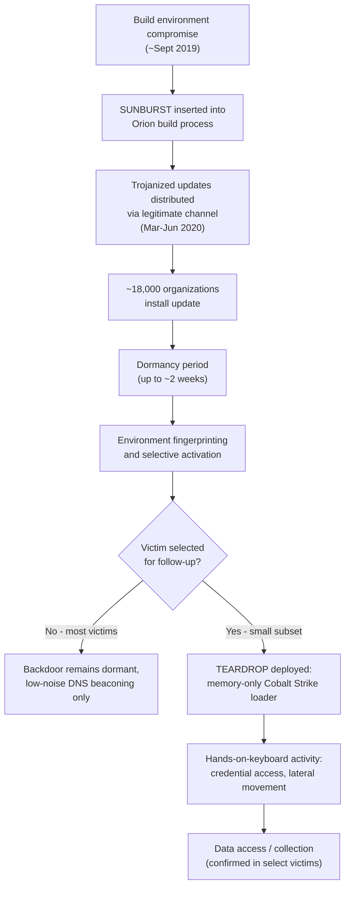
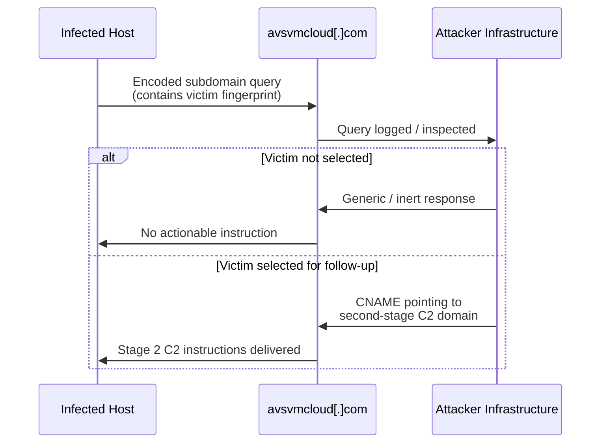

# Case Study: Hunting the SolarWinds Supply Chain Attack

---

## 1. Introduction

Every case study in this phase exists to do one thing: take everything you've built across nine phases — methodology, ATT&CK fluency, tooling, detection engineering, purple teaming — and pressure-test it against an intrusion that actually happened, against a real organization's real defenses, executed by an actor that was very good at their job.

SolarWinds is the right one to start with, because it breaks a comforting assumption almost every defender carries without examining it: *if I trust my software vendor, the software itself is safe.*

In December 2020, FireEye (now part of Mandiant) discovered that its own systems had been compromised — and in investigating that compromise, uncovered something far larger. A threat actor, later attributed by the US government to Russia's SVR foreign intelligence service and tracked under names including APT29, Nobelium, and Midnight Blizzard, had compromised the build pipeline of SolarWinds, a company that makes IT infrastructure management software used by tens of thousands of organizations, including a large share of the Fortune 500 and multiple US federal agencies.

The attacker didn't breach each victim individually. They breached one company — SolarWinds — and used that single point of compromise to gain a foothold inside thousands of downstream networks simultaneously, because every one of those networks had legitimately installed a SolarWinds Orion software update. That update, signed with SolarWinds' own legitimate code-signing certificate, contained a backdoor. Roughly 18,000 organizations downloaded it. The attacker then hand-selected a much smaller number of high-value targets from that pool for deeper, hands-on-keyboard exploitation.

This is what makes SolarWinds the canonical supply chain attack case study, and why it sits here in Phase 10 rather than earlier: it requires everything. ATT&CK mapping across nearly every tactic. Detection engineering against an adversary who specifically studied and evaded EDR and incident response tooling. Network egress hunting, because much of the most reliable evidence wasn't on disk — it was in DNS and outbound traffic patterns. And program-level thinking, because no single hunt query "catches SolarWinds." Catching something like this requires a hunting program mature enough to ask the right uncomfortable questions about your own supply chain in the first place.

You already know, from Lesson 37, how to think about supply chain compromise and trusted relationship abuse as ATT&CK techniques. You already know, from Lesson 51 and 52, how to hunt command-and-control traffic, including the DNS-based techniques this actor relied on heavily. You already know, from Phase 9, how to convert hunt findings into durable detections. This lesson is where those threads get pulled together against the most consequential supply chain intrusion in the industry's recent history.

---

## 2. Learning Objectives

After completing this lesson, you should be able to:

- Reconstruct the SolarWinds/SUNBURST attack chain from initial compromise through to hands-on-keyboard follow-on activity
- Explain why this intrusion was specifically engineered to evade both automated detection and human incident responders
- Apply network egress hunting techniques to identify SUNBURST-style staged, low-and-slow command-and-control behavior
- Differentiate the detection opportunities presented by SUNBURST versus the follow-on TEARDROP memory-only loader
- Map the attack chain to MITRE ATT&CK tactics and techniques across initial access, execution, defense evasion, and command and control
- Build hunt queries and Sigma-style detections targeting the specific behavioral patterns this campaign exhibited
- Produce a reusable SolarWinds-style supply chain hunt playbook applicable to future trusted-vendor compromises

---

## 3. Prerequisites

This lesson assumes working familiarity with: supply chain and trusted relationship techniques (Lesson 37), command-and-control hunting and DNS-based covert channels (Lessons 51–52, 85), Sigma rule construction (Lesson 69), and the hunt-to-detect pipeline (Lesson 113). Where this lesson depends on a specific concept from those lessons, it will briefly restate the relevant point rather than fully re-teaching it.

---

## 4. Core Concepts

### 4.1 What a Software Supply Chain Compromise Actually Is

**Definition.** A software supply chain compromise occurs when an attacker inserts malicious functionality into legitimate software during its development, build, or distribution process, so that the malicious code reaches victims through a channel they already trust — typically a vendor's own update mechanism, signed with the vendor's own legitimate code-signing certificate.

**Purpose, from the attacker's side.** Supply chain compromise solves a specific, hard problem for a sophisticated actor: gaining initial access at scale against well-defended targets without needing to breach each one individually. A target organization with excellent perimeter security, strong patching discipline, and a security-aware workforce is still going to install a signed update from a vendor it has a contractual relationship with. That update arrives through a channel specifically designed to be trusted and largely unscrutinized.

**Why it exists as an attack category.** Modern enterprises depend on dozens or hundreds of third-party software components, each representing a potential point of compromise that the victim organization does not control and often cannot fully audit. The attacker's insight is that compromising the *weakest* link in that dependency chain — which is rarely the final victim — yields access to every organization downstream of that link simultaneously.

**Benefits to the attacker.** Massive scale from a single point of compromise. Inherited trust — the malicious code runs with whatever privileges and trust level the legitimate software already had. Reduced need for spear-phishing or exploit development against each individual target, since the delivery mechanism is already solved by the legitimate vendor relationship.

**Limitations and risks to the attacker.** Supply chain compromise requires sustained, patient access to the vendor's build environment — itself a difficult, risky operation requiring real tradecraft. It also creates enormous blast radius once discovered: a single forensic discovery at any one victim can expose the entire campaign across every downstream organization, which is precisely what happened here. FireEye's discovery of its own compromise led directly to the unraveling of the global Orion campaign.

**Real-world significance.** SolarWinds fundamentally changed how mature organizations think about vendor risk, software bill of materials (SBOM) requirements, and build-pipeline integrity. It's a direct ancestor of the increased industry focus on supply chain security frameworks that followed in subsequent years.

**Common misconception.** People sometimes assume supply chain attacks require the attacker to write a fully malicious application from scratch. In SolarWinds' case, the attacker instead inserted a backdoor into an otherwise completely legitimate, functioning piece of software — Orion continued working normally for users, which is precisely what made the compromise so hard to notice operationally.

**Common mistake.** Treating supply chain risk purely as a vendor due-diligence checkbox exercise (reviewing a vendor's SOC 2 report once a year) rather than as an ongoing detection and hunting problem. Due diligence reduces the *probability* a vendor gets compromised; it does nothing to help you detect it if one does anyway — which is exactly the gap hunting exists to close.

**Best practice.** Build hunt hypotheses that specifically assume your trusted software is the threat vector, not just your unpatched systems or your phished users. Lesson 37's exercise on simulating a malicious update execution chain is directly preparing you for exactly this kind of scenario.

---

### 4.2 SUNBURST: The Backdoor Itself

**Definition.** SUNBURST (also tracked as Solorigate by Microsoft) was the malicious backdoor inserted into specific versions of the SolarWinds Orion software DLL (`SolarWinds.Orion.Core.BusinessLayer.dll`), digitally signed with a legitimate SolarWinds certificate, and distributed to customers through Orion's normal software update mechanism between roughly March and June 2020.

**Purpose.** SUNBURST's job was narrow and disciplined: establish a foothold, communicate with attacker-controlled infrastructure, and — critically — decide, based on a set of checks, whether the specific victim environment was interesting enough to warrant further attacker attention. It was not designed to act aggressively against every one of the roughly 18,000 organizations that received it.

**Why it was built this way.** A backdoor present on 18,000 networks simultaneously is an enormous detection risk if it behaves identically and loudly everywhere. The attacker mitigated this by making SUNBURST extremely patient and selective, which you'll see reflected directly in its technical behavior below.

**How it worked, mechanically.** Once the compromised DLL loaded as part of normal Orion operation, SUNBURST waited — a dormancy period of up to roughly two weeks before first attempting any command-and-control communication. This alone defeated a huge amount of standard incident response practice, where investigators often focus scrutiny on the period immediately following a known software installation.

When it did activate, SUNBURST performed environment checks before doing anything further — checking for the presence of specific security and forensic tools, antivirus products, and certain domain characteristics, deliberately designed to identify and avoid sandboxes, malware analysis environments, and (most concerning for defenders) certain high-security target environments where the attacker wanted to proceed only with extreme caution.

Its command-and-control channel used DNS, but not in the noisy, high-volume way many DGA-based malware families do. SUNBURST generated subdomains using an algorithm that encoded reconnaissance information about the victim (a unique identifier derived from characteristics of the host) into the DNS query itself, then queried `avsvmcloud[.]com` and related attacker-controlled domains. The DNS responses, when the attacker chose to respond meaningfully rather than with an innocuous default, contained CNAME records pointing to one of a small number of second-stage C2 domains — a deliberate filtering mechanism so that the loud, voluminous initial DNS beaconing across thousands of victims revealed almost nothing to an observer, while a tiny number of selected victims received instructions for further compromise.

**Benefits of this design, to the attacker.** Extremely low operational noise across the vast majority of infected organizations, who effectively received an inert backdoor that never escalated. Strong evasion of automated sandbox analysis. A built-in triage mechanism letting the attacker focus hands-on effort only on the small number of genuinely high-value targets, without having to manually inspect all 18,000 infections.

**Limitations, from a hunting perspective.** This same design created a specific, durable hunting opportunity: DNS queries to attacker infrastructure occurred *regardless* of whether a given victim was selected for further exploitation. Even organizations the attacker never touched beyond initial backdoor installation still generated detectable DNS traffic to `avsvmcloud[.]com` and related domains — which is exactly why network egress and DNS hunting (Section 4.4 below) became the most reliable detection method industry-wide, more reliable in many cases than endpoint-based detection of the DLL itself.

**Common misconception.** People sometimes describe SUNBURST as "the SolarWinds hack" as if it were the entire intrusion. SUNBURST was the initial access and dormant foothold mechanism. The actual damage, where it occurred, came from what the attacker did *after* SUNBURST called home and they decided a victim was worth pursuing — which is where TEARDROP and hands-on-keyboard activity enter the picture.

---

### 4.3 TEARDROP: The Follow-On Memory-Only Loader

**Definition.** TEARDROP was a custom memory-only dropper, deployed by the attacker on a subset of high-value victims after SUNBURST had established initial access and the attacker decided to proceed with deeper compromise. TEARDROP's job was to decode and load a Cobalt Strike Beacon payload directly into memory, without writing the final payload to disk in a recoverable form.

**Purpose.** Where SUNBURST optimized for patience and low noise across the entire infected population, TEARDROP optimized for something different: minimizing forensic artifacts on the specific systems where the attacker had decided to operate hands-on. Memory-only execution is significantly harder to recover and analyze after the fact than a payload that touches disk persistently.

**How it worked, mechanically.** TEARDROP was delivered as a DLL, masquerading with a filename designed to blend with legitimate system or security software. It read an encoded payload from a hardcoded offset within a seemingly innocuous file (in some observed cases, embedded data was hidden within what looked like a legitimate-format file to reduce suspicion if examined casually), decrypted it using a custom algorithm, and loaded the decoded Cobalt Strike Beacon shellcode directly into memory using process injection techniques, executing it without ever writing the unpacked beacon to disk.

**Benefits to the attacker.** Forensic recovery of memory-resident payloads requires live memory capture or specific endpoint telemetry capable of observing the injection itself — many organizations' standard disk-forensics-first incident response playbooks are far less effective against this kind of artifact. It also evades a large class of static, file-hash-based detection, since the actual malicious payload never exists on disk in its final executable form.

**Limitations, from a hunting perspective.** Memory-only execution still requires process injection to occur, and process injection — as you learned in Lessons 43 and 44 — leaves behavioral evidence: unusual parent-child process relationships, anomalous memory allocation patterns, and (where EDR telemetry is rich enough) specific API call sequences associated with injection techniques. TEARDROP wasn't invisible; it was specifically designed to defeat disk-based forensics, which means endpoint behavioral telemetry — not disk artifact recovery — was the more productive hunting lane against this specific tool.

**Common misconception.** People sometimes assume "memory-only" means "undetectable." It means "harder to recover after the fact through traditional disk forensics," not "behaviorally invisible while running." This distinction matters enormously for how you scope a hunt against this kind of tooling — you hunt for the *behavior* of injection and execution, not for a file that may never have existed on disk in a recoverable form.

---

### 4.4 Why Network Egress Hunting Was the Most Reliable Detection Path

**Definition, reinforced from Lesson 85.** Network egress hunting focuses on outbound traffic leaving your environment — DNS queries, HTTP/HTTPS connections, and other protocols — looking for patterns consistent with command-and-control communication, rather than relying solely on endpoint-based detection of the malicious files or processes themselves.

**Why it mattered specifically here.** SUNBURST's DNS-based C2 channel was, by design, present on every infected host that successfully phoned home — including the roughly 18,000 organizations the attacker never went on to exploit further. This made DNS query patterns a far more universal indicator across the entire victim population than any endpoint artifact, because endpoint behavior diverged sharply between "dormant SUNBURST only" victims and "selected for TEARDROP and hands-on exploitation" victims, while the underlying DNS beaconing pattern stayed comparatively consistent across both groups.

**The specific behavioral signature.** SUNBURST's DNS queries exhibited characteristics that distinguish them from normal application DNS traffic: queries to a small, specific set of domains (`avsvmcloud[.]com` and associated infrastructure later identified by FireEye, Microsoft, and other responders), generated by an algorithm rather than appearing in any legitimate application configuration, occurring at intervals consistent with the malware's internal sleep timer rather than user-driven application behavior, and originating specifically from processes associated with the Orion software rather than a web browser or standard application.

**Trade-offs.** Network egress hunting at this level requires either full DNS query logging (not just resolution results) or a network sensor capable of extracting DNS query data from traffic — a capability many organizations didn't have fully deployed at the time, and which Lesson 85 specifically taught you to build query patterns for. Organizations with only basic NetFlow (showing connections but not DNS query content) had a meaningfully harder time retroactively hunting for this specific campaign once IOCs were published, which is its own lesson about data source completeness (Lesson 6).

**Best practice, reinforced.** This case is a strong argument for why DNS logging specifically — not just general network flow — deserves dedicated retention and hunting attention as its own data source, a point this lesson treats as fully validated by real-world outcome rather than theoretical concern.

---

## 5. Deep Technical Explanation

### 5.1 Reconstructing the Full Attack Chain

It's worth walking the entire chain in sequence, because the way each stage specifically defeats a different category of defense is the real lesson here — not just "what happened," but "what specific defensive assumption did each stage exploit."

**Stage 1 — Build environment compromise.** The attacker gained access to SolarWinds' software build environment well before the malicious code shipped, with evidence suggesting access possibly as early as September 2019, and successfully inserted the SUNBURST backdoor into the Orion source build process by early 2020. This stage defeats the assumption that "if the vendor's released software is signed correctly, it's safe" — the signing process itself was operating on already-compromised source.

**Stage 2 — Trojanized update distribution.** Updates containing SUNBURST were distributed through SolarWinds' legitimate, expected update channel between March and June 2020, signed with a genuine SolarWinds digital certificate. This defeats code-signing as a trust signal in the specific case where the compromise occurs upstream of signing.

**Stage 3 — Dormancy.** SUNBURST waited up to approximately two weeks post-installation before any C2 activity, specifically defeating standard incident response practice of concentrating forensic attention on the period immediately surrounding a known software change.

**Stage 4 — Environment fingerprinting and selective activation.** SUNBURST checked for analysis tools, security products, and specific domain/host characteristics before proceeding, defeating both automated sandbox analysis and indiscriminately alerting on every infected host.

**Stage 5 — Low-and-slow DNS C2 with selective response.** As described in Section 4.2, this defeated naive volume-based or simple-blocklist DNS detection by keeping the vast majority of beaconing traffic functionally inert from the attacker's side, while still generating a durable, huntable pattern.

**Stage 6 — Selective hands-on-keyboard follow-up.** For organizations the attacker judged worth pursuing, they delivered TEARDROP and ultimately a Cobalt Strike Beacon, moving from automated backdoor behavior to genuine human-operated intrusion — at which point the attacker's behavior began to look like any other skilled, patient hands-on-keyboard operation, including credential harvesting, lateral movement, and (in some confirmed victim organizations) access to email systems and internal documents.

**Stage 7 — Defense evasion against incident response specifically.** Once operating hands-on, the actor displayed specific behaviors aimed at defeating *human* incident responders, not just automated tools — using infrastructure and naming conventions designed to blend with the target's own environment, carefully avoiding triggering behavioral alerts on tools known to be deployed in specific victim environments, and in at least one widely reported case (Microsoft's own internal investigation), modifying or disabling specific security tooling components rather than triggering an obvious wholesale removal that would itself be a strong alert.

### 5.2 Why This Specific Sequence Defeats Standard Defenses, Layer by Layer

Map this against the categories from Lesson 1 (Section 5.1 of that lesson, on why detection has a structural ceiling): SUNBURST itself is largely a category-one threat (genuinely novel, custom-built, never seen before its discovery) combined with category-three behavior in its later stages (abuse of legitimate, trusted update mechanisms and, once hands-on, legitimate admin tools). No signature existed for SUNBURST before its discovery, because nobody had seen it. No amount of well-tuned detection against *known* malware families was ever going to catch this — which is precisely the structural gap threat hunting exists to address, and precisely why this campaign was ultimately discovered through investigative hunting (FireEye's own internal incident response into their stolen Red Team tools) rather than any automated alert anywhere in the 18,000-organization victim population.

### 5.3 How the Attacker Thought, Stage by Stage

This actor displayed exceptionally disciplined operational security, consistent with a well-resourced, patient nation-state intelligence operation rather than a financially motivated actor. The dormancy period, the selective DNS response mechanism, and the careful avoidance of triggering wholesale, obvious defensive responses all point to an operator whose primary objective was sustained, undetected intelligence collection — not speed, not maximum immediate impact, and not financial gain. Every design decision in SUNBURST optimizes for "stay hidden as long as possible across the entire victim population," while every design decision in the post-selection hands-on activity optimizes for "stay hidden specifically against the defenses of this one valuable target."

### 5.4 How Hunters Eventually Found It

Worth being precise about this, because it's instructive: this campaign was not found by anyone hunting *for SolarWinds specifically*. FireEye discovered anomalous authentication activity related to their own internal Red Team assessment tools being accessed in a way inconsistent with normal use — essentially, their own internal hunting and monitoring caught unauthorized access to their own crown-jewel tooling (exactly the kind of crown-jewel-focused environmental hunting hypothesis taught in Lesson 24). Investigating that specific anomaly led, through careful pivoting, to the discovery of the Orion backdoor as the initial access vector. This is a strong real-world validation of a principle from Lesson 1: a mature hunting program watching its own highest-value assets closely can surface a campaign far larger than anything the initial anomaly suggested, purely through disciplined pivoting from a single odd signal.

---

## 6. Real-World Examples

These illustrate how organizations across different sectors might apply SolarWinds-derived hunting hypotheses to their own environments — composites built for teaching purposes, not depictions of specific named victims of the real campaign.

**Arden Federal Services (Government contractor).** Runs SolarWinds Orion for network monitoring across a classified-adjacent environment. After SolarWinds IOCs are published, their hunt team doesn't just check for known file hashes — they retroactively query historical DNS logs (retained for 13 months under their compliance requirements) for any query pattern matching the published `avsvmcloud[.]com` domain structure, going back to the start of the vulnerable software version's deployment window, recognizing that hash-based IOC matching alone would miss any tool variant not yet publicly catalogued.

**Brightfield Health Systems (Healthcare).** Uses Orion for IT infrastructure monitoring across a hospital network. Their hunt hypothesis, built using the environment-driven framework from Lesson 24, specifically asks: "If any vendor software with elevated network and system privileges were compromised upstream, what would the resulting outbound traffic look like, given our actual DNS logging coverage?" — and discovers, in the process of testing this hypothesis even before any public SolarWinds disclosure, that their DNS logging retention is far too short to support this kind of retroactive hunt, prompting an immediate logging policy change independent of whether they were actually compromised.

**Veltrix Manufacturing (Manufacturing/OT-adjacent).** Doesn't run SolarWinds Orion, but their hunt team uses the case study as the basis for a broader hypothesis: which of their other third-party vendor software products have similarly elevated privileges and network reach, and would their current telemetry detect a similarly low-and-slow DNS-based C2 channel from any of them? This produces a vendor risk reassessment that has nothing to do with SolarWinds specifically but everything to do with applying the *pattern* of this case study proactively.

**Castellan Financial Group (Financial services).** A regulated financial institution that did run affected Orion versions. Their post-disclosure hunt focuses heavily on Stage 6 and 7 from Section 5.1 — given confirmed dormant SUNBURST presence, hunters specifically search historical EDR telemetry for process injection indicators (per Lesson 44's methodology) on hosts running Orion, recognizing that the presence of the dormant backdoor alone doesn't tell them whether they were among the small number of organizations selected for hands-on follow-up.

---

## 7. Diagrams

### 7.1 Full Attack Chain Timeline



### 7.2 SUNBURST DNS C2 Filtering Mechanism



### 7.3 ATT&CK Tactic Mapping Across the Campaign

```mermaid
flowchart LR
    RD["Resource Development<br/>TA0042<br/>Build C2 infrastructure"] --> IA
    IA["Initial Access<br/>TA0001<br/>T1195.002 Supply Chain Compromise"] --> EX
    EX["Execution<br/>TA0002<br/>Orion process loads malicious DLL"] --> PER
    PER["Persistence<br/>TA0003<br/>Backdoor survives via legitimate software"] --> DE
    DE["Defense Evasion<br/>TA0005<br/>T1027 Obfuscation, sandbox evasion,<br/>T1055 Process Injection - TEARDROP"] --> CA
    CA["Credential Access<br/>TA0006<br/>Hands-on credential harvesting"] --> DIS
    DIS["Discovery<br/>TA0007<br/>Environment fingerprinting"] --> LM
    LM["Lateral Movement<br/>TA0008<br/>Selected high-value targets only"] --> C2
    C2["Command and Control<br/>TA0011<br/>T1071.004 DNS, T1572 staged C2"] --> COL
    COL["Collection<br/>TA0009<br/>Confirmed in select victims"]
```



---

## 8. Tables

### 8.1 SUNBURST vs. TEARDROP Comparison

| Dimension | SUNBURST | TEARDROP |
|---|---|---|
| Delivery | Trojanized Orion DLL via legitimate update | Deployed manually after victim selection |
| Scope | All ~18,000 installations | Small, hand-selected subset |
| Persistence model | Resides within legitimate software | Memory-only, no persistent disk artifact for final payload |
| Primary objective | Patient foothold, selective triage | Load Cobalt Strike Beacon for hands-on operations |
| Detection-resistant design | Dormancy, sandbox/AV checks, selective DNS response | Disk-forensics evasion via memory-only execution |
| Most reliable hunting lane | Network/DNS egress hunting | Endpoint process injection behavior |

### 8.2 ATT&CK Technique Mapping

| Tactic | Technique | ID | Relevance to this case |
|---|---|---|---|
| Resource Development | Acquire Infrastructure | T1583 | Attacker-controlled C2 domains, including `avsvmcloud[.]com` |
| Initial Access | Supply Chain Compromise | T1195.002 | Core mechanism — compromised software dependency |
| Execution | Compromised software dependency loaded | T1195 (related) | Malicious DLL executes as part of normal Orion operation |
| Defense Evasion | Indicator Removal / Obfuscation | T1027, T1070 | Encoded payloads, sandbox/AV-aware activation logic |
| Defense Evasion | Process Injection | T1055 | TEARDROP loading Cobalt Strike Beacon into memory |
| Discovery | System Information Discovery | T1082 | Environment fingerprinting before activation |
| Command and Control | Application Layer Protocol: DNS | T1071.004 | SUNBURST's primary C2 channel |
| Command and Control | Multi-Stage Channels | T1104 (related concept) | Selective CNAME-based second-stage delivery |

### 8.3 Detection Opportunity by Data Source

| Data Source | What It Could Reveal | Limitation |
|---|---|---|
| DNS query logs | Queries to `avsvmcloud[.]com` and related domains | Requires full query logging, not just resolution summaries |
| EDR process telemetry | Process injection behavior from TEARDROP-style loaders | Only relevant for the small subset of hands-on-keyboard victims |
| Code-signing / software inventory | Presence of affected Orion versions and DLL hashes | Only useful retroactively, once specific hashes are published |
| Network flow (NetFlow only, no DNS content) | General outbound connection volume/destination | Insufficient alone to distinguish this specific DNS-based C2 pattern |
| Authentication logs | Anomalous access to sensitive internal tools (as in FireEye's discovery) | Requires strong baseline of "normal" access to crown-jewel systems |

---

## 9. Threat Hunter Perspective

**How the attacker thought.** Patience as a deliberate operational choice, not a constraint. Every stage of this campaign reflects an actor willing to accept a multi-month timeline in exchange for minimizing detection risk across an enormous victim population, and willing to forgo immediate exploitation of the vast majority of victims in favor of careful, selective targeting of the few that mattered most to their actual intelligence objectives.

**How hunters think, applied here.** The most productive hunting hypothesis against a campaign like this isn't "does this specific file hash exist on our systems" — that's reactive IOC matching, useful only after public disclosure. The more durable hypothesis, buildable *before* any public disclosure, is structural: "if a trusted vendor with elevated privileges in our environment were compromised, what behavioral evidence would that produce, and do we currently have the visibility to find it?" That's an environment-driven hypothesis in the Lesson 24 sense, built from understanding which vendors hold privileged access in your specific environment, not from any external intelligence trigger.

**What evidence the attacker created despite extreme care.** Even this disciplined an actor couldn't avoid generating DNS queries from every successfully infected host — the fundamental requirement of C2 communication. They couldn't avoid the process injection behavior inherent to loading Cobalt Strike into memory. They couldn't avoid unusual authentication patterns when accessing crown-jewel systems at FireEye specifically. The lesson here, stated plainly: there is no level of attacker sophistication that eliminates the need to interact with systems in ways that differ, even subtly, from normal — sophistication shifts *where* that evidence appears and *how subtle* it is, not whether it exists at all.

**How defenders discovered it.** Not through any SolarWinds-specific detection — none existed — but through disciplined, crown-jewel-focused monitoring catching an anomaly unrelated on its surface to SolarWinds at all, followed by patient, methodical pivoting. This is the single most important takeaway for your own hunting practice: the next campaign of this scale and sophistication targeting your organization will also not be caught by a signature built for *this* one. It will be caught, if at all, by the same disciplined process — strong environmental knowledge, careful baseline development, and a willingness to pivot hard on small anomalies — applied to whatever your own crown jewels happen to be.

---

## 10. Detection Opportunities

**DNS query logs.** The single highest-value data source for this specific campaign, as established throughout this lesson. Full query logging (not just NetFlow-level connection summaries) is required to retroactively or proactively hunt for SUNBURST-style algorithmically-generated subdomain patterns.

**EDR process telemetry, specifically process injection indicators.** Per Lesson 44's methodology, hunting for anomalous memory allocation, unusual parent-child process relationships, and injection-consistent API call sequences is the most productive endpoint lane against TEARDROP-style loaders, since the final payload may never exist on disk in recoverable form.

**Code-signing certificate and software inventory data.** Useful specifically for retroactive hunting once IOCs are public — knowing which systems run which exact versions of third-party software with elevated privileges is foundational, and ties directly back to the data source inventory exercise from Lesson 6.

**Authentication and access logs for crown-jewel internal systems.** As FireEye's own discovery demonstrated, monitoring access to your *own* most sensitive internal tools and data — independent of any specific external campaign — is one of the most durable hunting investments available, because it doesn't depend on knowing what campaign to look for in advance.

**Windows Event Logs and Sysmon, for the hands-on-keyboard phase specifically.** Once an actor moves from dormant backdoor to active operation, standard endpoint hunting techniques from Phase 6 (process tree analysis, LOLBAS detection, credential access hunting) become directly applicable, because at that stage the actor's behavior converges with other hands-on-keyboard intrusion patterns you've already studied.

**Blind spots, named honestly.** Organizations without DNS query-level logging had a substantially harder time conducting any meaningful retroactive hunt for this specific campaign. Organizations without sufficient endpoint telemetry retention covering the multi-month window between initial compromise and public disclosure (December 2020) often could not definitively rule out hands-on-keyboard follow-up activity even after confirming dormant SUNBURST presence — a sobering illustration of why log retention policy (a recurring theme since Lesson 6) has real, sometimes irreversible consequences.

---

## 11. Threat Intelligence Perspective

This campaign produced an unusually rich and well-documented set of public intelligence, largely because of the scale of the response involved (FireEye, Microsoft, CrowdStrike, CISA, and many others published detailed technical analysis).

**IOCs** published in the aftermath included specific file hashes for the trojanized Orion DLLs, the `avsvmcloud[.]com` domain and related second-stage infrastructure, and specific TEARDROP sample hashes. As emphasized throughout this course, these are the most fragile, most quickly outdated form of intelligence from this campaign — useful for an immediate retroactive check, of little durable value against this actor's future operations.

**IOAs** from this campaign — the DNS query generation algorithm's behavioral pattern, the dormancy-then-selective-activation behavior, the memory-only loading technique — are considerably more durable, and several of the hunt queries built in Section 12 below are designed around these behavioral patterns rather than the specific published hashes.

**TTPs**, mapped in Section 8.2 above to MITRE ATT&CK, represent the most durable layer, and are exactly what you should expect this actor (and others learning from this campaign's success) to continue reusing in some form across future operations, even as specific tools and infrastructure inevitably change.

**Campaign intelligence and attribution.** US government agencies, including CISA and the FBI, along with the broader intelligence community, formally attributed this campaign to Russia's SVR, with the actor tracked under several names depending on vendor (APT29, Nobelium, Midnight Blizzard, and others). This attribution matters for hunting purposes specifically because it lets you connect this campaign's TTPs to the actor's broader, ongoing body of activity studied elsewhere in this course (Lesson 12 covered APT29 campaign analysis specifically) rather than treating SolarWinds as an isolated event.

---

## 12. Practical Exercise

**Scenario.** Your organization (pick an industry from Section 6, or use your own) runs third-party infrastructure monitoring software with elevated network and system privileges — structurally similar in privilege level to SolarWinds Orion, regardless of which specific vendor you choose to imagine. Leadership, having read about this case study, asks your hunt team a direct question: *"Could something like this happen to us, and would we know?"*

**Objective.** Build and document a SolarWinds-pattern hunt hypothesis and execute it conceptually (or technically, in your lab, if you choose to simulate the relevant traffic patterns) against your own environment's actual telemetry.

**Tasks.**

1. Identify which third-party software products in your environment hold privileges comparable to Orion's (broad network visibility, elevated system access, or both).
2. For your highest-privilege candidate, assess your actual DNS query logging coverage: do you retain full query content, or only resolution summaries / NetFlow-level data? For how long?
3. Build a hunt query (using whatever platform you have access to — Splunk, Elastic, Sentinel, or even a simple log-parsing script) that would flag DNS queries exhibiting algorithmically-generated subdomain characteristics (high entropy, inconsistent with any known legitimate application configuration, originating specifically from the privileged software's process).
4. If you have lab access, simulate a simplified version of SUNBURST's behavior: generate a DNS query with an encoded, high-entropy subdomain from a process you've labeled as your "privileged monitoring tool," and confirm your query from step 3 actually catches it.
5. Separately, build a hunt hypothesis for the TEARDROP-style follow-on stage: what would you look for in EDR telemetry if that same privileged software's process suddenly exhibited process injection behavior?
6. Write a two-to-three sentence honest answer to leadership's question, grounded in what steps 1 through 5 actually revealed about your current visibility.

**Expected observations.** Most learners doing this exercise honestly discover meaningful gaps — either in DNS logging depth, in retention duration, or in the absence of any existing baseline for "normal" behavior from their privileged third-party tools, making true anomalies hard to distinguish without first doing real baseline work.

**Hints.** If you're unsure how to characterize "algorithmically-generated subdomain," recall that legitimate applications typically use a small, stable, human-readable set of domains defined in configuration — not constantly varying, high-entropy strings. Entropy calculation (treated more fully in Lesson 85's DGA detection content) is a reasonable starting technique if you want to go quantitative rather than purely pattern-based.

**Success criteria.** A strong response identifies specific, real (or realistically fictional) software in your environment, honestly assesses your actual logging depth rather than assuming coverage exists, and produces a working or at least technically sound query — not just a description of what a query should theoretically do.

---

## 13. Hands-on Lab

**Scenario.** You'll simulate a simplified SUNBURST-style DNS C2 pattern and a simplified TEARDROP-style process injection pattern in your lab, then build and validate detections for each.

**Environment.** Your Lesson 5 lab environment: a Windows 10 or Windows Server VM with Sysmon configured (per Lesson 5 and 56-58), ingesting into either Elastic or Splunk (per your Phase 5 setup), plus DNS query logging enabled at the host or lab network level.

**Required tools.** PowerShell (for simulating the DNS query pattern), Sysmon, your SIEM/platform of choice, and optionally a simple Python script for generating high-entropy subdomain strings to mimic SUNBURST's encoding behavior.

**Lab steps.**

1. **Simulate SUNBURST-style DNS beaconing.** Write a short PowerShell or Python script that generates a series of DNS queries to a lab-controlled or non-resolving test domain, using subdomains built from encoded, semi-random strings (simulating the victim-fingerprint encoding SUNBURST used) rather than static, human-readable subdomains. Space these queries out over several minutes rather than firing them rapidly, to simulate low-and-slow behavior. Run this from a process you've deliberately named or tagged to represent your "privileged monitoring software" stand-in.

2. **Capture and inspect the DNS logs.** Confirm your DNS logging captures full query strings, not just resolution outcomes. If it doesn't, this step itself is a valid and important lab finding — document it.

3. **Build a detection query.** In your SIEM, write a query that flags DNS queries with high subdomain entropy or length, originating from your tagged "privileged monitoring software" process, occurring at irregular but sustained intervals (rather than the single-query-then-done pattern of legitimate lookups). A starting KQL sketch for Sentinel/Defender-style environments:

```kql
DnsEvents
| where TimeGenerated > ago(1d)
| extend SubdomainLength = strlen(split(Name, ".")[0])
| where SubdomainLength > 20
| where Name has "yourtestdomain.example"
| summarize QueryCount = count(), FirstSeen = min(TimeGenerated), LastSeen = max(TimeGenerated)
    by ClientIP, Name
| where QueryCount > 1
```

Each part of this query is doing something deliberate: filtering to a recent window, extracting and measuring subdomain length as a crude entropy proxy (real entropy calculation is more rigorous, but length is a reasonable lab-friendly starting filter), and grouping by client and domain to spot the sustained-but-spaced pattern rather than a single innocuous lookup.

4. **Simulate a simplified TEARDROP-style injection.** Using a benign, lab-safe process injection technique (many security training labs use a simple self-injection PowerShell or C# proof-of-concept for this purpose — choose a method appropriate to your lab's safety constraints and your own organization's policies on running such tools), trigger a Sysmon Event ID 8 (CreateRemoteThread) or Event ID 10 (ProcessAccess) from your "privileged monitoring software" stand-in process into another benign process.

5. **Build a detection query for the injection behavior**, using the Sigma pattern style from Lesson 44, adapted here:

```yaml
title: Suspicious Process Injection from Monitoring Software Process
id: example-solarwinds-lab-001
status: test
description: Detects anomalous process injection originating from a process
  expected to be a passive monitoring tool, consistent with TEARDROP-style
  memory-only loader behavior
logsource:
  category: create_remote_thread
  product: windows
detection:
  selection:
    SourceImage|endswith: '\yourmonitoringtool.exe'
    TargetImage|endswith:
      - '\explorer.exe'
      - '\svchost.exe'
  condition: selection
falsepositives:
  - Legitimate monitoring software performing expected diagnostic injection (baseline per vendor)
level: high
```

**Expected results.** Your DNS query in step 3 should flag the simulated beaconing pattern from step 1. Your Sigma-style detection in step 5 should flag the simulated injection from step 4. If either fails to fire, debug by checking whether your logging captured the expected fields at all before assuming the detection logic itself is wrong.

**Validation.** Re-run both simulations a second time after building the detections, confirming consistent triggering, and then run a brief negative test — normal DNS activity and normal (non-injecting) process behavior from the same tagged process — to confirm you haven't built something so broad it flags everything from that process indiscriminately.

**Cleanup.** Remove your test scripts, clear any test DNS records if you control a real test domain, and document both working queries in your hunt playbook deliverable below before tearing down or resetting any lab VM snapshot.

---

## 14. Deliverable: SolarWinds-Pattern Supply Chain Hunt Playbook

```
SOLARWINDS-PATTERN SUPPLY CHAIN HUNT PLAYBOOK
================================================

Organization: ____________________
Completed by: ____________________
Date: ____________________

------------------------------------------------
SECTION 1: SCOPE — PRIVILEGED THIRD-PARTY SOFTWARE INVENTORY
------------------------------------------------

Software/Vendor          | Network privilege | System privilege | DNS logging coverage (Y/N) | Retention period
--------------------------|--------------------|--------------------|------------------------------|------------------
                          |                    |                    |                              |
                          |                    |                    |                              |
                          |                    |                    |                              |

------------------------------------------------
SECTION 2: NETWORK EGRESS / DNS HUNT HYPOTHESIS
------------------------------------------------

Hypothesis:
"If [privileged software] were compromised upstream, it would generate 
DNS queries with [specific characteristics] at [specific interval pattern],
originating from [specific process], which our current logging 
[would / would not] capture."

Detection query (attach or reference):
____________________________________________________

Tested against simulated traffic? Y / N
Result: ____________________________________________________

------------------------------------------------
SECTION 3: ENDPOINT / PROCESS INJECTION HUNT HYPOTHESIS
------------------------------------------------

Hypothesis:
"If [privileged software] were used as a hands-on-keyboard foothold,
it would exhibit process injection behavior such as [specific 
Sysmon event types / API patterns], distinguishable from its normal,
expected behavior baseline."

Detection query (attach or reference):
____________________________________________________

Baseline of normal behavior established? Y / N
Tested against simulated injection? Y / N
Result: ____________________________________________________

------------------------------------------------
SECTION 4: CROWN-JEWEL ACCESS MONITORING CHECK
------------------------------------------------

(Modeled on FireEye's own discovery mechanism)

List your organization's 3-5 highest-value internal systems/tools:
1. ____________________________________________________
2. ____________________________________________________
3. ____________________________________________________

For each, is access specifically monitored and baselined 
independent of any known campaign?  Y / N / Partial

------------------------------------------------
SECTION 5: GAPS IDENTIFIED
------------------------------------------------

Gap #1: ____________________________________________________
Remediation owner: ____________________ Target date: __________

Gap #2: ____________________________________________________
Remediation owner: ____________________ Target date: __________

------------------------------------------------
SECTION 6: REVIEW CADENCE
------------------------------------------------

This playbook should be re-run whenever:
[ ] A new privileged third-party software product is onboarded
[ ] Major supply-chain-related public disclosures occur in your industry
[ ] At minimum, annually

Next scheduled review: ____________________
```

---

## 15. Knowledge Check

### Multiple Choice Questions

**1. What specifically made SolarWinds a supply chain attack rather than a direct intrusion against each victim?**
A) The attacker used phishing emails against every victim
B) The attacker compromised SolarWinds' build environment, embedding a backdoor in software legitimately distributed to all customers
C) The attacker exploited a public-facing web vulnerability at each victim
D) The attacker physically accessed each victim's data center

**Answer: B.** The defining characteristic is upstream compromise of the vendor's build process, with the malicious code reaching victims through their own legitimate, trusted update mechanism — not direct exploitation of each victim individually.

---

**2. Approximately how long did SUNBURST remain dormant before attempting command-and-control communication?**
A) A few seconds
B) Up to approximately two weeks
C) Exactly 24 hours
D) It never went dormant

**Answer: B.** This dormancy period was a deliberate design choice specifically intended to defeat incident response practices that concentrate scrutiny on the period immediately following a known software change.

---

**3. What was the primary purpose of SUNBURST's environment-fingerprinting checks before activation?**
A) To improve software performance
B) To avoid sandbox analysis environments and selectively decide which victims warranted further attention
C) To comply with SolarWinds' licensing terms
D) To update the software automatically

**Answer: B.** These checks served both evasion (avoiding analysis environments) and triage (deciding which of ~18,000 victims to pursue further) purposes.

---

**4. Why was DNS query-level logging specifically more valuable than basic NetFlow data for hunting this campaign?**
A) NetFlow doesn't capture network traffic at all
B) SUNBURST's C2 channel relied on DNS query content (encoded subdomains) that NetFlow-level summaries don't capture
C) DNS logging is cheaper to store than NetFlow
D) NetFlow only works on Linux systems

**Answer: B.** The actual malicious signal was encoded in the DNS query string itself, which requires full query logging to observe — connection-level NetFlow summaries wouldn't reveal this.

---

**5. What distinguishes TEARDROP's evasion strategy from SUNBURST's?**
A) TEARDROP avoided detection by never running at all
B) TEARDROP focused on evading disk-based forensic recovery through memory-only execution, while SUNBURST focused on patience and selective DNS-based triage
C) TEARDROP and SUNBURST used identical evasion techniques
D) TEARDROP only ran on Linux systems

**Answer: B.** SUNBURST's evasion strategy centers on dormancy and selective activation across a huge population; TEARDROP's centers on minimizing recoverable disk artifacts for the small subset of hands-on-keyboard victims.

---

**6. "Memory-only execution" specifically defeats which type of investigative approach most directly?**
A) Behavioral, telemetry-based hunting
B) Traditional disk-forensics-first investigation that depends on recovering files from storage
C) Network traffic analysis
D) User interviews

**Answer: B.** Memory-only payloads leave no persistent, recoverable file on disk, which specifically undermines disk-forensics-centric investigation — though it does not eliminate behavioral evidence visible through endpoint telemetry.

---

**7. How was this campaign actually first discovered?**
A) A SolarWinds customer's antivirus flagged the Orion DLL directly
B) FireEye investigated anomalous access to its own internal Red Team tools, and pivoting from that anomaly led to the discovery
C) SolarWinds self-reported the compromise immediately after it began
D) A government audit specifically targeting SolarWinds found it

**Answer: B.** The discovery began with FireEye's own internal investigation into unauthorized access to their proprietary tools — an example of crown-jewel-focused monitoring leading to a much larger discovery through careful pivoting.

---

**8. Which MITRE ATT&CK technique most directly corresponds to the core initial access mechanism in this campaign?**
A) T1566 Phishing
B) T1195.002 Supply Chain Compromise
C) T1190 Exploit Public-Facing Application
D) T1078 Valid Accounts

**Answer: B.** T1195.002 specifically covers compromise of software supply chains, which is the exact mechanism used here — not phishing, exploitation of a public-facing app, or valid account abuse.

---

**9. Why is file-hash-based IOC matching considered a weak long-term defense against campaigns like this?**
A) File hashes never work technically
B) Hashes are trivially changed by recompiling or modifying a tool, making this intelligence fragile and only useful retroactively after public disclosure
C) File hashes are illegal to use for detection
D) Hash-based detection requires special government authorization

**Answer: B.** Hash-based matching is the most fragile, least durable layer of threat intelligence, useful mainly for retroactive confirmation once specific samples are publicly known — not for proactively catching novel variants or future operations by the same actor.

---

**10. What does the attribution of this campaign to a nation-state intelligence service (per US government findings) suggest about the actor's likely primary objective?**
A) Immediate financial gain through ransomware
B) Sustained, undetected intelligence collection rather than speed or financial extraction
C) Public disruption and embarrassment of the victim
D) Selling stolen data on criminal marketplaces

**Answer: B.** The patient, low-noise, highly selective design across this entire campaign is consistent with an intelligence-collection objective prioritizing long-term undetected access over speed or financial motives.

---

**11. Why didn't the vast majority of the ~18,000 organizations that installed the trojanized update experience hands-on-keyboard exploitation?**
A) SUNBURST only worked on a small number of operating systems
B) The attacker used selective DNS-based triage to choose only high-value targets for further exploitation
C) Most organizations immediately uninstalled the update
D) SolarWinds blocked the backdoor before it activated

**Answer: B.** The selective CNAME-based response mechanism described in this lesson allowed the attacker to filter, at scale, which victims received further instructions, leaving most infections functionally dormant.

---

**12. What is the most durable category of threat intelligence derived from this campaign, according to this lesson's framework?**
A) Specific file hashes
B) The TTPs — the underlying behavioral patterns and techniques mapped to ATT&CK
C) The specific domain names used for C2
D) The exact dates of the campaign

**Answer: B.** TTPs persist across operations and tool changes, while hashes, specific domains, and exact dates are all far more fragile and tied to this one specific campaign instance.

---

**13. Why is "if a trusted vendor were compromised, what would the resulting behavior look like" a more durable hunt hypothesis than "does this specific published hash exist in our environment"?**
A) It's faster to write as a query
B) It's buildable and testable before any public disclosure, rather than depending entirely on after-the-fact published IOCs
C) It requires no log data at all
D) It only works for SolarWinds specifically

**Answer: B.** A behavior-based hypothesis can be developed proactively, using environmental knowledge about your own privileged vendor software, rather than waiting for a specific campaign's IOCs to become public.

---

**14. What specific limitation did organizations without DNS query-level logging face when this campaign became public?**
A) They were immune to the campaign
B) They had substantially reduced ability to retroactively hunt for the specific DNS-based C2 pattern, since NetFlow-level summaries don't capture query content
C) They could still fully reconstruct the attack using firewall logs alone
D) This limitation had no real impact on investigation capability

**Answer: B.** As established throughout this lesson, full DNS query content was the most reliable signal for this campaign, and organizations lacking that depth of logging faced real, sometimes irreversible gaps in their ability to investigate.

---

**15. What is the primary lesson for future hunting practice illustrated by FireEye's discovery method in this case?**
A) Only large incident response firms can ever discover sophisticated campaigns
B) Disciplined, crown-jewel-focused monitoring, combined with careful pivoting on small anomalies, can surface campaigns far larger than the initial anomaly suggests
C) SolarWinds-specific detection rules are now sufficient for all future supply chain threats
D) Discovery of sophisticated campaigns is essentially random luck

**Answer: B.** This is the lesson's central takeaway regarding discovery methodology — strong environmental knowledge and disciplined pivoting from a single odd signal is a repeatable, durable hunting practice, not a one-time fluke specific to this campaign.

---

### Scenario-Based Questions

**16.** Your organization confirms, after public disclosure, that you ran an affected Orion version during the vulnerable window, but you have no DNS query-level logs from that period — only basic firewall connection logs. Using this lesson's concepts, what can and can't you conclude about whether you were exploited beyond the dormant backdoor stage?

**Answer guidance:** Without DNS query-level data, you likely cannot confirm or rule out the initial SUNBURST beaconing behavior definitively from network telemetry alone. You would need to pivot to other available evidence — EDR process telemetry (if retained for the relevant period) looking for TEARDROP-style injection indicators, software inventory confirming the exact affected DLL version and installation dates, and crown-jewel access logs for anomalous authentication during the relevant window. The honest conclusion is significant investigative uncertainty, not a clean "we were fine" — which is itself an important, if uncomfortable, finding to report to leadership.

---

**17.** A colleague argues that since your organization doesn't use SolarWinds Orion, this case study has no practical relevance to your hunting program. How would you respond, using the concepts from Sections 4.1 and 11 of this lesson?

**Answer guidance:** The specific vendor (SolarWinds) and specific tool (SUNBURST) are the least durable, least transferable elements of this case study. What transfers is the pattern: any third-party software holding elevated network or system privileges represents a potential supply chain attack vector, and the behavioral hunting techniques (DNS egress analysis, process injection detection, crown-jewel access monitoring) apply regardless of which specific vendor might someday be compromised. The right response builds a hypothesis around your own actual privileged vendor software, not around SolarWinds specifically.

---

**18.** Your hunt team builds a detection rule that flags any DNS query longer than 20 characters in the subdomain portion, intending to catch SUNBURST-style encoded queries. After deployment, it generates hundreds of alerts daily, almost entirely from legitimate CDN and cloud service traffic. What does this scenario illustrate about hunt query design, and how would you improve it?

**Answer guidance:** This illustrates the false-positive-tolerance trade-off discussed in Lesson 1 and reinforced here — a single crude heuristic (subdomain length alone) is insufficient and produces excessive noise because many legitimate services also use long, machine-generated subdomains (CDN edge nodes, cloud storage buckets, etc.). Improvement requires combining multiple signals: restricting to specific suspect domains or domain characteristics, correlating with the originating process (specifically the privileged software in question, not all traffic broadly), and ideally incorporating a more rigorous entropy calculation rather than length alone, as referenced in the lab section.

---

**19.** During your lab exercise, your simulated process injection detection (Section 13, step 5) fails to fire even though you successfully triggered the injection technique. Walk through how you'd troubleshoot this, using principles from this lesson and earlier Sysmon-focused lessons.

**Answer guidance:** First, confirm the underlying telemetry exists at all — check whether Sysmon actually logged the relevant Event ID (8 or 10) for the simulated injection, since a query can't be wrong if there's no data to query in the first place. If the raw event exists, check field-level details against your detection logic's exact match criteria (process image paths, for instance, are a common source of mismatch due to case sensitivity, path formatting, or unexpected process names). Only after confirming both telemetry presence and exact field matching should you consider the detection logic itself potentially flawed.

---

**20.** Leadership asks why your team is recommending investment in DNS query-level logging specifically, when general network firewall logs already show "what's talking to what." Using this case study, construct a concise, non-technical justification.

**Answer guidance:** A strong answer explains that firewall and connection-level logs show that a connection happened and roughly where, but not the specific content of a DNS query — and in this real-world campaign, the actual malicious signal was encoded entirely within that query content (the subdomain structure), invisible to anyone looking only at connection-level summaries. The investment isn't about general visibility, which already exists; it's about closing a specific, demonstrated blind spot that materially affected real organizations' ability to investigate this exact kind of campaign.

---

### True/False Questions

**21.** SUNBURST activated and began command-and-control communication immediately upon installation, with no dormancy period.
**Answer: False.** SUNBURST included a deliberate dormancy period of up to approximately two weeks before any C2 activity began.

**22.** TEARDROP's primary evasion strategy centered on avoiding disk-based forensic recovery through memory-only execution.
**Answer: True.** This is precisely the distinction drawn in Section 4.3 between TEARDROP's design goals and SUNBURST's.

**23.** Every one of the approximately 18,000 organizations that installed the trojanized Orion update experienced hands-on-keyboard exploitation by the attacker.
**Answer: False.** The attacker used selective DNS-based triage to pursue only a small subset of high-value targets for further exploitation; most installations remained functionally dormant.

**24.** File hash-based IOCs from this campaign represent the most durable, future-proof form of threat intelligence derived from it.
**Answer: False.** File hashes are the most fragile, easily-changed form of intelligence; TTPs and behavioral patterns are considerably more durable, as emphasized throughout this lesson.

**25.** This campaign was ultimately discovered through a SolarWinds-specific detection signature deployed by a security vendor.
**Answer: False.** It was discovered through FireEye's own internal investigation into anomalous access to their proprietary Red Team tools, with the broader campaign uncovered through subsequent pivoting — not through any pre-existing signature for this previously unknown campaign.

---

## 16. Key Takeaways

The deepest lesson SolarWinds offers isn't really about SUNBURST or TEARDROP as specific tools — those will age, get superseded, and eventually matter only as historical reference. It's about what happens when an attacker correctly identifies that the *channel* you trust most — your own vendor relationships, arriving through your own legitimate update process — can itself become the vector, and designs every stage of the operation specifically to exploit the assumptions that trust creates.

What made this campaign so effective wasn't some unbreakable, magical evasion technique. It was disciplined patience: dormancy that defeated standard incident response timing assumptions, selective activation that kept the vast majority of victims' systems looking inert, and memory-only execution that defeated disk-centric forensics for the victims who mattered most to the operation. Every one of those choices defeated a *specific* defensive assumption, not detection in some abstract, total sense — and every one of them still left behavioral evidence somewhere, for a hunter disciplined enough to know where to look and patient enough to keep pivoting on small anomalies rather than dismissing them.

The practical takeaway for your own program is concrete: build hunt hypotheses around your own privileged third-party software now, not after the next vendor compromise makes headlines. Invest in DNS query-level logging, because connection summaries alone would have missed this campaign's most reliable signal entirely. And watch your own crown-jewel systems closely enough that an anomaly there — however small it seems at first — gets the same careful pivoting that turned FireEye's internal investigation into the discovery of one of the largest intrusions in the industry's history.

---

