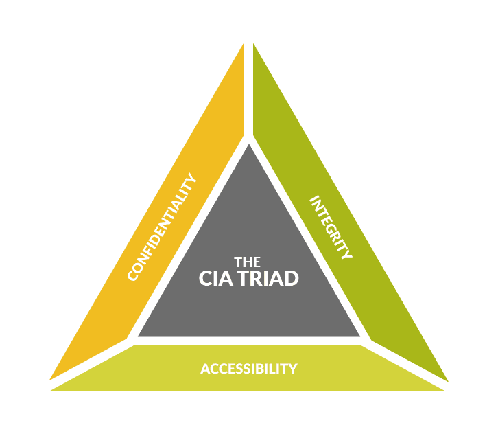

# Cybersecurity Fundamentals: The Foundation Every Threat Hunter Needs

[*Threat Hunting Foundations – Part 1*](Cybersecurity-Fundamentals-The-Foundation-Every-Threat-Hunter-Needs-part-1.md)    
[*Security Controls, Telemetry and Logs: Where Threat Hunting Begins - Part 3*](Cybersecurity-Fundamentals-The-Foundation-Every-Threat-Hunter-Needs-part-3.md)

In the first part of this article, we explored what cybersecurity is, who the common threat actors are, and the different types of cyber threats organizations face today.

Knowing these concepts is important, but Threat Hunting goes one step further.

A Threat Hunter doesn't simply ask **"What attack happened?"**

Instead, they ask:

* How did the attacker get here?
* What evidence did they leave behind?
* Which systems were affected?
* What was the attacker's objective?
* Could this still be happening?

The difference lies in **asking better questions**.

Every investigation starts with curiosity and follows a structured approach rather than assumptions.

---

## The 5W1H Investigation Methodology

One of the simplest yet most effective ways to approach any investigation is by using the **5W1H methodology**.

Rather than jumping directly into logs or searching randomly across a SIEM, Threat Hunters first build an understanding of the incident by asking six fundamental questions.

These questions help organize evidence and prevent investigators from overlooking important details.

---

**Who?**

The first question focuses on identity.

Who performed the activity?

Possible answers may include:

* A user account
* A service account
* An administrator
* An endpoint
* A server
* An external IP address

For example, imagine a PowerShell process is executed on a Domain Controller.

Before looking at the command itself, you would ask:

* Which user launched PowerShell?
* Was the account privileged?
* Was it an interactive logon or a scheduled task?
* Has this user executed PowerShell before?

Understanding **who** initiated an activity often provides valuable context.

---

**What?**

Once the identity is known, the next question becomes:

**What actually happened?**

Examples include:

* A suspicious process was created.
* A new service appeared.
* A scheduled task was added.
* A registry key was modified.
* A user logged in from an unfamiliar location.
* A large amount of data was transferred.

Threat Hunters focus on facts rather than assumptions.

Instead of saying,

> "This server is compromised."

They first establish exactly **what** occurred.

Evidence comes before conclusions.

---

**When?**

Time is one of the most overlooked aspects of an investigation.

The same activity may be completely normal during business hours but highly suspicious during the middle of the night.

Questions include:

* When was the activity first observed?
* Did multiple events occur within seconds?
* Has this behavior occurred before?
* Does it coincide with another alert?

Threat Hunters build timelines because attacks rarely consist of a single event.

Instead, attacks are sequences of related activities occurring over time.

---

**Where?**

Every attack leaves evidence somewhere.

Threat Hunters identify where the activity occurred.

Examples include:

* Endpoint
* Server
* Active Directory
* Firewall
* Cloud environment
* Email gateway
* Web application

Understanding the location helps determine which telemetry sources should be examined next.

---

**How?**

Perhaps the most important technical question.

How did the attacker achieve this?

Examples include:

* Phishing
* Credential Theft
* SQL Injection
* Exploiting a vulnerability
* PowerShell abuse
* Living-off-the-Land binaries
* Remote Desktop
* VPN compromise

Understanding the attack path allows defenders to identify weaknesses in security controls and improve future detections.

---

**Why?**

Finally, every investigation should attempt to understand intent.

Attackers rarely perform actions randomly.

Common objectives include:

* Stealing credentials
* Deploying ransomware
* Establishing persistence
* Exfiltrating data
* Escalating privileges
* Disabling security tools

When investigators understand **why**, the entire attack begins to make sense.

---

## Thinking Like an Investigator

One of the biggest differences between beginners and experienced Threat Hunters is their mindset.

Beginners often search for indicators.

Experienced hunters search for relationships.

Instead of asking,

> "Did I find malware?"

They ask,

* Why did Word launch PowerShell?
* Why is this administrator logging in at midnight?
* Why is a workstation communicating with an unfamiliar domain?
* Why was a new service installed immediately after a successful login?

Threat Hunting is less about finding obvious malicious files and more about identifying behaviors that don't belong.

---

## Cybersecurity Frameworks Every Threat Hunter Should Know

Cybersecurity frameworks provide structure.

Rather than investigating attacks randomly, they help analysts organize observations using a common language.

You don't need to master every framework immediately.

However, understanding what each framework contributes makes investigations significantly more effective.

---

## CIA Triad

The CIA Triad forms the foundation of information security.

It defines the three primary objectives organizations try to protect.

**Confidentiality**

Ensuring information is accessible only to authorized individuals.

Examples:

* Encryption
* Access Controls
* Multi-Factor Authentication

Threat Hunters investigate situations where confidentiality may have been violated through credential theft or unauthorized access.

---

**Integrity**

Protecting information from unauthorized modification.

Examples include:

* File integrity monitoring
* Digital signatures
* Checksums

Unexpected modifications to files, registry keys, or configurations often become valuable hunting opportunities.

---

**Availability**

Ensuring systems remain operational.

Examples include:

* Redundant infrastructure
* Backups
* Disaster Recovery
* High Availability

Denial-of-Service attacks directly target availability.

---

## MITRE ATT&CK Framework

If the CIA Triad explains **what we protect**, MITRE ATT&CK explains **how attackers behave**.

Instead of focusing on malware families, MITRE ATT&CK documents real-world attacker tactics and techniques.

Examples include:

* Initial Access
* Execution
* Persistence
* Privilege Escalation
* Defense Evasion
* Credential Access
* Discovery
* Lateral Movement
* Collection
* Exfiltration
* Impact

Threat Hunters frequently map observed behaviors to ATT&CK techniques.

This standardization allows investigators worldwide to describe attacks using a common language.

---

## Cyber Kill Chain

The Cyber Kill Chain explains the progression of an attack from beginning to end.

Although different attacks vary, many follow a similar sequence.

Typical stages include:

1. Reconnaissance
2. Weaponization
3. Delivery
4. Exploitation
5. Installation
6. Command and Control
7. Actions on Objectives

The value of the Kill Chain lies in identifying opportunities to interrupt attackers before they achieve their objective.

The earlier defenders detect malicious activity, the less damage attackers can cause.

---

## Diamond Model

The Diamond Model focuses on relationships rather than attack stages.

Every investigation attempts to connect four elements.

* Adversary
* Infrastructure
* Capability
* Victim

For example,

An attacker (Adversary)

uses a malicious domain (Infrastructure)

to deliver ransomware (Capability)

against a finance workstation (Victim).

Instead of viewing alerts independently, Threat Hunters connect these relationships to understand the complete intrusion.

---

## Pyramid of Pain

The Pyramid of Pain teaches one of the most valuable lessons in Threat Hunting.

Not every detection affects attackers equally.

Blocking a malicious IP address causes little inconvenience.

Blocking a file hash causes slightly more effort.

However, detecting attacker behavior forces adversaries to redesign their entire operation.

As defenders move higher up the pyramid, attackers experience significantly greater operational cost.

This is why behavioral hunting is considered far more resilient than relying solely on Indicators of Compromise (IOCs).

---

## NIST Cybersecurity Framework

While MITRE ATT&CK focuses on attacker behavior, the NIST Cybersecurity Framework focuses on managing organizational cybersecurity.

Its five core functions are:

* Identify
* Protect
* Detect
* Respond
* Recover

Threat Hunting primarily supports the **Detect** function but also contributes to Respond by providing investigative findings and recommendations for improving future security.

---

## How These Frameworks Work Together

Beginners often assume these frameworks compete with each other.

They don't.

Each framework answers a different question.

| Framework        | Primary Question                                 |
| ---------------- | ------------------------------------------------ |
| CIA Triad        | What are we protecting?                          |
| MITRE ATT&CK     | How do attackers behave?                         |
| Cyber Kill Chain | Where is the attacker in the attack lifecycle?   |
| Diamond Model    | Who attacked whom, using what capability?        |
| Pyramid of Pain  | Which detections hurt attackers the most?        |
| NIST CSF         | How should an organization manage cybersecurity? |

Together, they provide a complete understanding of modern cyber defense.

---

## Bringing Everything Together

At this point, you've learned:

* What cyber threats are.
* Who performs attacks.
* Common attack techniques.
* How investigators ask questions.
* Why frameworks exist.
* How each framework supports investigations.

Notice something interesting.

Not once have we opened Microsoft Sentinel.

Not once have we written a Sigma rule.

Not once have we queried Splunk.

Yet we've already built the mindset required for effective Threat Hunting.

Technology accelerates investigations.

Understanding accelerates defenders.

In the final part of this series, we'll complete the foundation by exploring **security controls**, **telemetry**, **Windows Event Logs**, **Sysmon**, **DNS logs**, **EDR telemetry**, and how Threat Hunters transform raw logs into meaningful evidence during real investigations.
