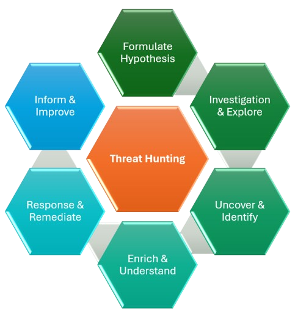

# Inside a Threat Hunt: Understanding the Threat Hunting Lifecycle

In the previous article, we explored how raw security telemetry is transformed into actionable intelligence through the **Threat Hunting Data Pipeline**.

By now, we know that Threat Hunting isn't about waiting for alerts. It's about asking questions, gathering evidence, and discovering threats that existing security controls may have overlooked.

That naturally raises another question.

> **Once a Threat Hunter has a hypothesis, what happens next?**

Unlike Incident Response, which usually follows a predefined workflow after an alert is generated, Threat Hunting is an investigative process. It requires curiosity, structured thinking, and the ability to adapt as new evidence emerges.

To keep investigations organized and repeatable, experienced Threat Hunters follow a lifecycle.

Rather than viewing Threat Hunting as a collection of ad hoc queries, think of it as a continuous cycle of learning, validating, improving, and strengthening an organization's security posture.

To understand this better, let's follow a real-world investigation from beginning to end.

---

## A Real-World Scenario

Imagine it's 8:30 on a Tuesday morning.

Your Threat Intelligence team publishes an advisory stating that attackers have recently started abusing Microsoft OAuth applications to maintain persistent access to Microsoft 365 environments.

Your organization also uses Microsoft 365.

No alerts have been generated.

No users have reported suspicious activity.

Nothing appears unusual on the SOC dashboard.

Most security teams would move on.

A Threat Hunter doesn't.

Instead, they ask one simple question.

> **"Could this already be happening inside our environment without us knowing?"**

That single question marks the beginning of every Threat Hunt.

---

---

## 1. Formulate a Hypothesis

Every successful Threat Hunt begins with a hypothesis.

Not a random guess.

An educated assumption based on evidence, intelligence, experience, or observed attacker behavior.

In our example, the Threat Intelligence advisory tells us that attackers are abusing OAuth applications.

That immediately creates a question.

> **Could attackers have registered or abused OAuth applications inside our Microsoft 365 tenant?**

That becomes our hypothesis.

Notice how different this is from randomly searching logs.

Instead of opening the SIEM and hoping to discover something suspicious, we're trying to answer a very specific question.

A strong hunting hypothesis should always be measurable.

For example:

- Have users recently granted consent to applications requesting excessive permissions?
- Have newly created OAuth applications requested administrator-level permissions?
- Are newly consented applications accessing mailboxes immediately after approval?
- Are users granting consent from unusual locations or devices?

Each of these questions can be validated using evidence.

Without a hypothesis, Threat Hunting quickly becomes an exercise in searching millions of events without a clear objective.

---

## 2. Investigate and Explore

Now that we have a hypothesis, the next challenge is determining where the evidence might exist.

One of the most common mistakes beginners make is immediately opening their SIEM and writing queries.

Experienced Threat Hunters pause first.

They identify the data sources most likely to answer their hypothesis.

For our OAuth investigation, useful sources may include:

- Microsoft Entra ID Sign-in Logs
- Microsoft Entra ID Audit Logs
- OAuth Consent Events
- Microsoft Defender XDR
- Microsoft Defender for Cloud Apps
- Exchange Online Audit Logs
- Unified Audit Logs

Each source provides another piece of the puzzle.

During this stage, the goal isn't to prove malicious activity.

It's simply to gather enough evidence to understand the environment and determine whether the hypothesis deserves further investigation.

Good hunters don't rush.

They build context before drawing conclusions.

---

## 3. Uncover and Identify

As the investigation progresses, patterns begin emerging.

Perhaps one OAuth application requested permissions far beyond what its advertised functionality requires.

Maybe three employees granted consent to the same application within fifteen minutes.

Perhaps the application's publisher cannot be verified.

Maybe the application immediately began accessing multiple mailboxes after consent was granted.

Individually, none of these observations prove an attack.

Together, however, they begin telling a story.

This is where Threat Hunting differs from traditional monitoring.

Instead of investigating one alert, hunters correlate multiple seemingly unrelated events until attacker behavior becomes visible.

The objective is no longer collecting evidence.

It's uncovering what was previously hidden.

---

## 4. Enrich and Understand

Finding suspicious activity is only half the investigation.

Now comes the most important question.

> **Does this actually represent malicious activity?**

To answer that, hunters enrich their findings with additional context.

Questions such as:

- Has this OAuth application appeared in previous investigations?
- Is the publisher verified and trusted?
- Does Threat Intelligence associate this application with known campaigns?
- Which users interacted with the application?
- Which departments were affected?
- Which business systems are involved?
- Does the observed behavior align with known MITRE ATT&CK techniques?

At this stage, isolated observations evolve into actionable intelligence.

Business context.

Identity information.

Asset criticality.

Threat Intelligence.

Historical investigations.

All of these pieces help determine whether the activity represents legitimate business operations or an active compromise.

Information tells us **what happened**.

Enrichment helps us understand **why it happened**.

---

## 5. Respond and Remediate

Once malicious activity has been confirmed, the investigation transitions into containment and remediation.

For our OAuth scenario, the response may involve:

- Revoking OAuth application consent
- Disabling compromised user accounts
- Revoking refresh tokens
- Resetting user credentials
- Reviewing mailbox forwarding rules
- Removing malicious persistence mechanisms
- Blocking similar applications from future consent

The objective isn't simply removing today's threat.

It's ensuring the attacker can no longer continue operating within the environment.

Threat Hunting doesn't stop at discovery.

A successful hunt leads directly to action.

---

## 6. Inform and Improve

This is the stage that separates mature Threat Hunting teams from organizations that simply investigate incidents.

Every completed hunt should improve the organization's overall security posture.

After the investigation concludes, hunters ask questions like:

- Why wasn't this activity detected automatically?
- Should we create a new Microsoft Sentinel Analytics Rule?
- Can this become a Sigma Rule?
- Should Detection Engineering build a new behavioral detection?
- Do SOC playbooks require updates?
- Should Threat Intelligence be enriched with newly discovered indicators?
- Can we improve dashboards or visualizations for future investigations?

Every Threat Hunt generates knowledge.

That knowledge should be shared across multiple security teams.

Detection Engineering creates new analytics.

Threat Intelligence documents attacker behavior.

SOC analysts receive updated investigation guidance.

Security Engineering improves logging and visibility.

Incident Response teams enhance their response procedures.

Every hunt should leave the organization stronger than it was before.

---

## The Lifecycle Never Really Ends

Although the diagram appears circular, the Threat Hunting Lifecycle represents something much bigger than six individual stages.

Each completed investigation generates new detections.

Those detections produce new alerts.

Those alerts uncover new attacker techniques.

Those techniques inspire new hypotheses.

And the cycle begins again.

Threat Hunting isn't a one-time project.

It's a continuous process of learning, adapting, and improving.

The organizations with the strongest Threat Hunting programs aren't necessarily the ones that find the most threats.

They're the ones that continuously reduce the attacker's ability to remain hidden.

---

## Key Takeaways

Throughout this article, we followed a complete Threat Hunt from a single Threat Intelligence advisory to organizational improvement.

We learned that:

- Every Threat Hunt begins with a hypothesis-not random log searches.
- Successful investigations rely on selecting the right data sources before writing queries.
- Hidden threats are uncovered by correlating multiple observations rather than relying on individual events.
- Context transforms suspicious activity into actionable intelligence.
- Every confirmed threat should lead to remediation and stronger security controls.
- Every completed hunt should improve detections, documentation, playbooks, and future investigations.

The Threat Hunting Lifecycle provides a repeatable framework for conducting structured investigations while continuously strengthening an organization's security posture.

However, not every Threat Hunt begins the same way.

Some investigations start with Threat Intelligence.

Others begin after observing unusual behavior.

Some focus on a specific user, endpoint, or application, while others are triggered by emerging campaigns or newly disclosed vulnerabilities.

Understanding these different approaches is essential because choosing the right hunting strategy often determines the success of the investigation.

In the next article, we'll explore the **different types of Threat Hunting**, including Structured, Unstructured, Situational, Entity-Centric, Intelligence-Driven, Behavior-Driven, and several other hunting methodologies used by mature Threat Hunting teams.
