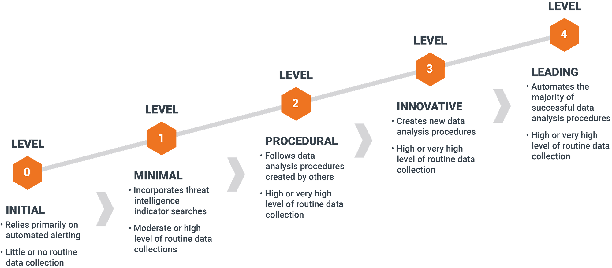
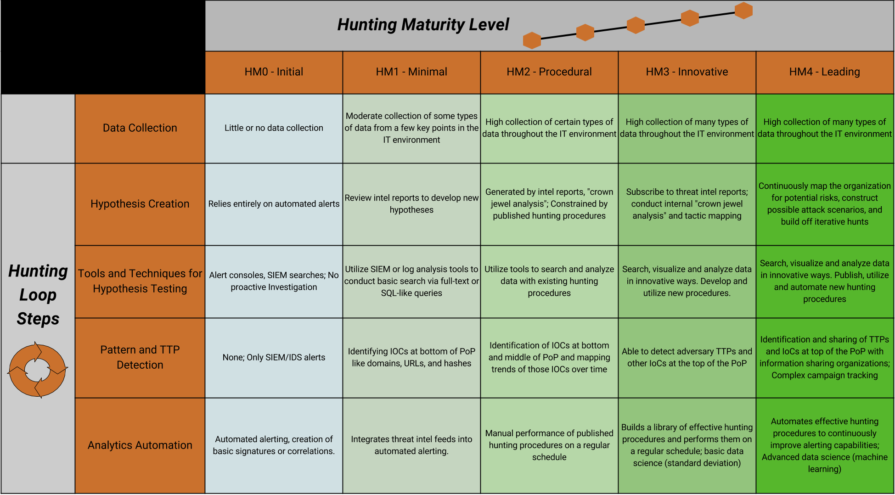

# The Threat Hunting Maturity Model Explained

> *Not every Security Operations Center (SOC) is ready to conduct advanced threat hunting-and that's perfectly normal. Threat hunting is a capability that evolves over time. The key is understanding where your organization stands today, identifying what's missing, and building a roadmap toward a mature hunting program.*

---

## Introduction

Organizations often ask a deceptively simple question:

> **"Are we doing threat hunting?"**

The answer is usually more complicated than a simple yes or no.

Many SOCs believe they are hunting because analysts occasionally search logs after reading a threat intelligence report. Others assume buying an EDR solution automatically makes them capable of threat hunting. In reality, effective threat hunting is not defined by the tools you own-it's defined by the maturity of your people, processes, and capabilities.

A mature hunting program is proactive, hypothesis-driven, data-informed, and continuously improving. An immature one is reactive, ad hoc, and dependent on alerts.

Understanding your current maturity level is the first step toward improving it.

---

## Why a Maturity Model Matters

Imagine asking someone to "become fit" without measuring their current fitness level.

The same applies to threat hunting.

Without understanding your current capabilities, it's impossible to answer questions like:

* Are we collecting the right telemetry?
* Do we have enough visibility?
* Are our hunts repeatable?
* Are we measuring success?
* What should we improve next?

A maturity model provides a structured way to answer these questions and create a realistic improvement roadmap.

Rather than comparing your SOC with world-class security teams, a maturity model helps you compare today's capabilities with where you want to be tomorrow.

---

## What Is the Threat Hunting Maturity Model?

The Threat Hunting Maturity Model (HMM) describes how organizations evolve from relying entirely on automated detections to performing highly proactive, intelligence-driven threat hunting.

One of the most widely referenced models was introduced by Sqrrl (later acquired by Splunk). Although different organizations use slightly different terminology, the underlying progression remains the same:

* Level 0 – No Hunting
* Level 1 – Initial Hunting
* Level 2 – Structured Hunting
* Level 3 – Advanced Hunting
* Level 4 – Optimized Hunting

The goal is **not** to reach Level 4 as quickly as possible. Instead, the objective is to continually improve your ability to detect threats that automated systems miss.

---

## Level 0 – No Hunting

**Characteristics**

At this stage, the SOC is entirely reactive.

Analysts investigate alerts generated by security tools but never proactively search for unknown threats.

Typical characteristics include:

* No dedicated hunting process
* Heavy reliance on SIEM and EDR alerts
* Limited endpoint or network visibility
* No documented hunting methodology
* Success measured by alert closure

The team waits for technology to identify malicious activity.

**Common Statement**

> "If something bad happens, our SIEM will alert us."

### Major Risks

* Unknown attackers remain undetected.
* Advanced threats evade signature-based detections.
* False confidence in security tooling.

---

## Level 1 – Initial Hunting

**Characteristics**

Organizations begin performing occasional hunts, usually triggered by external events such as:

* Threat intelligence reports
* Newly disclosed vulnerabilities
* Industry-specific attacks
* Security advisories

Hunting activities are informal and analyst-driven.

Examples include:

* Searching for indicators of compromise
* Looking for malicious hashes
* Investigating suspicious IP addresses
* Reviewing authentication logs

Although hunting exists, it is inconsistent and difficult to repeat.

**Strengths**

* Analysts begin thinking proactively.
* Threat intelligence is incorporated into investigations.

**Limitations**

* No standardized methodology
* Limited documentation
* Success depends on individual expertise

---

## Level 2 – Structured Hunting

**Characteristics**

At this stage, hunting becomes a formal SOC capability rather than an occasional activity.

The organization develops:

* Repeatable hunting procedures
* Standardized playbooks
* Defined hypotheses
* Scheduled hunting cycles
* Documented findings

Rather than asking:

> "What should we search today?"

Hunters ask:

> "What hypothesis are we testing?"

For example:

> "If an attacker abused PowerShell for reconnaissance, what evidence would appear in our endpoint telemetry?"

Every hunt has a defined objective, required data sources, expected outcomes, and lessons learned.

**Strengths**

* Consistent hunting process
* Better knowledge sharing
* Repeatable investigations
* Improved documentation

**Limitations**

* Manual analysis remains time-consuming.
* Limited automation.

---

## Level 3 – Advanced Hunting

**Characteristics**

The SOC begins leveraging richer data and analytics to uncover sophisticated threats.

Hunters use:

* Endpoint telemetry
* Network metadata
* Identity logs
* Cloud activity
* Threat intelligence
* Behavioral analytics

Instead of searching for known indicators, analysts hunt for attacker behaviors.

Examples include:

* Office applications spawning PowerShell
* Unusual service account usage
* Lateral movement patterns
* Privilege escalation attempts
* Suspicious cloud identity activity

Automation assists with repetitive tasks, allowing hunters to focus on analysis and hypothesis refinement.

**Strengths**

* Behavioral detection
* Multiple telemetry sources
* Faster investigations
* Improved detection engineering

**Limitations**

* Requires skilled analysts
* Greater infrastructure complexity
* Higher operational costs

---

## Level 4 – Optimized Hunting

**Characteristics**

Threat hunting becomes an integral part of the organization's security strategy.

Continuous improvement is embedded into daily operations.

The SOC:

* Continuously develops new hunting hypotheses
* Converts successful hunts into automated detections
* Measures hunting effectiveness
* Integrates threat intelligence into planning
* Shares findings across security teams

Rather than treating hunting as a separate activity, it becomes part of an ongoing detection engineering lifecycle.

Each successful hunt strengthens future detection capabilities.

**Indicators of a Mature Program**

* Metrics-driven improvement
* Continuous telemetry optimization
* Dedicated hunting specialists
* Threat-informed detection engineering
* Executive support and investment

At this level, hunting doesn't replace automation-it improves it.

---

## Understanding the Sqrrl Threat Hunting Maturity Model

The original Sqrrl model emphasizes that maturity is driven primarily by **data quality** and **analytical capability**, not simply by technology purchases.

Organizations typically progress through three major dimensions:

**Data Collection**

Can analysts access the telemetry they need?

Examples include:

* Endpoint events
* Authentication logs
* Network telemetry
* Cloud logs
* Identity events

Without sufficient visibility, advanced hunting is impossible.

---

**Analytical Capability**

Can analysts transform raw data into meaningful hypotheses?

This includes:

* Behavioral analysis
* Statistical reasoning
* Threat intelligence integration
* MITRE ATT&CK mapping
* Root cause analysis

Technology assists-but human expertise drives mature hunting.

---

**Operational Process**

Can the organization consistently execute, document, improve, and repeat hunts?

Questions include:

* Are hunts documented?
* Are findings shared?
* Are successful hunts converted into detections?
* Are lessons learned incorporated into future hunts?

The highest maturity organizations excel across all three dimensions.

---

## Identifying Capability Gaps

Many organizations assume they need better tools when the real issue is process or visibility.

Consider these examples:

| Capability Gap              | Symptoms                                     | Potential Improvement                          |
| --------------------------- | -------------------------------------------- | ---------------------------------------------- |
| Limited endpoint visibility | Unable to investigate process execution      | Deploy richer endpoint telemetry               |
| No hunt methodology         | Hunts depend on individual analysts          | Develop standardized hunt playbooks            |
| Poor documentation          | Findings are lost after investigations       | Create hunt reports and knowledge base         |
| Lack of threat intelligence | Hunts lack direction                         | Integrate industry and adversary intelligence  |
| Manual investigations       | Analysts spend excessive time gathering data | Automate data collection and enrichment        |
| No metrics                  | Unable to demonstrate hunting value          | Track hunt outcomes and detection improvements |

Understanding these gaps helps prioritize investments that have the greatest operational impact.

---

## Building a Threat Hunting Roadmap

Improvement doesn't happen overnight. A practical roadmap focuses on incremental progress rather than jumping directly to advanced hunting.

**Phase 1 – Establish Visibility**

* Collect endpoint telemetry
* Improve log retention
* Ensure identity logging
* Inventory critical assets

---

**Phase 2 – Standardize Hunting**

* Create hunting playbooks
* Develop hypotheses
* Schedule recurring hunts
* Document findings

---

**Phase 3 – Expand Data Sources**

* Integrate cloud telemetry
* Collect network metadata
* Enhance endpoint visibility
* Include threat intelligence

---

**Phase 4 – Automate and Improve**

* Convert successful hunts into detections
* Automate repetitive analysis
* Measure hunt effectiveness
* Continuously refine hypotheses

A roadmap should always be tailored to the organization's resources, risk profile, and business priorities.

---

## Practical Exercise**

Let's assess the maturity of a fictional SOC.

**Company Profile**

**RetailOne Security Operations Center**

Environment:

* 12 SOC analysts
* Microsoft Sentinel SIEM
* Microsoft Defender for Endpoint
* Microsoft 365
* AWS cloud workloads
* Active Directory
* Weekly vulnerability scanning

Current practices:

* Analysts investigate SIEM alerts.
* Quarterly threat intelligence reviews.
* Occasional manual hunts after major ransomware news.
* No documented hunting methodology.
* Findings are shared informally.
* Successful hunts are rarely converted into detection rules.
* Metrics focus on alert response time rather than hunting effectiveness.

---

## Step 1 – Evaluate Against Each Level

| Capability                      | Observation        |
| ------------------------------- | ------------------ |
| Dedicated hunting team          | No                 |
| Repeatable hunt methodology     | Partial            |
| Documented hypotheses           | No                 |
| Threat intelligence integration | Limited            |
| Behavioral hunting              | Limited            |
| Automation                      | Low                |
| Metrics                         | Alert-focused only |
| Continuous improvement          | Minimal            |

---

## Step 2 – Determine Maturity Level

RetailOne has progressed beyond Level 0 because analysts perform occasional proactive hunts.

However:

* Hunts are inconsistent.
* There are no standardized procedures.
* Results are not operationalized.
* Automation is limited.

**Assessment:** **Level 1 – Initial Hunting**

The SOC demonstrates proactive intent but lacks the structure required for Level 2.

---

## Step 3 – Recommend Next Improvements

To reach Level 2, RetailOne should:

* Create standardized hunting playbooks.
* Document hypotheses before each hunt.
* Record findings in a central repository.
* Schedule recurring hunting sessions.
* Convert successful hunts into detection rules.
* Track hunting metrics separately from incident response metrics.

These changes improve consistency without requiring significant new technology investments.

---

## Deliverable – Threat Hunting Maturity Assessment Scorecard

Use the following scorecard to evaluate your own SOC or a fictional organization.

| Category                         | Score (0–4)         | Notes |
| -------------------------------- | ------------------- | ----- |
| Endpoint Visibility              | ☐ 0 ☐ 1 ☐ 2 ☐ 3 ☐ 4 |       |
| Network Visibility               | ☐ 0 ☐ 1 ☐ 2 ☐ 3 ☐ 4 |       |
| Cloud Telemetry                  | ☐ 0 ☐ 1 ☐ 2 ☐ 3 ☐ 4 |       |
| Identity Monitoring              | ☐ 0 ☐ 1 ☐ 2 ☐ 3 ☐ 4 |       |
| Threat Intelligence Integration  | ☐ 0 ☐ 1 ☐ 2 ☐ 3 ☐ 4 |       |
| Hunting Methodology              | ☐ 0 ☐ 1 ☐ 2 ☐ 3 ☐ 4 |       |
| Hypothesis Development           | ☐ 0 ☐ 1 ☐ 2 ☐ 3 ☐ 4 |       |
| Documentation                    | ☐ 0 ☐ 1 ☐ 2 ☐ 3 ☐ 4 |       |
| Automation                       | ☐ 0 ☐ 1 ☐ 2 ☐ 3 ☐ 4 |       |
| Detection Engineering Feedback   | ☐ 0 ☐ 1 ☐ 2 ☐ 3 ☐ 4 |       |
| Metrics & Continuous Improvement | ☐ 0 ☐ 1 ☐ 2 ☐ 3 ☐ 4 |       |

**Scoring Guide**

* **0–10:** Level 0 – No Hunting
* **11–20:** Level 1 – Initial Hunting
* **21–30:** Level 2 – Structured Hunting
* **31–38:** Level 3 – Advanced Hunting
* **39–44:** Level 4 – Optimized Hunting

Use the scorecard annually or after major capability improvements to measure progress over time.

---

## Key Takeaways

Threat hunting maturity is not measured by the number of security tools deployed or the size of the SOC. It is measured by the organization's ability to proactively search for threats, develop repeatable hunting methodologies, learn from each investigation, and continuously improve detection capabilities. The journey from reactive alert handling to intelligence-driven hunting is gradual, requiring investments in telemetry, analyst skills, operational processes, and documentation.

Rather than striving for perfection, focus on the next achievable step. A Level 1 SOC with disciplined processes will often outperform a poorly organized Level 3 environment. Maturity is less about technology and more about building a culture of curiosity, structured investigation, and continuous learning.

---
