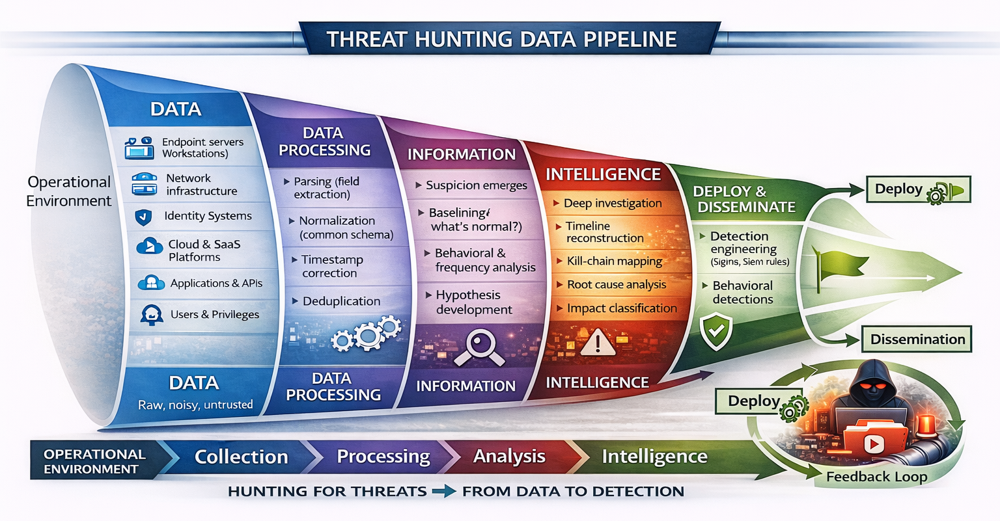

# From Raw Logs to Actionable Intelligence: Understanding the Threat Hunting Data Pipeline

In the previous article, we learned that Threat Hunting doesn't begin with an alert.

It begins with a hypothesis.

A Threat Hunter asks questions like:

> *"What if an attacker is already inside the environment, but our existing detections haven't noticed?"*

That's a powerful question.

But it immediately creates another challenge.

**How do you answer that question?**

Where do you even start?

Do you search Windows Event Logs?

Do you query Microsoft Entra ID?

Do you inspect firewall traffic?

Do you review EDR telemetry?

Do you correlate DNS logs?

The reality is that modern enterprises generate **millions—even billions—of events every single day**.

Some of those events may contain evidence of an attack.

Most do not.

The challenge for a Threat Hunter isn't collecting data.

It's turning overwhelming amounts of raw telemetry into something meaningful.

That transformation is known as the **Threat Hunting Data Pipeline**.

---



---

## Why Every Threat Hunt Begins With Data

Imagine you're asked to investigate a possible compromise involving a privileged administrator.

No alerts have been generated.

No malware has been detected.

The only information you've received is:

> **"Something doesn't feel right."**

What do you investigate first?

You can't begin by searching for malware.

You don't even know whether malware exists.

Instead, you begin with evidence.

Every digital action leaves traces.

A successful login creates an authentication record.

A process execution generates endpoint telemetry.

A DNS request leaves a resolver log.

A firewall records network connections.

Cloud platforms document administrative activity.

Email gateways record message delivery.

Identity providers capture authentication events.

None of these logs tell the complete story on their own.

Each one is simply another piece of evidence.

Just like fingerprints at a crime scene.

Threat Hunting begins by collecting those pieces before trying to understand what they mean.

---

## Stage 1 — Data

Every organization continuously generates enormous amounts of security telemetry.

These data sources may include:

- Windows Security Logs
- Sysmon
- Linux Audit Logs
- Microsoft Defender
- CrowdStrike
- Microsoft Entra ID
- AWS CloudTrail
- Azure Activity Logs
- Firewall Logs
- DNS Logs
- Proxy Logs
- Email Security Logs
- Network Flow Data
- Application Logs

At this stage, the data has **no context**.

It's simply a record of what happened.

Think of it as the raw ingredients before preparing a meal.

Everything you need is present.

Nothing is organized.

Nothing has meaning yet.

---

## Stage 2 — Processing

Collecting logs is only the beginning.

Now imagine trying to combine logs from ten different security products.

One product records the username as:

```
UserName
```

Another calls it:

```
AccountName
```

A cloud provider records:

```
UserPrincipalName
```

Some timestamps use UTC.

Others use local time.

One system stores IP addresses as strings.

Another stores them as integers.

Before any meaningful investigation can begin, all of this information must be normalized into a common structure.

This is where processing takes place.

During this stage, data is:

- Parsed
- Normalized
- Enriched
- Correlated
- Deduplicated
- Time synchronized

Without this step, every investigation would become a manual translation exercise.

Processing ensures that hunters spend time investigating threats—not cleaning data.

---

## Stage 3 — Information

Raw data doesn't answer questions.

Information does.

Imagine you discover the following.

PowerShell normally executes around **40 times per day** on a particular server.

Yesterday it executed **4,200 times**.

Nothing confirms an attack.

But you've discovered something unusual.

That observation is no longer just data.

It has become information.

Threat Hunters spend much of their time turning isolated events into meaningful observations.

Questions such as:

- Which user authenticated from a new country?
- Which endpoint contacted a domain for the first time?
- Which process suddenly became unusually active?
- Which service account logged into systems it has never accessed before?

This is where hunting truly begins. At this point, we've transformed raw logs into meaningful information. But information alone doesn't stop attackers. How do Threat Hunters turn those observations into actionable intelligence that improves an organization's defenses?


