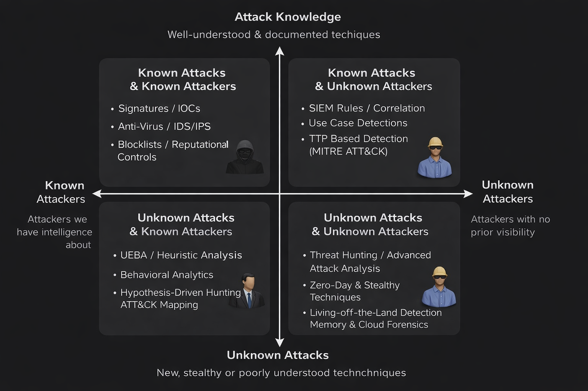
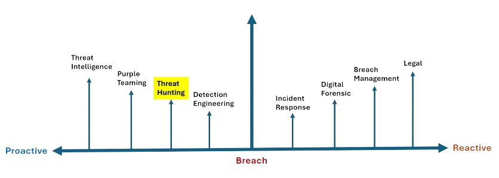

# Why Every Organization Needs Threat Hunting

## We Built Better Defenses. So Why Are Organizations Still Getting Breached?

Over the last decade, organizations have significantly strengthened their cybersecurity posture. Modern enterprises invest heavily in security technologies such as Next-Generation Firewalls (NGFW), Endpoint Detection and Response (EDR), Security Information and Event Management (SIEM), Identity and Access Management (IAM), Email Security, Cloud Security, Multi-Factor Authentication (MFA), and countless detection rules.

On paper, it appears that organizations have built an almost impenetrable fortress.

Yet, headlines continue to tell a different story.

Every week, we hear about ransomware attacks, cloud compromises, supply chain breaches, credential theft, insider attacks, and data exfiltration impacting organizations of every size.

This raises an important question.

> **If organizations have invested millions in cybersecurity technologies, why do successful breaches continue to happen?**

The answer lies in understanding one simple fact.

Most security technologies are designed to detect **what they already know**.

---

## Traditional Security is Built Around Known Threats

Security controls work by comparing observed activity against previously identified malicious patterns.

These patterns may include:

- Malware signatures
- Indicators of Compromise (IOCs)
- Threat Intelligence feeds
- Detection Rules
- Behavioral baselines
- MITRE ATT&CK techniques
- Reputation databases

Whenever user activity, network traffic, or endpoint behavior matches one of these known indicators, security tools generate an alert.

For example,

- An antivirus detects malware because its signature already exists.
- An Email Gateway blocks a phishing domain because it is listed in a threat intelligence feed.
- A SIEM generates an alert when a user performs multiple failed logins followed by a successful authentication from another country.

These detections are highly effective.

But they all depend on one important condition.

> **The attack pattern must already be known.**

---

## Modern Attackers Know How Security Products Work

Cyber attackers are no longer relying on noisy attacks that trigger obvious alerts.

Instead, they deliberately design attacks to blend into legitimate business operations.

Rather than deploying malware immediately, attackers often:

- Abuse legitimate administrative tools
- Use PowerShell or WMI instead of malware
- Steal valid user credentials
- Exploit trusted cloud applications
- Abuse OAuth permissions
- Use native operating system utilities (Living-off-the-Land)

Each individual action appears completely legitimate.

Opening PowerShell isn't suspicious.

Creating an OAuth application isn't suspicious.

Accessing cloud storage isn't suspicious.

Logging in with valid credentials isn't suspicious.

However...

When these seemingly harmless activities occur together, they form a sophisticated attack chain.

Traditional security tools may never generate an alert because none of the individual activities violate an existing detection rule.

This creates dangerous blind spots.

And this is exactly why advanced attackers often remain undetected for weeks-or even months.

---

## Why Threat Hunting Matters

Not every cyberattack looks the same.

Some attacks are well understood.

Others introduce entirely new techniques.

Some attackers are already known through threat intelligence.

Others have never been seen before.

Understanding these different combinations explains why Threat Hunting has become an essential capability within modern Security Operations.

Let's explore four possible scenarios.

---

**1. Known Attacks by Known Attackers**

This is the easiest scenario for security teams.

The attacker is already known.

The attack techniques are also well understood.

Examples include:

- Malware with known signatures
- Previously identified phishing campaigns
- Known ransomware families
- Malicious IP addresses already present in Threat Intelligence feeds

Traditional security controls excel in this category.

Antivirus detects malware signatures.

Threat Intelligence blocks malicious domains.

IDS and IPS recognize known network attack patterns.

Since the attack matches existing knowledge, automated detection works effectively.

---

**2. Known Attacks by Unknown Attackers**

Now imagine the attacker is completely new.

Perhaps the attacker has never been observed before.

Maybe the infrastructure has never appeared in any threat intelligence feed.

However, the attacker still performs techniques that security teams already understand.

For example:

- Credential Dumping
- Privilege Escalation
- Lateral Movement
- Pass-the-Hash attacks

Although the attacker is unknown, the behavior is familiar.

SIEM correlation rules detect suspicious activity.

EDR identifies abnormal parent-child process relationships.

MITRE ATT&CK-based detections recognize known attacker techniques.

The attacker is new.

The attack is not.

---

**3. Unknown Attacks by Known Attackers**

This situation becomes significantly more challenging.

Security teams know the threat actor.

However, the attacker introduces a completely new technique that existing detection rules were never designed to identify.

For example,

A ransomware group decides not to deploy malware.

Instead, they abuse legitimate cloud synchronization software to exfiltrate sensitive data.

No malicious executable exists.

No malware hash is generated.

No traditional signature matches.

Detection now depends on behavioral analytics, heuristic analysis, anomaly detection, and hypothesis-driven investigations.

This is where proactive security becomes increasingly important.

---

**4. Unknown Attacks by Unknown Attackers**

This is every security team's biggest challenge.

The attacker has never been observed before.

The attack technique has never been documented.

No Indicators of Compromise exist.

No signatures exist.

No Threat Intelligence exists.

Nothing matches existing detection rules.

Examples include:

- Zero-Day Exploits
- Living-off-the-Land (LotL) techniques
- OAuth Application Abuse
- Cloud Identity Compromise
- Memory-only Malware
- Novel persistence mechanisms

To the SOC dashboard...

Everything appears normal.

Yet the attacker may already be moving laterally inside the environment.

This is where Threat Hunting becomes indispensable.

Rather than waiting for alerts,

Threat Hunters actively search for weak behavioral indicators that suggest an attacker may already be operating within the environment.

Threat Hunting exists because not every attack announces itself.

Sometimes, the only evidence is a collection of seemingly harmless activities that only reveal malicious intent when viewed together.

---

## Where Does Threat Hunting Fit?

To fully understand the value of Threat Hunting, we must first understand where it fits within the cybersecurity lifecycle.

Security Operations do not begin when an alert is generated.

Nor do they end once an incident is contained.

Instead, cybersecurity consists of continuous activities that span before, during, and after a security incident.

On the proactive side of the lifecycle, organizations focus on reducing the likelihood of successful attacks.

Threat Intelligence provides visibility into emerging threat actors, malware campaigns, and attacker tactics.

Purple Teaming validates defensive controls by simulating real-world adversary behavior.

Detection Engineering transforms attacker techniques into detection logic by creating SIEM correlation rules, EDR detections, and analytics capable of identifying malicious behavior.

Immediately before Detection Engineering comes Threat Hunting.

This positioning is intentional.

Unlike traditional SOC operations, Threat Hunters are **not waiting for alerts to appear**.

Instead, they begin with a different assumption to find out new patterns and threats then creates new detections.

> **"What if an attacker is already inside our environment, but none of our security controls have detected them yet?"**

That single assumption changes everything.

Instead of investigating alerts,

Threat Hunters investigate uncertainty.

They formulate hypotheses.

They analyze endpoint telemetry.

They correlate authentication events.

They examine process execution.

They inspect network communication.

They validate whether seemingly normal activity actually represents attacker behavior.

Their objective is simple.

**Discover the attacker before the attacker achieves their objective.**

This significantly reduces attacker dwell time and limits the impact of a compromise.

Once suspicious activity becomes visible-or an incident is officially declared-the focus shifts toward reactive security operations.

Incident Response teams contain the attack and prevent further damage.

Digital Forensics and Malware Analysis reconstruct the attack timeline, identify the initial access vector, determine attacker actions, and collect evidence.

Breach Management coordinates communication, business recovery, executive reporting, and regulatory response.

Legal and Compliance teams address notification requirements, contractual obligations, and regulatory investigations.

All of these capabilities are critical.

However, they all operate **after** the attacker has already achieved some level of success.

Threat Hunting attempts to change that timeline.

Rather than asking,

> **"How do we respond to an attack?"**

Threat Hunters ask,

> **"How do we discover an attack before anyone else even knows it exists?"**

That difference is what makes Threat Hunting one of the most valuable proactive capabilities within modern Security Operations.

---

## Bridging the Gap

At this point, we've answered two important questions.

- **Why traditional security controls alone are no longer sufficient.**
- **Where Threat Hunting fits within the cybersecurity lifecycle.**

Now the next logical question becomes:

> **If Threat Hunting is different from traditional detection, then what exactly is Threat Hunting?**

In the next section, we'll formally define Threat Hunting, understand its core principles, and explore how Threat Hunters think differently from traditional SOC analysts.
